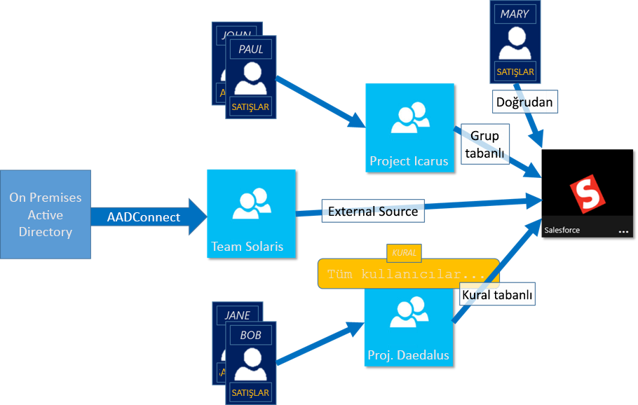
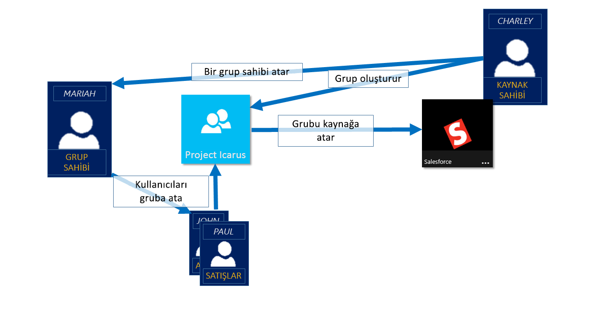

# Azure Active Directory grupları ile kaynaklara erişimi yönetme
Azure Active Directory (Azure AD), Office 365 gibi Microsoft çevrimiçi hizmetlerini de kapsayan şirket içi ve bulut uygulamalarıyla kaynakların yanı sıra Microsoft tarafından sunulmayan SaaS uygulamalarına da güvenli erişim sağlayan, kapsamlı bir kimlik ve erişim yönetimi çözümüdür. Bu makale özelliklere genel bir bakış sunmaktadır ancak Azure AD gruplarını hemen kullanmaya başlamak istiyorsanız [Azure AD'deki güvenlik gruplarını yönetme](active-directory-groups-create-azure-portal.md) talimatlarını uygulayın. Azure Active Directory gruplarını yönetme amacıyla PowerShell'i kullanma hakkında bilgi almak için bkz. [Grup yönetimi için Azure Active Directory cmdlet'leri](../users-groups-roles/groups-settings-v2-cmdlets.md).

> [!NOTE]
> Azure Active Directory'yi kullanmak için bir Azure hesabına ihtiyacınız vardır. Hesabınız yoksa [ücretsiz Azure hesabı için kaydolabilirsiniz](https://azure.microsoft.com/pricing/free-trial/).
>
>

Azure AD'nin en önemli özelliklerinden biri, kaynak erişimini yönetme seçeneğidir. Bu kaynaklar dizindeki roller aracılığıyla nesneleri yönetme izinlerinde olduğu gibi bir dizine veya SaaS uygulamaları, Azure hizmetleri ve SharePoint siteleri ya da şirket içi kaynaklar gibi dizin dışındaki kaynaklara ait olabilir. Bir kullanıcıya bir kaynakta erişim izni atamak için kullanabileceğiniz dört yöntem vardır:

1. Doğrudan atama

    Kullanıcı kaynağın sahibi tarafından doğrudan o kaynağa atanabilir.
2. Grup üyeliği

    Kaynak sahibi bir grubu kaynağa atayarak o grubun tüm üyelerine kaynak erişimi sağlayabilir. Grup üyelikleri, grubun sahibi tarafından yönetilebilir. Böylece kaynak sahibi, kullanıcıları kaynaklarına atama iznini grup sahibine vermiş olur.
3. Kural tabanlı

    Kaynak sahibi, belirli bir kaynağa erişim verilecek kullanıcıları belirtmek için bir kural kullanabilir. Kuralın sonucu, ilgili kuralda kullanılan özniteliklerle belirli kullanıcılara göre değerlerine bağlıdır ve kaynak sahibi bu sayede kaynağına erişimi yönetme hakkını kuralda kullanılan öznitelikler için yetkili kaynaklara aktarmış olur. Kaynak sahibi kuralı yönetmeye devam eder ve kaynağına erişim sağlayan özniteliklerle değerleri belirler.
4. Dış yetkili

    Kaynak erişimi bir dış kaynaktan alınır. Buna örnek olarak şirket içi dizini veya WorkDay benzeri bir SaaS uygulaması gibi bir yetkili kaynaktan eşitlenen grup verilebilir. Kaynak sahibi, kaynağa erişim sağlamak için grubu atar ve grup üyeleri dış kaynak tarafından yönetilir.

   

## Erişim yönetimini anlatan videoyu izleyin
Bu konu hakkında daha ayrıntılı bilgi veren kısa videoyu izleyebilirsiniz:

**Azure AD: Gruplar için dinamik üyeliğe giriş**

> [!VIDEO https://channel9.msdn.com/Series/Azure-Active-Directory-Videos-Demos/Azure-AD--Introduction-to-Dynamic-Memberships-for-Groups/player]
>
>

## Azure Active Directory’de erişim yönetimi nasıl yönetilir?
Azure AD erişim yönetimi çözümünün merkezinde güvenlik grubu yer alır. Kaynak erişimini yönetmek için güvenlik grubunun kullanılması sık başvurulan bir durumdur ve bu kaynak için istenen kullanıcı grubuna erişim sağlama amacıyla kullanılan esnek ve anlaşılması kolay bir yöntemdir. Kaynak sahibi (veya dizinin yöneticisi), bir gruba sahip oldukları kaynaklara belirli bir erişim hakkı atayabilir. Grubun üyelerine erişim sağlanır ve kaynak sahibi grubun üye listesini yönetme hakkını bölüm yöneticisi veya yardım masası yöneticisi gibi bir kullanıcıya verebilir.

Grubun sahibi, o grubu self servis istekleri için kullanılabilir duruma getirebilir. Bu sayede son kullanıcı grubu arayıp bularak katılma isteği gönderebilir ve bu şekilde grupla yönetilen kaynaklara erişim izni isteyebilir. Grubun sahibi, grubu katılma istekleri otomatik olarak veya grup sahibi tarafından onaylanacak şekilde ayarlayabilir. Kullanıcı gruba katılma isteği gönderdiğinde bu istek grubun sahiplerine iletilir. Sahiplerden biri isteği onaylarsa istekte bulunan kullanıcıya bildirim gönderilir ve kullanıcı gruba katılır. Sahiplerden biri isteği reddederse istekte bulunan kullanıcıya bildirim gönderilir ancak kullanıcı gruba katılmaz.

## Erişim yönetimini kullanmaya başlama
Başlamaya hazır mısınız? Azure AD gruplarını kullanarak gerçekleştirebileceğiniz bazı temel görevleri deneyebilirsiniz. Bu özellikleri kullanarak farklı kullanıcı gruplarına kuruluşunuzdaki farklı kaynaklara erişim izni verebilirsiniz. Temel ilk adımların listesi aşağıda verilmiştir.

* [Bir grup için dinamik üyelikleri yapılandırma amacıyla basit bir kural oluşturma](active-directory-groups-create-azure-portal.md)
* [SaaS uygulamalarına erişimi yönetmek için grup kullanma](../users-groups-roles/groups-saasapps.md)
* [Bir grubu, son kullanıcı self servisi için kullanıma sunma](../users-groups-roles/groups-self-service-management.md)
* [Azure AD Connect'i kullanarak şirket içindeki bir grubu Azure ile eşitleme](../connect/active-directory-aadconnect.md)
* [Grup sahiplerini yönetme](active-directory-accessmanagement-managing-group-owners.md)

## Sonraki adımlar
Erişim yönetiminin temellerini kavradığınıza göre Azure Active Directory'de uygulamalarınıza ve kaynaklarınıza erişimi yönetmek için kullanabileceğiniz ek gelişmiş özelliklere göz atabilirsiniz.

* [Gelişmiş kurallar oluşturmak için öznitelikleri kullanma](../users-groups-roles/groups-dynamic-membership.md)
* [Azure AD'deki güvenlik grubunu yönetme](active-directory-groups-create-azure-portal.md)
* [Gruplar için Graph API'si başvurusu](https://msdn.microsoft.com/Library/Azure/Ad/Graph/api/groups-operations#GroupFunctions)
* [Grup ayarlarını yapılandırmak için Azure Active Directory cmdlet'leri](../users-groups-roles/groups-settings-cmdlets.md)
