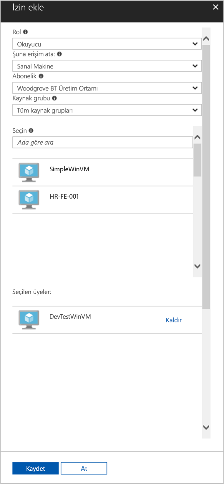

# <a name="use-a-windows-vm-system-assigned-managed-identity-to-access-resource-manager"></a>Resource Manager’a erişmek için Windows VM sistem tarafından atanan yönetilen kimliği kullanma

[!INCLUDE [preview-notice](../../../includes/active-directory-msi-preview-notice.md)]

Bu hızlı başlangıçta, sistem tarafından atanmış yönetilen kimliğin etkinleştirildiği bir Windows sanal makinesini kullanarak Azure Resource Manager API'sine nasıl erişeceğiniz gösterilmektedir. Azure kaynaklarına yönelik yönetilen kimlikler Azure tarafından otomatik olarak yönetilir ve kodunuza kimlik bilgileri girmenize gerek kalmadan Azure AD kimlik doğrulamasını destekleyen hizmetlerde kimlik doğrulaması yapmanıza olanak tanır. Aşağıdakileri nasıl yapacağınızı öğrenirsiniz:

> [!div class="checklist"] 
> * Azure Resource Manager’da Kaynak Grubuna VM'niz için erişim verme 
> * VM kimliğini kullanarak erişim belirteci alma ve Azure Resource Manager çağrısı yapmak için bunu kullanma

## <a name="prerequisites"></a>Önkoşullar

[!INCLUDE [msi-tut-prereqs](../../../includes/active-directory-msi-tut-prereqs.md)]

## <a name="grant-your-vm-access-to-a-resource-group-in-resource-manager"></a>Resource Manager’da kaynak grubuna VM'niz için erişim verme
Azure kaynakları için yönetilen kimlikler kullanıldığında kodunuz Azure AD kimlik doğrulamasını destekleyen kaynaklarda kimlik doğrulaması yapmak için erişim belirteçleri alabilir.  Azure Resource Manager Azure AD kimlik doğrulamasını destekler.  Öncelikle bu VM’in sistem tarafından atanan yönetilen kimliğine Resource Manager’da bulunan bir kaynak için erişim izni vermemiz gerekir; bu durumda bu kaynak VM’nin içinde yer aldığı Kaynak Grubudur.  

1.  **Kaynak Grupları** sekmesine gidin. 
2.  **Windows VM**’niz için oluşturduğunuz **Kaynak Grubu**’nu seçin. 
3.  Sol paneldeki **Erişim denetimi (IAM)** öğesine gidin. 
4.  Ardından **rol ataması Ekle** için yeni bir rol ataması, **Windows VM**.  **Rol** olarak **Okuyucu**'yu seçin. 
5.  Sonraki açılan listede **Erişimin atanacağı hedef** olarak **Sanal Makine** seçeneğini ayarlayın. 
6.  Ardından, **Abonelik** açılan listesinde uygun aboneliğin listelendiğinden emin olun. **Kaynak Grubu** için de **Tüm kaynak grupları**'nı seçin. 
7.  Son olarak **Seç** altındaki açılan listeden Windows VM'nizi seçin ve **Kaydet**’e tıklayın.

    

## <a name="get-an-access-token-using-the-vms-system-assigned-managed-identity-and-use-it-to-call-azure-resource-manager"></a>VM’nin sistem tarafından atanan yönetilen kimliğini kullanarak erişim belirteci alma ve Azure Resource Manager çağrısı yapmak için bunu kullanma 

Bu bölümde **PowerShell** kullanmanız gerekecektir.  **PowerShell** yüklü değilse [buradan](https://docs.microsoft.com/powershell/azure/overview) indirin. 

1.  Portalda, **Sanal Makineler**'e ve Windows sanal makinenize gidin, ardından **Genel Bakış**'ta **Bağlan**'a tıklayın. 
2.  Windows VM'sini oluştururken eklendiğiniz hesabın **Kullanıcı adı** ve **Parola** değerlerini girin. 
3.  Artık sanal makineyle **Uzak Masaüstü Bağlantısı**'nı oluşturduğunuza göre, uzak oturumda **PowerShell**'i açın. 
4.  Invoke-WebRequest cmdlet'ini kullanarak, Azure Resource Manager için bir erişim belirteci almak Azure kaynaklarını uç noktası için yönetilen yerel kimliği için istekte bulunmak.

    ```powershell
       $response = Invoke-WebRequest -Uri 'http://169.254.169.254/metadata/identity/oauth2/token?api-version=2018-02-01&resource=https://management.azure.com/' -Method GET -Headers @{Metadata="true"}
    ```
    
    > [!NOTE]
    > "Resource" parametre değeri Azure AD'nin beklediği değerle tam olarak eşleşmelidir. Azure Resource Manager kaynak kimliği kullanıldığında, URI'nin sonundaki eğik çizgiyi de eklemelisiniz.
    
    Ardından, $response nesnesinde JavaScript Nesne Gösterimi (JSON) biçimlendirilmiş dizesi olarak depolanan tam yanıtı ayıklayın. 
    
    ```powershell
    $content = $response.Content | ConvertFrom-Json
    ```
    Ardından, yanıttan erişim belirtecini ayıklayın.
    
    ```powershell
    $ArmToken = $content.access_token
    ```
    
    Son olarak erişim belirteci kullanarak Azure Resource Manager çağrısı yapın. Bu örnekte, aynı zamanda Invoke-WebRequest cmdlet'ini Azure Resource Manager'a çağrı yapıp erişim belirtecini içeren yetkilendirme üst bilgisinde kullanıyoruz.
    
    ```powershell
    (Invoke-WebRequest -Uri https://management.azure.com/subscriptions/<SUBSCRIPTION ID>/resourceGroups/<RESOURCE GROUP>?api-version=2016-06-01 -Method GET -ContentType "application/json" -Headers @{ Authorization ="Bearer $ArmToken"}).content
    ```
    > [!NOTE] 
    > URL büyük/küçük harfe duyarlıdır; dolayısıyla daha önce Kaynak Grubunu adlandırırken kullandığınız büyük/küçük harf düzenini kullanmaya dikkat edin ("resourceGroups" adındaki büyük "G" harfine de dikkat edin).
        
    Aşağıdaki komut Kaynak Grubu ayrıntılarını döndürür:

    ```powershell
    {"id":"/subscriptions/98f51385-2edc-4b79-bed9-7718de4cb861/resourceGroups/DevTest","name":"DevTest","location":"westus","properties":{"provisioningState":"Succeeded"}}
    ```

## <a name="next-steps"></a>Sonraki adımlar

Bu hızlı başlangıçta, Azure Resource Manager API'sine erişmek amacıyla, sistem tarafından atanmış bir yönetilen kimliği nasıl kullanacağınızı öğrendiniz.  Azure Resource Manager hakkında daha fazla bilgi edinmek için bkz:

> [!div class="nextstepaction"]
>[Azure Resource Manager](/azure/azure-resource-manager/resource-group-overview)

