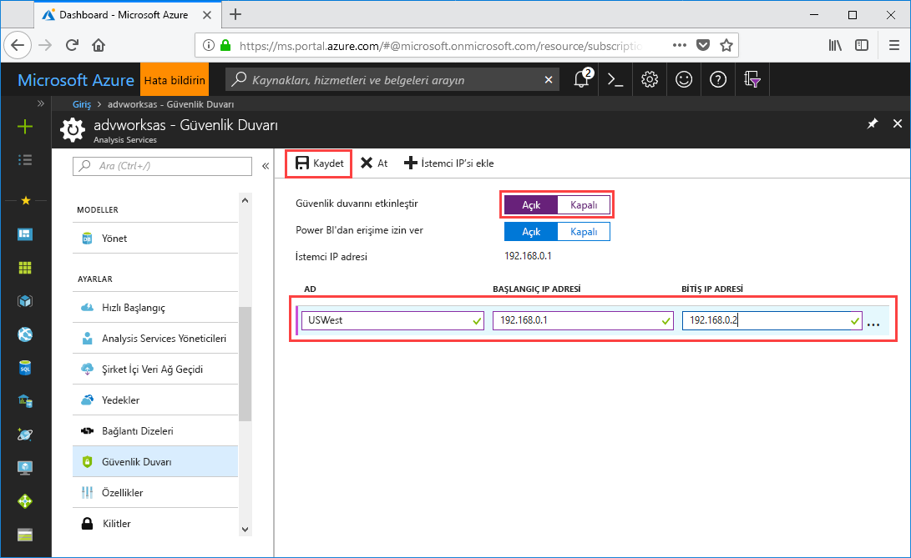

# Hızlı başlangıç: Sunucu güvenlik duvarını yapılandırma - Portal

Bu hızlı başlangıç Azure Analysis Services sunucunuz için güvenlik duvarını yapılandırmanıza yardımcı olur. Güvenlik duvarını etkinleştirmek ve yalnızca sunucunuza erişen bilgisayarlar için IP adresi aralıkları yapılandırmak, sunucunuzu ve verilerinizi güvenlik altına almanın önemli bir parçasıdır.

## Ön koşullar

- Aboneliğinizde bir Analysis Services sunucusu. Daha fazla bilgi edinmek için bkz. [Hızlı başlangıç: Sunucu oluşturma - Portal](analysis-services-create-server.md) veya [Hızlı başlangıç: Sunucu oluşturma - PowerShell](analysis-services-create-powershell.md)
- İstemci bilgisayarlar için bir veya birden çok IP adresi aralığı (gerekiyorsa).
- Power BI Premium'un veri alma (yenileme) ve paginated raporlar da dahil olmak üzere Azure Analiz Hizmetleri'ne bağlandığı bazı senaryolar, Power BI'den erişime izin ver etkinleştirildiğinde bile şu anda desteklenmez. Power BI Premium'dan Live Connect'i kullanmanın daha yaygın senaryosu desteklenir. Tüm Power BI Pro senaryoları desteklenir.

## Azure portalında oturum açın 

[Portalda oturum açın](https://portal.azure.com)

## Güvenlik duvarını yapılandırma

1. Genel Bakış sayfasını açmak için sunucunuza tıklayın. 
2. **AYARLAR** > **Güvenlik Duvarı** > **Etkinleştir güvenlik duvarı**, **Üzerine**tıklayın .
3. Power BI hizmetinden DirectQuery erişimine izin vermek için, **Power BI'dan erişime izin ver** alanında **Açık** seçeneğine tıklayın.  
4. (İsteğe bağlı) Bir veya birden çok IP adresi aralığı belirtin. Her aralık için bir ad, başlangıç ve bitiş IP adresi girin. Güvenlik duvarı kural adı 128 karakterle sınırlı olmalıdır ve yalnızca büyük harfler karakterler, küçük karakterler, sayılar, alt puan ve tire içerebilir. Beyaz alanlara ve diğer özel karakterlere izin verilmez.
5. **Kaydet**'e tıklayın.

     

## Kaynakları temizleme

Artık ihtiyacınız kalmadığında, IP adresi aralıklarını silin veya güvenlik duvarını devre dışı bırakın.

## Sonraki adımlar
Bu hızlı başlangıçta, sunucunuz için güvenlik duvarı yapılandırmayı öğrendiniz. Artık sunucunuz olduğuna ve bir güvenlik duvarıyla sunucunun güvenliğini sağladığınıza göre, ona portaldan temel bir örnek veri modeli ekleyebilirsiniz. Örnek modelin olması, model veritabanı rollerini yapılandırma ve istemci bağlantılarını test etme işlemlerini öğrenmeye yardımcı olur. Daha fazla bilgi edinmek için, örnek model ekleme öğreticisiyle devam edin.

> [!div class="nextstepaction"]
> [Öğretici: Sunucunuza örnek model ekleme](analysis-services-create-sample-model.md)
