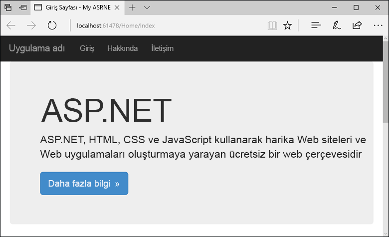
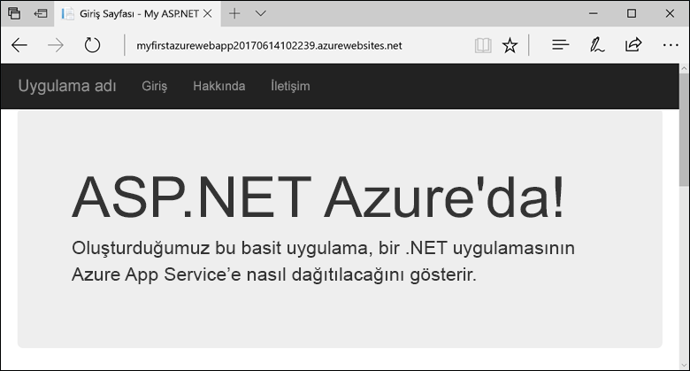

# <a name="create-an-aspnet-framework-web-app-in-azure"></a>Azure’da ASP.NET Framework web uygulaması oluşturma

[Azure App Service](overview.md), yüksek oranda ölçeklenebilen, kendi kendine düzeltme eki uygulayan bir web barındırma hizmeti sunar.

Bu hızlı başlangıç, ilk ASP.NET web uygulamanızı Azure Uygulama Hizmeti'ne nasıl dağıtılacağınızda gösterir. İşiniz bittiğinde, bir Uygulama Hizmeti planınız olur. Ayrıca, dağıtılan bir web uygulamasına sahip bir Uygulama Hizmeti uygulamanız da olur.

[!INCLUDE [quickstarts-free-trial-note](../../includes/quickstarts-free-trial-note.md)]

## <a name="prerequisites"></a>Ön koşullar

Bu eğitimi tamamlamak için <a href="https://www.visualstudio.com/downloads/" target="_blank">Visual Studio 2019'u</a> ASP.NET ve web geliştirme iş yüküyle birlikte **yükleyin.**

Visual Studio 2019'u zaten yüklediyseniz:

- **Güncellemeler için** **Yardım** > Denetimi'ni seçerek Visual Studio'daki en son güncelleştirmeleri yükleyin.
- **Araçları** > **Al Araçları ve Özellikleri**seçerek iş yükünü ekleyin.

## <a name="create-an-aspnet-web-app"></a>ASP.NET bir web uygulaması oluşturma<a name="create-and-publish-the-web-app"></a>

Aşağıdaki adımları izleyerek ASP.NET bir web uygulaması oluşturun:

1. Visual Studio'u açın ve ardından **yeni bir proje oluştur'u**seçin.

2. **Yeni bir proje oluştur'da,** Web Uygulaması **(.NET Framework) ASP.NET**bulun ve seçin, ardından **İleri'yi**seçin.

3. **Yeni projenizi yapılandırın**, uygulama _myFirstAzureWebApp_adını ve sonra **Oluştur'u**seçin.

   

4. Azure’a herhangi bir türde ASP.NET web uygulaması dağıtabilirsiniz. Bu hızlı başlangıç için **MVC** şablonu seçin.

5. Kimlik doğrulamanın Kimlik **Doğrulama Yok**olarak ayarlandıklarına emin olun. **Oluştur'u**seçin.

   

6. Visual Studio menüsünden, web uygulamasını yerel olarak çalıştırmak için Hata Ayıklama olmadan **Hata** > **Ayıklama Başlat'ı** seçin.

   

## <a name="publish-your-web-app"></a>Web uygulamanızı yayımlayın<a name="launch-the-publish-wizard"></a>

1. **Solution**Explorer'da, **myFirstAzureWebApp** projesine sağ tıklayın ve **Yayımla'yı**seçin.

1. **Uygulama Hizmeti'ni** seçin ve ardından **Yayımla profilini** **değiştirin.**

   

1. **Uygulama Hizmeti Oluştur'da yeni**, seçenekleriniz Azure'da oturum açıp açmadığınıza ve bir Azure hesabına bağlı bir Visual Studio hesabınız olup olmadığına bağlıdır. Azure aboneliğinizde oturum açmak için **hesap ekle** veya **oturum aç'ı** seçin. Zaten oturum açmışsanız, istediğiniz hesabı seçin.

   > [!NOTE]
   > Zaten oturum açtıysanız **Oluştur** öğesini henüz seçmeyin.
   >
   >

   

   [!INCLUDE [resource group intro text](../../includes/resource-group.md)]

1. **Kaynak grubu için** **Yeni'yi**seçin.

1. **Yeni kaynak grubu adında,** *myResourceGroup'u* girin ve **Tamam'ı**seçin.

   [!INCLUDE [app-service-plan](../../includes/app-service-plan.md)]

1. Hosting **Planı**için **Yeni'yi**seçin.

1. Barındırma **Planını Yapılandıriletişim** kutusunda, aşağıdaki tablodaki değerleri girin ve ardından **Tamam'ı**seçin.

   | Ayar | Önerilen Değer | Açıklama |
   |-|-|-|
   |App Service Planı| myAppServicePlan | App Service planının adı. |
   | Konum | Batı Avrupa | Web uygulamasının barındırıldığı veri merkezi. |
   | Boyut | Ücretsiz | [Fiyatlandırma katmanı](https://azure.microsoft.com/pricing/details/app-service/?ref=microsoft.com&utm_source=microsoft.com&utm_medium=docs&utm_campaign=visualstudio), barındırma özelliklerini belirler. |

   

1. **Ad'da**, yalnızca geçerli karakterleri içeren benzersiz `a-z`bir `A-Z` `0-9`uygulama `-`adı girin , , , ve . Otomatik olarak oluşturulan benzersiz adı kabul edebilirsiniz. Web uygulamasının URL'si `http://<app_name>.azurewebsites.net` şeklindedir; burada `<app_name>`, uygulamanızın adıdır.

2. Azure kaynaklarını oluşturmaya başlamak için **Oluştur**’u seçin.

   

Sihirbaz tamamlandıktan sonra ASP.NET web uygulamasını Azure’da yayımlar ve ardından uygulamayı varsayılan tarayıcıda başlatır.


**Uygulama Hizmeti'nde** belirtilen uygulama adı Yeni sayfa oluştur formatında `http://<app_name>.azurewebsites.net`URL öneki olarak kullanılır.

**Tebrikler!** ASP.NET web uygulamanız Azure Uygulama Hizmeti'nde canlı olarak yayınlanmaktadır.

## <a name="update-the-app-and-redeploy"></a>Uygulamayı güncelleştirme ve yeniden dağıtma

1. **Çözüm Gezgini'nde,** projeniz altında **Görünümler** > **Ana Sayfa** > **Index.cshtml'i**açın.

1. Üst kısımda `<div class="jumbotron">` HTML etiketini bulun ve tüm öğeyi aşağıdaki kodla değiştirin:

   ```HTML
   <div class="jumbotron">
       <h1>ASP.NET in Azure!</h1>
       <p class="lead">This is a simple app that we've built that demonstrates how to deploy a .NET app to Azure App Service.</p>
   </div>
   ```

1. Azure’a yeniden dağıtmak için **Çözüm Gezgini**’nde **myFirstAzureWebApp** projesine sağ tıklayıp **Yayımla**’yı seçin. Ardından, **Yayımla'yı**seçin.

Yayımlama tamamlandığında Visual Studio, web uygulamasının URL’si ile bir tarayıcı başlatır.



## <a name="manage-the-azure-app"></a>Azure uygulamasını yönetme

1. Web uygulamasını yönetmek için [Azure portalına](https://portal.azure.com)gidin ve **Uygulama Hizmetlerini**arayın ve seçin.

   

2. Uygulama **Hizmetleri** sayfasında web uygulamanızın adını seçin.

   

   Web uygulamanızın Genel Bakış sayfasını görürsünüz. Burada, göz atma, durdurma, başlatma, yeniden başlatma ve silme gibi temel yönetimi yapabilirsiniz.

   

   Soldaki menü, uygulamanızı yapılandırmak için farklı sayfalar sağlar.

## <a name="next-steps"></a>Sonraki adımlar

> [!div class="nextstepaction"]
> [SQL Veritabanı ile ASP.NET](app-service-web-tutorial-dotnet-sqldatabase.md)
