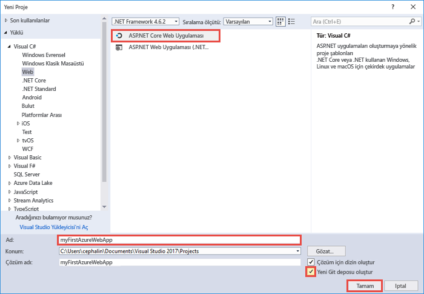
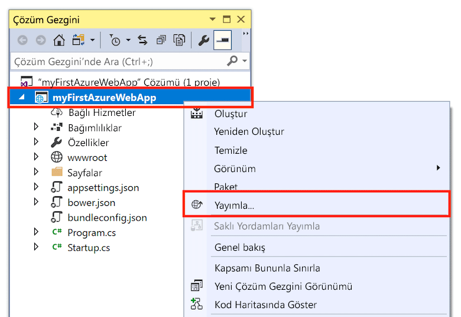
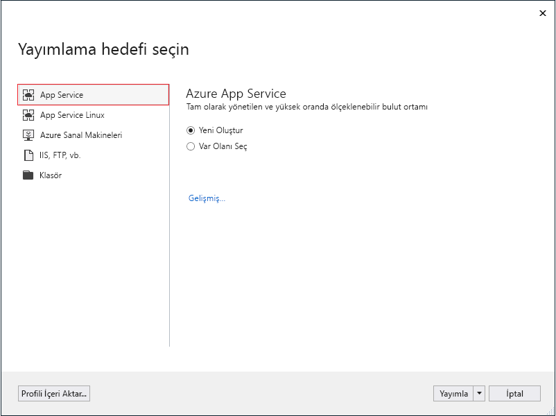
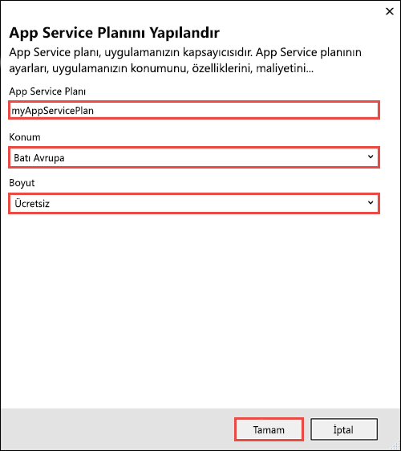
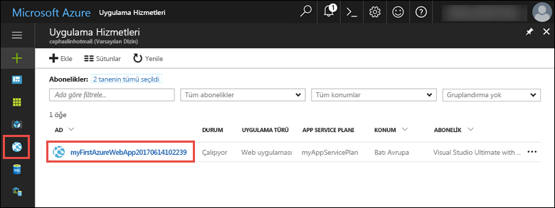

# <a name="create-an-aspnet-core-web-app-in-azure"></a>Azure’da ASP.NET Core web uygulaması oluşturma

> [!NOTE]
> Bu makalede bir uygulamanın Windows üzerinde App Service'e dağıtımı yapılır. _Linux_ üzerinde App Service'e dağıtım yapmak için bkz. [Linux üzerinde App Service'te .NET Core web uygulaması oluşturma](./containers/quickstart-dotnetcore.md).
>

[Azure Web Apps](app-service-web-overview.md) yüksek oranda ölçeklenebilen, kendi kendine düzeltme eki uygulayan bir web barındırma hizmeti sunar.  Bu hızlı başlangıçta, Azure Web Apps’e ilk ASP.NET Core web uygulamanızı dağıtma işlemi gösterilmektedir. İşlemi tamamladığınızda bir App Service planı ve dağıtılmış web uygulaması ile Azure web uygulamasından oluşan kaynak grubunuz olacaktır.


[!INCLUDE [quickstarts-free-trial-note](../../includes/quickstarts-free-trial-note.md)]

## <a name="prerequisites"></a>Ön koşullar

Bu öğreticiyi tamamlamak için **ASP.NET ve web geliştirme** iş yüküyle <a href="https://www.visualstudio.com/downloads/" target="_blank">Visual Studio 2017</a>’yi yükleyin.

Visual Studio 2017'yi zaten yüklediyseniz:

- **Yardım** > **Güncelleştirmeleri Denetle**'ye tıklayarak Visual Studio'daki en son güncelleştirmeleri yükleyin.
- **Araçlar** > **Araçları ve Özellikleri Al**'a tıklayarak iş yükünü ekleyin.

## <a name="create-an-aspnet-core-web-app"></a>ASP.NET Core web uygulaması oluşturma

Visual Studio'da **Dosya > Yeni > Proje**’yi seçerek bir proje oluşturun. 

**Yeni Proje** iletişim kutusunda **Visual C# > Web > ASP.NET Core Web Uygulaması** öğesini seçin.

Uygulamayı _myFirstAzureWebApp_ olarak adlandırın ve ardından **Tamam**’ı seçin.
   


Azure’a herhangi bir türde ASP.NET Core web uygulaması dağıtabilirsiniz. Bu hızlı başlangıçta **Web Uygulaması** şablonunu seçin ve kimlik doğrulamasının **Kimlik Doğrulaması Yok** olarak ayarlandığından ve başka seçenek belirtilmediğinden emin olun.
      
**Tamam**’ı seçin.


Menüden **Hata Ayıkla > Hata Ayıklamadan Başla**’yı seçerek web uygulamasını yerel olarak çalıştırın.


## <a name="launch-the-publish-wizard"></a>Yayımlama sihirbazını başlatma

**Çözüm Gezgini**’nde **myFirstAzureWebApp** projesine sağ tıklayıp **Yayımla**’yı seçin.



Yayımlama sihirbazı otomatik olarak başlatılır. **App Service** > **Yayımla**'yı seçerek **App Service Oluştur** iletişim kutusunu açın.



## <a name="sign-in-to-azure"></a>Azure'da oturum açma

**App Service Oluştur** iletişim kutusunda **Hesap ekle**’ye tıklayın ve Azure aboneliğinizde oturum açın. Zaten oturum açmış durumdaysanız, açılan listeden istediğiniz hesabı seçin.

> [!NOTE]
> Zaten oturum açtıysanız **Oluştur** öğesini henüz seçmeyin.
>
   


## <a name="create-a-resource-group"></a>Kaynak grubu oluşturma

[!INCLUDE [resource group intro text](../../includes/resource-group.md)]

**Kaynak Grubu**’nun yanındaki **Yeni** öğesini seçin.

Kaynak grubunuzu **myResourceGroup** olarak adlandırıp **Tamam**’ı seçin.

## <a name="create-an-app-service-plan"></a>App Service planı oluşturma

[!INCLUDE [app-service-plan](../../includes/app-service-plan.md)]

**Barındırma Planı**'nın yanındaki **Yeni**'yi seçin. 

**Barındırma Planını Yapılandır** iletişim kutusunda, ekran görüntüsünün altındaki tabloda verilen ayarları kullanın.



| Ayar | Önerilen Değer | Açıklama |
|-|-|-|
|App Service Planı| myAppServicePlan | App Service planının adı. |
| Konum | Batı Avrupa | Web uygulamasının barındırıldığı veri merkezi. |
| Boyut | Ücretsiz | [Fiyatlandırma katmanı](https://azure.microsoft.com/pricing/details/app-service/?ref=microsoft.com&utm_source=microsoft.com&utm_medium=docs&utm_campaign=visualstudio), barındırma özelliklerini belirler. |

**Tamam**’ı seçin.

## <a name="create-and-publish-the-web-app"></a>Web uygulaması oluşturma ve yayımlama

**Uygulama Adı**’na benzersiz bir ad girin (geçerli karakterler `a-z`, `0-9` ve `-` karakterleridir) veya otomatik olarak oluşturulan benzersiz adı kabul edin. Web uygulamasının URL'si `http://<app_name>.azurewebsites.net` şeklindedir; burada `<app_name>`, uygulamanızın adıdır.

Azure kaynaklarını oluşturmaya başlamak için **Oluştur**’u seçin.


Sihirbaz tamamlandıktan sonra ASP.NET Core web uygulamasını Azure’da yayımlar ve ardından uygulamayı varsayılan tarayıcıda başlatır.


[Oluşturma ve yayımlama adımında](#create-and-publish-the-web-app) belirtilen uygulama adı `http://<app_name>.azurewebsites.net` biçiminde URL ön eki olarak kullanılır.

Tebrikler, ASP.NET Core web uygulamanız Azure App Service’te çalışıyor.

## <a name="update-the-app-and-redeploy"></a>Uygulamayı güncelleştirme ve yeniden dağıtma

**Çözüm Gezgini** menüsünden _Pages/Index.cshtml_ dosyasını açın.

İki `<div>` etiketini aşağıdaki kodla değiştirin:

```HTML
<div class="jumbotron">
    <h1>ASP.NET in Azure!</h1>
    <p class="lead">This is a simple app that we’ve built that demonstrates how to deploy a .NET app to Azure App Service.</p>
</div>
```

Azure’a yeniden dağıtmak için **Çözüm Gezgini**’nde **myFirstAzureWebApp** projesine sağ tıklayıp **Yayımla**’yı seçin.

Yayımlama özeti sayfasında **Yayımla**'yı seçin.


Yayımlama tamamlandığında Visual Studio, web uygulamasının URL’si ile bir tarayıcı başlatır.


## <a name="manage-the-azure-web-app"></a>Azure web uygulamasını yönetme

Web uygulamasını yönetmek için <a href="https://portal.azure.com" target="_blank">Azure portalına</a> gidin.

Sol menüden **Uygulama Hizmetleri**'ni ve ardından Azure web uygulamanızın adını seçin.



Web uygulamanızın Genel Bakış sayfasını görürsünüz. Buradan göz atma, durdurma, başlatma, yeniden başlatma ve silme gibi temel yönetim görevlerini gerçekleştirebilirsiniz. 


Soldaki menü, uygulamanızı yapılandırmak için farklı sayfalar sağlar. 

[!INCLUDE [Clean-up section](../../includes/clean-up-section-portal.md)]

## <a name="next-steps"></a>Sonraki adımlar

> [!div class="nextstepaction"]
> [SQL Veritabanı ile ASP.NET Core](app-service-web-tutorial-dotnetcore-sqldb.md)
