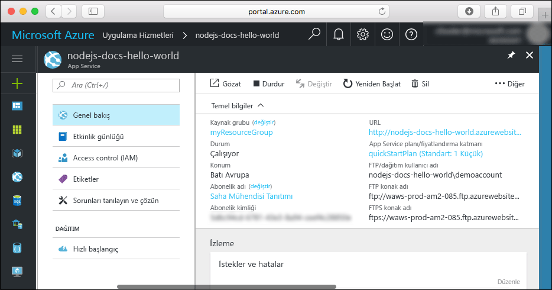

# <a name="create-a-nodejs-web-app-in-azure"></a>Azure App Service'te Node.js web uygulaması oluşturma

> [!NOTE]
> Bu makalede bir uygulamanın Windows üzerinde App Service'e dağıtımı yapılır. _Linux_ üzerinde App Service'e dağıtım yapmak için bkz. [Linux üzerinde Azure App Service'te Node.js web uygulaması oluşturma](./containers/quickstart-nodejs.md).
>

[Azure App Service](overview.md), yüksek oranda ölçeklenebilen, kendi kendine düzeltme eki uygulayan bir web barındırma hizmeti sunar.  Bu hızlı başlangıçta Azure App Service için bir Node. js uygulamasının nasıl dağıtılacağı gösterilmektedir. Web uygulamasını [Cloud Shell](https://docs.microsoft.com/azure/cloud-shell/overview)kullanarak oluşturursunuz, ancak bu komutları [Azure CLI](/cli/azure/install-azure-cli)ile yerel olarak da çalıştırabilirsiniz. [Az WebApp Deployment Source config-zip](/cli/azure/webapp/deployment/source?view=azure-cli-latest#az-webapp-deployment-source-config-zip) komutunu kullanarak örnek Node. js kodunu Web uygulamasına dağıtırsınız.  


Mac, Windows veya Linux makinesi kullanarak buradaki adımları izleyebilirsiniz. Adımları tamamlamaya yaklaşık üç dakika sürer.

[!INCLUDE [quickstarts-free-trial-note](../../includes/quickstarts-free-trial-note.md)]

[!INCLUDE [cloud-shell-try-it.md](../../includes/cloud-shell-try-it.md)]

## <a name="download-the-sample"></a>Örneği indirme

Cloud Shell'de bir quickstart dizini oluşturun ve o dizine geçin.

```azurecli-interactive
mkdir quickstart

cd $HOME/quickstart
```

Ardından, örnek uygulama deposunu quickstart dizininize kopyalamak için aşağıdaki komutu çalıştırın.

```azurecli-interactive
git clone https://github.com/Azure-Samples/nodejs-docs-hello-world
```

Çalıştırıldığında, aşağıdaki örneğe benzer bilgiler görüntüler:

```bash
Cloning into 'nodejs-docs-hello-world'...
remote: Counting objects: 40, done.
remote: Total 40 (delta 0), reused 0 (delta 0), pack-reused 40
Unpacking objects: 100% (40/40), done.
Checking connectivity... done.
```

> [!NOTE]
> Örnek index. js, dinleme bağlantı noktasını işlemek için. env. PORT olarak ayarlar. Bu ortam değişkeni App Service tarafından atanır.
>

[!INCLUDE [Create resource group](../../includes/app-service-web-create-resource-group-scus.md)]

[!INCLUDE [Create app service plan](../../includes/app-service-web-create-app-service-plan-scus.md)]

## <a name="create-a-web-app"></a>Web uygulaması oluşturma

Cloud Shell’de, [`az webapp create`](/cli/azure/webapp?view=azure-cli-latest#az-webapp-create) komutuyla `myAppServicePlan` App Service planında bir web uygulaması oluşturun.

Aşağıdaki örnekte `<app_name>` kısmını genel olarak benzersiz bir uygulama adıyla değiştirin (geçerli karakterler `a-z`, `0-9` ve `-` şeklindedir).

```azurecli-interactive
# Bash and Powershell
az webapp create --resource-group myResourceGroup --plan myAppServicePlan --name <app_name>
```

Web uygulaması oluşturulduğunda Azure CLI aşağıda yer alan çıktıdaki gibi bilgiler gösterir:

```json
{
  "availabilityState": "Normal",
  "clientAffinityEnabled": true,
  "clientCertEnabled": false,
  "cloningInfo": null,
  "containerSize": 0,
  "dailyMemoryTimeQuota": 0,
  "defaultHostName": "<app_name>.azurewebsites.net",
  "enabled": true,
  < JSON data removed for brevity. >
}
```

### <a name="set-nodejs-runtime"></a>Node.js çalışma zamanını ayarlama

Düğüm çalışma zamanını 10.14.1 olarak ayarlayın. Desteklenen tüm çalışma zamanları görmek için [`az webapp list-runtimes`](/cli/azure/webapp?view=azure-cli-latest#az-webapp-list-runtimes) komutunu çalıştırın.

```azurecli-interactive
# Bash and Powershell
az webapp config appsettings set --resource-group myResourceGroup --name <app_name> --settings WEBSITE_NODE_DEFAULT_VERSION=10.14.1
```

Yeni oluşturduğunuz web uygulamasına göz atın. `<app_name>` benzersiz bir uygulama adıyla değiştirin.

```
http://<app_name>.azurewebsites.net
```

Yeni Web uygulamanızın şöyle görünmesi gerekir: boş Web uygulaması sayfası 

## <a name="deploy-zip-file"></a>ZIP dosyası dağıtma

Cloud Shell, uygulamanızın kök dizinine gidin, örnek projeniz için yeni bir ZIP dosyası oluşturun.

```azurecli-interactive
cd nodejs-docs-hello-world  

zip -r myUpdatedAppFiles.zip *.*
```

[Az WebApp Deployment Source config-ZIP](/cli/azure/webapp/deployment/source?view=azure-cli-latest#az-webapp-deployment-source-config-zip) komutunu kullanarak ZIP dosyasını Web uygulamanıza dağıtın.  

```azurecli-interactive
az webapp deployment source config-zip --resource-group myResourceGroup --name <app_name> --src myUpdatedAppFiles.zip
```

Bu komut ZIP içindeki dosyaları ve dizinleri App Service uygulama klasörünüze (`\home\site\wwwroot`) dağıtır ve uygulamayı yeniden başlatır. Ek özel derleme işlemi yapılandırılmışsa bu işlemler de çalışır. Daha fazla bilgi için bkz. [kudu belgeleri](https://github.com/projectkudu/kudu/wiki/Deploying-from-a-zip-file).

## <a name="browse-to-the-app"></a>Uygulamaya göz atma

Web tarayıcınızı kullanarak, dağıtılan uygulamanın konumuna gidin.

```
http://<app_name>.azurewebsites.net
```

Node.js örnek kodu bir Azure App Service web uygulamasında çalışıyor.


> [!NOTE]
> Azure App Service'te uygulama [iisnode](https://github.com/Azure/iisnode) kullanılarak IIS'de çalıştırılır. Uygulamanın iisnode ile çalıştırılmasını sağlamak için kök uygulama dizininde bir web.config dosyası bulunur. Bu dosya IIS tarafından okunabilir ve iisnode ile ilgili ayarlar [iisnode GitHub deposunda](https://github.com/Azure/iisnode/blob/master/src/samples/configuration/web.config) belgelenmiştir.

**Tebrikler!** App Service’e ilk Node.js uygulamanızı dağıttınız.

## <a name="update-and-redeploy-the-code"></a>Kodu güncelleştirme ve yeniden dağıtma

Cloud Shell, Cloud Shell düzenleyicisini açmak için `code index.js` yazın.


`response.end` çağrısında metinde küçük bir değişiklik yapın:

```javascript
response.end("Hello Azure!");
```

Değişikliklerinizi kaydedin ve düzenleyiciden çıkın. Kaydetmek için `^S` ve çıkmak için `^Q` komutunu kullanın.

[Az WebApp Deployment Source config-ZIP](/cli/azure/webapp/deployment/source?view=azure-cli-latest#az-webapp-deployment-source-config-zip) komutunu kullanarak bir ZIP dosyası oluşturun ve dağıtın.  

```azurecli-interactive
# Bash
zip -r myUpdatedAppFiles.zip *.*

az webapp deployment source config-zip --resource-group myResourceGroup --name <app_name> --src myUpdatedAppFiles.zip
```

**Uygulamaya göz atma** adımında açılan tarayıcı penceresine dönüp sayfayı yenileyin.


## <a name="manage-your-new-azure-app"></a>Yeni Azure uygulamanızı yönetin

Oluşturduğunuz web uygulamasını yönetmek için <a href="https://portal.azure.com" target="_blank">Azure portalına</a> gidin.

Sol menüden **uygulama hizmetleri**' ne ve ardından Azure uygulamanızın adına tıklayın.


Web uygulamanızın Genel Bakış sayfasını görürsünüz. Buradan göz atma, durdurma, başlatma, yeniden başlatma ve silme gibi temel yönetim görevlerini gerçekleştirebilirsiniz.



Soldaki menü, uygulamanızı yapılandırmak için farklı sayfalar sağlar.

[!INCLUDE [cli-samples-clean-up](../../includes/cli-samples-clean-up.md)]

## <a name="next-steps"></a>Sonraki adımlar

> [!div class="nextstepaction"]
> [MongoDB ile Node.js](app-service-web-tutorial-nodejs-mongodb-app.md)
