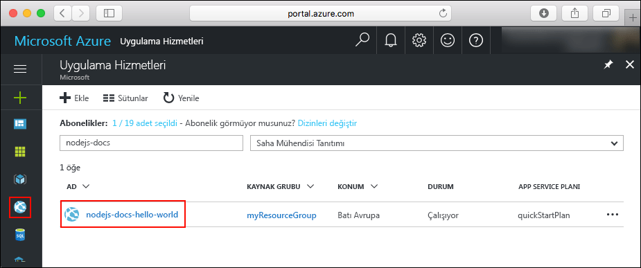

# <a name="create-a-nodejs-web-app-in-azure"></a>Azure App Service'te Node.js web uygulaması oluşturma

> [!NOTE]
> Bu makalede bir uygulamanın Windows üzerinde App Service'e dağıtımı yapılır. _Linux_ üzerinde App Service'e dağıtım yapmak için bkz. [Linux üzerinde Azure App Service'te Node.js web uygulaması oluşturma](./containers/quickstart-nodejs.md).
>

[Azure App Service](overview.md), yüksek oranda ölçeklenebilen, kendi kendine düzeltme eki uygulayan bir web barındırma hizmeti sunar.  Bu hızlı başlangıçta, Azure App Service'te bir Node.js uygulaması dağıtma işlemi gösterilmektedir. [Azure CLI](https://docs.microsoft.com/cli/azure/get-started-with-azure-cli)'yi kullanarak Web uygulamasını oluşturun ve örnek Node.js kodunu Web uygulamasına dağıtmak için Git'i kullanın.


Mac, Windows veya Linux makinesi kullanarak buradaki adımları izleyebilirsiniz. Önkoşullar yüklendikten sonra adımların tamamlanması yaklaşık olarak beş dakika sürer.   

[!INCLUDE [quickstarts-free-trial-note](../../includes/quickstarts-free-trial-note.md)]

## <a name="prerequisites"></a>Önkoşullar

Bu hızlı başlangıcı tamamlamak için:

* <a href="https://nodejs.org/" target="_blank">Node.js ve NPM'yi yükleyin</a>

## <a name="download-the-sample"></a>Örneği indirme

[https://github.com/Azure-Samples/nodejs-docs-hello-world/archive/master.zip](https://github.com/Azure-Samples/nodejs-docs-hello-world/archive/master.zip) adresinden örnek Node.js projesini indirin ve ZIP arşivini ayıklayın.

_index.js_ dosyasını açın ve aşağıdaki satırı bulun:

```javascript
const port = process.env.PORT || 1337;
```

App Service, process.env.PORT dosyasını uygulamanıza ekleyerek kodun bu değişkenle dinlemesi gereken bağlantı noktasını öğrenmesini sağlar. 

Terminal penceresinde, örnek Node.js projesinin kök dizinine gidin (_index.js_ dosyasını içeren dizin).

## <a name="run-the-app-locally"></a>Uygulamayı yerel olarak çalıştırma

Azure'a dağıttığınızda nasıl görüneceğini görmek için uygulamayı yerel olarak çalıştırın. Yerleşik Node.js HTTP sunucusunu başlatmak için bir terminal penceresi açın ve `npm start` betiğini kullanın.

```bash
npm start
```

Bir web tarayıcısı açın ve `http://localhost:1337` konumundaki örnek uygulamaya gidin.

Sayfada gösterilen örnek uygulamada **Hello World** iletisini görebilirsiniz.


Terminal pencerenizde **Ctrl+C** tuşlarına basarak web sunucusundan çıkın.

> [!NOTE]
> Azure App Service'te uygulama [iisnode](https://github.com/Azure/iisnode) kullanılarak IIS'de çalıştırılır. Uygulamanın iisnode ile çalıştırılmasını sağlamak için kök uygulama dizininde bir web.config dosyası bulunur. Bu dosya IIS tarafından okunabilir ve iisnode ile ilgili ayarlar [iisnode GitHub deposunda](https://github.com/Azure/iisnode/blob/master/src/samples/configuration/web.config) belgelenmiştir.

[!INCLUDE [Create ZIP file](../../includes/app-service-web-create-zip.md)]

[!INCLUDE [cloud-shell-try-it.md](../../includes/cloud-shell-try-it.md)]

[!INCLUDE [Create resource group](../../includes/app-service-web-create-resource-group-scus.md)] 

[!INCLUDE [Create app service plan](../../includes/app-service-web-create-app-service-plan-scus.md)] 

## <a name="create-a-web-app"></a>Web uygulaması oluşturma

Cloud Shell’de, [`az webapp create`](/cli/azure/webapp?view=azure-cli-latest#az-webapp-create) komutuyla `myAppServicePlan` App Service planında bir web uygulaması oluşturun. 

Aşağıdaki örnekte `<app_name>` kısmını genel olarak benzersiz bir uygulama adıyla değiştirin (geçerli karakterler `a-z`, `0-9` ve `-` şeklindedir).

```azurecli-interactive
# Bash and Powershell
az webapp create --resource-group myResourceGroup --plan myAppServicePlan --name <app_name>
```

Web uygulaması oluşturulduğunda Azure CLI aşağıda yer alan çıktıdaki gibi bilgiler gösterir:

```json
{
  "availabilityState": "Normal",
  "clientAffinityEnabled": true,
  "clientCertEnabled": false,
  "cloningInfo": null,
  "containerSize": 0,
  "dailyMemoryTimeQuota": 0,
  "defaultHostName": "<app_name>.azurewebsites.net",
  "enabled": true,
  < JSON data removed for brevity. >
}
```

### <a name="set-nodejs-runtime"></a>Node.js çalışma zamanını ayarlama

Düğüm çalışma zamanı için 10.14.1 ayarlayın. Desteklenen tüm çalışma zamanları görmek için [`az webapp list-runtimes`](/cli/azure/webapp?view=azure-cli-latest#az-webapp-list-runtimes) komutunu çalıştırın.

```azurecli-interactive
# Bash and Powershell
az webapp config appsettings set --resource-group myResourceGroup --name <app_name> --settings WEBSITE_NODE_DEFAULT_VERSION=10.14.1
```

Yeni oluşturduğunuz web uygulamasına göz atın. Değiştirin `<app_name>` benzersiz bir uygulama adına sahip.

```bash
http://<app_name>.azurewebsites.net
```

Yeni web uygulamanız aşağıdaki gibi görünmelidir:


[!INCLUDE [Deploy ZIP file](../../includes/app-service-web-deploy-zip.md)]

## <a name="browse-to-the-app"></a>Uygulamaya göz atma

Web tarayıcınızı kullanarak, dağıtılan uygulamanın konumuna gidin.

```
http://<app_name>.azurewebsites.net
```

Node.js örnek kodu bir Azure App Service web uygulamasında çalışıyor.


**Tebrikler!** App Service’e ilk Node.js uygulamanızı dağıttınız.

## <a name="update-and-redeploy-the-code"></a>Kodu güncelleştirme ve yeniden dağıtma

Bir metin düzenleyici kullanarak `index.js` dosyasını Node.js uygulaması içinde açın ve `response.end` çağrısındaki metinde küçük bir değişiklik yapın:

```javascript
response.end("Hello Azure!");
```

Yerel terminal penceresinde, uygulamanızın kök dizinine gidin ve güncelleştirilmiş projeniz için yeni bir ZIP dosyası oluşturun.

```azurecli-interactive
# Bash
zip -r myUpdatedAppFiles.zip .

# PowerShell
Compress-Archive -Path * -DestinationPath myUpdatedAppFiles.zip
```

[ZIP dosyası dağıtma](#deploy-zip-file)'daki adımları kullanarak bu yeni ZIP dosyasını App Service'e dağıtın.

**Uygulamaya göz atma** adımında açılan tarayıcı penceresine dönüp sayfayı yenileyin.


## <a name="manage-your-new-azure-app"></a>Yeni Azure uygulamanızı yönetme

Oluşturduğunuz web uygulamasını yönetmek için <a href="https://portal.azure.com" target="_blank">Azure portalına</a> gidin.

Sol menüden **uygulama hizmetleri**ve ardından Azure uygulamanızın adına tıklayın.



Web uygulamanızın Genel Bakış sayfasını görürsünüz. Buradan göz atma, durdurma, başlatma, yeniden başlatma ve silme gibi temel yönetim görevlerini gerçekleştirebilirsiniz. 


Soldaki menü, uygulamanızı yapılandırmak için farklı sayfalar sağlar. 

[!INCLUDE [cli-samples-clean-up](../../includes/cli-samples-clean-up.md)]

## <a name="next-steps"></a>Sonraki adımlar

> [!div class="nextstepaction"]
> [MongoDB ile Node.js](app-service-web-tutorial-nodejs-mongodb-app.md)
