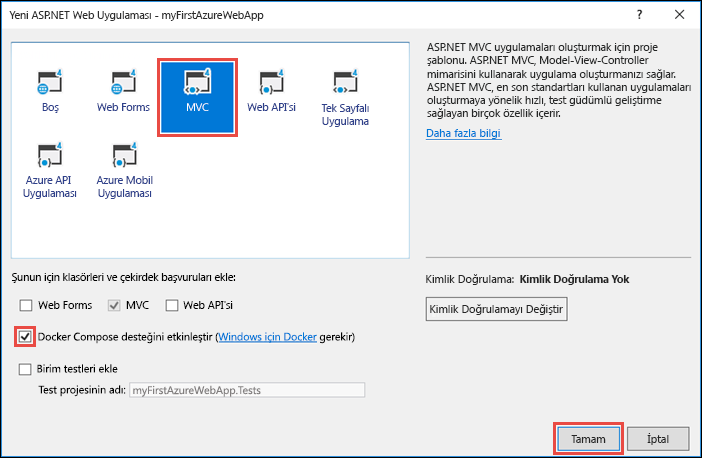
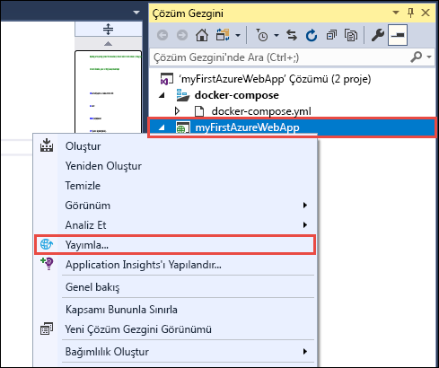
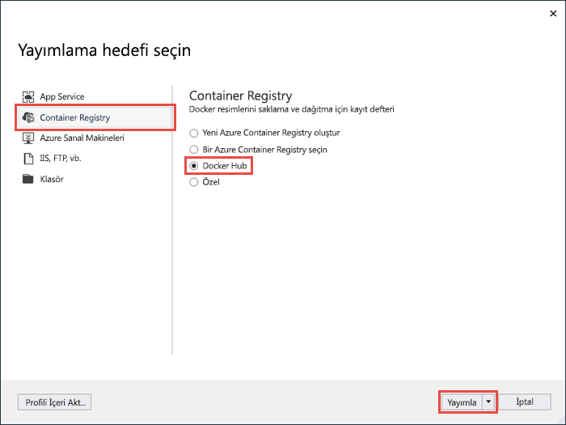
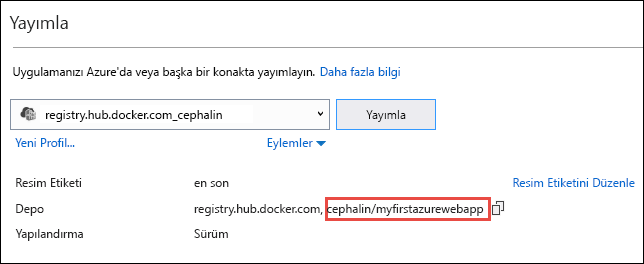
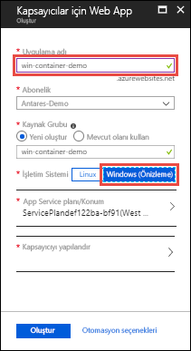
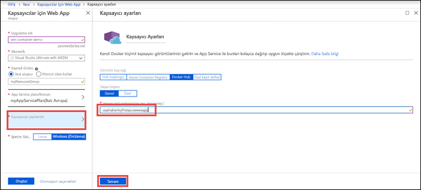

# <a name="run-a-custom-windows-container-in-azure-preview"></a>Azure'da özel Windows kapsayıcısı çalıştırma (Önizleme)

[Azure App Service](overview.md), Windows'da IIS üzerinde çalışan ASP.NET veya Node.js gibi önceden tanımlı uygulama yığınları sunar. Önceden yapılandırılmış Windows ortamı, işletim sistemini yönetimsel erişime, yazılım yüklemesine ve genel derleme önbelleğine ve benzeri uygulamalara karşı kilitler (bkz. [Azure App Service'teki işletim sistemi işlevleri](operating-system-functionality.md)). Uygulamanız önceden yapılandırılmış ortamın sunduğundan daha fazla erişime ihtiyaç duyuyorsa özel bir Windows kapsayıcısı dağıtabilirsiniz. Bu hızlı başlangıçta bir Windows görüntüsündeki ASP.NET uygulamasını Visual Studio’dan [Docker Hub](https://hub.docker.com/)’a dağıtma ve Azure App Service’teki bir özel kapsayıcıda çalıştırma işlemi gösterilmektedir.


## <a name="prerequisites"></a>Önkoşullar

Bu öğreticiyi tamamlamak için:

- <a href="https://hub.docker.com/" target="_blank">Docker Hub hesabı için kaydolma</a>
- <a href="https://docs.docker.com/docker-for-windows/install/" target="_blank">Docker for Windows'u yükleyin</a>.
- <a href="https://docs.microsoft.com/virtualization/windowscontainers/quick-start/quick-start-windows-10" target="_blank">Windows kapsayıcılarını çalıştırmak için Docker’a geçiş yapın</a>.
- **ASP.NET ve web geliştirme** ve **Azure geliştirme** iş yükleriyle <a href="https://www.visualstudio.com/downloads/" target="_blank">Visual Studio 2017</a>’yi yükleyin. Visual Studio 2017'yi zaten yüklediyseniz:
    - **Yardım** > **Güncelleştirmeleri Denetle**'ye tıklayarak Visual Studio'daki en son güncelleştirmeleri yükleyin.
    - **Araçlar** > **Araçları ve Özellikleri Al**'a tıklayarak iş yüklerini Visual Studio’ya ekleyin.

## <a name="create-an-aspnet-web-app"></a>ASP.NET web uygulaması oluşturma

Visual Studio'da **Dosya > Yeni > Proje**’yi seçerek bir proje oluşturun. 

**Yeni Proje** iletişim kutusunda **Visual C# > Web > ASP.NET Web Uygulaması (.NET Framework)** öğesini seçin.

Uygulamayı _myFirstAzureWebApp_ olarak adlandırın ve ardından **Tamam**’ı seçin.
   


Azure’a herhangi bir türde ASP.NET web uygulaması dağıtabilirsiniz. Bu hızlı başlangıçta **MVC** şablonunu seçin ve kimlik doğrulamasının **Kimlik Doğrulaması Yok** olarak ayarlandığından emin olun.

**Docker Compose desteğini etkinleştir**’i seçin.

**Tamam**’ı seçin.



_Dockerfile_ dosyası otomatik olarak açılmazsa **Çözüm Gezgini**’nden açın.

[Desteklenen bir üst görüntü](#use-a-different-parent-image) kullanmanız gerekir. `FROM` satırını aşağıdaki kod ile değiştirerek üst görüntüyü değiştirin ve dosyayı kaydedin:

```Dockerfile
FROM mcr.microsoft.com/dotnet/framework/aspnet:4.7.2-windowsservercore-ltsc2019
```

Menüden **Hata Ayıkla > Hata Ayıklamadan Başla**’yı seçerek web uygulamasını yerel olarak çalıştırın.


## <a name="publish-to-docker-hub"></a>Docker Hub'da yayımlama

**Çözüm Gezgini**’nde **myFirstAzureWebApp** projesine sağ tıklayıp **Yayımla**’yı seçin.



Yayımlama sihirbazı otomatik olarak başlatılır. **Container Registry** > **Docker Hub** > **Yayımla**’yı seçin.



Docker Hub hesabı kimlik bilgilerinizi belirtin ve **Kaydet**’e tıklayın. 

Dağıtımın tamamlanmasını bekleyin. **Yayımla** sayfasında, daha sonra App Service’te kullanacağınız depo adı gösterilir.



Bu depo adını daha sonrası için kopyalayın.

## <a name="sign-in-to-azure"></a>Azure'da oturum açma

https://portal.azure.com adresinden Azure portalında oturum açın.

## <a name="create-a-windows-container-app"></a>Windows kapsayıcı uygulaması oluşturma

1. Azure portalının sol üst köşesinde bulunan **Kaynak oluştur** öğesini seçin.

2. Azure Market kaynakları listesinin üzerindeki arama kutusunda **Kapsayıcılar için Web App**'i arayın ve seçin.

3. *win-container-demo* gibi bir uygulama adı girin, varsayılan değerleri kabul ederek yeni kaynak grubu oluşturun ve **İşletim sistemi** kutusunda **Windows (Önizleme)** seçeneğine tıklayın.

    

4. **App Service planı/Konumu** > **Yeni oluştur**'a tıklayarak bir App Service planı oluşturun. Plana yeni bir ad verin, varsayılan değerleri kabul edin ve **Tamam**'a tıklayın.

    

5. **Kapsayıcıyı yapılandır**’a tıklayın. **Görüntü ve isteğe bağlı etiket** alanında, [Docker Hub’da Yayımla](#publish-to-docker-hub) işleminde kopyaladığınız depo adını kullanın, ardından **Tamam**’a tıklayın.

    

    Web uygulamanız için [Azure Container Registry](/azure/container-registry/) gibi başka bir konumda veya başka özel bir depoda bulunan özel görüntünüz varsa bu adımda yapılandırabilirsiniz.

6. **Oluştur**'a tıklayın ve Azure'un gereken kaynakları oluşturmasını bekleyin.

## <a name="browse-to-the-container-app"></a>Kapsayıcı uygulamasına göz atma

Azure işlemi tamamlandığında bir bildirim kutusu görüntülenir.


1. **Kaynağa git**'e tıklayın.

2. Uygulama sayfasında **URL**'nin altındaki bağlantıya tıklayın.

Aşağıdaki sayfayla yeni bir tarayıcı sayfası açılır:


Birkaç dakika bekleyin ve varsayılan ASP.NET giriş sayfasını görene kadar tekrar deneyin:


**Tebrikler!** Azure App Service'te ilk özel Windows kapsayıcınızı çalıştırıyorsunuz.

## <a name="see-container-start-up-logs"></a>Kapsayıcı başlangıç günlüklerini inceleme

Windows kapsayıcısının yüklenmesi biraz zaman alabilir. İlerleme durumunu görmek için aşağıdaki URL'ye gidin. *\<app_name>* yerine uygulamanızın adını yazın.
```
https://<app_name>.scm.azurewebsites.net/api/logstream
```

Akışı yapılan günlükler şuna benzer:

```
2018-07-27T12:03:11  Welcome, you are now connected to log-streaming service.
27/07/2018 12:04:10.978 INFO - Site: win-container-demo - Start container succeeded. Container: facbf6cb214de86e58557a6d073396f640bbe2fdec88f8368695c8d1331fc94b
27/07/2018 12:04:16.767 INFO - Site: win-container-demo - Container start complete
27/07/2018 12:05:05.017 INFO - Site: win-container-demo - Container start complete
27/07/2018 12:05:05.020 INFO - Site: win-container-demo - Container started successfully
```

## <a name="update-locally-and-redeploy"></a>Yerel olarak güncelleştirme ve yeniden dağıtma

**Çözüm Gezgini** menüsünden _Görünümler\Giriş\Index.cshtml_ dosyasını açın.

Üst kısımda `<div class="jumbotron">` HTML etiketini bulun ve tüm öğeyi aşağıdaki kodla değiştirin:

```HTML
<div class="jumbotron">
    <h1>ASP.NET in Azure!</h1>
    <p class="lead">This is a simple app that we’ve built that demonstrates how to deploy a .NET app to Azure App Service.</p>
</div>
```

Azure’a yeniden dağıtmak için **Çözüm Gezgini**’nde **myFirstAzureWebApp** projesine sağ tıklayıp **Yayımla**’yı seçin.

Yayımlama sayfasında **Yayımla**’yı seçin ve yayımlama işleminin tamamlanmasını bekleyin.

App Service’in Docker Hub’dan yeni görüntüyü çekmesini istemek için uygulamayı yeniden başlatın. Portaldaki uygulama sayfasına geri dönerek **Yeniden Başlat** > **Evet**’e tıklayın.


Yeniden [Kapsayıcı uygulamasına göz atın](#browse-to-the-container-app). Web sayfasını yenilediğinizde, uygulama ilk olarak "Başlangıç" sayfasına geri dönmeli, birkaç dakika sonra ise güncellenmiş web sayfasını tekrar görüntülemelidir.


## <a name="use-a-different-parent-image"></a>Farklı bir üst görüntü kullanma

Uygulamanızı çalıştırmak için farklı bir özel Docker görüntüsü kullanabilirsiniz. Ancak istediğiniz çerçeve için doğru [üst görüntüyü](https://docs.docker.com/develop/develop-images/baseimages/) seçmeniz gerekir: 

- .NET Framework uygulamalarını dağıtmak için Windows Server Core 2019 üzerinde temel alan bir üst görüntü kullanmak [uzun süreli bakım kanalı (LTSC)](https://docs.microsoft.com/windows-server/get-started-19/servicing-channels-19#long-term-servicing-channel-ltsc) bırakın. 
- .NET Core uygulamaları dağıtmak için Windows Server Nano 1809 alan bir üst görüntü kullanmak [yarı yıllık bakım kanalı (SAC)](https://docs.microsoft.com/windows-server/get-started-19/servicing-channels-19#semi-annual-channel) bırakın. 

Uygulama başlatılırken üst görüntünün indirilmesi zaman alabilir. Ancak Azure App Service önbelleğinde bulunan aşağıdaki üst görüntülerden birini kullanarak başlangıç süresini kısaltabilirsiniz:

- [MCR.microsoft.com/dotnet/Framework/ASPNET](https://hub.docker.com/_/microsoft-dotnet-framework-aspnet/): 4.7.2-windowsservercore-ltsc2019
- [MCR.microsoft.com/Windows/nanoserver](https://hub.docker.com/_/microsoft-windows-nanoserver/): 1809 - Bu, Microsoft kullanılan temel kapsayıcısı [ASP.NET Core](https://hub.docker.com/_microsoft-dotnet-cores-aspnet) Microsoft Windows Nano sunucu görüntülerini.

## <a name="next-steps"></a>Sonraki adımlar

> [!div class="nextstepaction"]
> [Azure'da Windows kapsayıcısına geçirme](app-service-web-tutorial-windows-containers-custom-fonts.md)
