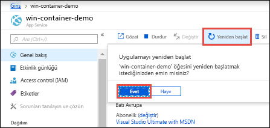

# <a name="run-a-custom-windows-container-in-azure-preview"></a>Azure'da özel Windows kapsayıcısı çalıştırma (Önizleme)

[Azure App Service](overview.md), Windows'da IIS üzerinde çalışan ASP.NET veya Node.js gibi önceden tanımlı uygulama yığınları sunar. Önceden yapılandırılmış Windows ortamı, işletim sistemini yönetim erişiminden, yazılım yüklemelerinden, genel derleme önbelleğinde yapılan değişikliklerden ve benzeri değişikliklerden kilitler. Daha fazla bilgi için [Azure Uygulama Hizmeti'nde İşletim sistemi işlevine](operating-system-functionality.md)bakın. Uygulamanız önceden yapılandırılmış ortamın sunduğundan daha fazla erişime ihtiyaç duyuyorsa özel bir Windows kapsayıcısı dağıtabilirsiniz.

Bu hızlı başlangıç, Windows görüntüsündeki bir ASP.NET uygulamasının Visual Studio'dan [Docker Hub'a](https://hub.docker.com/) nasıl dağıtılancaya kadar dağıtılabildiğini gösterir. Uygulamayı Azure Uygulama Hizmeti'nde özel bir kapsayıcıda çalıştırın.

## <a name="prerequisites"></a>Ön koşullar

Bu öğreticiyi tamamlamak için:

- <a href="https://hub.docker.com/" target="_blank">Docker Hub hesabı için kaydolma</a>
- <a href="https://docs.docker.com/docker-for-windows/install/" target="_blank">Docker for Windows'u yükleyin</a>.
- <a href="https://docs.microsoft.com/virtualization/windowscontainers/quick-start/quick-start-windows-10" target="_blank">Windows kapsayıcılarını çalıştırmak için Docker’a geçiş yapın</a>.
- Visual <a href="https://www.visualstudio.com/downloads/" target="_blank">Studio 2019'u</a> **ASP.NET ve web geliştirme ve** Azure **geliştirme** iş yükleriyle yükleyin. Visual Studio 2019'u zaten yüklediyseniz:

    - **Güncellemeler için** **Yardım** > Denetimi'ni seçerek Visual Studio'daki en son güncelleştirmeleri yükleyin.
    - **Araçlar** > **Alın Araçları ve Özellikleri**seçerek Visual Studio'daki iş yüklerini ekleyin.

## <a name="create-an-aspnet-web-app"></a>ASP.NET web uygulaması oluşturma

Aşağıdaki adımları izleyerek ASP.NET bir web uygulaması oluşturun:

1. Visual Studio'u açın ve ardından **yeni bir proje oluştur'u**seçin.

1. **Yeni bir proje oluştur'da**C#için web uygulamasını **(.NET Framework) ASP.NET** bulun ve seçin, ardından **İleri'yi**seçin.

1. **Yeni projenizi yapılandırın**, uygulama _myFirstAzureWebApp_adını ve sonra **Oluştur'u**seçin.

   

1. Azure’a herhangi bir türde ASP.NET web uygulaması dağıtabilirsiniz. Bu hızlı başlangıç için **MVC** şablonu seçin.

1. **Docker desteğini**seçin ve kimlik doğrulamanın Kimlik **Doğrulama yok**olarak ayarlandıklarına emin olun. **Oluştur'u**seçin.

   

1. _Dockerfile_ dosyası otomatik olarak açılmazsa **Çözüm Gezgini**’nden açın.

1. Desteklenen bir [üst görüntüye](#use-a-different-parent-image)ihtiyacınız vardır. `FROM` satırını aşağıdaki kod ile değiştirerek üst görüntüyü değiştirin ve dosyayı kaydedin:

   ```Dockerfile
   FROM mcr.microsoft.com/dotnet/framework/aspnet:4.7.2-windowsservercore-ltsc2019
   ```

1. Visual Studio menüsünden, web uygulamasını yerel olarak çalıştırmak için Hata Ayıklama olmadan **Hata** > **Ayıklama Başlat'ı** seçin.

   

## <a name="publish-to-docker-hub"></a>Docker Hub'da yayımlama

1. **Solution**Explorer'da, **myFirstAzureWebApp** projesine sağ tıklayın ve **Yayımla'yı**seçin.

1. **Uygulama Hizmeti'ni** seçin ve ardından **Yayımla'yı**seçin.

1. **Yayımlama hedefini**seç'te, **Konteyner Kayıt Defteri** ve Docker **Hub'ı**seçin ve ardından **Yayımla'yı**tıklatın.

   

1. Docker Hub hesap kimlik bilgilerinizi temin edin ve **Kaydet'i**seçin.

   Dağıtımın tamamlanmasını bekleyin. **Yayımla** sayfası artık daha sonra kullanılacak depo adını gösterir.

   

1. Bu depo adını daha sonrası için kopyalayın.

## <a name="create-a-windows-container-app"></a>Windows kapsayıcı uygulaması oluşturma

1. [Azure portalında]( https://portal.azure.com)oturum açın.

1. Azure portalının sol üst köşesinde bulunan **Kaynak oluştur** öğesini seçin.

1. Azure Marketi kaynakları listesinin üzerindeki arama kutusunda **Kapsayıcılar için Web Uygulaması'nı**arayın ve **Oluştur'u**seçin.

1. **Web App Oluştur'da**aboneliğinizi ve **Kaynak Grubu'nuzu**seçin. Gerekirse yeni bir kaynak grubu oluşturabilirsiniz.

1. *Win-container-demo* gibi bir uygulama adı sağlayın ve **İşletim Sistemi**için **Windows'u** seçin. **Sonraki seçin: Devam** etmek için Docker.

   

1. **Resim Kaynağı**için **Docker Hub'ı** seçin ve Resim **ve etiket**için, [Docker Hub'a Yayımla'da](#publish-to-docker-hub)kopyala'da kopyaladığınız depo adını girin.

   

    Web uygulamanız için [Azure Container Registry](/azure/container-registry/) gibi başka bir konumda veya başka özel bir depoda bulunan özel görüntünüz varsa bu adımda yapılandırabilirsiniz.

1. **Gözden Geçir ve Oluştur'u** seçin ve ardından Azure'un gerekli kaynakları oluşturmasını bekleyin. **Create**

## <a name="browse-to-the-container-app"></a>Kapsayıcı uygulamasına göz atma

Azure işlemi tamamlandığında bir bildirim kutusu görüntülenir.


1. **Kaynağa git**'e tıklayın.

1. Bu kaynağın genel görünümünde, **URL'nin**yanındaki bağlantıyı izleyin.

Yeni bir tarayıcı sayfası aşağıdaki sayfaya açılır:


Birkaç dakika bekleyin ve varsayılan ASP.NET giriş sayfasını görene kadar tekrar deneyin:


**Tebrikler!** Azure App Service'te ilk özel Windows kapsayıcınızı çalıştırıyorsunuz.

## <a name="see-container-start-up-logs"></a>Kapsayıcı başlangıç günlüklerini inceleme

Windows kapsayıcısının yüklenmesi biraz zaman alabilir. İlerlemeyi görmek için, * \<app_name>* uygulamanızın adıyla değiştirerek aşağıdaki URL'ye gidin.
```
https://<app_name>.scm.azurewebsites.net/api/logstream
```

Akışı yapılan günlükler şuna benzer:

```
2018-07-27T12:03:11  Welcome, you are now connected to log-streaming service.
27/07/2018 12:04:10.978 INFO - Site: win-container-demo - Start container succeeded. Container: facbf6cb214de86e58557a6d073396f640bbe2fdec88f8368695c8d1331fc94b
27/07/2018 12:04:16.767 INFO - Site: win-container-demo - Container start complete
27/07/2018 12:05:05.017 INFO - Site: win-container-demo - Container start complete
27/07/2018 12:05:05.020 INFO - Site: win-container-demo - Container started successfully
```

## <a name="update-locally-and-redeploy"></a>Yerel olarak güncelleştirme ve yeniden dağıtma

1. Visual Studio' da, **Solution Explorer'** da, **Açık Görünümler** > **Home** > **Index.cshtml**.

1. Üst kısımda `<div class="jumbotron">` HTML etiketini bulun ve tüm öğeyi aşağıdaki kodla değiştirin:

   ```HTML
   <div class="jumbotron">
       <h1>ASP.NET in Azure!</h1>
       <p class="lead">This is a simple app that we've built that demonstrates how to deploy a .NET app to Azure App Service.</p>
   </div>
   ```

1. Azure'a yeniden dağıtmak için **Solution Explorer'daki** **myFirstAzureWebApp** projesine sağ tıklayın ve **Yayımla'yı**seçin.

1. Yayımlama sayfasında **Yayımla**’yı seçin ve yayımlama işleminin tamamlanmasını bekleyin.

1. App Service’in Docker Hub’dan yeni görüntüyü çekmesini istemek için uygulamayı yeniden başlatın. Portaldaki uygulama sayfasına geri dön, >  **Evet'i Yeniden Başlat'ı**tıklatın.**Yes**

   

Yeniden [Kapsayıcı uygulamasına göz atın](#browse-to-the-container-app). Web sayfasını yenilediğinizde, uygulama ilk olarak "Başlangıç" sayfasına geri dönmeli, birkaç dakika sonra ise güncellenmiş web sayfasını tekrar görüntülemelidir.


## <a name="use-a-different-parent-image"></a>Farklı bir üst görüntü kullanma

Uygulamanızı çalıştırmak için farklı bir özel Docker görüntüsü kullanmakta özgürüz. Ancak, istediğiniz çerçeve için doğru [üst görüntüyü (temel resim)](https://docs.docker.com/develop/develop-images/baseimages/) seçmeniz gerekir:

- .NET Framework uygulamalarını dağıtmak için Windows Server Core 2019 [Uzun Vadeli Hizmet Kanalı (LTSC)](https://docs.microsoft.com/windows-server/get-started-19/servicing-channels-19#long-term-servicing-channel-ltsc) sürümüne dayalı bir üst görüntü kullanın. 
- .NET Core uygulamalarını dağıtmak için, Windows Server Nano 1809 [Yarı Yıllık Servis Kanalı (SAC)](https://docs.microsoft.com/windows-server/get-started-19/servicing-channels-19#semi-annual-channel) sürümüne dayalı bir üst görüntü kullanın. 

Uygulama başlatılırken üst görüntünün indirilmesi zaman alabilir. Ancak Azure App Service önbelleğinde bulunan aşağıdaki üst görüntülerden birini kullanarak başlangıç süresini kısaltabilirsiniz:

- [mcr.microsoft.com/dotnet/framework/aspnet](https://hub.docker.com/_/microsoft-dotnet-framework-aspnet/):4.7.2-windowsservercore-ltsc2019
- [mcr.microsoft.com/windows/nanoserver](https://hub.docker.com/_/microsoft-windows-nanoserver/):1809 - Bu resim, [Microsoft ASP.NET Core](https://hub.docker.com/_/microsoft-dotnet-core-aspnet/) Microsoft Windows Nano Server görüntülerinde kullanılan temel kapsayıcıdır.

## <a name="next-steps"></a>Sonraki adımlar

> [!div class="nextstepaction"]
> [Azure'da Windows kapsayıcısına geçirme](app-service-web-tutorial-windows-containers-custom-fonts.md)
