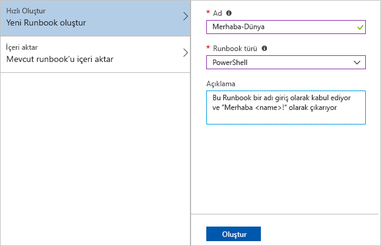

# <a name="create-an-azure-automation-runbook"></a>Azure Otomasyonu runbook'u oluşturma

Azure Otomasyonu runbook'larını Azure üzerinden oluşturabilirsiniz. Bu yöntem Otomasyon runbook'larının oluşturulması için tarayıcı tabanlı kullanıcı arabirimi sunar. Bu hızlı başlangıçta Otomasyon PowerShell runbook'u oluşturma, düzenleme, test etme ve yayımlama adımları incelenmiştir.

Azure aboneliğiniz yoksa başlamadan önce [ücretsiz bir Azure hesabı](https://azure.microsoft.com/free/?WT.mc_id=A261C142F) oluşturun.

## <a name="sign-in-to-azure"></a>Azure'da oturum açma

Adresinden Azure 'da oturum açın https://portal.azure.com .

## <a name="create-the-runbook"></a>Runbook 'u oluşturma

Öncelikle bir runbook oluşturun. Bu hızlı başlangıçta oluşturulan örnek runbook, varsayılan olarak `Hello World` çıktısını verir.

1. Otomasyon hesabınızı açın.

1. **Işlem Otomasyonu**altında **runbook 'lar** ' a tıklayın. Runbook'ların listesi görüntülenir.

1. Listenin en üstünde **runbook oluştur ' a** tıklayın.

1. `Hello-World` **Ad** alanına Runbook adı Için yazın ve **runbook türü** alanı için **PowerShell** ' i seçin. 

   

1. **Oluştur**’a tıklayın. Runbook oluşturulur ve PowerShell Runbook'unu Düzenle sayfası açılır.

    :::image type="content" source="./media/automation-quickstart-create-runbook/automation-edit-runbook-empty.png" alt-text="PowerShell runbook 'Unu Düzenle sayfasının ekran görüntüsü.":::

1. Aşağıdaki kodu düzenleme bölmesine yazın veya kopyalayıp yapıştırın. Varsayılan değeri ile çağrılan isteğe bağlı bir giriş parametresi oluşturur `Name` `World` ve bu giriş değerini kullanan bir dize verir:

   ```powershell-interactive
   param
   (
       [Parameter(Mandatory=$false)]
       [String] $Name = "World"
   )

   "Hello $Name!"
   ```

1. Runbook 'un taslak kopyasını kaydetmek için **Kaydet** ' e tıklayın.

    :::image type="content" source="./media/automation-quickstart-create-runbook/automation-edit-runbook.png" alt-text="Sağ pencerede bir kod örneği içeren PowerShell runbook 'Unu Düzenle sayfasının ekran görüntüsü.":::

## <a name="test-the-runbook"></a>Runbook'u test etme

Runbook oluşturulduktan sonra, çalıştığını doğrulamak için Runbook 'u test etmeniz gerekir.

1. Test bölmesini açmak için **Test bölmesi**’ne tıklayın.

1. **Ad** için bir değer girip **Başlat**'a tıklayın. Test işi başlar ve iş durumuyla çıkışı görüntülenir.

    :::image type="content" source="./media/automation-quickstart-create-runbook/automation-test-runbook.png" alt-text="Ad alanında örnek bir değere sahip test bölmesinin ekran görüntüsü.":::

1. Sağ üst köşedeki **X** simgesine tıklayarak test bölmesini kapatın. Açılan pencerede **Tamam**'ı seçin.

1. PowerShell Runbook'unu Düzenle sayfasında **Yayımla**'ya tıklayarak runbook'u hesaptaki runbook'un resmi sürümü olarak yayımlayın.

   :::image type="content" source="./media/automation-quickstart-create-runbook/automation-hello-world-runbook-job.png" alt-text="Yayımla düğmesinin seçili olduğunu gösteren PowerShell runbook 'Unu Düzenle sayfasının ekran görüntüsü.":::

## <a name="run-the-runbook"></a>Runbook'u çalıştırma

Runbook yayımlandıktan sonra genel bakış sayfası gösterilir.

1. Runbook'un genel bakış sayfasında **Başlat**'a tıklayarak bu runbook'un Runbook'u Başlat yapılandırma sayfasını açın.

   :::image type="content" source="./media/automation-quickstart-create-runbook/automation-hello-world-runbook-start.png" alt-text="Runbook yapılandırması başlatma sayfasının ekran görüntüsü.":::

1. Varsayılan değerin kullanılması için **Ad** alanın boş bırakıp **Tamam**'a tıklayın. Runbook işi gönderilir ve Iş sayfası görüntülenir.

   :::image type="content" source="./media/automation-quickstart-create-runbook/automation-job-page.png" alt-text="Çıktı düğmesinin seçili olduğunu gösteren Iş sayfasının ekran görüntüsü.":::

1. İş durumu `Running` veya olduğunda, çıkış `Completed` bölmesini açmak ve Runbook çıkışını görüntülemek için **Çıkış** ' a tıklayın.

   :::image type="content" source="./media/automation-quickstart-create-runbook/automation-hello-world-runbook-job-output.png" alt-text="Runbook çıkışını gösteren çıkış bölmesinin ekran görüntüsü.":::

## <a name="clean-up-resources"></a>Kaynakları temizleme

İhtiyacınız kalmadıysa runbook'u silebilirsiniz. Bunu yapmak için runbook listesinden runbook'u seçip **Sil**'e tıklayın.

## <a name="next-steps"></a>Sonraki adımlar

Bu hızlı başlangıçta bir runbook oluşturdunuz, düzenlediniz, test ettiniz ve yayımladınız, ayrıca bir runbook işi başlattınız. Otomasyon runbook'ları hakkında daha fazla bilgi edinmek için Otomasyon'da oluşturabileceğiniz ve kullanabileceğiniz farklı runbook türlerini anlatan makaleye geçin.

> [!div class="nextstepaction"]
> [Azure Otomasyonu runbook türleri](./automation-runbook-types.md)
