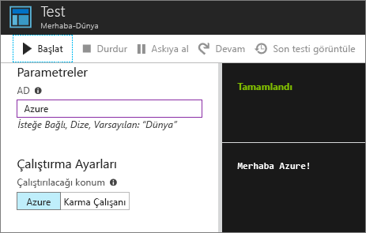

# <a name="create-an-azure-automation-runbook"></a>Azure Otomasyonu runbook'u oluşturma

Azure Otomasyonu runbook'larını Azure üzerinden oluşturabilirsiniz. Bu yöntem Otomasyon runbook'larının oluşturulması için tarayıcı tabanlı kullanıcı arabirimi sunar. Bu hızlı başlangıçta Otomasyon PowerShell runbook'u oluşturma, düzenleme, test etme ve yayımlama adımları incelenmiştir.

Azure aboneliğiniz yoksa başlamadan önce [ücretsiz bir Azure hesabı](https://azure.microsoft.com/free/?WT.mc_id=A261C142F) oluşturun.

## <a name="sign-in-to-azure"></a>Azure'da oturum açma

Azure'da oturum https://portal.azure.comaç.

## <a name="create-the-runbook"></a>Runbook'u oluşturma

Öncelikle bir runbook oluşturun. Bu hızlı başlangıçta oluşturulan örnek runbook, varsayılan olarak `Hello World` çıktısını verir.

1. Otomasyon hesabınızı açın.

1. **Proses Otomasyonu**altında **Runbook'ları** tıklatın. Runbook'ların listesi görüntülenir.

1. Listenin en üstünde **bir runbook oluştur'u** tıklatın.

1. Ad `Hello-World` alanına runbook adı **Name** için girin ve **Runbook türü** alanı için **PowerShell'i** seçin. 

   

1. **Oluştur'u**tıklatın. Runbook oluşturulur ve PowerShell Runbook'unu Düzenle sayfası açılır.

    

1. Aşağıdaki kodu düzenleme bölmesine yazın veya kopyalayıp yapıştırın. Varsayılan değeri `Name` `World`ile çağrılan isteğe bağlı bir giriş parametresi oluşturur ve bu giriş değerini kullanan bir dize çıkar:

   ```powershell-interactive
   param
   (
       [Parameter(Mandatory=$false)]
       [String] $Name = "World"
   )

   "Hello $Name!"
   ```

1. Runbook'un taslak kopyasını kaydetmek için **Kaydet'i** tıklatın.

    

## <a name="test-the-runbook"></a>Runbook'u test etme

Runbook oluşturulduktan sonra, çalıştığını doğrulamak için runbook test gerekir.

1. Test bölmesini açmak için **Test bölmesi**’ne tıklayın.

1. **Ad** için bir değer girip **Başlat**'a tıklayın. Test işi başlar ve iş durumuyla çıkışı görüntülenir.

    

1. Sağ üst köşedeki **X'e** tıklayarak Test bölmesini kapatın. Açılan pencerede **Tamam**'ı seçin.

1. PowerShell Runbook'unu Düzenle sayfasında **Yayımla**'ya tıklayarak runbook'u hesaptaki runbook'un resmi sürümü olarak yayımlayın.

   

## <a name="run-the-runbook"></a>Runbook'u çalıştırma

Runbook yayımlandıktan sonra genel bakış sayfası gösterilir.

1. Runbook'un genel bakış sayfasında **Başlat**'a tıklayarak bu runbook'un Runbook'u Başlat yapılandırma sayfasını açın.

   

1. Varsayılan değerin kullanılması için **Ad** alanın boş bırakıp **Tamam**'a tıklayın. Runbook işi gönderilir ve İş sayfası görüntülenir.

   

1. İş durumu olduğunda `Running` `Completed`veya Çıktı bölmesini görüntülemek için **Çıktı'yı** tıklatın.

   

## <a name="clean-up-resources"></a>Kaynakları temizleme

İhtiyacınız kalmadıysa runbook'u silebilirsiniz. Bunu yapmak için runbook listesinden runbook'u seçip **Sil**'e tıklayın.

## <a name="next-steps"></a>Sonraki adımlar

Bu hızlı başlangıçta bir runbook oluşturdunuz, düzenlediniz, test ettiniz ve yayımladınız, ayrıca bir runbook işi başlattınız. Otomasyon runbook'ları hakkında daha fazla bilgi edinmek için Otomasyon'da oluşturabileceğiniz ve kullanabileceğiniz farklı runbook türlerini anlatan makaleye geçin.

> [!div class="nextstepaction"]
> [Otomasyon ile Nasıl Yapılır? - Runbook Türleri](./automation-runbook-types.md)
