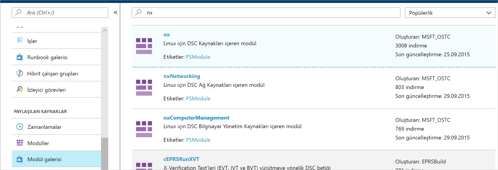

# <a name="configure-a-virtual-machine-with-desired-state-configuration"></a>İstenilen Durum Yapılandırması ile sanal makineyi yapılandırma

Azure Otomasyon Durumu Yapılandırmasını etkinleştirerek, Windows ve Linux sunucularınızın yapılandırmalarını İstenilen Durum Yapılandırmasını (DSC) kullanarak yönetebilir ve izleyebilirsiniz. İstenilen yapılandırmadan sürüklenen yapılandırmalar tanımlanabilir veya otomatik olarak düzeltilebilir. Bu hızlı başlangıçta Linux VM ekleme ve DSC ile LAMP yığını dağıtma adımlarına yer verilmiştir.

## <a name="prerequisites"></a>Ön koşullar

Bu hızlı başlangıcı tamamlamak için şunlar gerekir:

* Azure aboneliği. Azure aboneliğiniz yoksa, ücretsiz [bir hesap oluşturun.](https://azure.microsoft.com/free/)
* Azure Otomasyonu hesabı. Bir Azure Otomasyonu Garklı Çalıştır hesabı oluşturma yönergeleri için bkz. [Azure Farklı Çalıştır Hesabı](automation-sec-configure-azure-runas-account.md).
* Red Hat Enterprise Linux, CentOS veya Oracle Linux çalıştıran bir Azure Resource Manager VM (Klasik değil). VM oluşturma yönergeleri için bkz. [Azure portalında ilk Linux sanal makinenizi oluşturma](../virtual-machines/linux/quick-create-portal.md)

## <a name="sign-in-to-azure"></a>Azure'da oturum açma
Azure'da oturum https://portal.azure.comaç.

## <a name="onboard-a-virtual-machine"></a>Sanal makine ekleme

Bir makinede bulunan ve DSC'yi etkinleştirmek için birçok farklı yöntem vardır. Bu hızlı başlangıçta ekleme işlemi Otomasyon hesabıyla gerçekleştirilmektedir. Biniş makalesini okuyarak makinelerinizi Devlet Yapılandırmasına eketmek [onboarding](https://docs.microsoft.com/azure/automation/automation-dsc-onboarding) için farklı yöntemler hakkında daha fazla bilgi edinebilirsiniz.

1. Azure portalının sol tarafındaki bölmede **Otomasyon hesapları**'nı seçin. Sol bölmede görünmüyorsa, Tüm **hizmetleri** tıklatın ve ortaya çıkan görünümde arama yapın.
1. Listeden bir Otomasyon hesabı seçin.
1. Otomasyon hesabının sol bölmesinde, **Durum yapılandırması (DSC)** öğesini seçin.
2. VM seçme sayfasını açmak için **Ekle**'ye tıklayın.
3. DSC'yi etkinleştirmek için sanal makineyi bulun. Aradığınız sanal makineyi bulmak için arama alanını ve filtre seçeneklerini kullanabilirsiniz.
4. Sanal makineye tıklayın ve sonra **Bağlan'ı** tıklatın
5. Sanal makineye uygun DSC ayarlarını seçin. Bir yapılandırma hazırladıysanız, bunu `Node Configuration Name`. Makinenin yapılandırma davranışını denetlemek için [yapılandırma modunu](https://docs.microsoft.com/powershell/scripting/dsc/managing-nodes/metaConfig) ayarlayabilirsiniz.
6. **Tamam**'a tıklayın. DSC uzantısı sanal makineye dağıtılırken, durum `Connecting`.


## <a name="import-modules"></a>Modülleri içeri aktarma

Modüller DSC kaynakları içerir ve birçok [PowerShell Galerisi'nde](https://www.powershellgallery.com)bulunabilir. Yapılandırmalarınızda kullanılan tüm kaynakların derlemeden önce Otomasyon hesabına aktarılması gerekir. Bu öğretici için **nx** adlı modülün kullanılması gerekir.

1. Otomasyon hesabının sol bölmesinde Paylaşılan **Kaynaklar**altında **Modüller Galerisi'ni** seçin.
1. Adının bir kısmını yazarak içe aktarılabilmek için modülü arayın: `nx`.
1. Almak için modüle tıklayın.
1. **İçeri Aktar**’a tıklayın.



## <a name="import-the-configuration"></a>Yapılandırmayı içeri aktarma

Bu hızlı başlangıçta makinede Apache HTTP Server, MySQL ve PHP yapılandırması gerçekleştiren bir DSC yapılandırması kullanılmaktadır. [Bkz. DSC yapılandırmaları.](https://docs.microsoft.com/powershell/scripting/dsc/configurations/configurations)

Bir metin düzenleyicisinde, aşağıdakileri yazın ve yerel olarak **AMPServer.ps1**olarak kaydedin.

```powershell-interactive
configuration LAMPServer {
   Import-DSCResource -module "nx"

   Node localhost {

        $requiredPackages = @("httpd","mod_ssl","php","php-mysql","mariadb","mariadb-server")
        $enabledServices = @("httpd","mariadb")

        #Ensure packages are installed
        ForEach ($package in $requiredPackages){
            nxPackage $Package{
                Ensure = "Present"
                Name = $Package
                PackageManager = "yum"
            }
        }

        #Ensure daemons are enabled
        ForEach ($service in $enabledServices){
            nxService $service{
                Enabled = $true
                Name = $service
                Controller = "SystemD"
                State = "running"
            }
        }
   }
}
```

Yapılandırmayı içeri aktarmak için:

1. Otomasyon hesabının sol bölmesinde **Durum yapılandırması (DSC)** öğesini seçin ve ardından **Yapılandırmalar** sekmesine tıklayın.
2. **+ Ekle**'ye tıklayın.
3. Önceki adımda kaydettiğiniz yapılandırma dosyasını seçin.
4. **Tamam**'a tıklayın.

## <a name="compile-a-configuration"></a>Yapılandırma derleme

Düğüme atanabilmesi için bir düğüm yapılandırmasına (MOF belgesi) DSC yapılandırması derlemeniz gerekir. Derleme yapılandırmayı doğrular ve parametre değerlerinin girilmesini sağlar. Yapılandırma derleme hakkında daha fazla bilgi edinmek için [bkz.](automation-dsc-compile.md)

1. Otomasyon hesabının sol bölmesinde **Durum Yapılandırması'nı (DSC)** seçin ve ardından **Yapılandırmalar** sekmesini tıklatın.
1. Yapılandırmayı `LAMPServer`seçin.
1. Menü seçeneklerinden **Derle'yi** seçin ve ardından **Evet'i**tıklatın.
1. Yapılandırma görünümünde, yeni bir derleme işi sıralanmış bakın. İş başarıyla tamamlandıktan sonra bir sonraki adıma geçebilirsiniz. Herhangi bir hata varsa, ayrıntılar için derleme işini tıklatabilirsiniz.

## <a name="assign-a-node-configuration"></a>Düğüm yapılandırması atama

DSC düğümüne derlenmiş bir düğüm yapılandırması atayabilirsiniz. Atama makine ve monitörler veya otomatik düzeltmeler bu yapılandırma dan herhangi bir sürüklenme için yapılandırma uygular.

1. Otomasyon hesabının sol bölmesinde **Durum Yapılandırması'nı (DSC)** seçin ve ardından **Düğümler** sekmesini tıklatın.
1. Yapılandırma atamak için düğümü seçin.
1. **Düğüm Yapılandırması Ata**'ya tıklayın
1. Düğüm yapılandırmasını `LAMPServer.localhost` seçin ve **Tamam'ı**tıklatın. Durum Yapılandırması şimdi derlenmiş yapılandırmayı düğüme atar ve düğüm `Pending`durumu . Bir sonraki periyodik denetimde düğüm yapılandırmayı alır, uygular ve durumu bildirir. Düğüm ayarlarına bağlı olarak düğümün yapılandırmayı alması 30 dakika kadar sürebilir. 
1. Düğümü hemen denetim gerçekleştirmeye zorlamak için şu komutu Linux sanal makinesinde yerel olarak çalıştırabilirsiniz: `sudo /opt/microsoft/dsc/Scripts/PerformRequiredConfigurationChecks.py`


## <a name="view-node-status"></a>Düğüm durumunu görüntüle

Otomasyon hesabınızdaki tüm Durum Yapılandırması yönetilen düğümlerin durumunu görüntüleyebilirsiniz. Bilgiler, **Durum Yapılandırması (DSC)** seçilerek ve **Düğümler** sekmesini tıklatarak görüntülenir. Ekrana durum, düğüm yapılandırması veya ad araması ile filtre uygulayabilirsiniz.


## <a name="next-steps"></a>Sonraki adımlar

Bu hızlı başlangıçta, Bir Linux VM'den Devlet Yapılandırmasına bindiniz, LAMP yığını için bir yapılandırma oluşturdunuz ve yapılandırmayı VM'ye dağıttınız. Sürekli dağıtımı etkinleştirmek için Azure Otomasyon Durumu Yapılandırmasını nasıl kullanabileceğinizi öğrenmek için makaleye devam edin:

> [!div class="nextstepaction"]
> [DSC ve Chocolatey kullanarak VM'ye sürekli dağıtım](./automation-dsc-cd-chocolatey.md)

* PowerShell DSC hakkında daha fazla bilgi edinmek için [PowerShell İstenen Durum Yapılandırmasına genel bakış](https://docs.microsoft.com/powershell/scripting/dsc/overview/overview)alabakın.
* PowerShell'den Devlet Yapılandırmasını yönetme hakkında daha fazla bilgi edinmek için Azure [PowerShell'e](https://docs.microsoft.com/powershell/module/azurerm.automation/)bakın.
* Raporlama ve uyarı için DSC raporlarını Azure Monitor günlüklerine nasıl ileteceklerini öğrenmek için [Bkz.](automation-dsc-diagnostics.md)