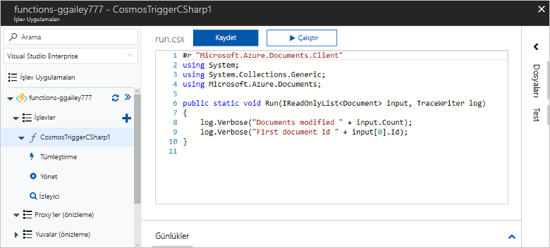
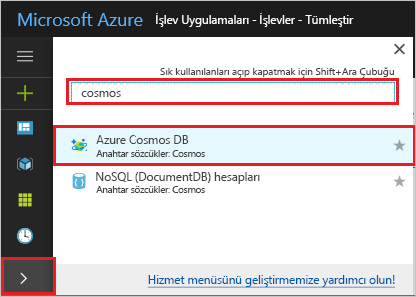

# Azure Cosmos DB tarafından tetiklenen bir işlev oluşturma

Azure Cosmos DB’de veri eklendiğinde veya değiştirildiğinde tetiklenen bir işlev oluşturmayı öğrenin. Azure Cosmos DB hakkında daha fazla bilgi edinmek için bkz. [Azure Cosmos DB: Azure İşlevleri ile sunucusuz veritabanı işlemleri](..\cosmos-db\serverless-computing-database.md).

## Ön koşullar

Bu öğreticiyi tamamlamak için:

+ Azure aboneliğiniz yoksa başlamadan önce [ücretsiz bir hesap](https://azure.microsoft.com/free/?WT.mc_id=A261C142F) oluşturun.

## Azure İşlev uygulaması oluşturma

[!INCLUDE [Create function app Azure portal](../../includes/functions-create-function-app-portal.md)]

Ardından, yeni işlev uygulamasında bir işlev oluşturun.

## Azure Cosmos DB tetikleyicisi oluşturma

1. İşlev uygulamanızı genişletin ve **İşlevler**'in yanındaki **+** düğmesine tıklayın. Bu, işlev uygulamanızdaki ilk işlevse **Özel işlev**'i seçin. Böylece işlev şablonlarının tamamı görüntülenir.

    

2. Arama alanına `cosmos` yazıp Azure Cosmos DB tetikleyici şablonunuz için istediğiniz dili seçin.

    

3. Yeni tetikleyiciyi resmin altındaki tabloda belirtilen ayarlarla yapılandırın.

    
    
    | Ayar      | Önerilen değer  | Açıklama                                |
    | ------------ | ---------------- | ------------------------------------------ |
    | **Ad** | Varsayılan | Şablonun önerdiği varsayılan işlev adını kullanın. |
    | **Koleksiyon adı** | Öğeler | İzlenecek koleksiyonun adı. |
    | **Yoksa kira koleksiyonu oluşturun** | İşaretli | Koleksiyon henüz mevcut değil, bu yüzden oluşturun. |
    | **Veritabanı adı** | Görevler | İzlenecek koleksiyonu içeren veritabanının adı. |

4. **Azure Cosmos DB hesap bağlantısı** etiketinin yanından **Yeni**’yi seçin ve mevcut bir Cosmos DB hesabını ya da **+ Yeni oluştur** seçeneğini belirleyin. 
 
    

6. Yeni bir Cosmos DB hesabı oluştururken tabloda belirtilen **Yeni hesap** ayarlarını kullanın.

    | Ayar      | Önerilen değer  | Açıklama                                |
    | ------------ | ---------------- | ------------------------------------------ |
    | **ID** | Veritabanının adı | Azure Cosmos DB veritabanı için benzersiz kimlik  |
    | **API** | SQL | Bu konu SQL API'sini kullanır.  |
    | **Abonelik** | Azure Aboneliği | Bu yeni Cosmos DB hesabının oluşturulduğu abonelik.  |
    | **Kaynak Grubu** | myResourceGroup |  İşlevi uygulamanızı içeren mevcut kaynak grubunu kullanın. |
    | **Konum**  | WestEurope | İşlev uygulamanıza veya depolanmış belgeleri kullanan diğer uygulamalara yakın olan bir konum seçin.  |

6. Veritabanını oluşturmak için **Tamam**’a tıklayın. Veritabanının oluşturulması birkaç dakika sürebilir. Veritabanı oluşturulduktan sonra, veritabanı bağlantı dizesi bir işlev uygulaması ayarı olarak depolanır. Bu uygulama ayarının adı **Azure Cosmos DB hesap bağlantısına** eklenir. 

7. **Oluştur**’a tıklayarak Azure Cosmos DB tarafından tetiklenen işlevinizi oluşturun. İşlev oluşturulduktan sonra şablon temelli işlev kodu görüntülenir.  

    

    Bu işlev şablonu, günlüklere belge sayısını ve ilk belgenin kimliğini yazar. 

Daha sonra, Azure Cosmos DB hesabınız bağlar ve veritabanında **Görevler** koleksiyonunu oluşturursunuz. 

## Öğeler koleksiyonunu oluşturma

1. Tarayıcıdaki yeni bir sekmede [Azure portalının](https://portal.azure.com) ikinci bir örneğini açın. 

2. Portalın sol tarafındaki simge çubuğunu genişletin, arama alanına `cosmos` yazıp **Azure Cosmos DB**’yi seçin.

    

2. Azure Cosmos DB hesabınızı seçin ve ardından **Veri Gezgini**’ni seçin. 
 
3. **Koleksiyonlar** bölümünde **taskDatabase**’i seçip **Yeni Koleksiyon**’u seçin.

    

4. **Koleksiyon Ekle** bölümünde, resmin altındaki tabloda gösterilen ayarları kullanın. 
 
    
 
    | Ayar|Önerilen değer|Açıklama |
    | ---|---|--- |
    | **Veritabanı Kimliği** | Görevler |Yeni veritabanınızın adı. Bu, işlev bağlamanızda tanımlanan adla eşleşmelidir. |
    | **Koleksiyon Kimliği** | Öğeler | Yeni koleksiyonun adı. Bu, işlev bağlamanızda tanımlanan adla eşleşmelidir.  |
    | **Depolama kapasitesi** | Sabit (10 GB)|Varsayılan değeri kullanın. Bu değer, veritabanının depolama kapasitesidir. |
    | **Aktarım hızı** |400 RU| Varsayılan değeri kullanın. Daha sonra gecikme süresini azaltmak isterseniz aktarım hızının ölçeğini artırabilirsiniz. |
    | **[Bölüm anahtarı](../cosmos-db/partition-data.md#design-for-scale)** | /kategori|Verileri her bölüme eşit şekilde dağıtan bir bölüm anahtarı. Koleksiyon performansının yüksek olması için doğru bölüm anahtarının seçilmesi önemlidir. | 

1. **Görevler** koleksiyonunu oluşturmak için **Tamam**’a tıklayın. Koleksiyonun oluşturulması biraz zaman alabilir.

İşlev bağlamasında belirtilen koleksiyon oluşturulduktan sonra bu yeni koleksiyona belge ekleyerek işlevi test edebilirsiniz.

## İşlevi test etme

1. Veri Gezgini’nde yeni **taskCollection** koleksiyonunu genişletin, **Belgeler**’i ve sonra **Yeni Belge**’yi seçin.

    

2. Yeni belgenin içeriğini aşağıdaki içerikle değiştirip **Kaydet**’i seçin.

        {
            "id": "task1",
            "category": "general",
            "description": "some task"
        }

1. Portalda işlevinizi içeren ilk tarayıcı sekmesine geçin. İşlev günlüklerini genişletin ve yeni belgenin işlevi tetiklediğini doğrulayın. `task1` belge kimliğinin günlüklere yazılıp yazılmadığına bakın. 

    

4. (İsteğe bağlı) Belgenize dönerek bir değişiklik yapın ve **Güncelleştir**’e tıklayın. Sonra işlev günlüklerine dönerek güncelleştirmenin işlevi de tetiklediğini doğrulayın.

## Kaynakları temizleme

[!INCLUDE [Next steps note](../../includes/functions-quickstart-cleanup.md)]

## Sonraki adımlar

Azure Cosmos DB’nizde bir belge eklendiğinde ya da değiştirildiğinde çalışan bir işlev oluşturdunuz.

[!INCLUDE [Next steps note](../../includes/functions-quickstart-next-steps.md)]

Azure Cosmos DB tetikleyicileri hakkında daha fazla bilgi için bkz. [Azure İşlevleri için Azure Cosmos DB bağlamaları](functions-bindings-cosmosdb.md).
