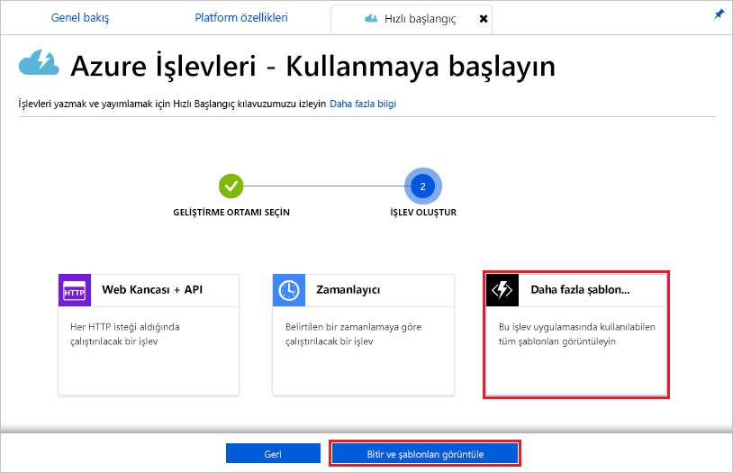

# Azure Cosmos DB tarafından tetiklenen bir işlev oluşturma

Azure Cosmos DB’de veri eklendiğinde veya değiştirildiğinde tetiklenen bir işlev oluşturmayı öğrenin. Azure Cosmos DB hakkında daha fazla bilgi edinmek için bkz. [Azure Cosmos DB: Azure İşlevleri ile sunucusuz veritabanı işlemleri](../cosmos-db/serverless-computing-database.md).

## Ön koşullar

Bu öğreticiyi tamamlamak için:

+ Azure aboneliğiniz yoksa başlamadan önce [ücretsiz bir hesap](https://azure.microsoft.com/free/?WT.mc_id=A261C142F) oluşturun.

> [!NOTE]
> [!INCLUDE [SQL API support only](../../includes/functions-cosmosdb-sqlapi-note.md)]

## Azure Cosmos DB hesabı oluşturma

Tetikleyiciyi oluşturabilmek için SQL API'sini kullanan bir Azure Cosmos DB hesabınızın olması gerekir.

[!INCLUDE [cosmos-db-create-dbaccount](../../includes/cosmos-db-create-dbaccount.md)]

## Azure İşlev uygulaması oluşturma

[!INCLUDE [Create function app Azure portal](../../includes/functions-create-function-app-portal.md)]

Ardından, yeni işlev uygulamasında bir işlev oluşturun.

## Azure Cosmos DB tetikleyicisi oluşturma

1. İşlev uygulamanızı genişletin ve **işlevler**' in **+** yanındaki düğmesine tıklayın. Bu, işlev uygulamanızdaki ilk işlevse **Portalda**'yı ve ardından **Devam**'ı seçin. Aksi takdirde üçüncü adıma geçin.

   

1. **Diğer şablonlar**'ı ve ardından **Sonlandır ve şablonları görüntüle**'yi seçin.

    

1. Arama alanına `cosmos` yazıp **Azure Cosmos DB tetikleyicisi** şablonunu seçin.

1. İstenirse, işlev uygulamasına Azure Cosmos DB uzantısını yüklemek için, **yüklensin** ' i seçin. Yükleme başarılı olduktan sonra **Devam**'ı seçin.

    

1. Yeni tetikleyiciyi resmin altındaki tabloda belirtilen ayarlarla yapılandırın.

    

    | Ayar      | Önerilen değer  | Açıklama                                |
    | ------------ | ---------------- | ------------------------------------------ |
    | **Adı** | Varsayılan | Şablonun önerdiği varsayılan işlev adını kullanın.|
    | **Azure Cosmos DB hesabı bağlantısı** | Yeni ayar | **Yeni**'yi ve ardından **Aboneliğinizi**, önceden oluşturduğunuz **Veritabanı hesabını** ve **Seç**'i belirtin. Bunu yaptığınızda hesap bağlantınız için bir uygulama ayarı oluşturulur. Bu ayar bağlama tarafından veritabanı bağlantısı için kullanılır. |
    | **Kapsayıcı adı** | Öğeler | İzlenecek kapsayıcının adı. |
    | **Mevcut değilse kira kapsayıcısı oluştur** | İşaretli | Kapsayıcı zaten mevcut değil, oluşturun. |
    | **Veritabanı adı** | Görevler | İzlenecek kapsayıcının bulunduğu veritabanının adı. |

1. **Oluştur**’a tıklayarak Azure Cosmos DB tarafından tetiklenen işlevinizi oluşturun. İşlev oluşturulduktan sonra şablon temelli işlev kodu görüntülenir.  

    

    Bu işlev şablonu, günlüklere belge sayısını ve ilk belgenin kimliğini yazar.

Sonra, Azure Cosmos DB hesabınıza bağlanıp `Items` kapsayıcıyı `Tasks` veritabanında oluşturursunuz.

## Öğe kapsayıcısını oluşturma

1. Tarayıcıdaki yeni bir sekmede [Azure portalının](https://portal.azure.com) ikinci bir örneğini açın.

1. Portalın sol tarafındaki simge çubuğunu genişletin, arama alanına `cosmos` yazıp **Azure Cosmos DB**’yi seçin.

    

1. Azure Cosmos DB hesabınızı seçin ve ardından **Veri Gezgini**’ni seçin. 

1. **SQL API 'si**altında **Görevler** veritabanı ' nı seçin ve **yeni kapsayıcı**' yı seçin.

    

1. **Kapsayıcı Ekle**' de, görüntünün altındaki tabloda gösterilen ayarları kullanın. 

    

    | Ayar|Önerilen değer|Açıklama |
    | ---|---|--- |
    | **Veritabanı Kimliği** | Görevler |Yeni veritabanınızın adı. Bu, işlev bağlamanızda tanımlanan adla eşleşmelidir. |
    | **Kapsayıcı KIMLIĞI** | Öğeler | Yeni kapsayıcının adı. Bu, işlev bağlamanızda tanımlanan adla eşleşmelidir.  |
    | **[Bölüm anahtarı](../cosmos-db/partition-data.md)** | /kategori|Verileri her bölüme eşit şekilde dağıtan bir bölüm anahtarı. Doğru bölüm anahtarının seçilmesi, bir performanslı kapsayıcı oluşturmak için önemlidir. | 
    | **Aktarım hızı** |400 RU| Varsayılan değeri kullanın. Daha sonra gecikme süresini azaltmak isterseniz aktarım hızının ölçeğini artırabilirsiniz. |    

1. Öğeler kapsayıcısını oluşturmak için **Tamam** ' ı tıklatın. Kapsayıcının oluşturulması kısa bir zaman alabilir.

İşlev bağlamasında belirtilen kapsayıcı varsa, bu yeni kapsayıcıya öğe ekleyerek işlevi test edebilirsiniz.

## İşlevi test etme

1. Veri Gezgini yeni **öğeler** kapsayıcısını genişletin, **öğeler**' i seçin ve sonra **Yeni öğe**' yi seçin.

    

1. Yeni öğenin içeriğini aşağıdaki içerikle değiştirin ve ardından **Kaydet**' i seçin.

        {
            "id": "task1",
            "category": "general",
            "description": "some task"
        }

1. Portalda işlevinizi içeren ilk tarayıcı sekmesine geçin. İşlev günlüklerini genişletin ve yeni belgenin işlevi tetiklediğini doğrulayın. `task1` belge kimliğinin günlüklere yazılıp yazılmadığına bakın. 

    

1. (İsteğe bağlı) Belgenize dönerek bir değişiklik yapın ve **Güncelleştir**’e tıklayın. Sonra işlev günlüklerine dönerek güncelleştirmenin işlevi de tetiklediğini doğrulayın.

## Kaynakları temizleme

[!INCLUDE [Next steps note](../../includes/functions-quickstart-cleanup.md)]

## Sonraki adımlar

Azure Cosmos DB’nizde bir belge eklendiğinde ya da değiştirildiğinde çalışan bir işlev oluşturdunuz. Azure Cosmos DB tetikleyicileri hakkında daha fazla bilgi için bkz. [Azure İşlevleri için Azure Cosmos DB bağlamaları](functions-bindings-cosmosdb.md).

[!INCLUDE [Next steps note](../../includes/functions-quickstart-next-steps.md)]
