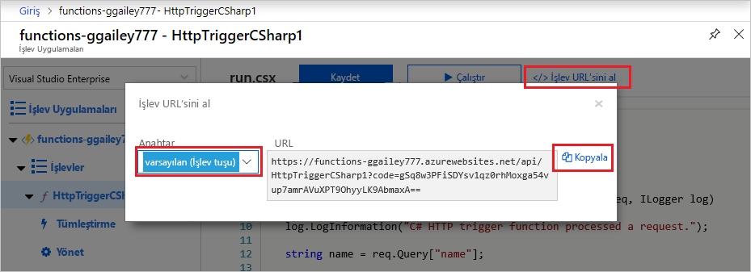

# İlk Azure İşlevinizi oluşturma
## Genel Bakış
Azure İşlevleri, diğer Azure hizmetlerinde, SaaS ürünlerinde ve şirket içi sistemlerde gerçekleşen olaylar tarafından tetiklenen kodları uygulama işlevine sahip var olan Azure uygulaması platformunu genişleten olay denetimli bir istendiğinde işlem deneyimidir. Azure İşlevleriyle uygulamalarınız isteğe göre ölçeklenir ve yalnızca tükettiğiniz kaynaklar için ödeme yaparsınız. Azure İşlevleri, çeşitli programlama dillerinde uygulanan zamanlanan veya tetiklenen kod birimleri oluşturmanızı sağlar. Azure İşlevleri hakkında daha fazla bilgi edinmek için bkz. [Azure İşlevlerine Genel Bakış](functions-overview.md).

Bu konu başlığında, bir HTTP tetikleyicisi tarafından çağrılan basit bir "merhaba dünya" Node.js işlevi oluşturmak için portaldaki Azure İşlevleri hızlı başlangıcının nasıl kullanılacağı gösterilmektedir. Bu adımların portalda nasıl gerçekleştirildiğini görmek için kısa bir video da izleyebilirsiniz.

## Videoyu izleme
Aşağıdaki video bu öğreticideki temel adımların nasıl gerçekleştirileceğini gösterir. 

[!VIDEO https://channel9.msdn.com/Series/Windows-Azure-Web-Sites-Tutorials/Create-your-first-Azure-Function-simple/player]

## Hızlı başlangıçtan bir işlev oluşturma
Azure'da işlevlerinizin yürütülmesini bir işlev uygulaması barındırır. Yeni işlevin yanı sıra yeni bir işlev uygulaması oluşturmak için bu adımları izleyin. Yeni işlev uygulaması, varsayılan yapılandırma ile oluşturulur. İşlev uygulamanızın açıkça nasıl oluşturulacağına ilişkin bir örnek görmek için bkz. [diğer Azure İşlevleri hızlı başlangıç öğreticisi](functions-create-first-azure-function-azure-portal.md).

İlk işlevinizin oluşturmadan önce etkin bir Azure hesabınız olması gerekir. Bir Azure hesabınız yoksa [ücretsiz hesaplar kullanılabilir](https://azure.microsoft.com/free/).

1. [Azure İşlevleri portalına](https://functions.azure.com/signin) gidin ve Azure hesabınız ile oturum açın.
2. Yeni işlev uygulamanız için benzersiz bir **Ad** yazın veya oluşturulan adı kabul edin, tercih ettiğiniz **Region (Bölge)** seçeneğini belirleyin ve ardından **Create + get started (Oluştur + başla)** düğmesine tıklayın. 
3. **Hızlı Başlangıç** sekmesinde, **Web Kancası + API** ve **JavaScript**'e tıklayın ve ardından **İşlev oluştur**'a tıklayın. Yeni bir önceden tanımlanmış Node.js işlevi oluşturulur. 
   
    
4. (İsteğe bağlı) Hızlı başlangıcın bu noktasında portaldaki Azure İşlevleri özelliklerinin hızlı turuna bakmayı seçebilirsiniz.   Turu tamamladıktan veya atladıktan sonra, HTTP tetikleyicisini kullanarak yeni işlevinizi test edebilirsiniz.

## İşlevi test etme
Azure İşlevleri hızlı başlangıçlarında işlevsel kod olduğundan, yeni işlevinizi hemen test edebilirsiniz.

1. **Develop (Geliştir)** sekmesinde **Code (Kod)** penceresini inceleyin ve bu Node.js kodunun, ileti gövdesinde veya bir sorgu dizesinde geçirilen bir *ad* değerine sahip bir HTTP isteğini beklediğine dikkat edin. İşlev çalıştığında bu değer yanıt iletisinde döndürülür.
   
    
2. **Request body (İstek gövdesi)** metin kutusuna doğru aşağı kaydırın, *ad* özelliğinin değerini adınızla değiştirin ve **Run (Çalıştır)** düğmesine tıklayın. Yürütmenin bir test HTTP isteği tarafından tetiklendiğini, akış günlüklerine bilginin yazıldığını ve **Output (Çıktı)** içinde "hello" yanıtının görüntülendiğini göreceksiniz. 
3. Aynı işlevin başka bir tarayıcı penceresi veya sekmesinden yürütülmesini tetiklemek için, **Develop (Geliştir)** sekmesindeki **Function URL (İşlev URL'si)** değerini kopyalayın ve bir tarayıcının adres çubuğuna yapıştırın, ardından `&name=yourname` sorgu dizesi değerini ekleyin ve Enter'a basın. Aynı bilgiler günlüklere yazılır ve tarayıcı önceki "hello" yanıtını görüntüler.

## Sonraki adımlar
Bu hızlı başlangıç, temel bir HTTP tetiklemeli işlevin çok basit bir yürütmesini gösterir. Uygulamalarınızda Azure İşlevlerinin gücünü kullanmak hakkında daha fazla bilgi için bu konu başlıklarına bakın.

* [Azure İşlevleri geliştirici başvurusu](functions-reference.md)  
  İşlevleri kodlamak ve tetikleyicileri ve bağlamaları tanımlamak için programcı başvurusu
* [Azure İşlevlerini test etme](functions-test-a-function.md)  
  İşlevlerinizi test etmek için çeşitli araçları ve teknikleri açıklar.
* [Azure İşlevlerini ölçeklendirme](functions-scale.md)  
  Dinamik hizmet planı dahil olmak üzere Azure İşlevlerinde kullanılabilen hizmet planlarını ve doğru planın nasıl seçileceğini açıklar. 
* [Azure App Service nedir?](../app-service/app-service-value-prop-what-is.md)  
  Azure İşlevleri; dağıtımlar, ortam değişkenleri ve tanılama gibi temel işlevler için Azure App Service platformunu kullanır. 

[!INCLUDE [Getting Started Note](../../includes/functions-get-help.md)]

<!--HONumber=Sep16_HO3-->

