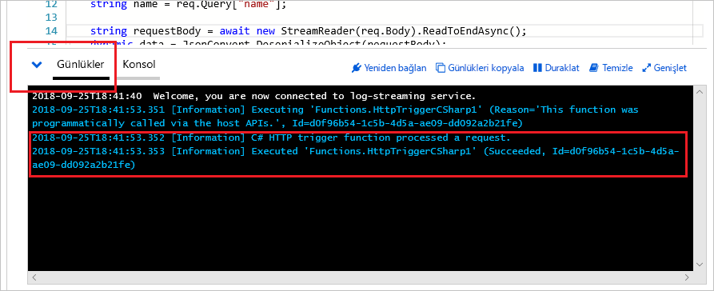

# Azure portalında ilk işlevinizi oluşturma

Azure İşlevleri, öncelikle bir VM oluşturmak veya bir web uygulaması yayımlamak zorunda kalmadan kodunuzu sunucusuz bir ortamda yürütmenize olanak tanır. Bu konu başlığında, Azure portalında İşlevler’i kullanarak bir "hello world" işlevi oluşturmayı öğrenebilirsiniz.

[!INCLUDE [quickstarts-free-trial-note](../../includes/quickstarts-free-trial-note.md)]

## Azure'da oturum açma

[Azure Portal](https://portal.azure.com/)’da oturum açın.

## İşlev uygulaması oluşturma

İşlevlerinizin yürütülmesini barındıran bir işlev uygulamasına sahip olmanız gerekir. İşlev uygulaması, kaynakların daha kolay yönetilmesi, dağıtılması ve paylaşılması için işlevleri bir mantıksal birim olarak gruplandırmanıza olanak tanır. 

[!INCLUDE [Create function app Azure portal](../../includes/functions-create-function-app-portal.md)]

[!INCLUDE [functions-portal-favorite-function-apps](../../includes/functions-portal-favorite-function-apps.md)]

Ardından, yeni işlev uygulamasında bir işlev oluşturun.

## HTTP ile tetiklenen bir işlev oluşturma

1. Yeni işlev uygulamanızı genişletin, ardından **İşlevler**’in yanındaki **+** düğmesine tıklayın.

2.  **Hemen kullanmaya başlayın** sayfasında **Web Kancası + API**'ye tıklayın, işleviniz için bir dil seçin ve **Bu işlevi oluştur**'a tıklayın. 
   
    

HTTP ile tetiklenen işlevin şablonu kullanılarak, seçtiğiniz dilde bir işlev oluşturulur. Bir HTTP isteği göndererek yeni işlevi çalıştırabilirsiniz.

## İşlevi test etme

1. Yeni işlevinizde **</> İşlev URL'sini al**'a tıklayın, **varsayılan (İşlev anahtarı)** seçeneğini belirleyin ve ardından **Kopyala**'ya tıklayın. 

    

2. HTTP isteğinin URL’sini tarayıcınızın adres çubuğuna yapıştırın. `&name=<yourname>` sorgu dizesini bu URL’ye ekleyip isteği yürütün. İşlevin döndürdüğü GET isteğine tarayıcıda verilen yanıt aşağıda gösterilmiştir:

    

    İstek URL’si, işlevinize HTTP üzerinden erişmek için varsayılan olarak gerekli olan bir anahtar içerir.   

## İşlev günlüklerini görüntüleme 

İşleviniz çalıştığında, izleme bilgileri günlüklere yazılır. Önceki yürütme işleminden alınan izleme çıktısını görmek için, portalda işlevinize geri dönün ve ekranın altındaki yukarı okuna tıklayarak **Günlükler**’i genişletin. 

## Kaynakları temizleme

[!INCLUDE [Clean up resources](../../includes/functions-quickstart-cleanup.md)]

## Sonraki adımlar

HTTP ile tetiklenen basit bir işlevi kullanarak işlev uygulaması oluşturdunuz.  

[!INCLUDE [Next steps note](../../includes/functions-quickstart-next-steps.md)]

Daha fazla bilgi için bkz. [Azure İşlevleri HTTP ve web kancası bağlamaları](functions-bindings-http-webhook.md).

