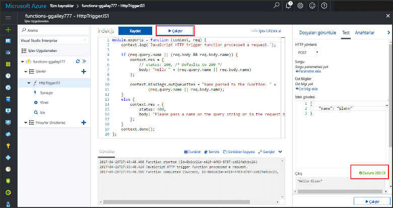
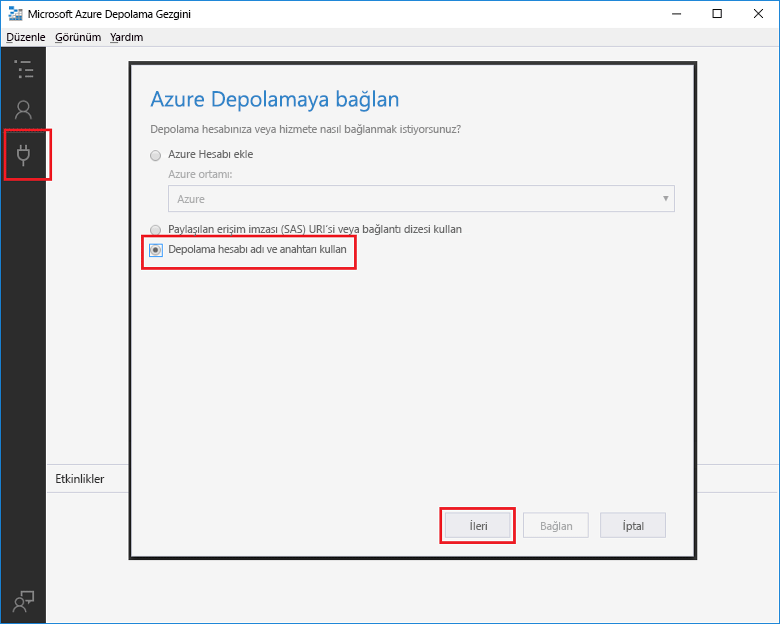

<a id="add-messages-to-an-azure-storage-queue-using-functions" class="xliff"></a>

# İşlevleri kullanarak bir Azure Depolama kuyruğuna ileti ekleme

Azure İşlevleri’nde giriş ve çıkış bağlamaları, işlevinizden dış hizmet verilerine bağlanmanın bildirim temelli bir yöntemini sağlar. Bu konu başlığında, Azure Kuyruk Depolama’ya iletiler gönderen bir çıkış bağlaması ekleyerek mevcut bir işlevi güncelleştirmeyi öğrenebilirsiniz.  


<a id="prerequisites" class="xliff"></a>

## Ön koşullar 

[!INCLUDE [Previous topics](../../includes/functions-quickstart-previous-topics.md)]

* [Microsoft Azure Depolama Gezgini](http://storageexplorer.com/)'ni yükleyin.

[!INCLUDE [functions-portal-favorite-function-apps](../../includes/functions-portal-favorite-function-apps.md)] 

## <a name="add-binding"></a>Çıkış bağlaması ekleme
 
1. İşlev uygulamanızı ve işlevinizi genişletin.

2. **Tümleştir** ve **+ Yeni çıkış** seçeneklerini belirleyin ve ardından **Azure Kuyruk depolama**'ya ve **Seç**'e tıklayın.
    
    

3. Tabloda belirtilen ayarları kullanın ve ardından **Kaydet**'i seçin: 

    

    | Ayar      |  Önerilen değer   | Açıklama                              |
    | ------------ |  ------- | -------------------------------------------------- |
    | **Kuyruk adı**   | myqueue-items    | Depolama hesabınızdaki bağlantı kurulacak kuyruğun adı. |
    | **Depolama hesabı bağlantısı** | AzureWebJobStorage | İşlev uygulamanız tarafından kullanılmakta olan depolama hesabı bağlantısını kullanabilir veya yeni bir bağlantı oluşturabilirsiniz.  |
    | **İleti parametre adı** | outQueueItem | Çıkış bağlama parametresinin adı. | 

Bir çıkış bağlaması tanımladığınıza göre, bir kuyruğa ileti eklemek üzere bağlamayı kullanmak için kodu güncelleştirmeniz gerekir.  

<a id="update-the-function-code" class="xliff"></a>

## İşlev kodunu güncelleştirme

1. İşlev kodunu düzenleyicide görüntülemek için işlevinizi seçin. 

2. Bir C# işlevi için, **outQueueItem** depolama bağlama parametresini eklemek üzere işlev tanımınızı aşağıdaki gibi güncelleştirin. JavaScript işlevi için bu adımı atlayın.

    ```cs   
    public static async Task<HttpResponseMessage> Run(HttpRequestMessage req, 
        ICollector<string> outQueueItem, TraceWriter log)
    {
        ....
    }
    ```

3. Yöntemden dönülmeden hemen önce aşağıdaki kodu işleve ekleyin. İşlevinizin diline uygun parçacığı kullanın.

    ```javascript
    context.bindings.outQueueItem = "Name passed to the function: " + 
                (req.query.name || req.body.name);
    ```

    ```cs
    outQueueItem.Add("Name passed to the function: " + name);     
    ```

4. Değişiklikleri kaydetmek için **Kaydet**'i seçin.

HTTP tetikleyicisine geçirilen değer, kuyruğa alınmış bir iletiye eklenir.
 
<a id="test-the-function" class="xliff"></a>

## İşlevi test etme 

1. Kod değişiklikleri kaydedildikten sonra **Çalıştır**'ı seçin. 

    

2. İşlevin başarılı olduğundan emin olmak için günlükleri denetleyin. Çıkış bağlaması ilk kez kullanıldığında, Depolama hesabınızda İşlevler çalışma zamanı tarafından **outqueue** adlı yeni bir kuyruk oluşturulur.

Bundan sonra, yeni kuyruğunuzu ve ona eklediğiniz iletiyi doğrulamak için depolama hesabınıza bağlanabilirsiniz. 

<a id="connect-to-the-queue" class="xliff"></a>

## Kuyruğa bağlanma

Depolama Gezgini’ni daha önce yükleyip depolama hesabınıza bağladıysanız, ilk üç adımı atlayın.    

1. İşlevinizde **Tümleştir**'i ve yeni **Azure Kuyruk depolama** çıkış bağlamasını seçip **Belgeler**'i genişletin. Hem **Hesap adı** hem de **Hesap anahtarı** değerlerini kopyalayın. Depolama hesabına bağlanmak için bu kimlik bilgilerini kullanacaksınız.
 
    

2. [Microsoft Azure Depolama Gezgini](http://storageexplorer.com/) aracını çalıştırın, sol taraftaki bağlanma simgesini seçin, **Depolama hesabı adı ve anahtarı kullan**'ı seçip **İleri**'ye tıklayın.

    
    
3. 1. adımdaki **Hesap adını** ve **Hesap anahtarını** uygun alanlara yapıştırıp **İleri** ve **Bağlan** seçeneklerini belirleyin. 
  
    

4. Bağlı depolama hesabını genişletin, **Kuyruklar**’a sağ tıklayın ve **myqueue-items** adlı bir kuyruğun var olduğunu doğrulayın. Ayrıca zaten kuyrukta olan bir ileti görmeniz gerekir.  
 
    
 

<a id="clean-up-resources" class="xliff"></a>

## Kaynakları temizleme

[!INCLUDE [Next steps note](../../includes/functions-quickstart-cleanup.md)]

<a id="next-steps" class="xliff"></a>

## Sonraki adımlar

Var olan bir işleve çıkış bağlaması eklediniz. 

[!INCLUDE [Next steps note](../../includes/functions-quickstart-next-steps.md)]

Kuyruk depolamaya bağlama hakkında daha fazla bilgi için bkz. [Azure İşlevleri Depolama kuyruğu bağlamaları](functions-bindings-storage-queue.md). 


