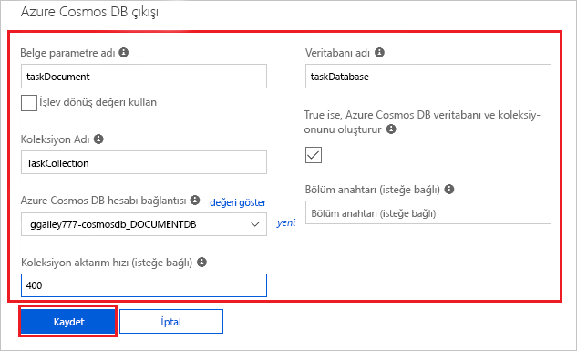

<a id="store-unstructured-data-using-azure-functions-and-cosmos-db" class="xliff"></a>

# Azure İşlevleri ve Cosmos DB’yi kullanarak yapılandırılmamış verileri depolama

Azure Cosmos DB, yapılandırılmamış verileri ve JSON verilerini depolamanın harika bir yoludur. Cosmos DB, Azure İşlevleri ile birlikte kullanıldığında verilerin ilişkisel bir veritabanında depolanmasına göre çok daha az kodla verileri hızlı ve kolay bir şekilde depolar.

Bu öğreticide, Cosmos DB belgesinde yapılandırılmamış verileri depolayan bir Azure İşlevi oluşturmak için Azure Portalı’nın nasıl kullanılacağı gösterilmiştir. 

<a id="prerequisites" class="xliff"></a>

## Ön koşullar

[!INCLUDE [Previous quickstart note](../../includes/functions-quickstart-previous-topics.md)]

[!INCLUDE [functions-portal-favorite-function-apps](../../includes/functions-portal-favorite-function-apps.md)]

<a id="create-a-function" class="xliff"></a>

## İşlev oluşturma

`MyTaskList` adında yeni bir C# genel Web Kancası oluşturun.

1. Mevcut işlevler listenizi genişletin ve yeni bir işlev oluşturmak için + işaretine tıklayın
1. GenericWebHook-CSharp’ı seçin ve `MyTaskList` olarak adlandırın


<a id="add-an-output-binding" class="xliff"></a>

## Çıktı bağlaması ekleme

Bir Azure işlevinde, bir tetikleyici ve herhangi bir sayıda girdi veya çıktı bağlaması olabilir. Bu örnekte, bir HTTP isteği tetikleyicisini ve çıktı bağlaması olarak Cosmos DB belgesini kullanacağız.

1. İşlevin tetikleyicisini ve bağlamalarını görüntülemek veya değiştirmek için işlevin *Tümleştir* sekmesine tıklayın.
1. Sayfanın üst sağ tarafında bulunan *Yeni Çıktı* bağlantısını seçin.

Not: HTTP İsteği tetikleyicisi zaten yapılandırılmıştır, ancak Cosmos DB belge bağlamasını eklemeniz gerekir.


1. Bağlamayı oluşturmak için gerekli bilgileri girin. Değerleri belirlemek için aşağıdaki tabloyu kullanın.



|  Alan | Değer  |
|---|---|
| Belge parametre adı | Kodda Cosmos DB nesnesine başvuran ad |
| Veritabanı adı | Belgelerin kaydedileceği veritabanının adı |
| Koleksiyon adı | Cosmos DB veritabanları gruplandırmasının adı |
| Cosmos DB’nin ve koleksiyonun sizin için oluşturulmasını ister misiniz? | Evet veya Hayır |
| Cosmos DB hesabı bağlantısı | Cosmos DB veritabanını gösteren bağlantı dizesi |

Cosmos DB veritabanının bağlantısını da yapılandırmanız gerekir.

1. *Cosmos DB belge bağlantısı" etiketinin yanındaki “Yeni” bağlantısına tıklayın.
1. Alanları doldurun ve Cosmos DB belgesini oluşturmak için gereken uygun seçenekleri belirleyin.


|  Alan | Değer  |
|---|---|
| Kimlik | Cosmos DB veritabanı için benzersiz kimlik  |
| NoSQL API | Cosmos DB veya MongoDB  |
| Abonelik | MSDN Aboneliği  |
| Kaynak Grubu  | Yeni bir grup oluşturun veya mevcut bir grubu seçin.  |
| Konum  | WestEurope  |

1. *Tamam* düğmesine tıklayın. Azure kaynakları oluştururken birkaç dakika beklemeniz gerekebilir.
1. *Kaydet* düğmesine tıklayın.

<a id="update-the-function-code" class="xliff"></a>

## İşlev kodunu güncelleştirme

İşlevin şablon kodunu şununla değiştirin:

Bu örneğe yönelik kodun yalnızca C#'ta olduğunu unutmayın.

```csharp
using System.Net;

public static HttpResponseMessage Run(HttpRequestMessage req, out object taskDocument, TraceWriter log)
{
    string name = req.GetQueryNameValuePairs()
        .FirstOrDefault(q => string.Compare(q.Key, "name", true) == 0)
        .Value;

    string task = req.GetQueryNameValuePairs()
        .FirstOrDefault(q => string.Compare(q.Key, "task", true) == 0)
        .Value;

    string duedate = req.GetQueryNameValuePairs()
        .FirstOrDefault(q => string.Compare(q.Key, "duedate", true) == 0)
        .Value;

    taskDocument = new {
        name = name,
        duedate = duedate.ToString(),
        task = task
    };

    if (name != "" && task != "") {
        return req.CreateResponse(HttpStatusCode.OK);
    }
    else {
        return req.CreateResponse(HttpStatusCode.BadRequest);
    }
}

```

Bu kod örneği, HTTP İsteği sorgu dizelerini okur ve bunları `taskDocument` nesnesinin üyeleri olarak atar. `taskDocument` nesnesi, Cosmos DB veritabanındaki verileri otomatik olarak kaydeder ve hatta ilk kullanımda veritabanını oluşturur.

<a id="test-the-function-and-database" class="xliff"></a>

## İşlevi ve veritabanını test etme

1. İşlev sekmesinde, portalın sağ tarafındaki *Test* bağlantısına tıklayın ve aşağıdaki HTTP sorgu dizelerini girin:

| Sorgu Dizesi | Değer |
|---|---|
| ad | Chris P. Bacon |
| görev | BLT sandviçi oluşturma |
| duedate | 12.05.2017 |

1. *Çalıştır* bağlantısına tıklayın.
1. İşlevin *HTTP 200 OK* Yanıt kodunu döndürdüğünü doğrulayın.


Cosmos DB veritabanına bir giriş yapıldığını onaylayın.

1. Azure portalında veritabanınızı bulup seçin.
1. *Veri Gezgini* seçeneğini belirleyin.
1. Belgenin girişlerine ulaşana dek düğümleri genişletin.
1. Veritabanı girişini onaylayın. Veritabanınızda, verilerinizle birlikte ek meta veriler olacaktır.


Veriler belgedeyse yapılandırılmamış verileri Cosmos DB veritabanında depolayan Azure işlevini başarıyla oluşturmuşsunuzdur.

<a id="clean-up-resources" class="xliff"></a>

## Kaynakları temizleme

[!INCLUDE [Next steps note](../../includes/functions-quickstart-cleanup.md)]

<a id="next-steps" class="xliff"></a>

## Sonraki adımlar

Azure İşlevleri hakkında daha fazla bilgi edinmek için, aşağıdaki konulara bakın:

[!INCLUDE [Getting help note](../../includes/functions-get-help.md)]

[!INCLUDE [functions-quickstart-next-steps](../../includes/functions-quickstart-next-steps.md)]

