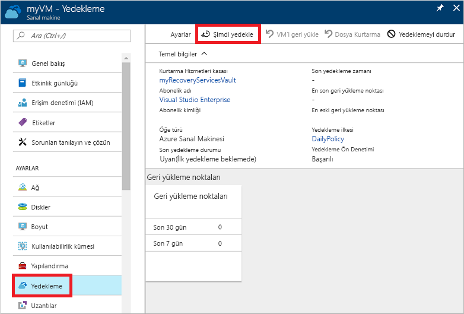
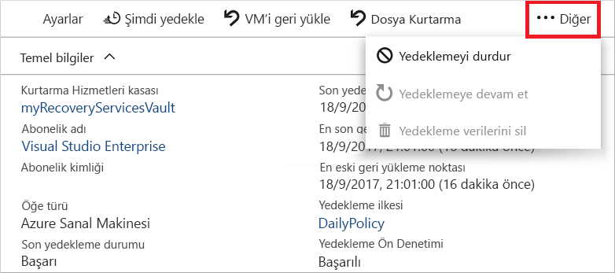

# Azure'daki bir sanal makineyi yedekleme
Azure yedekleri Azure portalı üzerinden oluşturulabilir. Bu yöntem, Azure yedeklerini ve tüm ilgili kaynakları oluşturup yapılandırmaya yönelik tarayıcı tabanlı bir kullanıcı arabirimi sağlar. Düzenli aralıklarla yedekleme yaparak verilerinizi koruyabilirsiniz. Azure Backup, coğrafi olarak yedekli kurtarma kasalarında saklanabilecek kurtarma noktaları oluşturur. Bu makalede Azure portalıyla bir sanal makinenin nasıl yedekleneceği anlatılmaktadır. 

Bu hızlı başlangıç belgesi var olan bir Azure VM'de yedeklemeyi etkinleştirir. Bir sanal makine oluşturmanız gerekiyorsa [Azure portalıyla sanal makine oluşturabilirsiniz](../virtual-machines/windows/quick-create-portal.md).

## Azure'da oturum açma

[https://portal.azure.com](https://portal.azure.com ) adresinden Azure portalında oturum açın.

## Yedeklenecek sanal makineyi seçme
Kurtarma Hizmetleri Kasasına basit bir zamanlanmış günlük yedekleme oluşturma. 

1. Sol taraftaki menüden **Sanal makineler**'i seçin. 
2. Listeden yedekleyeceğiniz sanal makineyi seçin. Örnek VM hızlı başlangıç komutlarını kullandıysanız VM'nin adı *myVM*, kaynak grubunun adı ise *myResourceGroup* olacaktır.
3. **İşlemler** bölümünde **Yedekle**'yi seçin. **Yedeklemeyi etkinleştir** penceresi açılır.

## Bir sanal makinede yedeklemeyi etkinleştirme
Kurtarma Hizmetleri kasası, Azure sanal makineleri gibi koruma altındaki kaynakların yedeklenen verilerini saklayan bir mantıksal kapsayıcıdır. Koruma altındaki bir kaynak için yedekleme işi çalıştığında Kurtarma Hizmetleri kasasının içinde bir kurtarma noktası oluşturulur. Daha sonra bu kurtarma noktalarından birini kullanarak verileri dilediğiniz zaman geri yükleyebilirsiniz.

1. **Yeni oluştur**'u seçin ve yeni kasa için *myRecoveryServicesVault* gibi bir ad girin.
2. Seçili değilse **Var olanı kullan**'ı ve açılan menüden sanal makinenin kaynak grubunu seçin.

    

    Varsayılan olarak kasada Coğrafi Olarak Yedekli depolama özelliği etkindir. Bu depolama yedekliliği seviyesi verilerinizi daha fazla korumak için yedeklenen verilerinizin birincil bölgeden yüzlerce kilometre uzaktaki ikincil bir Azure bölgesinde çoğaltılmasını sağlar.

    Bir yedekleme işinin çalışma zamanını ve kurtarma noktalarının saklama süresini tanımlamak için ilke oluşturur ve kullanırsınız. Varsayılan koruma ilkesi yedekleme işini her gün çalıştırır ve kurtarma noktalarını 30 gün boyunca tutar. Sanal makinenizi hızlı bir şekilde koruma altına almak için bu varsayılan ilke değerlerini kullanabilirsiniz. 

3. Varsayılan yedekleme ilkesi değerlerini kabul etmek için **Yedeklemeyi Etkinleştir**'i seçin.

Kurtarma Hizmetleri kasasının oluşturulması birkaç dakika sürer.

## Bir yedekleme işi başlatma
Varsayılan ilkenin işi planlanan saatte başlatmasını beklemek yerine yedekleme işini hemen başlatabilirsiniz. İlk yedekleme işi tam kurtarma noktası oluşturur. Bu ilk yedekleme sonrasında çalıştırılan tüm yedekleme işleri artımlı kurtarma noktaları oluşturur. Yalnızca son yedekleme sonrasında yapılan değişiklikleri aktardığından artımlı kurtarma noktaları depolama alanı ve süre açısından verimlilik sağlar.

1. Sanal makinenizin **Yedekleme** penceresinde **Şimdi yedekle**'yi seçin.

    

2. 30 günlük yedekleme tutma ilkesini kabul etmek için varsayılan **Yedekleri Şu Tarihe Kadar Tut:** tarihini kullanın. İşi başlatmak için **Yedekle**'yi seçin.

## Yedekleme işini izleme
Sanal makinenizin **Yedekleme** penceresinde yedekleme durumu ve tamamlanan geri yükleme noktası sayısı gösterilir. Sanal makine yedekleme işi tamamlandıktan sonra **Son yedekleme zamanı**, **En son geri yükleme noktası** ve **En eski geri yükleme noktası**, **Genel Bakış** penceresinin sağ tarafında gösterilir.

## Dağıtımı temizleme
Artık gerekli değilse sanal makine korumasını devre dışı bırakabilir, kurtarma noktalarını ve Kurtarma Hizmetleri kasasını kaldırabilir ve ardından sanal makine kaynaklarıyla ilişkilendirilmiş kaynak grubunu silebilirsiniz

Sanal makine verilerini nasıl geri yükleyeceğinizi açıklayan bir Yedekleme öğreticisine geçecekseniz bu bölümdeki adımları atlayın ve [Sonraki adımlar](#next-steps) bölümüne geçin.

1. Sanal makinenizle ilgili **Yedekleme** seçeneğini belirleyin.

2. Ek seçenekleri görmek için **...Daha Fazla** öğesini seçin ve ardından **Yedeklemeyi durdur**'u belirleyin.

    

3. Açılan menüden **Yedekleme Verilerini Sil**'i seçin.

4. **Yedekleme öğesinin adını yazın** iletişim kutusuna sanal makinenizin adını girin. Örneğin: *myVM*. **Yedeklemeyi Durdur**' u seçin.

    Sanal makine yedekleme işlemi durdurulduktan ve kurtarma noktaları kaldırıldıktan sonra kaynak grubunu silebilirsiniz. Var olan bir sanal makineyi kullandıysanız kaynak grubunu ve sanal makineyi bırakmak isteyebilirsiniz.

5. Soldaki menüden **Kaynak grupları**'nı seçin. 
6. Listeden kaynak grubunuzu seçin. Örnek sanal makine hızlı başlangıç komutlarını kullandıysanız kaynak grubunun adı *myResourceGroup* olacaktır.
7. **Kaynak grubunu sil**'i seçin. Onaylamak için kaynak grubunun adını girin ve **Sil**'i seçin.

    

## Sonraki adımlar
Bu hızlı başlangıçta bir Kurtarma Hizmetleri kasası oluşturdunuz, bir sanal makine için koruma özelliklerini etkinleştirdiniz ve ilk kurtarma noktasını oluşturdunuz. Azure Backup ve Kurtarma Hizmetleri hakkında daha fazla bilgi edinmek için öğreticilere geçin.

> [!div class="nextstepaction"]
> [Birden fazla Azure sanal makinesini yedekleme](./tutorial-backup-vm-at-scale.md)
