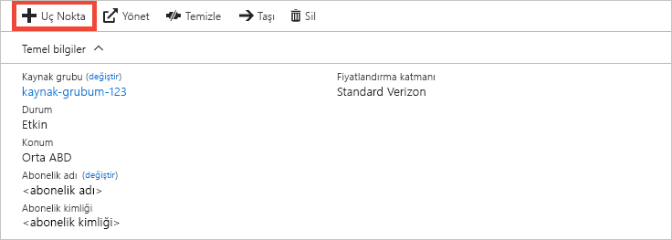
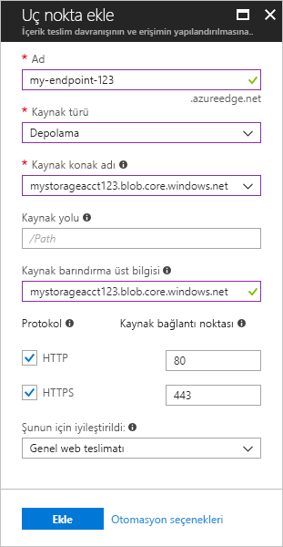

# Hızlı Başlangıç: Azure CDN profili ve uç noktası oluşturma

Bu hızlı başlangıçta, bir veya daha fazla CDN uç noktası koleksiyonu olan yeni bir CDN profili oluşturarak Azure Content Delivery Network 'yi (CDN) etkinleştirirsiniz. Bir profil ve uç nokta oluşturduktan sonra müşterilerinize içerik sunmaya başlayabilirsiniz.

## Önkoşullar

- Etkin aboneliği olan bir Azure hesabı. [Ücretsiz hesap oluşturun](https://azure.microsoft.com/free/?ref=microsoft.com&utm_source=microsoft.com&utm_medium=docs&utm_campaign=visualstudio).
- Kaynak ana bilgisayar adı için kullandığınız *cdnstorageacct123*adlı bir Azure depolama hesabı. Bu gereksinimi gerçekleştirmek için bkz. [Azure Storage hesabını Azure CDN Ile tümleştirme](cdn-create-a-storage-account-with-cdn.md).

## Azure portalında oturum açın

Azure hesabınızla [Azure portalında](https://portal.azure.com) oturum açın.

[!INCLUDE [cdn-create-profile](../../includes/cdn-create-profile.md)]

## Yeni bir CDN uç noktası oluşturma

Bir CDN profili oluşturduktan sonra, bunu bir uç nokta oluşturmak için kullanırsınız.

1. Azure portalında, panonuzda oluşturduğunuz CDN profilini seçin. Bu dosyayı bulamıyorsanız, oluşturduğunuz kaynak grubunu açabilir veya portalın üst kısmındaki arama çubuğunu kullanabilir, profil adını girebilir ve sonuçlardan profili seçebilirsiniz ve sonra da sonuçlardan profil oluşturabilirsiniz.
   
1. CDN profili sayfasında **+ uç noktası**' nı seçin.
   
    
   
    **Uç nokta ekleyin** bölmesi görünür.

3. Aşağıdaki ayar değerlerini girin:

    | Ayar | Değer |
    | ------- | ----- |
    | **Ad** | Uç nokta ana bilgisayar adı için *CDN-Endpoint-123* girin. Bu ad Azure genelinde genel olarak benzersiz olmalıdır; zaten kullanımda ise, farklı bir ad girin. Bu ad, etki alanı _ &lt; uç noktası-adı &gt; _. azureedge.net olan önbelleğe alınmış kaynaklarınıza erişmek için kullanılır.|
    | **Kaynak türü** | **Depolama**’yı seçin. | 
    | **Kaynak konak adı** | *Cdnstorageacct123.blob.Core.Windows.net*gibi açılan listeden kullandığınız Azure depolama hesabının konak adını seçin. |
    | **Kaynak yolu** | Boş bırakın. |
    | **Kaynak barındırma üst bilgisi** | Varsayılan değeri (depolama hesabı için ana bilgisayar adı) bırakın. |  
    | **Protokol** | Varsayılan **HTTP** ve **HTTPS** seçeneklerini seçili şekilde bırakın. |
    | **Kaynak bağlantı noktası** | Varsayılan bağlantı noktası değerlerini değiştirmeyin. | 
    | **Şunun için iyileştirildi:** | Varsayılan **Genel web teslimatı** seçimini değiştirmeyin. |

    

3. Yeni uç nokta oluşturmak için **Ekle**’yi seçin. Uç nokta oluşturulduktan sonra, profile yönelik uç noktalar listesinde görünür.
    
   
    
   Uç noktanın yayılması için gereken süre, profili oluştururken seçilen fiyatlandırma katmanına bağlıdır. **Standart Akamai** genellikle bir dakika içinde, 10 dakika Içinde **standart Microsoft standart** **Verizon** ve **Premium Verizon** 90 dakikaya kadar tamamlanır.

## Kaynakları temizleme

Önceki adımlarda, bir kaynak grubunda CDN profili ve bir uç nokta oluşturdunuz. [Sonraki adımlara](#next-steps) gidip uç noktanıza nasıl özel etki alanı ekleneceğini öğrenmek istiyorsanız bu kaynakları kaydedin. Ancak ileride bu kaynakları kullanmayı düşünmüyorsanız, kaynak grubunu silerek bunları silebilir, böylece ek ücretleri önleyebilirsiniz:

1. Azure portal sol taraftaki menüden **kaynak grupları** ' nı seçin ve ardından **cdnquickstart-RG**' yi seçin.

2. **Kaynak grubu** sayfasında, **kaynak grubunu sil**' i seçin, metin kutusuna *cdnquickstart-RG* girin ve **Sil**' i seçin. Bu eylem, bu hızlı başlangıçta oluşturduğunuz kaynak grubunu, profili ve uç noktayı silin.

## Sonraki adımlar

> [!div class="nextstepaction"]
> [Öğretici: bir Web uygulamasının statik içeriğini sunucu için CDN kullanma](cdn-add-to-web-app.md)

> [!div class="nextstepaction"]
> [Öğretici: Azure CDN uç noktanıza özel etki alanı ekleme](cdn-map-content-to-custom-domain.md)
