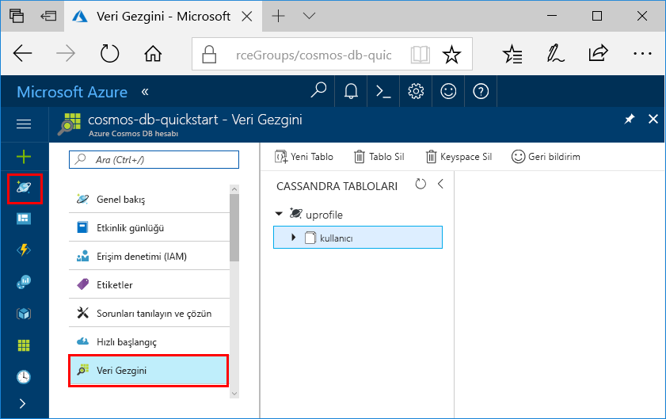

# <a name="quickstart-build-a-cassandra-app-with-net-and-azure-cosmos-db"></a>Hızlı Başlangıç: .NET ve Azure Cosmos DB ile Cassandra uygulaması oluşturma

Bu hızlı başlangıç .NET ve Azure Cosmos DB nasıl kullanılacağını gösterir [Cassandra API](cassandra-introduction.md) örneği github'dan kopyalanarak profili uygulamanızı oluşturmak için. Bu hızlı başlangıç Ayrıca, bir Azure Cosmos DB hesap oluşturulmasını web tabanlı Azure portalını kullanarak açıklanmaktadır.   

Azure Cosmos DB Microsoft'un Genel dağıtılmış birden çok model veritabanı hizmetidir. Hızlı bir şekilde oluşturmak ve belge, tablo, anahtar-değer ve grafik veritabanları, her biri genel dağıtım ve yatay ölçek yetenekleri Azure Cosmos DB en yararlı sorgulayabilirsiniz. 

## <a name="prerequisites"></a>Ön koşullar

Azure Cosmos DB Cassandra API Önizleme programına erişim. Erişim için henüz yapmadıysanız uyguladıysanız [şimdi kaydolun](https://aka.ms/cosmosdb-cassandra-signup).

Visual Studio yüklü 2017 yoksa kullanın karşıdan yükleyip **ücretsiz** [Visual Studio 2017 Community Edition](https://www.visualstudio.com/downloads/). Visual Studio kurulumu sırasında **Azure dağıtımını** etkinleştirdiğinizden emin olun.

[!INCLUDE [quickstarts-free-trial-note](../../includes/quickstarts-free-trial-note.md)]Alternatif olarak, [Azure Cosmos DB ücretsiz deneyin](https://azure.microsoft.com/try/cosmosdb/) gider ve taahhüt bir Azure aboneliği boş.

Yükleme [Git](https://www.git-scm.com/) örnek kopyalanamıyor.

<a id="create-account"></a>
## <a name="create-a-database-account"></a>Veritabanı hesabı oluşturma

[!INCLUDE [cosmos-db-create-dbaccount-cassandra](../../includes/cosmos-db-create-dbaccount-cassandra.md)]


## <a name="clone-the-sample-application"></a>Örnek uygulamayı kopyalama

Şimdi kod ile çalışmaya geçelim. Şimdi Cassandra API uygulaması github'dan bağlantı dizesini ayarlamak ve çalıştırın kopyalayın. Verilerle programlı bir şekilde çalışmanın ne kadar kolay olduğunu göreceksiniz. 

1. Git bash gibi bir git terminal penceresi açın ve kullanmak `cd` örnek uygulamayı yüklemek için bir klasör olarak değiştirmek için komutu. 

    ```bash
    cd "C:\git-samples"
    ```

2. Örnek depoyu kopyalamak için aşağıdaki komutu çalıştırın. Bu komut bilgisayarınızda örnek uygulaması bir kopyasını oluşturur.

    ```bash
    git clone https://github.com/Azure-Samples/azure-cosmos-db-cassandra-dotnet-getting-started.git
    ```

3. Ardından Visual Studio'da CassandraQuickStartSample çözüm dosyasını açın. 

## <a name="review-the-code"></a>Kodu gözden geçirin

Bu adım isteğe bağlıdır. Veritabanı kaynakları kodda nasıl oluşturulduğunu öğrenmek isterseniz, aşağıdaki kod parçacıkları gözden geçirebilirsiniz. Kod parçacıkları tüm gelen alınır `Program.cs` C:\git-samples\azure-cosmos-db-cassandra-dotnet-getting-started\CassandraQuickStartSample klasöründe yüklü dosya. Aksi takdirde, atlayabilirsiniz [bağlantı dizenizi güncelleştirme](#update-your-connection-string).

* Oturum Cassandra küme uç noktasına bağlanarak başlatılamıyor. Azure Cosmos DB Cassandra API yalnızca TLSv1.2 destekler. 

  ```csharp
   var options = new Cassandra.SSLOptions(SslProtocols.Tls12, true, ValidateServerCertificate);
   options.SetHostNameResolver((ipAddress) => CassandraContactPoint);
   Cluster cluster = Cluster.Builder().WithCredentials(UserName, Password).WithPort(CassandraPort).AddContactPoint(CassandraContactPoint).WithSSL(options).Build();
   ISession session = cluster.Connect();
   ```

* Yeni bir keyspace oluşturun.

    ```csharp
    session.Execute("CREATE KEYSPACE uprofile WITH REPLICATION = { 'class' : 'NetworkTopologyStrategy', 'datacenter1' : 1 };"); 
    ```

* Yeni bir tablo oluşturun.

   ```csharp
  session.Execute("CREATE TABLE IF NOT EXISTS uprofile.user (user_id int PRIMARY KEY, user_name text, user_bcity text)");
   ```

* Uprofile keyspace bağlanan yeni bir oturum ile IMapper nesnesini kullanarak kullanıcı varlıkları ekleyin.

    ```csharp
    mapper.Insert<User>(new User(1, "LyubovK", "Dubai"));
    ```
    
* Tüm kullanıcı bilgilerini almak için sorgu.

    ```csharp
   foreach (User user in mapper.Fetch<User>("Select * from user"))
   {
      Console.WriteLine(user);
   }
    ```
    
 * Tek bir kullanıcının bilgilerini almak için sorgu.

    ```csharp
    mapper.FirstOrDefault<User>("Select * from user where user_id = ?", 3);
    ```

## <a name="update-your-connection-string"></a>Bağlantı dizenizi güncelleştirme

Bu adımda Azure portalına dönerek bağlantı dizesi bilgilerinizi kopyalayıp uygulamaya ekleyin. Bağlantı dizesi bilgilerini barındırılan veritabanıyla iletişim kurmak uygulamanızı sağlar.

1. İçinde [Azure portal](http://portal.azure.com/), tıklatın **bağlantı dizesi**. 

    Kullanın  Kullanıcı adı değeri kopyalamak için ekranın sağ taraftaki düğmesi.

    

2. Visual Studio 2017 ' Program.cs dosyasını açın. 

3. Üzerinden portalından USERNAME değerini yapıştırın `<FILLME>` satırında 13.

    Program.cs 13 satırının benzer görünmelidir 

    `private const string UserName = "cosmos-db-quickstart";`

3. Portalına geri dönün ve parola değerini kopyalayın. Üzerinden Portalı'ndan parola değeri yapıştırın `<FILLME>` 14 satırındaki.

    Program.cs 14 satırının benzer görünmelidir 

    `private const string Password = "2Ggkr662ifxz2Mg...==";`

4. Portalına geri dönün ve kişi noktası değerini kopyalayın. Üzerinden portalı kişi noktası değerinden Yapıştır `<FILLME>` satırında 15.

    Program.cs 15 satırının benzer görünmelidir 

    `private const string CassandraContactPoint = "cosmos-db-quickstarts.documents.azure.com"; //  DnsName`

5. Program.cs dosyasını kaydedin.
    
## <a name="run-the-app"></a>Uygulamayı çalıştırma

1. Visual Studio'da sırasıyla **Araçları** > **NuGet Paket Yöneticisi** > **Paket Yöneticisi Konsolu**.

2. Komut isteminde, .NET sürücünün NuGet paketini yüklemek için aşağıdaki komutu kullanın. 

    ```cmd
    Install-Package CassandraCSharpDriver
    ```
3. Uygulamayı çalıştırmak için CTRL+F5 tuşlarına basın. Uygulamanızı konsol penceresinde görüntüler. 

    

    Programın exection durdurun ve konsol penceresini kapatmak için CTRL + C tuşlarına basın. 
    
    Sorgu görmek, değiştirmek ve bu yeni verilerle çalışmak için Azure portalında Veri Gezgini artık açabilirsiniz. 

    

## <a name="review-slas-in-the-azure-portal"></a>Azure portalında SLA'ları gözden geçirme

[!INCLUDE [cosmosdb-tutorial-review-slas](../../includes/cosmos-db-tutorial-review-slas.md)]

## <a name="clean-up-resources"></a>Kaynakları temizleme

[!INCLUDE [cosmosdb-delete-resource-group](../../includes/cosmos-db-delete-resource-group.md)]

## <a name="next-steps"></a>Sonraki adımlar

Bu hızlı başlangıçta Azure Cosmos DB hesabı oluşturmayı, Veri Gezgini'ni kullanarak koleksiyon oluşturmayı ve bir web uygulamasını çalıştırmayı öğrendiniz. Şimdi Cosmos DB hesabınıza ek veri aktarabilirsiniz. 

> [!div class="nextstepaction"]
> [Azure Cosmos Veritabanına Cassandra veri alma](cassandra-import-data.md)
