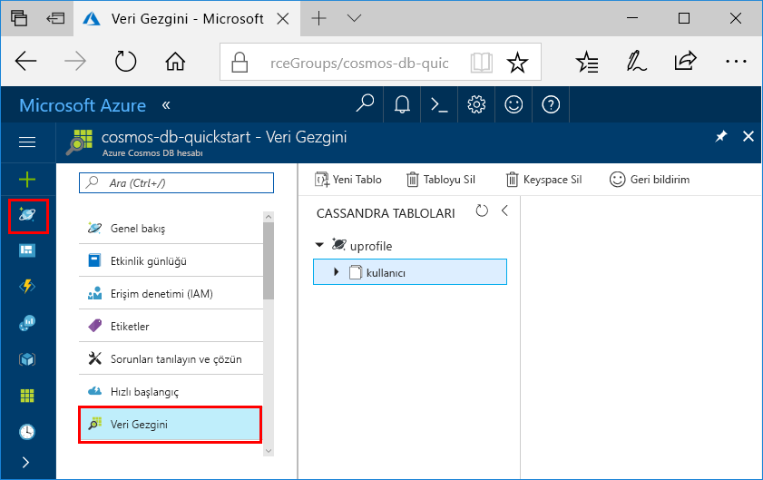

# <a name="quickstart-build-a-cassandra-app-with-nodejs-and-azure-cosmos-db"></a>Hızlı Başlangıç: Node.js ve Azure Cosmos DB ile Cassandra uygulaması oluşturma

Bu hızlı başlangıçta GitHub’dan bir örneği kopyalayarak bir profil uygulaması oluşturmak için Node.js ve Azure Cosmos DB [Cassandra API’sini](cassandra-introduction.md) nasıl kullanacağınız gösterilmektedir. Bu hızlı başlangıç ayrıca web tabanlı Azure portalını kullanarak bir Azure Cosmos DB hesabı oluşturma adımlarını gösterir.

Azure Cosmos DB, Microsoft'un genel olarak dağıtılmış çok modelli veritabanı hizmetidir. Bu hizmetle belge, tablo, anahtar/değer ve grafik veritabanlarını kolayca oluşturup sorgulayabilir ve tüm bunları yaparken Azure Cosmos DB'nin genel dağıtım ve yatay ölçeklendirme özelliklerinden faydalanabilirsiniz. 

## <a name="prerequisites"></a>Ön koşullar

[!INCLUDE [quickstarts-free-trial-note](../../includes/quickstarts-free-trial-note.md)] Alternatif olarak, [Azure Cosmos DB](https://azure.microsoft.com/try/cosmosdb/)’yi ücretsiz olarak, Azure aboneliği olmadan ve herhangi bir taahhütte bulunmadan deneyebilirsiniz.

Azure Cosmos DB Cassandra API’si önizleme programına erişim. Erişim için henüz başvurmadıysanız [şimdi kaydolun](cassandra-introduction.md#sign-up-now).

Buna ek olarak:
* [Node.js](https://nodejs.org/en/) sürüm v0.10.29 veya üzeri
* [Git](http://git-scm.com/)

## <a name="create-a-database-account"></a>Veritabanı hesabı oluşturma

Bir belge veritabanı oluşturmadan önce Azure Cosmos DB ile bir Cassandra hesabı oluşturmanız gerekir.

[!INCLUDE [cosmos-db-create-dbaccount-cassandra](../../includes/cosmos-db-create-dbaccount-cassandra.md)]

## <a name="clone-the-sample-application"></a>Örnek uygulamayı kopyalama

Şimdi GitHub’dan bir Cassandra API’si uygulaması kopyalayalım, bağlantı dizesini ayarlayalım ve uygulamayı çalıştıralım. Verilerle programlı bir şekilde çalışmanın ne kadar kolay olduğunu görüyorsunuz. 

1. Bir komut istemini açın, git-samples adlı yeni bir klasör oluşturun ve komut istemini kapatın.

    ```bash
    md "C:\git-samples"
    ```

2. Git Bash gibi bir Git terminal penceresi açın ve örnek uygulamayı yüklemek üzere yeni bir klasör olarak değiştirmek için `cd` komutunu kullanın.

    ```bash
    cd "C:\git-samples"
    ```

3. Örnek depoyu kopyalamak için aşağıdaki komutu çalıştırın. Bu komut bilgisayarınızda örnek uygulamanın bir kopyasını oluşturur.

    ```bash
    git clone https://github.com/Azure-Samples/azure-cosmos-db-cassandra-nodejs-getting-started.git
    ```

## <a name="review-the-code"></a>Kodu gözden geçirin

Bu adım isteğe bağlıdır. Veritabanı kaynaklarının kodda nasıl oluşturulduğunu öğrenmekle ilgileniyorsanız aşağıdaki kod parçacıklarını gözden geçirebilirsiniz. Kod parçacıklarının tümü C:\git-samples\azure-cosmos-db-cassandra-nodejs-getting-started klasöründeki uprofile.js dosyasından alınmıştır. Aksi durumda, [Bağlantı dizenizi güncelleştirme](#update-your-connection-string) bölümüne atlayabilirsiniz. 

* Kullanıcı adı ve parola Azure portalında bağlantı dizesi sayfası kullanılarak ayarlanır. `path\to\cert' X509 sertifikasına bir yol sağlar. 

   ```nodejs
   var ssl_option = {
        cert : fs.readFileSync("path\to\cert"),
        rejectUnauthorized : true,
        secureProtocol: 'TLSv1_2_method'
        };
   const authProviderLocalCassandra = new cassandra.auth.PlainTextAuthProvider(config.username, config.password);
   ```

* `client` contactPoint bilgileriyle başlatılır. ContactPoint, Azure portalından alınır.

    ```nodejs
    const client = new cassandra.Client({contactPoints: [config.contactPoint], authProvider: authProviderLocalCassandra, sslOptions:ssl_option});
    ```

* `client`, Azure Cosmos DB Cassandra API’sine bağlanır.

    ```nodejs
    client.connect(next);
    ```

* Yeni bir anahtar alanı oluşturulur.

    ```nodejs
    function createKeyspace(next) {
        var query = "CREATE KEYSPACE IF NOT EXISTS uprofile WITH replication = {\'class\': \'NetworkTopologyStrategy\', \'datacenter1\' : \'1\' }";
        client.execute(query, next);
        console.log("created keyspace");    
  }
    ```

* Yeni bir tablo oluşturulur.

   ```nodejs
   function createTable(next) {
    var query = "CREATE TABLE IF NOT EXISTS uprofile.user (user_id int PRIMARY KEY, user_name text, user_bcity text)";
        client.execute(query, next);
        console.log("created table");
   },
   ```

* Anahtar/değer varlıkları eklenir.

    ```nodejs
    ...
       {
          query: 'INSERT INTO  uprofile.user  (user_id, user_name , user_bcity) VALUES (?,?,?)',
          params: [5, 'IvanaV', 'Belgaum', '2017-10-3136']
        }
    ];
    client.batch(queries, { prepare: true}, next);
    ```

* Tüm anahtar değerlerini almak için sorgu.

    ```nodejs
   var query = 'SELECT * FROM uprofile.user';
    client.execute(query, { prepare: true}, function (err, result) {
      if (err) return next(err);
      result.rows.forEach(function(row) {
        console.log('Obtained row: %d | %s | %s ',row.user_id, row.user_name, row.user_bcity);
      }, this);
      next();
    });
    ```  
    
* Bir anahtar-değeri almak için sorgu.

    ```nodejs
    function selectById(next) {
        console.log("\Getting by id");
        var query = 'SELECT * FROM uprofile.user where user_id=1';
        client.execute(query, { prepare: true}, function (err, result) {
        if (err) return next(err);
            result.rows.forEach(function(row) {
            console.log('Obtained row: %d | %s | %s ',row.user_id, row.user_name, row.user_bcity);
        }, this);
        next();
        });
    }
    ```  

## <a name="update-your-connection-string"></a>Bağlantı dizenizi güncelleştirme

Bu adımda Azure portalına dönerek bağlantı dizesi bilgilerinizi kopyalayıp uygulamaya ekleyin. Bu, uygulamanızın barındırılan veritabanıyla iletişim kurmasına olanak tanır.

1. [Azure portalında](http://portal.azure.com/) **Bağlantı Dizesi**’ne tıklayın. 

    En üstteki USERNAME değerini kopyalamak için ekranın sağ tarafındaki  düğmesini kullanın.

    

2. `config.js` dosyasını açın. 

3. Portaldan CONTACT POINT değerini 4. satırda `<FillMEIN>` üzerine yapıştırın.

    Satır 4 şuna benzer şekilde görünmelidir: 

    `config.contactPoint = "cosmos-db-quickstarts.cassandra.cosmosdb.azure.com:10350"`

4. Portaldan USERNAME değerini kopyalayın ve 2. satırda `<FillMEIN>` üzerine yapıştırın.

    Satır 2 şuna benzer şekilde görünmelidir: 

    `config.username = 'cosmos-db-quickstart';`
    
5. Portaldan PASSWORD değerini kopyalayın ve 3. satırda `<FillMEIN>` üzerine yapıştırın.

    Satır 3 şuna benzer şekilde görünmelidir:

    `config.password = '2Ggkr662ifxz2Mg==';`

6. Config.js dosyasını kaydedin.
    
## <a name="use-the-x509-certificate"></a>X509 sertifikası kullanma 

1. Baltimore CyberTrust Root eklemeniz gerekiyorsa seri numarası 02:00:00:b9 ve SHA1 parmak izi d4🇩🇪20:d0:5e:66:fc:53:fe:1a:50:88:2c:78:db:28:52:ca:e4:74’tür. Bu, https://cacert.omniroot.com/bc2025.crt adresinden indirilip .cer uzantısıyla yerel bir dosyaya kaydedilebilir. 

2. Uprofile.js dosyasını açıp 'path\to\cert' yolunu yeni sertifikanıza işaret edecek şekilde değiştirin. 

3. Uprofile.js dosyasını kaydedin. 

## <a name="run-the-app"></a>Uygulamayı çalıştırma

1. Git terminal penceresinde `npm install` komutunu çalıştırarak gerekli npm modüllerini yükleyin.

2. Node.js uygulamanızı başlatmak için `node uprofile.js` komutunu çalıştırın.

3. Sonuçların beklendiği gibi olduğunu komut satırından kontrol edin.

    

    Programın yürütülmesini durdurup konsol penceresini kapatmak için CTRL + C tuşlarına basın. 

    Şimdi Azure portalında Veri Gezgini'ni açıp bu yeni verileri görebilir, sorgulayabilir, değiştirebilir ve onlarla çalışabilirsiniz. 

     

## <a name="review-slas-in-the-azure-portal"></a>Azure portalında SLA'ları gözden geçirme

[!INCLUDE [cosmosdb-tutorial-review-slas](../../includes/cosmos-db-tutorial-review-slas.md)]

## <a name="clean-up-resources"></a>Kaynakları temizleme

[!INCLUDE [cosmosdb-delete-resource-group](../../includes/cosmos-db-delete-resource-group.md)]

## <a name="next-steps"></a>Sonraki adımlar

Bu hızlı başlangıçta Azure Cosmos DB hesabı oluşturmayı, Veri Gezgini'ni kullanarak koleksiyon oluşturmayı ve bir uygulamayı çalıştırmayı öğrendiniz. Şimdi Cosmos DB hesabınıza ek veri aktarabilirsiniz. 

> [!div class="nextstepaction"]
> [Cassandra verilerini Azure Cosmos DB’ye aktarma](cassandra-import-data.md)


