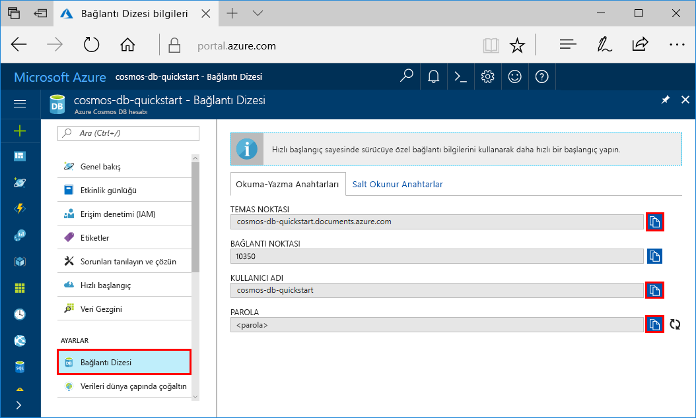
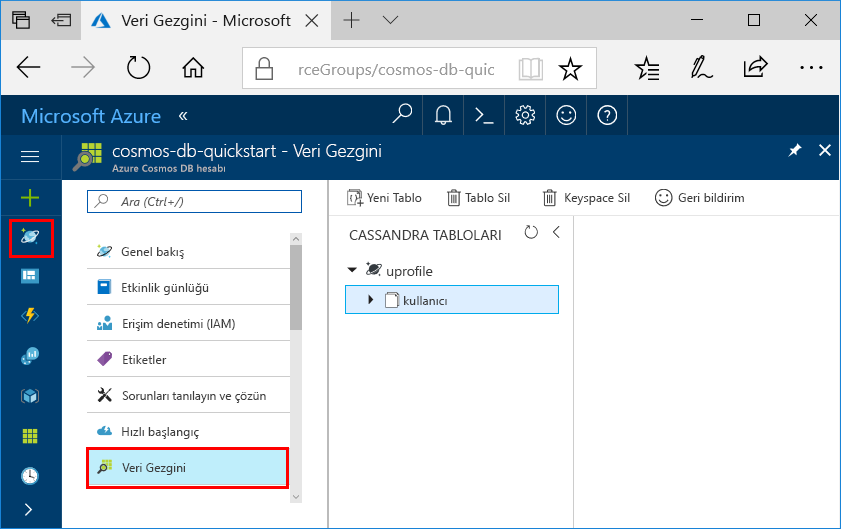

# <a name="quickstart-build-a-cassandra-app-with-python-and-azure-cosmos-db"></a>Hızlı Başlangıç: Python ve Azure Cosmos DB ile Cassandra uygulaması oluşturma

Bu hızlı başlangıç Python ve Azure Cosmos DB nasıl kullanılacağını gösterir [Cassandra API](cassandra-introduction.md) örneği github'dan kopyalanarak profili uygulamanızı oluşturmak için. Bu hızlı başlangıç Ayrıca, bir Azure Cosmos DB hesap oluşturulmasını web tabanlı Azure portalını kullanarak açıklanmaktadır.

Azure Cosmos DB Microsoft'un Genel dağıtılmış birden çok model veritabanı hizmetidir. Hızlı bir şekilde oluşturmak ve belge, tablo, anahtar-değer ve grafik veritabanları, her biri genel dağıtım ve yatay ölçek yetenekleri Azure Cosmos DB en yararlı sorgulayabilirsiniz.   

## <a name="prerequisites"></a>Ön koşullar

[!INCLUDE [quickstarts-free-trial-note](../../includes/quickstarts-free-trial-note.md)]Alternatif olarak, [Azure Cosmos DB ücretsiz deneyin](https://azure.microsoft.com/try/cosmosdb/) gider ve taahhüt bir Azure aboneliği boş.

Azure Cosmos DB Cassandra API Önizleme programına erişim. Erişim için henüz yapmadıysanız uyguladıysanız [şimdi kaydolun](cassandra-introduction.md#sign-up-now).

Buna ek olarak:
* [Python](https://www.python.org/downloads/) sürüm v2.7.14
* [Git](http://git-scm.com/)
* [Apache Cassandra Python sürücüsü](https://github.com/datastax/python-driver)

## <a name="create-a-database-account"></a>Veritabanı hesabı oluşturma

Bir belge veritabanı oluşturmadan önce Azure Cosmos DB ile Cassandra hesabı oluşturmanız gerekir.

[!INCLUDE [cosmos-db-create-dbaccount-cassandra](../../includes/cosmos-db-create-dbaccount-cassandra.md)]

## <a name="clone-the-sample-application"></a>Örnek uygulamayı kopyalama

Artık şimdi kopya Cassandra API uygulaması, github'dan bağlantı dizesini ayarlamak ve çalıştırın. Verilerle programlı bir şekilde çalışmanın ne kadar kolay olduğunu görüyorsunuz. 

1. Git bash gibi bir git terminal penceresi açın ve kullanmak `cd` örnek uygulamayı yüklemek için bir klasör olarak değiştirmek için komutu. 

    ```bash
    cd "C:\git-samples"
    ```

2. Örnek depoyu kopyalamak için aşağıdaki komutu çalıştırın. Bu komut bilgisayarınızda örnek uygulaması bir kopyasını oluşturur. 

    ```bash
    git clone https://github.com/Azure-Samples/azure-cosmos-db-cassandra-python-getting-started.git
    ```

## <a name="review-the-code"></a>Kodu gözden geçirin

Bu adım isteğe bağlıdır. Veritabanı kaynakları kodda nasıl oluşturulduğunu öğrenmek isterseniz, aşağıdaki kod parçacıkları gözden geçirebilirsiniz. Kod parçacıkları tüm gelen alınır `pyquickstart.py` dosya. Aksi takdirde, atlayabilirsiniz [bağlantı dizenizi güncelleştirme](#update-your-connection-string). 

* Kullanıcı adı ve parola bağlantı dizesini sayfasında Azure portalı kullanılarak ayarlanır. Yolu, X509 path\to\cert Değiştir sertifika.

   ```python
    ssl_opts = {
            'ca_certs': 'path\to\cert',
            'ssl_version': ssl.PROTOCOL_TLSv1_2
            }
    auth_provider = PlainTextAuthProvider( username=cfg.config['username'], password=cfg.config['password'])
    cluster = Cluster([cfg.config['contactPoint']], port = cfg.config['port'], auth_provider=auth_provider, ssl_options=ssl_opts)
    session = cluster.connect()
   
   ```

* `cluster` ContactPoint bilgilerle başlatılır. ContactPoint Azure portalından alınır.

    ```python
   cluster = Cluster([cfg.config['contactPoint']], port = cfg.config['port'], auth_provider=auth_provider)
    ```

* `cluster` Azure Cosmos DB Cassandra API'sine bağlanır.

    ```python
    session = cluster.connect()
    ```

* Yeni bir keyspace oluşturulur.

    ```python
   session.execute('CREATE KEYSPACE IF NOT EXISTS uprofile WITH replication = {\'class\': \'NetworkTopologyStrategy\', \'datacenter1\' : \'1\' }')
    ```

* Yeni bir tablo oluşturulur.

   ```
   session.execute('CREATE TABLE IF NOT EXISTS uprofile.user (user_id int PRIMARY KEY, user_name text, user_bcity text)');
   ```

* Anahtar/değer varlıklar eklenir.

    ```Python
    insert_data = session.prepare("INSERT INTO  uprofile.user  (user_id, user_name , user_bcity) VALUES (?,?,?)")
    batch = BatchStatement()
    batch.add(insert_data, (1, 'LyubovK', 'Dubai'))
    batch.add(insert_data, (2, 'JiriK', 'Toronto'))
    batch.add(insert_data, (3, 'IvanH', 'Mumbai'))
    batch.add(insert_data, (4, 'YuliaT', 'Seattle'))
    ....
    session.execute(batch)
    ```

* Almak için sorgu tüm anahtar değerlerin alın.

    ```Python
    rows = session.execute('SELECT * FROM uprofile.user')
    ```  
    
* Bir anahtar-değer almak için sorgu.

    ```Python
    
    rows = session.execute('SELECT * FROM uprofile.user where user_id=1')
    ```  

## <a name="update-your-connection-string"></a>Bağlantı dizenizi güncelleştirme

Bu adımda Azure portalına dönerek bağlantı dizesi bilgilerinizi kopyalayıp uygulamaya ekleyin. Bu, barındırılan veritabanıyla iletişim kurmak uygulamanızı sağlar.

1. İçinde [Azure portal](http://portal.azure.com/), tıklatın **bağlantı dizesi**. 

    Kullanın  ekranın üst değer, ilgili kişi noktası kopyalamak için sağ taraftaki düğmesi.

    

2. `config.py` dosyasını açın. 

3. Üzerinden portalı kişi noktası değerinden Yapıştır `<FILLME>` 10 satırındaki.

    Satır 10 benzer görünmelidir 

    `'contactPoint': 'cosmos-db-quickstarts.documents.azure.com:10350'`

4. USERNAME değerini portaldan kopyalayıp üzerinden yapıştırın `<FILLME>` satır 6.

    Satır 6 benzer görünmelidir 

    `'username': 'cosmos-db-quickstart',`
    
5. PAROLA değeri Portal'dan kopyalayın ve üzerinden yapıştırın `<FILLME>` 8 satırındaki.

    Satır 8 benzer görünmelidir

    `'password' = '2Ggkr662ifxz2Mg==`';`

6. Documentdb dosyasını kaydedin.
    
## <a name="use-the-x509-certificate"></a>Kullanım X509 sertifika

1. Baltimore CyberTrust Root eklemeniz gerekiyorsa, seri numarası 02:00:00:b9 ve SHA1 parmak izi d4🇩🇪20:d0:5e:66:fc:53:fe:1a:50:88:2 c onu vardır: 78:db:28:52:ca:e4:74. Yerel bir dosya uzantısı .cer ile kaydedilen https://cacert.omniroot.com/bc2025.crt adresten yüklenebilir

2. Pyquickstart.PY açın ve 'yeni sertifikanızı işaret edecek şekilde path\to\cert' değiştirin.

3. Pyquickstart.PY kaydedin.

## <a name="run-the-app"></a>Uygulamayı çalıştırma

1. Cd komutunu terminal git azure-cosmos-db-cassandra-python-getting-started klasörüne değiştirmek için kullanın. 

2. Gerekli modüllerini yüklemek için aşağıdaki komutları çalıştırın:

    ```python
    python -m pip install cassandra-driver
    python -m pip install prettytable
    python -m pip install requests
    python -m pip install pyopenssl
    ```

2. Düğüm uygulamanızı başlatmak için aşağıdaki komutu çalıştırın:

    ```
    python pyquickstart.py
    ```

3. Komut satırından beklendiği gibi sonuçlarını doğrulayın.

    Programın exection durdurun ve konsol penceresini kapatmak için CTRL + C tuşlarına basın. 

    
    
    Sorgu görmek, değiştirmek ve bu yeni verilerle çalışmak için Azure portalında Veri Gezgini artık açabilirsiniz. 

    

## <a name="review-slas-in-the-azure-portal"></a>Azure portalında SLA'ları gözden geçirme

[!INCLUDE [cosmosdb-tutorial-review-slas](../../includes/cosmos-db-tutorial-review-slas.md)]

## <a name="clean-up-resources"></a>Kaynakları temizleme

[!INCLUDE [cosmosdb-delete-resource-group](../../includes/cosmos-db-delete-resource-group.md)]

## <a name="next-steps"></a>Sonraki adımlar

Bu hızlı başlangıçta Azure Cosmos DB hesabı oluşturmayı, Veri Gezgini'ni kullanarak koleksiyon oluşturmayı ve bir uygulamayı çalıştırmayı öğrendiniz. Şimdi Cosmos DB hesabınıza ek veri aktarabilirsiniz. 

> [!div class="nextstepaction"]
> [Azure Cosmos Veritabanına Cassandra veri alma](cassandra-import-data.md)

