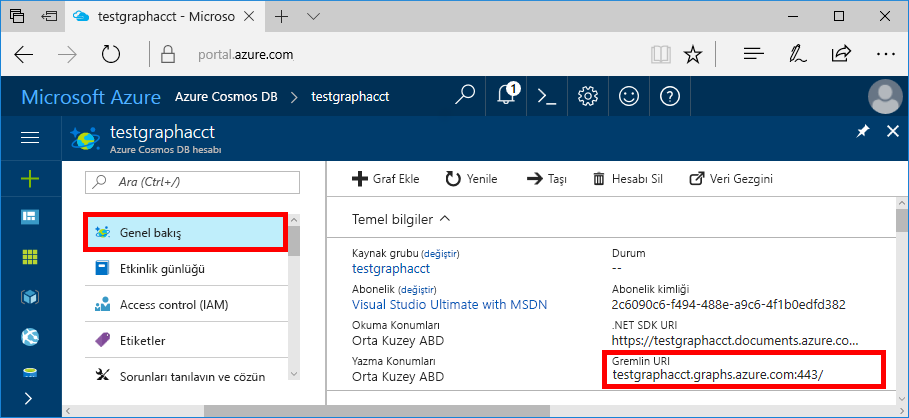
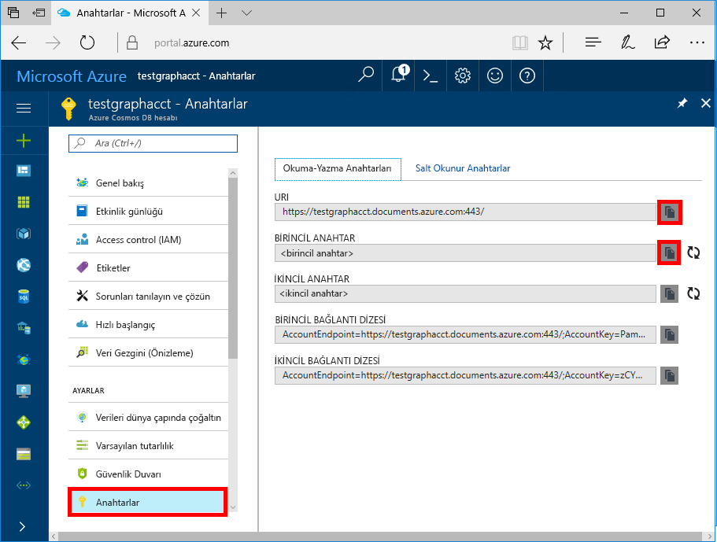

# <a name="azure-cosmos-db-create-query-and-traverse-a-graph-in-the-gremlin-console"></a>Azure Cosmos DB: Gremlin konsolunda oluşturma, sorgulama ve çapraz geçiş yapma

Azure Cosmos DB, Microsoft'un genel olarak dağıtılmış çok modelli veritabanı hizmetidir. Bu hizmetle belge, anahtar/değer ve grafik veritabanlarını kolayca oluşturup sorgulayabilir ve tüm bunları yaparken Azure Cosmos DB'nin genel dağıtım ve yatay ölçeklendirme özelliklerinden faydalanabilirsiniz. 

Bu hızlı başlangıçta Azure portalını kullanarak bir Azure Cosmos DB hesabı, veritabanı ve graf (kapsayıcı) oluşturma işlemi ve [Apache TinkerPop](http://tinkerpop.apache.org) tarafından kullanıma sunulan [Gremlin Console](https://tinkerpop.apache.org/docs/current/reference/#gremlin-console)'u kullanarak Graph API'si verileri ile çalışma işlemi anlatılmaktadır. Bu öğreticide köşe ve kenarlar oluşturup sorgular, bir köşe özelliğini güncelleştirir, köşeleri sorgular, grafiğin çapraz geçişini yapar ve bir köşeyi bırakırsınız.


Gremlin konsolu, Groovy/Java tabanlıdır ve Linux, Mac ve Windows üzerinde çalışır. Konsolu [Apache TinkerPop sitesinden](http://tinkerpop.apache.org/downloads.html) indirebilirsiniz.

## <a name="prerequisites"></a>Ön koşullar

Bu hızlı başlangıca yönelik bir Azure Cosmos DB hesabı oluşturmak için Azure aboneliğinizin olması gerekir.

[!INCLUDE [quickstarts-free-trial-note](../../includes/quickstarts-free-trial-note.md)]

Ayrıca [Gremlin konsolunu](http://tinkerpop.apache.org/) yüklemeniz gerekir. 3.2.5 veya daha yüksek bir sürüm kullanın.

## <a name="create-a-database-account"></a>Veritabanı hesabı oluşturma

[!INCLUDE [cosmos-db-create-dbaccount-graph](../../includes/cosmos-db-create-dbaccount-graph.md)]

## <a name="add-a-graph"></a>Graf ekleme

[!INCLUDE [cosmos-db-create-graph](../../includes/cosmos-db-create-graph.md)]

## <a id="ConnectAppService"></a>Uygulama hizmetinize bağlanma
1. Gremlin Konsolu’nu başlatmadan önce `apache-tinkerpop-gremlin-console-3.2.5/conf` dizininde remote-secure.yaml yapılandırma dosyasını oluşturun veya değiştirin.
2. *ana bilgisayar*, *bağlantı noktası*, *kullanıcı adı*, *parola*, *bağlantı havuzu* ve *serileştirici* değerlerini girin:

    Ayar|Önerilen değer|Açıklama
    ---|---|---
    hosts|[***.graphs.azure.com]|Aşağıdaki ekran görüntüsüne bakın. Bu, Azure portalının Genel Bakış sayfasında bulunan, köşeli ayraç içindeki, sonundan :443/ bölümü çıkartılmış Gremlin URI değeridir.<br><br>Bu değer, Anahtarlar sekmesinde bulunan URI değeri kullanılıp https:// bölümü çıkarılarak ve belgeleri grafiklere dönüştürüp sondaki :443/ bölümü çıkarılarak alınabilir.
    port|443|443 olarak ayarlayın.
    kullanıcı adı|*Kullanıcı adınız*|`/dbs/<db>/colls/<coll>` formunun kaynağı; burada `<db>` veritabanı adınız ve `<coll>` koleksiyon adınızdır.
    password|*Birincil anahtarınız*| Aşağıdaki ikinci ekran görüntüsüne bakın. Bu sizin birincil anahtarınızdır, bu anahtarı Azure portalının Anahtarlar sayfasındaki Birincil Anahtar kutusunda bulabilirsiniz. Değeri kopyalamak için kutunun solundaki kopyala düğmesini kullanın.
    connectionPool|{enableSsl: true}|SSL için bağlantı havuzu ayarınız.
    serializer|{ className: org.apache.tinkerpop.gremlin.<br>driver.ser.GraphSONMessageSerializerV1d0,<br> config: { serializeResultToString: true }}|Bu değere ayarlayın ve değeri yapıştırırken tüm `\n` satır sonlarını silin.

    Hosts değeri için **Genel Bakış** sayfasından **Gremlin URI** değerini kopyalayın: 

    Password değeri için, **Anahtarlar** sayfasından **Birincil Anahtar**’ı kopyalayın: 

Remote-secure.yaml dosyanız aşağıdaki gibi görünmelidir:

```
hosts: [your_database_server.graphs.azure.com]
port: 443
username: /dbs/your_database_account/colls/your_collection
password: your_primary_key
connectionPool: {
  enableSsl: true
}
serializer: { className: org.apache.tinkerpop.gremlin.driver.ser.GraphSONMessageSerializerV1d0, config: { serializeResultToString: true }}
```

3. Terminalinizde [Gremlin Konsolunu](http://tinkerpop.apache.org/docs/3.2.5/tutorials/getting-started/) başlatmak için `bin/gremlin.bat` veya `bin/gremlin.sh` çalıştırın.
4. Terminalinizde uygulama hizmetinize bağlanmak için `:remote connect tinkerpop.server conf/remote-secure.yaml` çalıştırın.

    > [!TIP]
    > `No appenders could be found for logger` hatasını alırsanız, remote-secure.yaml dosyasındaki seri hale getirici değerini 2. adımda açıklanan şekilde güncelleştirdiğinizden emin olun. 

Harika! Kurulumu tamamladığımıza göre, bazı konsol komutlarını çalıştırmaya başlayalım.

Basit bir count() komutunu deneyelim. İstendiğinde konsola aşağıdakileri yazın:
```
:> g.V().count()
```

> [!TIP]
> `:>` öğesinin `g.V().count()` metninden önce yazıldığına dikkat edin. 
>
> Bu yazmanız gereken komutun bir parçasıdır. Gremlin Console ile Azure Cosmos DB birlikte kullanıldığında bu kısım önemlidir.  
>
> Bu `:>` ön ekini attığınızda, konsola komutu yerel olarak (genellikle bellek içi bir grafikte) yürütmesini söylemiş olursunuz.
> `:>` ön ekini kullandığınızda, bu örnekte Cosmos DB'de (localhost öykünücüsü veya bir > Azure örneği) olmak üzere, konsola uzaktan komut yürütmesini söylemiş olursunuz.


## <a name="create-vertices-and-edges"></a>Köşe ve kenar oluşturma

İlk olarak *Thomas*, *Mary Kay*, *Robin*, *Ben* ve *Jack* için beş kişi köşesi ekleyelim.

Giriş (Thomas):

```
:> g.addV('person').property('firstName', 'Thomas').property('lastName', 'Andersen').property('age', 44).property('userid', 1)
```

Çıktı:

```
==>[id:796cdccc-2acd-4e58-a324-91d6f6f5ed6d,label:person,type:vertex,properties:[firstName:[[id:f02a749f-b67c-4016-850e-910242d68953,value:Thomas]],lastName:[[id:f5fa3126-8818-4fda-88b0-9bb55145ce5c,value:Andersen]],age:[[id:f6390f9c-e563-433e-acbf-25627628016e,value:44]],userid:[[id:796cdccc-2acd-4e58-a324-91d6f6f5ed6d|userid,value:1]]]]
```
Giriş (Mary Kay):

```
:> g.addV('person').property('firstName', 'Mary Kay').property('lastName', 'Andersen').property('age', 39).property('userid', 2)

```

Çıktı:

```
==>[id:0ac9be25-a476-4a30-8da8-e79f0119ea5e,label:person,type:vertex,properties:[firstName:[[id:ea0604f8-14ee-4513-a48a-1734a1f28dc0,value:Mary Kay]],lastName:[[id:86d3bba5-fd60-4856-9396-c195ef7d7f4b,value:Andersen]],age:[[id:bc81b78d-30c4-4e03-8f40-50f72eb5f6da,value:39]],userid:[[id:0ac9be25-a476-4a30-8da8-e79f0119ea5e|userid,value:2]]]]

```

Giriş (Robin):

```
:> g.addV('person').property('firstName', 'Robin').property('lastName', 'Wakefield').property('userid', 3)
```

Çıktı:

```
==>[id:8dc14d6a-8683-4a54-8d74-7eef1fb43a3e,label:person,type:vertex,properties:[firstName:[[id:ec65f078-7a43-4cbe-bc06-e50f2640dc4e,value:Robin]],lastName:[[id:a3937d07-0e88-45d3-a442-26fcdfb042ce,value:Wakefield]],userid:[[id:8dc14d6a-8683-4a54-8d74-7eef1fb43a3e|userid,value:3]]]]
```

Giriş (Ben):

```
:> g.addV('person').property('firstName', 'Ben').property('lastName', 'Miller').property('userid', 4)

```

Çıktı:

```
==>[id:ee86b670-4d24-4966-9a39-30529284b66f,label:person,type:vertex,properties:[firstName:[[id:a632469b-30fc-4157-840c-b80260871e9a,value:Ben]],lastName:[[id:4a08d307-0719-47c6-84ae-1b0b06630928,value:Miller]],userid:[[id:ee86b670-4d24-4966-9a39-30529284b66f|userid,value:4]]]]
```

Giriş (Jack):

```
:> g.addV('person').property('firstName', 'Jack').property('lastName', 'Connor').property('userid', 5)
```

Çıktı:

```
==>[id:4c835f2a-ea5b-43bb-9b6b-215488ad8469,label:person,type:vertex,properties:[firstName:[[id:4250824e-4b72-417f-af98-8034aa15559f,value:Jack]],lastName:[[id:44c1d5e1-a831-480a-bf94-5167d133549e,value:Connor]],userid:[[id:4c835f2a-ea5b-43bb-9b6b-215488ad8469|userid,value:5]]]]
```


Ardından, kişilerimiz arasındaki ilişkiler için kenarlar ekleyelim.

Giriş (Thomas -> Mary Kay):

```
:> g.V().hasLabel('person').has('firstName', 'Thomas').addE('knows').to(g.V().hasLabel('person').has('firstName', 'Mary Kay'))
```

Çıktı:

```
==>[id:c12bf9fb-96a1-4cb7-a3f8-431e196e702f,label:knows,type:edge,inVLabel:person,outVLabel:person,inV:0d1fa428-780c-49a5-bd3a-a68d96391d5c,outV:1ce821c6-aa3d-4170-a0b7-d14d2a4d18c3]
```

Giriş (Thomas -> Robin):

```
:> g.V().hasLabel('person').has('firstName', 'Thomas').addE('knows').to(g.V().hasLabel('person').has('firstName', 'Robin'))
```

Çıktı:

```
==>[id:58319bdd-1d3e-4f17-a106-0ddf18719d15,label:knows,type:edge,inVLabel:person,outVLabel:person,inV:3e324073-ccfc-4ae1-8675-d450858ca116,outV:1ce821c6-aa3d-4170-a0b7-d14d2a4d18c3]
```

Giriş (Robin -> Ben):

```
:> g.V().hasLabel('person').has('firstName', 'Robin').addE('knows').to(g.V().hasLabel('person').has('firstName', 'Ben'))
```

Çıktı:

```
==>[id:889c4d3c-549e-4d35-bc21-a3d1bfa11e00,label:knows,type:edge,inVLabel:person,outVLabel:person,inV:40fd641d-546e-412a-abcc-58fe53891aab,outV:3e324073-ccfc-4ae1-8675-d450858ca116]
```

## <a name="update-a-vertex"></a>Köşe güncelleştirme

*Thomas* köşesini yeni yaşı olan *45* ile güncelleştirelim.

Giriş:
```
:> g.V().hasLabel('person').has('firstName', 'Thomas').property('age', 45)
```
Çıktı:

```
==>[id:ae36f938-210e-445a-92df-519f2b64c8ec,label:person,type:vertex,properties:[firstName:[[id:872090b6-6a77-456a-9a55-a59141d4ebc2,value:Thomas]],lastName:[[id:7ee7a39a-a414-4127-89b4-870bc4ef99f3,value:Andersen]],age:[[id:a2a75d5a-ae70-4095-806d-a35abcbfe71d,value:45]]]]
```

## <a name="query-your-graph"></a>Grafınızı sorgulama

Şimdi de grafiğinize karşı çeşitli sorgular çalıştıralım.

İlk olarak, yalnızca 40 yaşından büyük kişileri döndürecek bir filtre sorgulamayı deneyelim.

Giriş (filtre sorgusu):

```
:> g.V().hasLabel('person').has('age', gt(40))
```

Çıktı:

```
==>[id:ae36f938-210e-445a-92df-519f2b64c8ec,label:person,type:vertex,properties:[firstName:[[id:872090b6-6a77-456a-9a55-a59141d4ebc2,value:Thomas]],lastName:[[id:7ee7a39a-a414-4127-89b4-870bc4ef99f3,value:Andersen]],age:[[id:a2a75d5a-ae70-4095-806d-a35abcbfe71d,value:45]]]]
```

Ardından, 40 yaşından büyük kişiler için ad planlaması yapalım.

Giriş (filtre + planlama sorgusu):

```
:> g.V().hasLabel('person').has('age', gt(40)).values('firstName')
```

Çıktı:

```
==>Thomas
```

## <a name="traverse-your-graph"></a>Grafınızı çapraz geçirme

Şimdi grafiği Thomas'ın tüm arkadaşlarını döndürecek şekilde geçirelim.

Giriş (Thomas’ın arkadaşları):

```
:> g.V().hasLabel('person').has('firstName', 'Thomas').outE('knows').inV().hasLabel('person')
```

Çıktı: 

```
==>[id:f04bc00b-cb56-46c4-a3bb-a5870c42f7ff,label:person,type:vertex,properties:[firstName:[[id:14feedec-b070-444e-b544-62be15c7167c,value:Mary Kay]],lastName:[[id:107ab421-7208-45d4-b969-bbc54481992a,value:Andersen]],age:[[id:4b08d6e4-58f5-45df-8e69-6b790b692e0a,value:39]]]]
==>[id:91605c63-4988-4b60-9a30-5144719ae326,label:person,type:vertex,properties:[firstName:[[id:f760e0e6-652a-481a-92b0-1767d9bf372e,value:Robin]],lastName:[[id:352a4caa-bad6-47e3-a7dc-90ff342cf870,value:Wakefield]]]]
```

Ardından, sonraki köşe katmanlarını alalım. Thomas'ın arkadaşlarının tüm arkadaşlarını almak üzere grafiği çapraz geçirin.

Giriş (Thomas’ın arkadaşlarının arkadaşları):

```
:> g.V().hasLabel('person').has('firstName', 'Thomas').outE('knows').inV().hasLabel('person').outE('knows').inV().hasLabel('person')
```
Çıktı:

```
==>[id:a801a0cb-ee85-44ee-a502-271685ef212e,label:person,type:vertex,properties:[firstName:[[id:b9489902-d29a-4673-8c09-c2b3fe7f8b94,value:Ben]],lastName:[[id:e084f933-9a4b-4dbc-8273-f0171265cf1d,value:Miller]]]]
```

## <a name="drop-a-vertex"></a>Köşe bırakma

Şimdi de grafik veritabanından bir köşeyi silelim.

Giriş (Jack köşesini bırakın):

```
:> g.V().hasLabel('person').has('firstName', 'Jack').drop()
```

## <a name="clear-your-graph"></a>Grafınızı temizleme

Son olarak, veritabanındaki tüm köşe ve kenarları temizleyelim.

Giriş:

```
:> g.E().drop()
:> g.V().drop()
```

Tebrikler! Bu Azure Cosmos DB: Graph API’si öğreticisini tamamladınız!

## <a name="review-slas-in-the-azure-portal"></a>Azure portalında SLA'ları gözden geçirme

[!INCLUDE [cosmosdb-tutorial-review-slas](../../includes/cosmos-db-tutorial-review-slas.md)]

## <a name="clean-up-resources"></a>Kaynakları temizleme

Bu uygulamayı kullanmaya devam etmeyecekseniz aşağıdaki adımları kullanarak Azure portalında bu hızlı başlangıç tarafından oluşturulan tüm kaynakları silin:  

1. Azure portalında sol taraftaki menüden, **Kaynak grupları**'na ve ardından oluşturduğunuz kaynağın adına tıklayın. 
2. Kaynak grubu sayfanızda, **Sil**'e tıklayın, metin kutusuna silinecek kaynağın adını yazın ve ardından **Sil**'e tıklayın.

## <a name="next-steps"></a>Sonraki adımlar

Bu hızlı başlangıçta bir Azure Cosmos DB hesabı oluşturmayı, Veri Gezgini’ni kullanarak grafik oluşturmayı, köşe ve kenar oluşturmayı ve Gremlin konsolunu kullanarak grafiğinizi çapraz geçirmeyi öğrendiniz. Artık daha karmaşık sorgular derleyebilir ve Gremlin kullanarak güçlü grafik geçişi mantığını kullanabilirsiniz. 

> [!div class="nextstepaction"]
> [Gremlin kullanarak sorgulama](tutorial-query-graph.md)
