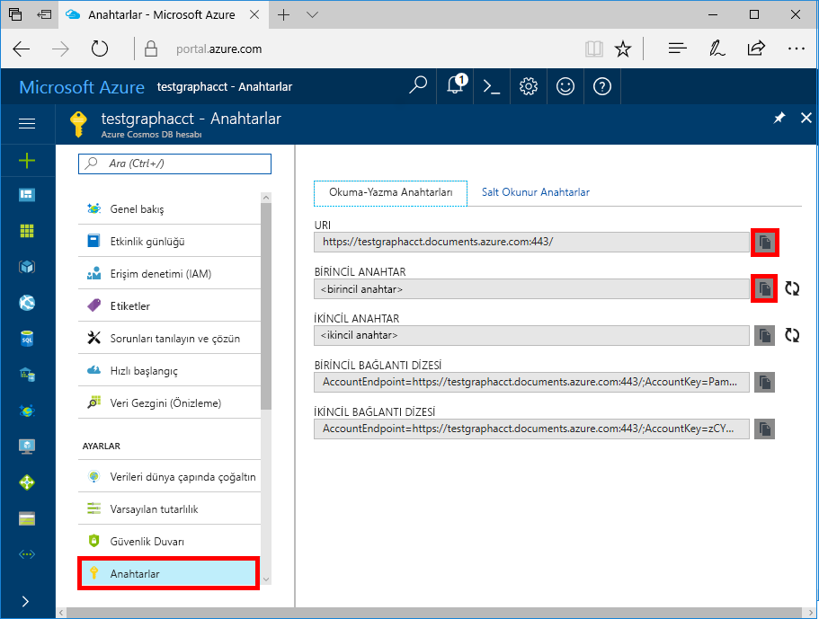

# <a name="azure-cosmos-db-build-a-nodejs-application-by-using-graph-api"></a>Azure Cosmos DB: Grafik API'sini kullanarak bir Node.js uygulaması oluşturma

Azure Cosmos DB, Microsoft'un genel olarak dağıtılmış çok modelli veritabanı hizmetidir. Bu hizmetle belge, anahtar/değer ve grafik veritabanlarını kolayca oluşturup sorgulayabilir ve tüm bunları yaparken Azure Cosmos DB'nin genel dağıtım ve yatay ölçeklendirme özelliklerinden faydalanabilirsiniz. 

Bu hızlı başlangıç makalesinde, Azure portalı kullanılarak Grafik API'si (önizleme), veritabanı ve grafik için Azure Cosmos DB hesabının nasıl oluşturulacağı gösterilmiştir. Bu adımların ardından açık kaynaklı [Gremlin Node.js](https://www.npmjs.com/package/gremlin) sürücüsünü kullanarak bir konsol uygulaması oluşturabilir ve çalıştırabilirsiniz.  

## <a name="prerequisites"></a>Ön koşullar

Bu örneği çalıştırmadan önce aşağıdaki önkoşullara sahip olmanız gerekir:
* [Node.js](https://nodejs.org/en/) v0.10.29 sürümü veya sonraki bir sürüm
* [Git](http://git-scm.com/)

[!INCLUDE [quickstarts-free-trial-note](../../includes/quickstarts-free-trial-note.md)]

## <a name="create-a-database-account"></a>Veritabanı hesabı oluşturma

[!INCLUDE [cosmos-db-create-dbaccount-graph](../../includes/cosmos-db-create-dbaccount-graph.md)]

## <a name="add-a-graph"></a>Grafik ekleme

[!INCLUDE [cosmos-db-create-graph](../../includes/cosmos-db-create-graph.md)]

## <a name="clone-the-sample-application"></a>Örnek uygulamayı kopyalama

Şimdi GitHub'dan bir Grafik API'si uygulaması kopyalayalım, bağlantı dizesini ayarlayalım ve uygulamayı çalıştıralım. Verilerle programlı bir şekilde çalışmanın ne kadar kolay olduğunu göreceksiniz. 

1. Git Bash gibi bir Git terminal penceresi açın ve bir çalışma diziniyle değiştirin (`cd` komutuyla).  

2. Örnek depoyu kopyalamak için aşağıdaki komutu çalıştırın. 

    ```bash
    git clone https://github.com/Azure-Samples/azure-cosmos-db-graph-nodejs-getting-started.git
    ```

3. Çözüm dosyasını Visual Studio'da açın. 

## <a name="review-the-code"></a>Kodu gözden geçirin

Uygulamada gerçekleşen işlemleri hızlıca gözden geçirelim. `app.js` dosyasını açtığınızda aşağıdaki kod satırlarıyla karşılaşacaksınız. 

* Gremlin istemcisi oluşturulur.

    ```nodejs
    const client = Gremlin.createClient(
        443, 
        config.endpoint, 
        { 
            "session": false, 
            "ssl": true, 
            "user": `/dbs/${config.database}/colls/${config.collection}`,
            "password": config.primaryKey
        });
    ```

  Tüm yapılandırmalar, aşağıdaki bölümde düzenlediğimiz `config.js` öğesinde yer alır.

* `client.execute` yöntemiyle bir dizi Gremlin adımı yürütülür.

    ```nodejs
    console.log('Running Count'); 
    client.execute("g.V().count()", { }, (err, results) => {
        if (err) return console.error(err);
        console.log(JSON.stringify(results));
        console.log();
    });
    ```

## <a name="update-your-connection-string"></a>Bağlantı dizenizi güncelleştirme

1. Config.js dosyasını açın. 

2. Config.js dosyasında, config.endpoint anahtarını Azure portalının **Genel Bakış** sayfasında bulunan **Gremlin URI** değeriyle doldurun. 

    `config.endpoint = "GRAPHENDPOINT";`

    

   **Gremlin URI** değeri boşsa, portaldaki **Anahtarlar** sayfasında bulunan **URI** değerini kullanıp https:// bölümünü çıkararak ve belgeleri grafiklere dönüştürerek bir değer oluşturabilirsiniz.

   Gremlin uç noktası, `mygraphdb.graphs.azure.com` (`https://mygraphdb.graphs.azure.com` veya `mygraphdb.graphs.azure.com:433` değil) gibi protokol/bağlantı noktası numarası olmayan tek ana bilgisayar adı olmalıdır.

3. Config.js dosyasında, config.primaryKey değerini Azure portalının **Anahtarlar** sayfasında bulunan **Birincil Anahtar** değeriyle doldurun. 

    `config.primaryKey = "PRIMARYKEY";`

   

4. Veritabanı adını ve config.database ve config.collection değerinin grafik (kapsayıcı) adını girin. 

Aşağıda, tamamlanan config.js dosyanızın nasıl görüneceğine ilişkin bir örnek bulabilirsiniz:

```nodejs
var config = {}

// Note that this must not have HTTPS or the port number
config.endpoint = "testgraphacct.graphs.azure.com";
config.primaryKey = "Pams6e7LEUS7LJ2Qk0fjZf3eGo65JdMWHmyn65i52w8ozPX2oxY3iP0yu05t9v1WymAHNcMwPIqNAEv3XDFsEg==";
config.database = "graphdb"
config.collection = "Persons"

module.exports = config;
```

## <a name="run-the-console-app"></a>Konsol uygulamasını çalıştırma

1. Terminal penceresi açın ve projeye dahil olan package.json dosyası için yükleme diziniyle değiştirin (`cd` komutuyla).  

2. `gremlin` dahil gerekli npm modüllerini yüklemek için `npm install` öğesini çalıştırın.

3. Node.js uygulamanızı başlatmak için bir terminalde `node app.js` komutunu çalıştırın.

## <a name="browse-with-data-explorer"></a>Veri Gezgini ile Göz Ama

Artık Azure portalındaki Veri Gezgini'ne dönerek yeni grafik verilerinizi görüntüleyebilir, sorgulayabilir, değiştirebilir ve bu verilerle çalışabilirsiniz.

Yeni veritabanı, Veri Gezgini'nin **Grafikler** bölmesinde görüntülenir. Veritabanını ve ardından koleksiyonu genişletip **Grafik**’e tıklayın.

Örnek uygulama tarafından oluşturulan veriler, **Filtre Uygula**’ya tıkladığınızda **Grafik** sekmesinin sonraki bölmesinde gösterilir.

Filtreyi test etmek için `g.V()` işlemini `.has('firstName', 'Thomas')` ile tamamlamayı deneyin. Değerin büyük küçük harfe duyarlı olduğunu unutmayın.

## <a name="review-slas-in-the-azure-portal"></a>Azure portalında SLA'ları gözden geçirme

[!INCLUDE [cosmosdb-tutorial-review-slas](../../includes/cosmos-db-tutorial-review-slas.md)]

## <a name="clean-up-your-resources"></a>Kaynaklarınızı temizleme

Bu uygulamayı kullanmaya devam etmeyi düşünmüyorsanız aşağıdakileri yaparak bu makalede oluşturduğunuz tüm kaynakları silin: 

1. Azure portalında sol taraftaki menüden **Kaynak grupları**'na ve ardından oluşturduğunuz kaynağın adına tıklayın. 
2. Kaynak grubu sayfanızda **Sil**'e tıklayın, silinecek kaynağın adını yazın ve ardından **Sil**'e tıklayın.

## <a name="next-steps"></a>Sonraki adımlar

Bu makalede, Azure Cosmos DB hesabı oluşturmayı, Veri Gezgini'ni kullanarak grafik oluşturmayı ve bir uygulamayı çalıştırmayı öğrendiniz. Artık daha karmaşık sorgular oluşturabilir ve Gremlin kullanarak güçlü grafik geçişi mantığını kullanabilirsiniz. 

> [!div class="nextstepaction"]
> [Gremlin kullanarak sorgulama](tutorial-query-graph.md)

