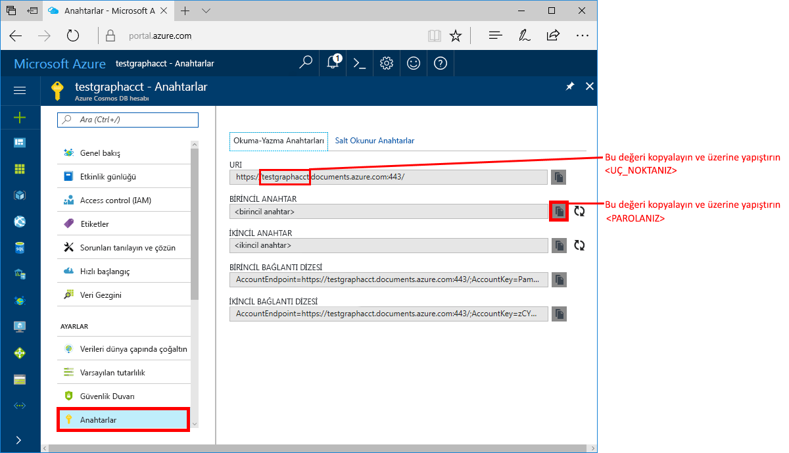
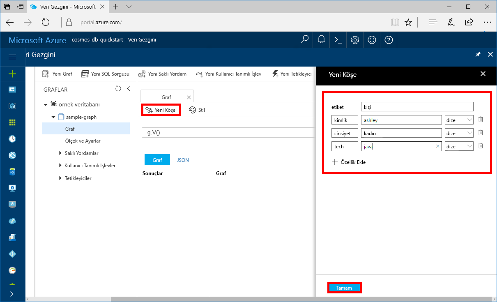
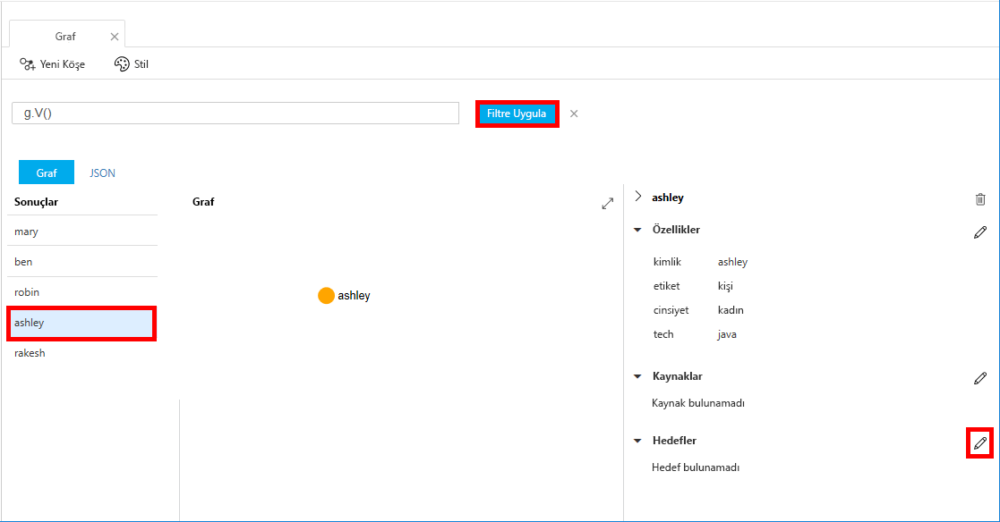
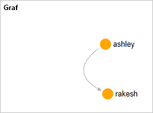

# <a name="quickstart-create-a-graph-database-in-azure-cosmos-db-using-python-and-the-azure-portal"></a>Hızlı başlangıç: Python ve Azure portal kullanarak Azure Cosmos DB grafik veritabanı oluşturma

> [!div class="op_single_selector"]
> * [Gremlin konsolu](create-graph-gremlin-console.md)
> * [.NET](create-graph-dotnet.md)
> * [Java](create-graph-java.md)
> * [Node.js](create-graph-nodejs.md)
> * [Python](create-graph-python.md)
> * [PHP](create-graph-php.md)
>  

Bu hızlı başlangıçta, Azure portal bir Azure Cosmos DB Gremlin (Graf) API hesabı oluşturup yönetirsiniz ve GitHub ' dan kopyalanmış bir Python uygulamasını kullanarak veri eklersiniz. Azure Cosmos DB, genel dağıtım ve yatay ölçeklendirme özellikleri ile belge, tablo, anahtar değer ve grafik veritabanlarını hızlıca oluşturmanıza ve sorgulamanızı sağlayan çok modelli bir veritabanı hizmetidir.

## <a name="prerequisites"></a>Önkoşullar
- Etkin aboneliği olan bir Azure hesabı. [Ücretsiz bir tane oluşturun](https://azure.microsoft.com/free/?ref=microsoft.com&utm_source=microsoft.com&utm_medium=docs&utm_campaign=visualstudio). Veya Azure aboneliği olmadan [ücretsiz Azure Cosmos DB deneyin](https://azure.microsoft.com/try/cosmosdb/) .
- [PIP](https://pip.pypa.io/en/stable/installing/) paketi yükleyicisi dahil [Python 3.5 +](https://www.python.org/downloads/) .
- [Gremlin Için Python sürücüsü](https://github.com/apache/tinkerpop/tree/master/gremlin-python).
- [Git](https://git-scm.com/downloads).

> [!NOTE]
> Bu hızlı başlangıç için 20 Aralık 2017’den sonra oluşturulmuş bir grafik veritabanı hesabı gerekir. Mevcut hesaplar genel kullanılabilirliğe geçirildikten sonra Python’u destekleyecektir.

## <a name="create-a-database-account"></a>Veritabanı hesabı oluşturma

Bir grafik veritabanı oluşturmadan önce Azure Cosmos DB ile bir Gremlin (Graf) veritabanı hesabı oluşturmanız gerekir.

[!INCLUDE [cosmos-db-create-dbaccount-graph](../../includes/cosmos-db-create-dbaccount-graph.md)]

## <a name="add-a-graph"></a>Graf ekleme

[!INCLUDE [cosmos-db-create-graph](../../includes/cosmos-db-create-graph.md)]

## <a name="clone-the-sample-application"></a>Örnek uygulamayı kopyalama

Şimdi kod ile çalışmaya geçelim. GitHub'dan bir Gremlin API'si uygulaması kopyalayalım, bağlantı dizesini ayarlayalım ve uygulamayı çalıştıralım. Verilerle program aracılığıyla çalışmanın ne kadar kolay olduğunu göreceksiniz.  

1. Bir komut istemini açın, git-samples adlı yeni bir klasör oluşturun ve komut istemini kapatın.

    ```bash
    md "C:\git-samples"
    ```

2. Git Bash gibi bir Git terminal penceresi açın ve örek uygulamayı yüklemek üzere bir klasör olarak değiştirmek için `cd` komutunu kullanın.  

    ```bash
    cd "C:\git-samples"
    ```

3. Örnek depoyu kopyalamak için aşağıdaki komutu çalıştırın. Bu komut bilgisayarınızda örnek uygulamanın bir kopyasını oluşturur. 

    ```bash
    git clone https://github.com/Azure-Samples/azure-cosmos-db-graph-python-getting-started.git
    ```

## <a name="review-the-code"></a>Kodu gözden geçirin

Bu adım isteğe bağlıdır. Veritabanı kaynaklarının kodda nasıl oluşturulduğunu öğrenmekle ilgileniyorsanız, aşağıdaki kod parçacıklarını gözden geçirebilirsiniz. Kod parçacıkları, *C:\git-samples\azure-cosmos-db-graph-python-getting-started\\* klasöründeki *Connect.py* dosyasından alınır. Aksi takdirde, [Bağlantı dizenizi güncelleştirme](#update-your-connection-information) bölümüne atlayabilirsiniz. 

* Gremlin `client`, *Connect.py*'de satır 104 ' de başlatılır:

    ```python
    ...
    client = client.Client('wss://<YOUR_ENDPOINT>.gremlin.cosmosdb.azure.com:443/','g', 
        username="/dbs/<YOUR_DATABASE>/colls/<YOUR_COLLECTION_OR_GRAPH>", 
        password="<YOUR_PASSWORD>")
    ...
    ```

* *Connect.py* dosyasının başlangıcında bir dizi Gremlin adımı bildirilmiştir. Bu adımlar daha sonra `client.submitAsync()` yöntemi kullanılarak yürütülür:

    ```python
    client.submitAsync(_gremlin_cleanup_graph)
    ```

## <a name="update-your-connection-information"></a>Bağlantı bilgilerinizi güncelleştirme

Şimdi, Azure portalına dönerek bağlantı bilgilerinizi kopyalayıp uygulamaya ekleyin. Bu ayarlar, uygulamanızın barındırılan veritabanıyla iletişim kurmasına olanak tanır.

1. [Azure portal](https://portal.azure.com/)Azure Cosmos DB hesabınızda **anahtarlar**' ı seçin. 

    URI değerinin ilk parçasını kopyalayın.

    

2. *Connect.py* dosyasını açın ve 104. satırdaki urı değerini `<YOUR_ENDPOINT>` üzerine yapıştırın:

    ```python
    client = client.Client('wss://<YOUR_ENDPOINT>.gremlin.cosmosdb.azure.com:443/','g', 
        username="/dbs/<YOUR_DATABASE>/colls/<YOUR_COLLECTION_OR_GRAPH>", 
        password="<YOUR_PASSWORD>")
    ```

    İstemci nesnesinin URI kısmı artık şu koda benzer görünmelidir:

    ```python
    client = client.Client('wss://test.gremlin.cosmosdb.azure.com:443/','g', 
        username="/dbs/<YOUR_DATABASE>/colls/<YOUR_COLLECTION_OR_GRAPH>", 
        password="<YOUR_PASSWORD>")
    ```

3. `client` nesnesinin ikinci parametresini `<YOUR_DATABASE>` ve `<YOUR_COLLECTION_OR_GRAPH>` dizelerinin yerine geçecek şekilde değiştirin. Önerilen değerleri kullandıysanız, parametre şu kod gibi görünmelidir:

    `username="/dbs/sample-database/colls/sample-graph"`

    Tüm `client` nesnesi artık şu kod gibi görünmelidir:

    ```python
    client = client.Client('wss://test.gremlin.cosmosdb.azure.com:443/','g', 
        username="/dbs/sample-database/colls/sample-graph", 
        password="<YOUR_PASSWORD>")
    ```

4. **Anahtarlar** sayfasında, Kopyala DÜĞMESINI kullanarak birincil anahtarı kopyalayın ve `password=<YOUR_PASSWORD>` parametresindeki `<YOUR_PASSWORD>` üzerine yapıştırın.

    Tüm `client` nesne tanımı artık şu kod gibi görünmelidir:
    ```python
    client = client.Client('wss://test.gremlin.cosmosdb.azure.com:443/','g', 
        username="/dbs/sample-database/colls/sample-graph", 
        password="asdb13Fadsf14FASc22Ggkr662ifxz2Mg==")
    ```

6. *Connect.py* dosyasını kaydedin.

## <a name="run-the-console-app"></a>Konsol uygulamasını çalıştırma

1. Git terminal penceresinde `cd` komutuyla azure-cosmos-db-graph-python-getting-started klasörüne ulaşın.

    ```git
    cd "C:\git-samples\azure-cosmos-db-graph-python-getting-started"
    ```

2. Git terminal penceresinde aşağıdaki komutu kullanarak gerekli Python paketlerini yükleyin.

   ```
   pip install -r requirements.txt
   ```

3. Git terminal penceresinde, Python uygulamasını başlatmak için aşağıdaki komutları kullanın.
    
    ```
    python connect.py
    ```

    Terminal penceresinde grafiğe eklenmekte olan köşe ve kenarlar gösterilir. 
    
    Zaman aşımı hatası alırsanız, bağlantı bilgilerini, [Bağlantı bilgilerinizi güncelleştirme](#update-your-connection-information), konusunda belirtildiği şekilde güncelleştirdiğinizden emin olun ve son komutu çalıştırmayı yeniden deneyin. 
    
    Program durduktan sonra Enter tuşuna basın ve ardından İnternet tarayıcınızdaki Azure portalına geçin.

<a id="add-sample-data"></a>
## <a name="review-and-add-sample-data"></a>Örnek verileri inceleme ve ekleme

Köşeler ve kenarlar eklendikten sonra artık Veri Gezgini geri dönüp grafiğe eklenen köşeleri görebilir ve ek veri noktaları ekleyebilirsiniz.

1. Azure portal Azure Cosmos DB hesabınızda, **Veri Gezgini**, **örnek grafik**' i ve **Graf**' ı seçin ve ardından **Filtre Uygula**' yı seçin. 

   

2. **Sonuçlar** listesinde, grafiğe üç yeni kullanıcı eklendiğine dikkat edin. Köşeleri sürükleyip bırakarak hareket ettirebilir, farenizin tekerleğini kaydırarak öğeleri yakınlaştırabilir ve uzaklaştırabilir, ayrıca çift okla grafiğin boyutunu genişletebilirsiniz. 

   

3. Şimdi birkaç yeni kullanıcı ekleyelim. Grafiğinize veri eklemek için **Yeni köşe** düğmesini seçin.

   

4. *Kişi* etiketi girin.

5. Aşağıdaki özelliklerden her birini eklemek için **Özellik Ekle** ' yi seçin. Graftaki her kişi için benzersiz özellikler oluşturabileceğinizi görürsünüz. Yalnızca kimliği anahtarı gereklidir.

    anahtar|değer|Notlar
    ----|----|----
    ba|/PK| 
    id|ashley|Köşe için benzersiz tanımlayıcı. Kimlik belirtmezseniz, bir kimlik otomatik olarak oluşturulur.
    cinsiyet|kadın| 
    teknoloji | java | 

    > [!NOTE]
    > Bu hızlı başlangıçta bölümlenmemiş bir koleksiyon oluşturun. Ancak koleksiyon oluşturma sırasında bir bölüm anahtarı belirterek bölümlendirilmiş bir koleksiyon oluşturursanız, daha sonra bölüm anahtarını her yeni köşede anahtar olarak eklemeniz gerekir. 

6. **Tamam**’ı seçin. Ekranın en altındaki **Tamam** seçeneğini görmek için ekranınızı genişletmeniz gerekebilir.

7. **Yeni köşe** ' i yeniden seçin ve ek bir yeni kullanıcı ekleyin. 

8. *Kişi* etiketi girin.

9. Aşağıdaki özelliklerden her birini eklemek için **Özellik Ekle** ' yi seçin:

    anahtar|değer|Notlar
    ----|----|----
    ba|/PK| 
    id|rakesh|Köşe için benzersiz tanımlayıcı. Kimlik belirtmezseniz, bir kimlik otomatik olarak oluşturulur.
    cinsiyet|erkek| 
    okul|MIT| 

10. **Tamam**’ı seçin. 

11. Grafikteki tüm değerleri göstermek için varsayılan `g.V()` filtresiyle **Filtre Uygula** düğmesini seçin. Tüm kullanıcılar **Sonuç listesinde** gösterilir. 

    Daha fazla veri ekledikçe sonuçlarınızı sınırlamak için filtreleri kullanabilirsiniz. Veri Gezgini, varsayılan olarak bir grafikteki tüm köşeleri almak için `g.V()` kullanır. JSON biçimindeki bir grafikteki tüm köşelerin sayımını döndürmek için, bu değeri [ gibi farklı bir ](tutorial-query-graph.md)grafik sorgusu`g.V().count()` olarak değiştirebilirsiniz. Filtreyi değiştirdiyseniz, filtreyi geri `g.V()` olarak değiştirin ve tüm sonuçları yeniden göstermek için **Filtreyi Uygula** ' yı seçin.

12. Artık rakesh ve ashley arasında bağlantı kurabiliriz. **Sonuçlar** listesinde **Ashley** ' in seçili olduğundan emin olun, sonra sağ alt köşedeki **hedefler** ' in yanındaki Düzenle düğmesini seçin. **Özellikler** alanını görmek için pencerenizi genişletmeniz gerekebilir.

    

13. **Hedef** kutusuna *Rakesh*yazın ve **kenar etiketi** kutusuna *bilir*yazın ve ardından denetimi seçin.

    

14. Sonuç listesinden **rakesh**’i seçin, ashley ve rakesh’in bağlantılı olduğunu görürsünüz. 

    

Bu işlemle birlikte, bu öğreticideki kaynak oluşturma bölümünü tamamladınız. Grafiğinize köşe eklemeye, var olan köşeleri veya sorguları değiştirmeye devam edebilirsiniz. Şimdi, Azure Cosmos DB’nin sağladığı ölçümleri gözden geçirip kaynakları temizleyelim. 

## <a name="review-slas-in-the-azure-portal"></a>Azure portalında SLA'ları gözden geçirme

[!INCLUDE [cosmosdb-tutorial-review-slas](../../includes/cosmos-db-tutorial-review-slas.md)]

## <a name="clean-up-resources"></a>Kaynakları temizleme

[!INCLUDE [cosmosdb-delete-resource-group](../../includes/cosmos-db-delete-resource-group.md)]

## <a name="next-steps"></a>Sonraki adımlar

Bu hızlı başlangıçta, bir Azure Cosmos DB hesabı oluşturmayı, Veri Gezgini kullanarak bir grafik oluşturmayı ve grafiğe veri eklemek için bir Python uygulaması çalıştırmayı öğrendiniz. Artık daha karmaşık sorgular oluşturabilir ve Gremlin kullanarak güçlü grafik geçişi mantığını kullanabilirsiniz. 

> [!div class="nextstepaction"]
> [Gremlin kullanarak sorgulama](tutorial-query-graph.md)

