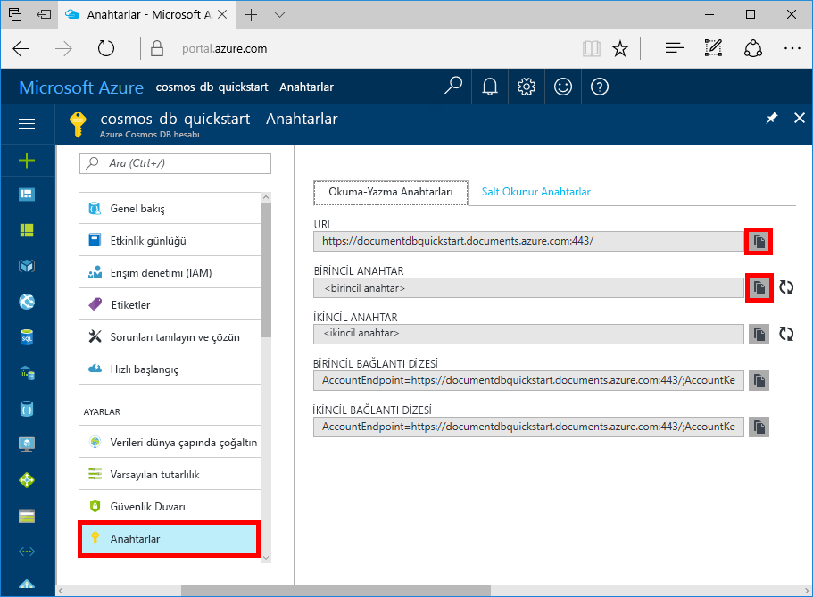

# <a name="azure-cosmos-db-build-a-sql-api-app-with-nodejs-and-the-azure-portal"></a>Azure Cosmos DB: Node.js ve Azure portalı ile bir SQL API'si uygulaması derleme

Azure Cosmos DB, Microsoft'un genel olarak dağıtılmış çok modelli veritabanı hizmetidir. Bu hizmetle belge, anahtar/değer ve grafik veritabanlarını kolayca oluşturup sorgulayabilir ve tüm bunları yaparken Azure Cosmos DB'nin genel dağıtım ve yatay ölçeklendirme özelliklerinden faydalanabilirsiniz. 

Bu hızlı başlangıç belgesinde Azure portalını kullanarak bir Azure Cosmos DB [SQL API](sql-api-introduction.md) hesabını, belge veritabanını ve koleksiyonunu nasıl oluşturacağınız anlatılmıştır. Bu adımların ardından [SQL Node.js API'si](sql-api-sdk-node.md) kullanarak bir konsol uygulaması derleyebilir ve çalıştırabilirsiniz.

## <a name="prerequisites"></a>Ön koşullar

[!INCLUDE [quickstarts-free-trial-note](../../includes/quickstarts-free-trial-note.md)] 
[!INCLUDE [cosmos-db-emulator-docdb-api](../../includes/cosmos-db-emulator-docdb-api.md)]

* Buna ek olarak:
    * [Node.js](https://nodejs.org/en/) sürüm v0.10.29 veya üzeri
    * [Git](http://git-scm.com/)

## <a name="create-a-database-account"></a>Veritabanı hesabı oluşturma

[!INCLUDE [cosmos-db-create-dbaccount](../../includes/cosmos-db-create-dbaccount.md)]

## <a name="add-a-collection"></a>Koleksiyon ekleme

[!INCLUDE [cosmos-db-create-collection](../../includes/cosmos-db-create-collection.md)]

## <a name="add-sample-data"></a>Örnek verileri ekleme

[!INCLUDE [cosmos-db-create-sql-api-add-sample-data](../../includes/cosmos-db-create-sql-api-add-sample-data.md)]

## <a name="query-your-data"></a>Verilerinizi sorgulayın

[!INCLUDE [cosmos-db-create-sql-api-query-data](../../includes/cosmos-db-create-sql-api-query-data.md)]

## <a name="clone-the-sample-application"></a>Örnek uygulamayı kopyalama

Şimdi GitHub'dan bir SQL API'si uygulaması kopyalayalım, bağlantı dizesini ayarlayalım ve uygulamayı çalıştıralım. Verilerle programlı bir şekilde çalışmanın ne kadar kolay olduğunu görüyorsunuz. 

1. Bir komut istemini açın, git-samples adlı yeni bir klasör oluşturun ve komut istemini kapatın.

    ```bash
    md "C:\git-samples"
    ```

2. Git Bash gibi bir Git terminal penceresi açın ve örnek uygulamayı yüklemek üzere yeni bir klasör olarak değiştirmek için `cd` komutunu kullanın.

    ```bash
    cd "C:\git-samples"
    ```

3. Örnek depoyu kopyalamak için aşağıdaki komutu çalıştırın. Bu komut bilgisayarınızda örnek uygulamanın bir kopyasını oluşturur.

    ```bash
    git clone https://github.com/Azure-Samples/azure-cosmos-db-documentdb-nodejs-getting-started.git
    ```

## <a name="review-the-code"></a>Kodu gözden geçirin

Bu adım isteğe bağlıdır. Veritabanı kaynaklarının kodda nasıl oluşturulduğunu öğrenmekle ilgileniyorsanız aşağıdaki kod parçacıklarını gözden geçirebilirsiniz. Aksi durumda, [Bağlantı dizenizi güncelleştirme](#update-your-connection-string) bölümüne atlayabilirsiniz. 

Aşağıdaki kod parçacıklarının tamamı, app.js dosyasından alınmıştır.

* `documentClient` başlatılır.

    ```nodejs
    var client = new documentClient(config.endpoint, { "masterKey": config.primaryKey });
    ```

* Yeni bir veritabanı oluşturulur.

    ```nodejs
    client.createDatabase(config.database, (err, created) => {
        if (err) reject(err)
        else resolve(created);
    });
    ```

* Yeni bir koleksiyon oluşturulur.

    ```nodejs
    client.createCollection(databaseUrl, config.collection, { offerThroughput: 400 }, (err, created) => {
        if (err) reject(err)
        else resolve(created);
    });
    ```

* Birkaç belge oluşturulur.

    ```nodejs
    client.createDocument(collectionUrl, document, (err, created) => {
        if (err) reject(err)
        else resolve(created);
    });
    ```

* JSON üzerinden bir SQL sorgusu gerçekleştirilir.

    ```nodejs
    client.queryDocuments(
        collectionUrl,
        'SELECT VALUE r.children FROM root r WHERE r.lastName = "Andersen"'
    ).toArray((err, results) => {
        if (err) reject(err)
        else {
            for (var queryResult of results) {
                let resultString = JSON.stringify(queryResult);
                console.log(`\tQuery returned ${resultString}`);
            }
            console.log();
            resolve(results);
        }
    });
    ```    

## <a name="update-your-connection-string"></a>Bağlantı dizenizi güncelleştirme

Bu adımda Azure portalına dönerek bağlantı dizesi bilgilerinizi kopyalayıp uygulamaya ekleyin.

1. [Azure portalında](http://portal.azure.com/), Azure Cosmos DB hesabınızın sol taraftaki gezinti menüsünden **Anahtarlar**'a ve ardından **Okuma/Yazma Anahtarları**'na tıklayın. Ekranın sağ tarafındaki kopyalama düğmelerini kullanarak URI ve Birincil Anahtar değerlerini kopyalayarak sonraki adımda `config.js` dosyasına yapıştırın.

    

2. `config.js` dosyasını açın. 

3. Portaldaki URI değerinizi kopyalayın (kopyalama düğmesini kullanarak) ve `config.js` dosyasına uç nokta değeri olarak yapıştırın. 

    `config.endpoint = "https://FILLME.documents.azure.com"`

4. Ardından portaldaki BİRİNCİL ANAHTAR değerinizi kopyalayıp `config.js` dosyasına `config.primaryKey` değeri olarak yapıştırın. Bu adımlarla uygulamanıza Azure Cosmos DB ile iletişim kurması için gereken tüm bilgileri eklemiş oldunuz. 

    `config.primaryKey "FILLME"`
    
## <a name="run-the-app"></a>Uygulamayı çalıştırma
1. Gerekli npm modüllerini yüklemek için bir terminalde `npm install` komutunu çalıştırın

2. Node.js uygulamanızı başlatmak için bir terminalde `node app.js` komutunu çalıştırın.

Şimdi Veri Gezgini'ne dönüp bu yeni verileri görebilir, sorgulayabilir, değiştirebilir ve onlarla çalışabilirsiniz. 

## <a name="review-slas-in-the-azure-portal"></a>Azure portalında SLA'ları gözden geçirme

[!INCLUDE [cosmosdb-tutorial-review-slas](../../includes/cosmos-db-tutorial-review-slas.md)]

## <a name="clean-up-resources"></a>Kaynakları temizleme

[!INCLUDE [cosmosdb-delete-resource-group](../../includes/cosmos-db-delete-resource-group.md)]

## <a name="next-steps"></a>Sonraki adımlar

Bu hızlı başlangıçta Azure Cosmos DB hesabı oluşturmayı, Veri Gezgini'ni kullanarak koleksiyon oluşturmayı ve bir uygulamayı çalıştırmayı öğrendiniz. Şimdi Cosmos DB hesabınıza ek veri aktarabilirsiniz. 

> [!div class="nextstepaction"]
> [Azure Cosmos DB hesabınıza veri aktarma](import-data.md)


