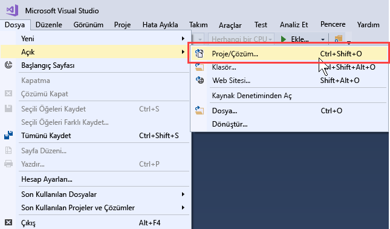
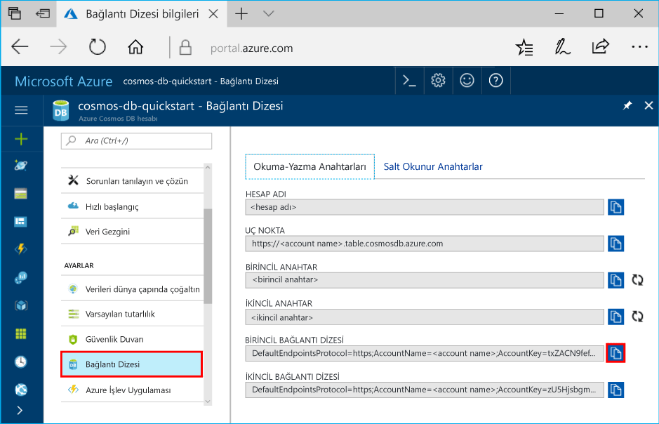

# <a name="quickstart-build-a-table-api-app-with-net-sdk-and-azure-cosmos-db"></a>Hızlı başlangıç: .NET SDK ve Azure Cosmos DB Tablo API'si uygulama oluşturma 

> [!div class="op_single_selector"]
> * [.NET](create-table-dotnet.md)
> * [Java](create-table-java.md)
> * [Node.js](create-table-nodejs.md)
> * [Python](create-table-python.md)
>  

Bu hızlı başlangıçta GitHub’dan bir örneği kopyalayarak bir uygulama oluşturmak için .NET ve Azure Cosmos DB [Tablo API’sini](table-introduction.md) nasıl kullanacağınız gösterilmektedir. Bu hızlı başlangıçta ayrıca Azure Cosmos DB hesabı oluşturma ve web tabanlı Azure portalında tablo ve varlıklar oluşturmak için Veri Gezgini’ni kullanma da gösterilmektedir.

## <a name="prerequisites"></a>Önkoşullar

Zaten Visual Studio 2019 yüklü değilse, **ücretsiz** [Visual Studio 2019 Community Edition](https://www.visualstudio.com/downloads/)' ı indirip kullanabilirsiniz. Visual Studio kurulumu sırasında **Azure dağıtımını** etkinleştirdiğinizden emin olun.

[!INCLUDE [quickstarts-free-trial-note](../../includes/quickstarts-free-trial-note.md)]

## <a name="create-a-database-account"></a>Veritabanı hesabı oluşturma

[!INCLUDE [cosmos-db-create-dbaccount-table](../../includes/cosmos-db-create-dbaccount-table.md)]

## <a name="add-a-table"></a>Tablo ekleme

[!INCLUDE [cosmos-db-create-table](../../includes/cosmos-db-create-table.md)]

## <a name="add-sample-data"></a>Örnek verileri ekleme

[!INCLUDE [cosmos-db-create-table-add-sample-data](../../includes/cosmos-db-create-table-add-sample-data.md)]

## <a name="clone-the-sample-application"></a>Örnek uygulamayı kopyalama

Şimdi GitHub'dan bir Tablo uygulaması kopyalayalım, bağlantı dizesini ayarlayalım ve uygulamayı çalıştıralım. Verilerle program aracılığıyla çalışmanın ne kadar kolay olduğunu göreceksiniz. 

1. Bir komut istemini açın, git-samples adlı yeni bir klasör oluşturun ve komut istemini kapatın.

   ```bash
   md "C:\git-samples"
   ```

2. Git Bash gibi bir Git terminal penceresi açın ve örnek uygulamayı yüklemek üzere yeni bir klasör olarak değiştirmek için `cd` komutunu kullanın.

   ```bash
   cd "C:\git-samples"
   ```

3. Örnek depoyu kopyalamak için aşağıdaki komutu çalıştırın. Bu komut bilgisayarınızda örnek uygulamanın bir kopyasını oluşturur.

   ```bash
   git clone https://github.com/Azure-Samples/azure-cosmos-table-dotnet-core-getting-started.git
   ```

## <a name="open-the-sample-application-in-visual-studio"></a>Örnek uygulamayı Visual Studio'da açma

1. Visual Studio'da **Dosya** menüsünden **Aç**'ı ve ardından **Proje/Çözüm**'ü seçin. 

    

2. Örnek uygulamayı Klonladığınız klasöre gidin ve TableStorage. sln dosyasını açın.

## <a name="update-your-connection-string"></a>Bağlantı dizenizi güncelleştirme

Bu adımda Azure portalına dönerek bağlantı dizesi bilgilerinizi kopyalayıp uygulamaya ekleyin. Bu, uygulamanızın barındırılan veritabanıyla iletişim kurmasına olanak tanır. 

1. [Azure portalında](https://portal.azure.com/)**Bağlantı Dizesi**’ne tıklayın. Pencerenin sağ tarafındaki kopyala düğmesini kullanarak **PRIMARY CONNECTION STRING**'i kopyalayın.

   

2. Visual Studio 'da **Settings. JSON** dosyasını açın. 

3. Portaldan **BIRINCIL bağlantı dizesini** StorageConnectionString değerine yapıştırın. Dizeyi tırnak işareti içinde yapıştırın.

   ```csharp
   {
      "StorageConnectionString": "<Primary connection string from Azure portal>"
   }
   ```

4. **Settings. JSON** dosyasını kaydetmek için CTRL + S tuşlarına basın.

Bu adımlarla uygulamanıza Azure Cosmos DB ile iletişim kurması için gereken tüm bilgileri eklemiş oldunuz. 

## <a name="build-and-deploy-the-app"></a>Uygulama derleme ve dağıtma

1. Visual Studio 'da, **Çözüm Gezgini** ' de **Cosmostablesamples** projesine sağ tıklayın ve ardından **NuGet Paketlerini Yönet**' e tıklayın. 

   

2. NuGet **Gözden** geçirme kutusuna Microsoft. Azure. Cosmos. Table yazın. Cosmos DB Table API istemci kitaplığı görüntülenir. Bu kitaplığın Şu anda .NET Framework ve .NET Standard için kullanılabilir olduğunu unutmayın. 
   
   

3. **Microsoft. Azure. Cosmos. Table** kitaplığını yüklemek Için, **yüklensin** ' e tıklayın. Bunu yaptığınızda Azure Cosmos DB Tablo API paketi ve tüm bağımlılıklar yüklenir.

4. Tüm uygulamayı çalıştırdığınızda, örnek veriler tablo varlığına eklenir ve sonda silinir, böylece tüm örneği çalıştırırsanız hiçbir veri eklenmez. Ancak, verileri görüntülemek için bazı kesme noktaları ekleyebilirsiniz. BasicSamples.cs dosyasını açın ve satır 52 ' ye sağ tıklayıp **kesme noktası**' nı seçin ve **kesme noktası Ekle**' yi seçin. 55. satıra da bir kesme noktası ekleyin.

    

5. Uygulamayı çalıştırmak için F5'e basın. Konsol penceresinde, Azure Cosmos DB yeni tablo veritabanının adı (Bu örnekte demoa13b1) görüntülenir. 
    
   

   İlk kesme noktasına ulaştığınızda Azure portalında Veri Gezgini'ne dönün. **Yenile** düğmesine tıklayın, demo* tablosunu genişletin ve **Varlıklar**'a tıklayın. Sağdaki **Varlıklar** sekmesinde Walter Harp için eklenmiş olan yeni varlık gösterilir. Yeni varlığın telefon numarasının 425-555-0101 olduğuna dikkat edin.

   
    
   Projeyi çalıştırırken Settings. json dosyasının bulunamadığını bildiren bir hata alırsanız, proje ayarlarına aşağıdaki XML girişini ekleyerek bu sorunu çözebilirsiniz. CosmosTableSamples öğesine sağ tıklayın, CosmosTableSamples. csproj öğesini Düzenle ' yi seçin ve şu ItemGroup 'u ekleyin: 

   ```csharp
     <ItemGroup>
       <None Update="Settings.json">
         <CopyToOutputDirectory>PreserveNewest</CopyToOutputDirectory>
       </None>
     </ItemGroup>
   ```

6. Veri Gezgini'nde **Varlıklar** sekmesini kapatın.
    
7. Uygulamayı bir sonraki kesme noktasına kadar çalıştırmak için F5'e basın. 

    Kesme noktasına ulaştığınızda Azure portalına dönün, yeniden **Varlıklar**'a tıklayarak **Varlıklar** sekmesini açın ve telefon numarasının 425-555-0105 olarak güncelleştirildiğine dikkat edin.

8. Uygulamayı çalıştırmak için F5'e basın. 
 
   Uygulama varlıkları Tablo API'si tarafından desteklenmeyen gelişmiş örnek uygulamada kullanılmak üzere ekler. Uygulama ardından örnek uygulama tarafından oluşturulan tabloyu siler.

9. Konsol penceresinde uygulamanın yürütülmesini sonlandırmak için Enter'a basın. 
  

## <a name="review-slas-in-the-azure-portal"></a>Azure portalında SLA'ları gözden geçirme

[!INCLUDE [cosmosdb-tutorial-review-slas](../../includes/cosmos-db-tutorial-review-slas.md)]

## <a name="clean-up-resources"></a>Kaynakları temizleme

[!INCLUDE [cosmosdb-delete-resource-group](../../includes/cosmos-db-delete-resource-group.md)]

## <a name="next-steps"></a>Sonraki adımlar

Bu hızlı başlangıçta Azure Cosmos DB hesabı oluşturmayı, Veri Gezgini'ni kullanarak tablo oluşturmayı ve bir uygulamayı çalıştırmayı öğrendiniz.  Şimdi Tablo API'sini kullanarak verilerinizi sorgulayabilirsiniz.  

> [!div class="nextstepaction"]
> [Tablo verilerini Tablo API’sine aktarma](table-import.md)

