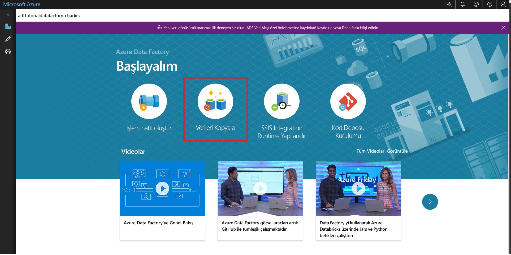

# Veri Kopyalama aracını kullanarak veri kopyalama 
> [!div class="op_single_selector" title1="Select the version of Data Factory service you are using:"]
> * [Sürüm 1 - Genel Kullanım](v1/data-factory-copy-data-from-azure-blob-storage-to-sql-database.md)
> * [Sürüm 2 - Önizleme](quickstart-create-data-factory-copy-data-tool.md)

Bu hızlı başlangıçta Azure portalını kullanarak bir veri fabrikası oluşturursunuz. Sonra, Veri Kopyalama aracını kullanarak Azure blob depolama alanındaki bir klasörde bulunan verileri başka bir klasöre kopyalarsınız. 

> [!NOTE]
> Azure Data Factory kullanmaya yeni başlıyorsanız, bu hızlı başlangıçtaki işlemleri gerçekleştirmeden önce [Azure Data Factory'ye giriş](data-factory-introduction.md) konusuna bakın. 
>
> Bu makale şu anda önizleme sürümünde olan Data Factory sürüm 2 için geçerlidir. Data Factory hizmetinin genel kullanıma açık (GA) 1. sürümünü kullanıyorsanız [Data Factory sürüm 1 ile çalışmaya başlama](v1/data-factory-copy-data-from-azure-blob-storage-to-sql-database.md) konusunu inceleyin.

[!INCLUDE [data-factory-quickstart-prerequisites](../../includes/data-factory-quickstart-prerequisites.md)] 

## Veri fabrikası oluşturma

1. Soldaki menüde **Yeni**, **Veri + Analiz** ve **Data Factory** öğesine tıklayın. 
   
   
2. **Yeni veri fabrikası** sayfasında **ad** için **ADFTutorialDataFactory** girin. 
      
     
 
   Azure data factory adı **küresel olarak benzersiz** olmalıdır. Ad alanı için aşağıdaki hatayı görürseniz veri fabrikasının adını değiştirin (örneğin, adınızADFTutorialDataFactory) ve yeniden oluşturmayı deneyin. Data Factory yapıtlarının adlandırma kuralları için [Data Factory - Adlandırma Kuralları](naming-rules.md) makalesine bakın.
  
     
3. Veri fabrikasını oluşturmak istediğiniz Azure **aboneliğini** seçin. 
4. **Kaynak Grubu** için aşağıdaki adımlardan birini uygulayın:
     
      - **Var olanı kullan**’ı seçin ve ardından açılır listeden var olan bir kaynak grubu belirleyin. 
      - **Yeni oluştur**’u seçin ve bir kaynak grubunun adını girin.   
         
      Kaynak grupları hakkında daha fazla bilgi için bkz. [Azure kaynaklarınızı yönetmek için kaynak gruplarını kullanma](../azure-resource-manager/resource-group-overview.md).  
4. **Sürüm** için **V2 (Önizleme)** öğesini seçin.
5. Data factory için **konum** seçin. Açılan listede yalnızca desteklenen konumlar görüntülenir. Veri fabrikası tarafından kullanılan verileri depoları (Azure Depolama, Azure SQL Veritabanı, vb.) ve işlemler (HDInsight, vb.) başka konumlarda/bölgelerde olabilir.
6. **Panoya sabitle**’yi seçin.     
7. **Oluştur**’a tıklayın.
8. Panoda şu kutucuğu ve üzerinde şu durumu görürsünüz: **Veri fabrikası dağıtılıyor**. 

    
9. Oluşturma işlemi tamamlandıktan sonra, görüntüde gösterildiği gibi **Data Factory** sayfasını görürsünüz.
   
   
10. Azure Data Factory kullanıcı arabirimini (UI) ayrı bir sekmede açmak için **Geliştir ve İzle** kutucuğuna tıklayın. 

## Veri Kopyalama aracını başlatma

1. Veri Kopyalama aracını başlatmak için başlangıç sayfasında **Veri Kopyalama**’ya tıklayın. 

   
2. Veri Kopyalama aracının **Özellikler** sayfasında **İleri**’ye tıklayın. Bu sayfada işlem hattının adını ve açıklamasını belirtebilirsiniz. 

    
3. **Kaynak veri deposu** sayfasında **Azure Blob Depolama**’yı seçip **İleri**’ye tıklayın.

    
4. **Azure Blob depolama hesabı belirtin** sayfasında, açılan listeden **depolama hesabınızın adını** seçip İleri’ye tıklayın. 

    
5. **Girdi dosyasını veya klasörünü seçin** sayfasında aşağıdaki adımları uygulayın:

    1. **adftutorial/input** klasörüne gidin. 
    2. **emp.txt** dosyasını seçin.
    3. **Seçin**’e tıklayın. Bu adımı atlamak için **emp.txt** dosyasına çift tıklayabilirsiniz. 
    4. **İleri**’ye tıklayın. 

    
6. **Dosya biçimi ayarları** sayfasında aracın sütun ve satır sınırlayıcılarını otomatik olarak belirlediğine dikkat edin ve **İleri**’ye tıklayın. Ayrıca, bu sayfada verilerin önizlemesini yapabilir ve giriş verilerinin şemasını görüntüleyebilirsiniz. 

    
7. **Hedef veri deposu** sayfasında **Azure Blob Depolama**’yı seçip **İleri**’ye tıklayın. 

        
8. **Azure Blob depolama hesabı belirtin** sayfasında, Azure Blob depolama hesabınızın adını seçip **İleri**’ye tıklayın. 

    
9. **Çıktı dosyasını veya klasörünü seçin** sayfasında aşağıdaki adımları uygulayın: 

    1. **Klasör yolu** için **adftutorial/output** yolunu girin.
    2. **Dosya adı** için **emp.txt** adını girin. 
    3. **İleri**’ye tıklayın. 

     
10. **Dosya biçimi ayarları** sayfasında **İleri**’ye tıklayın. 

    
11. **Ayarlar** sayfasında **İleri**’ye tıklayın. 

    
12. **Özet** sayfasında tüm ayarları gözden geçirin ve İleri’ye tıklayın. 

    
13. **Dağıtım tamamlandı** sayfasında, oluşturduğunuz işlem hattını izlemek için **İzleyici**’ye tıklayın. 

    
14. Uygulama **İzleyici** sekmesine geçer. Bu sayfada işlem hattının durumunu görürsünüz. Listeyi yenilemek için **Yenile**’ye tıklayın. 
    
    
15. Eylemler sütunundaki **Etkinlik Çalıştırmalarını Görüntüle** bağlantısına tıklayın. İşlem hattı, **Kopyalama** türünde tek bir etkinlik içerir. 

    
16. Kopyalama işlemiyle ilgili ayrıntıları görüntülemek için **Eylemler** sütunundaki **Ayrıntılar**’a (gözlük resmi) tıklayın. Özelliklerle ilgili ayrıntılar için bkz. [Kopyalama Etkinliğine genel bakış](copy-activity-overview.md). 

    
17. **adftutorial** kapsayıcısının **çıktı** klasöründe **emp.txt** dosyasının oluşturulduğunu doğrulayın. Çıktı klasörü mevcut değilse Data Factory hizmeti tarafından otomatik olarak oluşturulur. 
18. Bağlı hizmetleri, veri kümelerini ve işlem hatlarını düzenleyebilmek için **Düzenle** sekmesine geçin. Bunları Data Factory kullanıcı arabiriminde düzenleme hakkında bilgi edinmek için bkz. [Azure portalını kullanarak veri fabrikası oluşturma](quickstart-create-data-factory-portal.md).

    

## Sonraki adımlar
Bu örnekteki işlem hattı, verileri bir konumdan Azure blob depolama alanındaki başka bir konuma kopyalar. Daha fazla senaryoda Data Factory’yi kullanma hakkında bilgi almak için [öğreticileri](tutorial-copy-data-portal.md) okuyun. 