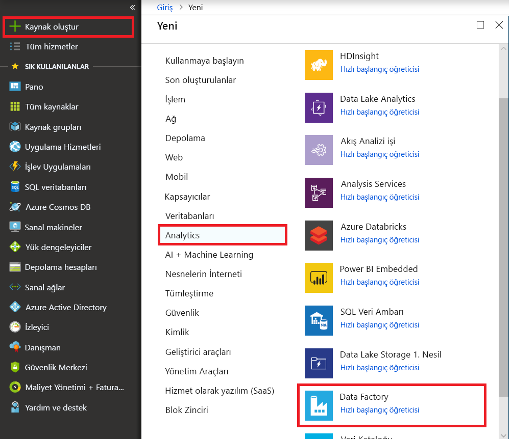

# Veri Kopyalama aracını kullanarak veri kopyalama 
> [!div class="op_single_selector" title1="Select the version of Data Factory service that you are using:"]
> * [Sürüm 1 - Genel Kullanım](v1/data-factory-copy-data-from-azure-blob-storage-to-sql-database.md)
> * [Sürüm 2 - Önizleme](quickstart-create-data-factory-copy-data-tool.md)

Bu hızlı başlangıçta Azure portalını kullanarak bir veri fabrikası oluşturursunuz. Sonra, Veri Kopyalama aracını kullanarak Azure Blob depolama alanındaki bir klasörde bulunan verileri başka bir klasöre kopyalarsınız. 

> [!NOTE]
> Azure Data Factory'yi kullanmaya yeni başlıyorsanız, bu hızlı başlangıçtaki işlemleri gerçekleştirmeden önce [Azure Data Factory'ye giriş](data-factory-introduction.md) konusuna bakın. 
>
> Bu makale şu anda önizleme sürümünde olan Data Factory sürüm 2 için geçerlidir. Hizmetin genel kullanıma açık (GA) 1. sürümünü kullanıyorsanız [Data Factory sürüm 1 ile çalışmaya başlama](v1/data-factory-copy-data-from-azure-blob-storage-to-sql-database.md) konusunu inceleyin.

[!INCLUDE [data-factory-quickstart-prerequisites](../../includes/data-factory-quickstart-prerequisites.md)] 

## Veri fabrikası oluşturma

1. Soldaki menüden **Yeni**’yi, sonra **Veri ve Analiz**’i ve ardından **Data Factory**’i seçin. 
   
   
2. **Yeni veri fabrikası** sayfasında **Ad** için **ADFTutorialDataFactory** girin. 
      
   
 
   Azure data factory adı *küresel olarak benzersiz* olmalıdır. Aşağıdaki hatayı alırsanız veri fabrikasının adını değiştirin (örneğin **&lt; adınız&gt;ADFTutorialDataFactory**) ve veri fabrikası oluşturmayı yeniden deneyin. Data Factory yapıtlarının adlandırma kuralları için [Data Factory - adlandırma kuralları](naming-rules.md) makalesini inceleyin.
  
   
3. **Abonelik** için, veri fabrikasını oluşturmak istediğiniz Azure aboneliğini seçin. 
4. **Kaynak Grubu** için aşağıdaki adımlardan birini uygulayın:
     
   - **Var olanı kullan**’ı ve ardından listeden var olan bir kaynak grubunu seçin. 
   - **Yeni oluştur**’u seçin ve bir kaynak grubunun adını girin.   
         
   Kaynak grupları hakkında daha fazla bilgi için bkz. [Azure kaynaklarınızı yönetmek için kaynak gruplarını kullanma](../azure-resource-manager/resource-group-overview.md).  
4. **Sürüm** için **V2 (Önizleme)** öğesini seçin.
5. **Konum** için, veri fabrikasının konumunu seçin. 

   Bu listede yalnızca desteklenen konumlar görüntülenir. Data Factory tarafından kullanılan veri depoları (Azure Depolama ve Azure SQL Veritabanı gibi) ve işlemler (Azure HDInsight gibi) başka konumlarda veya bölgelerde olabilir.

6. **Panoya sabitle**’yi seçin.     
7. **Oluştur**’u seçin.
8. Panoda, **Data Factory Dağıtılıyor** durumuna sahip aşağıdaki kutucuğu görürsünüz: 

    
9. Oluşturma işlemi tamamlandıktan sonra, **Data Factory** sayfasını görürsünüz. Azure Data Factory kullanıcı arabirimi (UI) uygulamasını ayrı bir sekmede başlatmak için **Yazar ve İzleyici** kutucuğunu seçin.
   
   

## Veri Kopyalama aracını başlatma

1. **Başlayalım** sayfasında, Veri Kopyalama aracını başlatmak için **Veri Kopyala** kutucuğunu seçin. 

   
2. Veri Kopyalama aracının **Özellikler** sayfasında **İleri**’yi seçin. Bu sayfada işlem hattının adını ve açıklamasını belirtebilirsiniz. 

   
3. **Kaynak veri deposu** sayfasında **Azure Blob Depolama**’yı ve ardından **İleri**’yi seçin.

   
4. **Azure Blob depolama hesabı belirtin** sayfasında, **Depolama hesabı adı** listesinden depolama hesabınızı ve sonra **İleri**’yi seçin. 

   
5. **Girdi dosyasını veya klasörünü seçin** sayfasında aşağıdaki adımları uygulayın:

   a. **adftutorial/input** klasörüne göz atın.

   b. **emp.txt** dosyasını seçin.

   c. **Seç** seçeneğini belirleyin. Bu adımı atlamak için **emp.txt** dosyasına çift tıklayabilirsiniz.

   d. **İleri**’yi seçin. 

   
6. **Dosya biçimi ayarları** sayfasında aracın sütun ve satır sınırlayıcılarını otomatik olarak belirlediğine dikkat edin ve **İleri**’yi seçin. Ayrıca, bu sayfada verilerin önizlemesini yapabilir ve giriş verisi şemalarını görüntüleyebilirsiniz. 

   
7. **Hedef veri deposu** sayfasında **Azure Blob Depolama**’yı ve sonra **İleri**’yi seçin. 

       
8. **Azure Blob depolama hesabı belirtin** sayfasında, Azure Blob depolama hesabınızın adını ve sonra **İleri**’yi seçin. 

   
9. **Çıktı dosyasını veya klasörünü seçin** sayfasında aşağıdaki adımları uygulayın: 

   a. Klasör yolu için **adftutorial/output** yolunu girin.

   b. Dosya adı için **emp.txt** adını girin.

   c. **İleri**’yi seçin. 

    
10. **Dosya biçimi ayarları** sayfasında **İleri**’yi seçin. 

    
11. **Ayarlar** sayfasında **İleri**’yi seçin. 

    
12. **Özet** sayfasında tüm ayarları gözden geçirin ve **İleri**’yi seçin. 

    
13. **Dağıtım tamamlandı** sayfasında, oluşturduğunuz işlem hattını izlemek için **İzleyici**’yi seçin. 

    
14. Uygulama **İzleyici** sekmesine geçer. Bu sekmede işlem hattının durumunu görürsünüz. Listeyi yenilemek için **Yenile**’yi seçin. 
    
    
15. **Eylemler** sütununda **Etkinlik Çalıştırma İşlemlerini Görüntüle**’yi seçin. İşlem hattı, **Kopyalama** türünde tek bir etkinlik içerir. 

    
16. Kopyalama işlemiyle ilgili ayrıntıları görüntülemek için **Eylemler** sütunundaki **Ayrıntılar**’ı (gözlük resmi) seçin. Özelliklerle ilgili ayrıntılar için bkz. [Kopyalama Etkinliğine genel bakış](copy-activity-overview.md). 

    
17. **adftutorial** kapsayıcısının **çıktı** klasöründe **emp.txt** dosyasının oluşturulduğunu doğrulayın. Çıkış klasörü yoksa, Data Factory hizmeti tarafından otomatik olarak oluşturulur. 
18. Bağlı hizmetleri, veri kümelerini ve işlem hatlarını düzenleyebilmek için **Düzenle** sekmesine geçin. Bunları Data Factory kullanıcı arabiriminde düzenleme hakkında bilgi edinmek için bkz. [Azure portalını kullanarak veri fabrikası oluşturma](quickstart-create-data-factory-portal.md).

    

## Sonraki adımlar
Bu örnekteki işlem hattı, verileri bir konumdan Azure Blob depolama alanındaki başka bir konuma kopyalar. Data Factory’yi daha fazla senaryoda kullanma hakkında bilgi almak için [öğreticileri](tutorial-copy-data-portal.md) okuyun. 