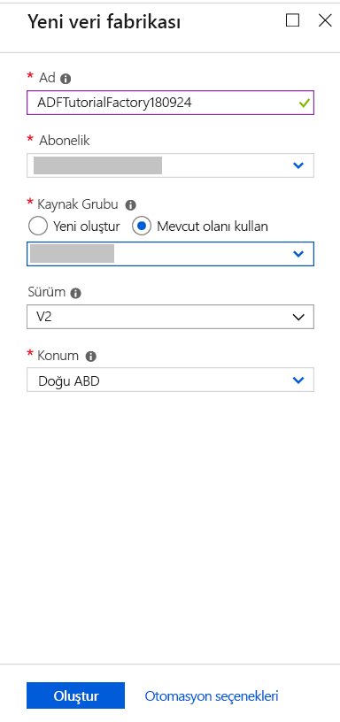

# Azure portalını kullanarak bir veri fabrikası oluşturma
> [!div class="op_single_selector" title1="Select the version of Data Factory service you are using:"]
> * [Sürüm 1 - Genel Kullanım](v1/data-factory-copy-data-from-azure-blob-storage-to-sql-database.md)
> * [Sürüm 2 - Önizleme](quickstart-create-data-factory-portal.md)

Azure Data Factory, bulutta veri hareketi ve veri dönüştürmeyi düzenleyip otomatikleştirmek için veri odaklı iş akışları oluşturmanıza olanak tanıyan, bulut tabanlı bir veri tümleştirme hizmetidir. Azure Data Factory’yi kullanarak, farklı veri depolarından veri alabilen, Azure HDInsight Hadoop, Spark, Azure Data Lake Analytics ve Azure Machine Learning gibi işlem hizmetlerini kullanarak verileri işleyebilen/dönüştürebilen ve çıktı verilerini iş zekası (BI) uygulamaları tarafından kullanılabilmesi için Azure SQL Veri Ambarı gibi veri depolarında yayımlayabilen veri odaklı iş akışları (işlem hatları olarak adlandırılır) oluşturup zamanlayabilirsiniz. 

Bu hızlı başlangıçta Azure portalını kullanarak bir veri fabrikası oluşturacaksınız. Veri fabrikasını oluşturduktan sonra, diğer hızlı başlangıçlarda olduğu gibi bir kaynak veri deposundan hedef veri deposuna verileri kopyalayan veri işlem hattı olarak PowerShell, .NET SDK, Python SDK veya REST API’sini kullanmanız gerekir. Şu anda, Azure portalını kullanarak bir veri fabrikasında işlem hattı oluşturamazsınız.

> [!NOTE]
> Bu makale şu anda önizleme sürümünde olan Data Factory sürüm 2 için geçerlidir. Data Factory hizmetinin genel kullanıma açık (GA) 1. sürümünü kullanıyorsanız [Data Factory sürüm 1 ile çalışmaya başlama](v1/data-factory-copy-data-from-azure-blob-storage-to-sql-database.md) konusunu inceleyin.

Azure aboneliğiniz yoksa başlamadan önce [ücretsiz](https://azure.microsoft.com/free/) bir hesap oluşturun.

## Azure portalında oturum açma
[Azure Portal](https://portal.azure.com/)’da oturum açın.

## Veri fabrikası oluşturma
Bu hızlı başlangıcın bir parçası olarak gerçekleştireceğiniz adımlar şunlardır:
1. Soldaki menüde **Yeni**, **Veri + Analiz** ve **Data Factory** öğesine tıklayın. 
   
   
2. **Yeni veri fabrikası** dikey penceresine **ad** için **ADFTutorialDataFactory** girin. 
      
     
 
   Azure data factory adı **küresel olarak benzersiz** olmalıdır. Aşağıdaki hatayı alırsanız veri fabrikasının adını değiştirin (örneğin adınızADFTutorialDataFactory) ve oluşturmayı yeniden deneyin. Data Factory yapıtlarının adlandırma kuralları için [Data Factory - Adlandırma Kuralları](naming-rules.md) konusuna bakın.
  
       `Data factory name “ADFTutorialDataFactory” is not available`
3. Veri fabrikasını oluşturmak istediğiniz Azure **aboneliğini** seçin. 
4. **Kaynak Grubu** için aşağıdaki adımlardan birini uygulayın:
     
      - **Var olanı kullan**’ı seçin ve ardından açılır listeden var olan bir kaynak grubu belirleyin. 
      - **Yeni oluştur**’u seçin ve bir kaynak grubunun adını girin.   
         
      Bu hızlı başlangıçtaki adımlardan bazıları kaynak grubu için şu adı kullandığınızı varsayar: **ADFTutorialResourceGroup**. Kaynak grupları hakkında daha fazla bilgi için bkz. [Azure kaynaklarınızı yönetmek için kaynak gruplarını kullanma](../azure-resource-manager/resource-group-overview.md).  
4. **Sürüm** için **V2 (Önizleme)** öğesini seçin.
5. Data factory için **konum** seçin. Şu anda V2 veri fabrikalarını yalnızca **Doğu ABD** bölgesinde oluşturabilirsiniz. Ancak, veri fabrikalarında kullanılan işlem ve veri depoları başka bölgelerde olabilir. 
6. **Panoya sabitle**’yi seçin.     
7. **Oluştur**'a tıklayın.
      
      > [!IMPORTANT]
      > Data Factory örnekleri oluşturmak için abonelik/kaynak grubu düzeyinde [Data Factory Katılımcısı](../active-directory/role-based-access-built-in-roles.md#data-factory-contributor) rolünün üyesi olmanız gerekir.
      > 
      > Data factory adı gelecekte bir DNS adı olarak kaydedilmiş olabilir; bu nedenle herkese görünür hale gelmiştir.             
3. Panoda şu kutucuğu ve üzerinde şu durumu görürsünüz: **Veri fabrikası dağıtılıyor**. 

    
1. Oluşturma işlemi tamamlandıktan sonra, görüntüde gösterildiği gibi **Data Factory** dikey penceresini görürsünüz.
   
   

## Sonraki adımlar
Bu örnekteki işlem hattı, verileri bir konumdan Azure blob depolama alanındaki başka bir konuma kopyalar. Daha fazla senaryoda Data Factory’yi kullanma hakkında bilgi almak için [öğreticileri](tutorial-copy-data-dot-net.md) okuyun. 