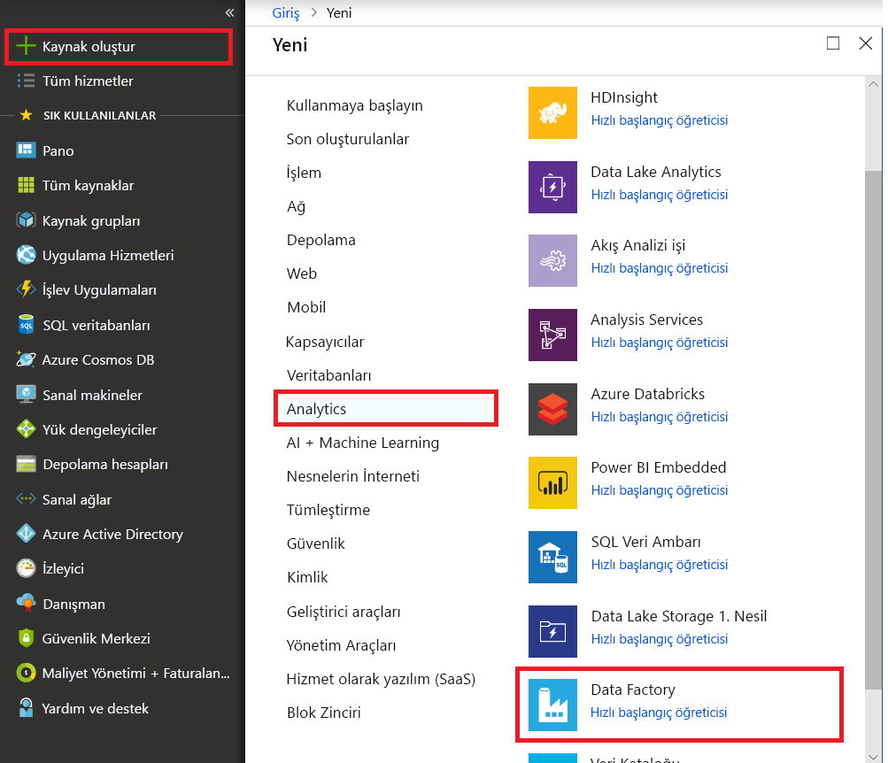
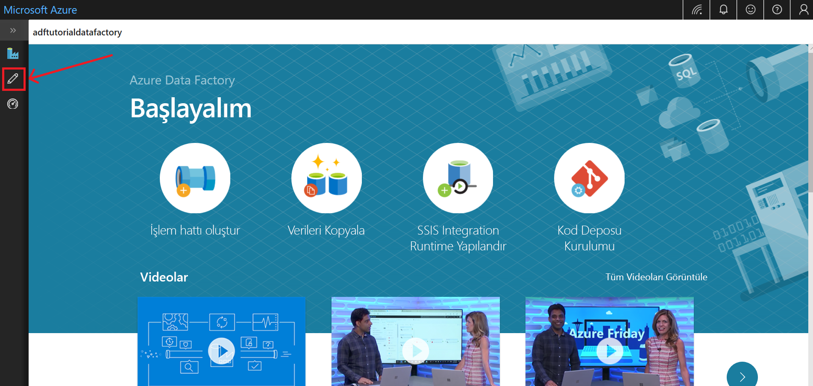

# Azure Data Factory UI kullanarak veri fabrikası oluşturma
> [!div class="op_single_selector" title1="Select the version of Data Factory service that you are using:"]
> * [Sürüm 1 - Genel Kullanım](v1/data-factory-copy-data-from-azure-blob-storage-to-sql-database.md)
> * [Sürüm 2 - Önizleme](quickstart-create-data-factory-portal.md)

Bu hızlı başlangıçta, Azure Data Factory UI kullanarak veri fabrikasını oluşturma ve izleme işlemi açıklanır. Bu veri fabrikasında oluşturduğunuz işlem hattı, verileri Azure Blob depolama alanındaki bir klasörden başka bir klasöre *kopyalar*. Azure Data Factory kullanarak verileri *dönüştürme* hakkında bir öğretici için bkz. [Öğretici: Spark kullanarak verileri dönüştürme](tutorial-transform-data-spark-portal.md). 

> [!NOTE]
> Azure Data Factory'yi kullanmaya yeni başlıyorsanız, bu hızlı başlangıçtaki işlemleri gerçekleştirmeden önce [Azure Data Factory'ye giriş](data-factory-introduction.md) konusuna bakın. 
>
> Bu makale şu anda önizleme sürümünde olan Data Factory sürüm 2 için geçerlidir. Hizmetin genel kullanıma açık (GA) 1. sürümünü kullanıyorsanız bkz. [Data Factory sürüm 1 öğreticisi](v1/data-factory-copy-data-from-azure-blob-storage-to-sql-database.md).

[!INCLUDE [data-factory-quickstart-prerequisites](../../includes/data-factory-quickstart-prerequisites.md)] 

### Video 
Bu videoyu izlemeniz, Data Factory kullanıcı arabirimini anlamanıza yardımcı olur: 
>[!VIDEO https://channel9.msdn.com/Shows/Azure-Friday/Visually-build-pipelines-for-Azure-Data-Factory-v2/Player]

## Veri fabrikası oluşturma

1. [Azure Portal](https://portal.azure.com) gidin. 
2. Solda yer alan menüde **Yeni**’yi, sonra **Veri ve Analiz**’i ve ardından **Data Factory**’yi seçin. 
   
   
2. **Yeni veri fabrikası** sayfasında **Ad** için **ADFTutorialDataFactory** adını girin. 
      
   
 
   Azure data factory adı *küresel olarak benzersiz* olmalıdır. Aşağıdaki hatayı alırsanız veri fabrikasının adını değiştirin (örneğin **&lt; adınız&gt;ADFTutorialDataFactory**) ve veri fabrikası oluşturmayı yeniden deneyin. Data Factory yapıtlarının adlandırma kuralları için [Data Factory - adlandırma kuralları](naming-rules.md) makalesini inceleyin.
  
   
3. **Abonelik** için, veri fabrikasını oluşturmak istediğiniz Azure aboneliğini seçin. 
4. **Kaynak Grubu** için aşağıdaki adımlardan birini uygulayın:
     
   - **Var olanı kullan**’ı ve ardından listeden var olan bir kaynak grubunu seçin. 
   - **Yeni oluştur**’u seçin ve bir kaynak grubunun adını girin.   
         
   Kaynak grupları hakkında daha fazla bilgi için bkz. [Azure kaynaklarınızı yönetmek için kaynak gruplarını kullanma](../azure-resource-manager/resource-group-overview.md).  
4. **Sürüm** için **V2 (Önizleme)** öğesini seçin.
5. **Konum** için, veri fabrikasının konumunu seçin.

   Listede yalnızca Data Factory tarafından desteklenen konumlar gösterilir. Data Factory tarafından kullanılan veri depoları (Azure Depolama ve Azure SQL Veritabanı) ve işlemler (Azure HDInsight gibi) başka konumlarda olabilir.
6. **Panoya sabitle**’yi seçin.     
7. **Oluştur**’u seçin.
8. Panoda, **Data Factory Dağıtılıyor** durumuna sahip aşağıdaki kutucuğu görürsünüz: 

   
9. Oluşturma işlemi tamamlandıktan sonra, **Data Factory** sayfasını görürsünüz. Azure Data Factory kullanıcı arabirimi (UI) uygulamasını ayrı bir sekmede başlatmak için **Yazar ve İzleyici** kutucuğunu seçin.
   
   
10. **Başlayalım** sayfasında, sol bölmede bulunan **Düzenle** sekmesine geçin. 

    

## Bağlı hizmet oluşturma
Bu yordamda, Azure depolama hesabınızı veri fabrikasına bağlamak için bağlı bir hizmet oluşturursunuz. Bağlı hizmetler, Data Factory hizmetinin bunlara bağlanmak için çalışma zamanında kullandığı bağlantı bilgilerini içerir.

1. **Bağlantılar**'ı seçip araç çubuğundan **İleri** düğmesini seçin. 

       
2. **Yeni Bağlı Hizmet** sayfasında **Azure Blob Depolama**’yı seçip **Devam**’ı seçin. 

   
3. Aşağıdaki adımları tamamlayın: 

   a. **Ad** için **AzureStorageLinkedService** adını girin.

   b. **Depolama hesabı adı** alanı için Azure depolama hesabınızın adını seçin.

   c. Data Factory hizmetinin depolama hesabına bağlanabildiğini onaylamak için **Bağlantıyı sına**'yı seçin. 

   d. Bağlı hizmeti kaydetmek için **Kaydet**’i seçin. 

    
4. Bağlı hizmetler listesinde **AzureStorageLinkedService** öğesini gördüğünüzü onaylayın. 

   

## Veri kümeleri oluşturma
Bu yordamda iki veri kümesi oluşturursunuz: **InputDataset** ve **OutputDataset**. Bu veri kümeleri **AzureBlob** türündedir. Bunlar, önceki bölümde oluşturduğunuz Azure Depolama bağlı hizmetine başvurur. 

Giriş veri kümesi, giriş klasöründeki kaynak verileri temsil eder. Giriş veri kümesi tanımında, kaynak verileri içeren blob kapsayıcısını (**adftutorial**), klasörü (**input**) ve dosyayı (**emp.txt**) belirtirsiniz. 

Çıkış veri kümesi hedefe kopyalanan verileri temsil eder. Çıkış veri kümesi tanımında, verilerin kopyalandığı blob kapsayıcısını (**adftutorial**), klasörü (**output**) ve dosyayı belirtirsiniz. Bir işlem hattının her çalıştırmasıyla ilişkili benzersiz bir Kimlik vardır. Bu kimliğe **RunId** sistem değişkenini kullanarak erişebilirsiniz. Çıkış dosyasının adı, işlem hattının çalıştırma kimliği temelinde dinamik olarak belirlenir.   

Bağlı hizmet ayarlarında, kaynak verileri içeren Azure depolama hesabını belirtmiştiniz. Kaynak veri kümesi ayarlarında, kaynak verilerin tam olarak nerede durduğunu (blob kapsayıcısı, klasör ve dosya) belirtirsiniz. Havuz veri kümesi ayarlarında, verilerin nereye kopyalandığını (blob kapsayıcısı, klasör ve dosya) belirtirsiniz. 
 
1. **+** (artı) düğmesini seçip **Veri Kümesi**'ni seçin.

   
2. **Yeni Veri Kümesi** sayfasında **Azure Blob Depolama**’yı seçip **Son**’u seçin. 

   
3. Veri kümesinin **Özellikler** penceresinde, **Ad** olarak **InputDataset** girin. 

   
4. **Bağlantı** sekmesine geçin ve aşağıdaki adımları tamamlayın: 

   a. **Bağlı hizmet** için **AzureStorageLinkedService** hizmetini seçin.

   b. **Dosya yolu** için **Gözat** düğmesini seçin.

       c. **Dosya veya klasör seçin** penceresinde **adftutorial** kapsayıcısındaki **input** klasörüne göz atın ve **emp.txt** dosyasını seçip **Son**'u seçin.

      
    
   d. (isteğe bağlı) Emp.txt dosyasındaki verilerin önizlemesini görmek için **Verileri önizle**'yi seçin.     
5. Çıktı veri kümesini oluşturmak için adımları yineleyin:  

   a. **+** (artı) düğmesini seçip **Veri Kümesi**'ni seçin.

   b. **Yeni Veri Kümesi** sayfasında **Azure Blob Depolama**’yı seçip **Son**’u seçin.

   c. Ad olarak **OutputDataset** değerini belirtin.

   d. Klasör olarak **adftutorial/output** girin. Çıkış klasörü yoksa kopyalama etkinliği tarafından oluşturulur.

   e. Dosya adı olarak `@CONCAT(pipeline().RunId, '.txt')` girin. 
   
      İşlem hattını her çalıştırdığınızda, işlem hattı çalıştırmasının kendisiyle ilişkilendirilmiş bir benzersiz kimliği olur. İfade, işlem hattının çalıştırma kimliğini **.txt** uzantısıyla birleştirerek çıkış dosyası adını oluşturur. Desteklenen sistem değişkenleri ve ifadelerin listesi için bkz. [Sistem değişkenleri](control-flow-system-variables.md) ve [İfade dili](control-flow-expression-language-functions.md).

   

## İşlem hattı oluşturma 
Bu yordamda, giriş ve çıkış veri kümelerini kullanan kopyalama etkinliğiyle bir işlem hattı oluşturur ve doğrularsınız. Kopyalama etkinliği, girdi veri kümesi ayarlarında belirtilen dosyadaki verileri çıktı veri kümesi ayarlarında belirtilen dosyaya kopyalar. Giriş veri kümesi yalnızca bir klasörü belirtiyorsa (dosya adını belirtmiyorsa), kopyalama etkinliği kaynak klasördeki tüm dosyaları hedefe kopyalar. 

1. **+** (artı) düğmesini seçip **İşlem Hattı**'nı seçin. 

   
2. **Özellikler** penceresinde **Ad** için **CopyPipeline** adını belirtin. 

   
3. **Etkinlikler** araç kutusunda **Veri Akışı**’nı genişletin. **Etkinlikler** araç kutusundan **Kopyalama** etkinliğini işlem hattı tasarımcısının yüzeyine sürükleyin. Ayrıca, **Etkinlikler** araç kutusunda etkinlikler için arama yapabilirsiniz. **Ad** için **CopyFromBlobToBlob** adını belirtin.

   
4. Kopyalama etkinliği ayarlarında **Kaynak** sekmesine geçin ve **Kaynak Veri Kümesi** olarak **InputDataset** öğesini seçin.

       
5. Kopyalama etkinliği ayarlarında **Kaynak** sekmesine geçin ve **Havuz Veri Kümesi** olarak **OutputDataset** öğesini seçin.

       
7. İşlem hattı ayarlarını doğrulamak için **Doğrula**'yı seçin. İşlem hattının başarıyla doğrulandığını onaylayın. Doğrulama çıktısını kapatmak için **>>** (sağ ok) düğmesini seçin. 

   

## İşlem hattında test çalıştırması yapma
Bu adımda, işlem hattını Data Factory'de dağıtmadan önce test çalıştırması yaparsınız. 

1. İşlem hattının araç çubuğunda **Test Çalıştırması**'nı seçin. 
    
   
2. İşlem hattı ayarlarının **Çıktı** sekmesinde işlem hattı çalıştırmasının durumunu gördüğünüzü onaylayın. 

       
3. **adftutorial** kapsayıcısının **output** klasöründe bir çıkış dosyası gördüğünüzü onaylayın. Çıkış klasörü yoksa, Data Factory hizmeti tarafından otomatik olarak oluşturulur. 
    
   

## İşlem hattını el ile tetikleme
Bu yordamda, varlıkları (bağlı hizmetler, veri kümeleri, işlem hatları) Azure Data Factory'ye dağıtırsınız. Ardından, işlem hattı çalıştırmasını el ile tetiklersiniz. Ayrıca, varlıkları kendi Visual Studio Team Services Git deponuzda da yayımlayabilirsiniz. Bu konu [başka bir öğreticinin](tutorial-copy-data-portal.md?#configure-code-repository) kapsamındadır.

1. Bir işlem hattını tetiklemeden önce varlıkları Data Factory'de yayımlamanız gerekir. Yayımlamak için, sol bölmede **Yayımla**'yı seçin. 

   
2. İşlem hattını el ile tetiklemek için, araç çubuğunda **Tetikleyici**'yi seçip **Şimdi Tetikle**'yi seçin. 
    
   

## İşlem hattını izleme

1. Soldaki **İzleyici** sekmesine geçin. Listeyi yenilemek için **Yenile** düğmesini kullanın.

   
2. **Eylemler**'in altındaki **Etkinlik Çalıştırmalarını Görüntüle** bağlantısını seçin. Bu sayfada kopyalama etkinliği çalıştırmasının durumunu görürsünüz. 

   
3. Kopyalama işlemiyle ilgili ayrıntıları görüntülemek için **Eylemler** sütunundaki **Ayrıntılar**’ı (gözlük resmi) seçin. Özelliklerle ilgili ayrıntılar için bkz. [Kopyalama Etkinliğine genel bakış](copy-activity-overview.md). 

   
4. **Çıkış** klasöründe yeni bir dosya gördüğünüzü onaylayın. 
5. **İşlem Hatları** bağlantısını seçerek **Etkinlik Çalıştırmaları** görünümünden **İşlem Hattı Çalıştırmaları** görünümüne dönebilirsiniz. 

## İşlem hattını bir zamanlamaya göre tetikleme
Bu yordamda bu adım isteğe bağlıdır. İşlem hattını düzenli aralıklarla (saatlik, günlük, vb.) çalıştırılacak şekilde zamanlamak için bir *zamanlayıcı tetikleyicisi* oluşturabilirsiniz. Bu yordamda, belirttiğiniz bitiş tarihine ve saatine kadar her dakika çalıştırılacak bir tetikleyici oluşturursunuz. 

1. **Düzen** sekmesine geçin. 

   
1. Menüde **Tetikleyici**’yi seçip **Yeni/Düzenle**’yi seçin. 

   
2. **Tetikleyici Ekle** sayfasında **Tetikleyici seç**’i ve sonra **Yeni**’yi seçin. 

   
3. **Yeni Tetikleyici** sayfasındaki **Son** bölümünden **Tarihinde** öğesini seçin, bitiş saati olarak geçerli saatten birkaç dakika sonrasını belirtin ve **Uygula**'yı seçin. 

   Her işlem hattı çalıştırmasının bir maliyeti olduğundan, bitiş saati olarak başlangıç saatinden yalnızca birkaç dakika sonrasını belirtin. Bunun aynı güne ait olduğundan emin olun. Öte yandan, yayımlama saatiyle bitiş saati arasında işlem hattının çalıştırılmasına yetecek kadar zaman olduğundan emin olun. Tetikleyici siz çözümü kullanıcı arabiriminde kaydettiğinizde değil ancak Data Factory'de yayımladığınızda devreye girer. 

   
4. **Yeni Tetikleyici** sayfasında, **Etkinleştirildi** onay kutusunu ve sonra **İleri**’yi seçin. 

   
5. Uyarı iletisini gözden geçirin ve **Son**’u seçin.

   
6. Değişiklikleri Data Factory'de yayımlamak için **Yayımla**'yı seçin. 

   
8. Soldaki **İzleyici** sekmesine geçin. Listeyi yenilemek için **Yenile**’yi seçin. İşlem hattının yayımlama saatinden bitiş saatine kadar dakikada bir çalıştırıldığını görürsünüz. 

   **Tetikleyen** sütunundaki değerlere dikkat edin. El ile tetikleyici çalıştırması daha önce uyguladığınız bir adıma (**Şimdi Tetikle**) aittir. 

   
9. **İşlem Hattı Çalıştırmaları**'nın yanındaki aşağı oku seçerek **Tetikleyici Çalıştırmaları** görünümüne geçin. 

       
10. **Çıktı** klasöründe belirtilen son tarih ve saate kadar her işlem hattı çalıştırması için bir çıktı dosyası oluşturulduğunu onaylayın. 

## Sonraki adımlar
Bu örnekteki işlem hattı, verileri bir konumdan Azure Blob depolama alanındaki başka bir konuma kopyalar. Data Factory’yi daha fazla senaryoda kullanma hakkında bilgi almak için [öğreticileri](tutorial-copy-data-portal.md) okuyun. 