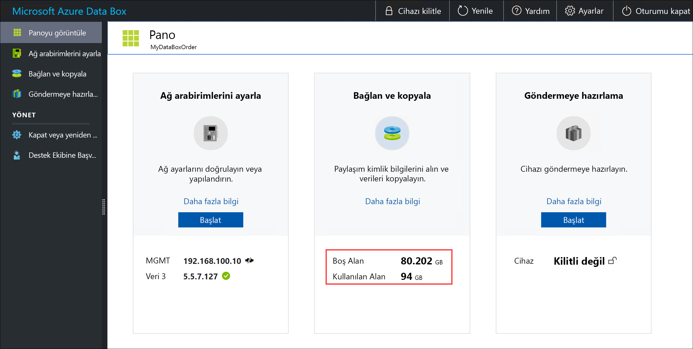
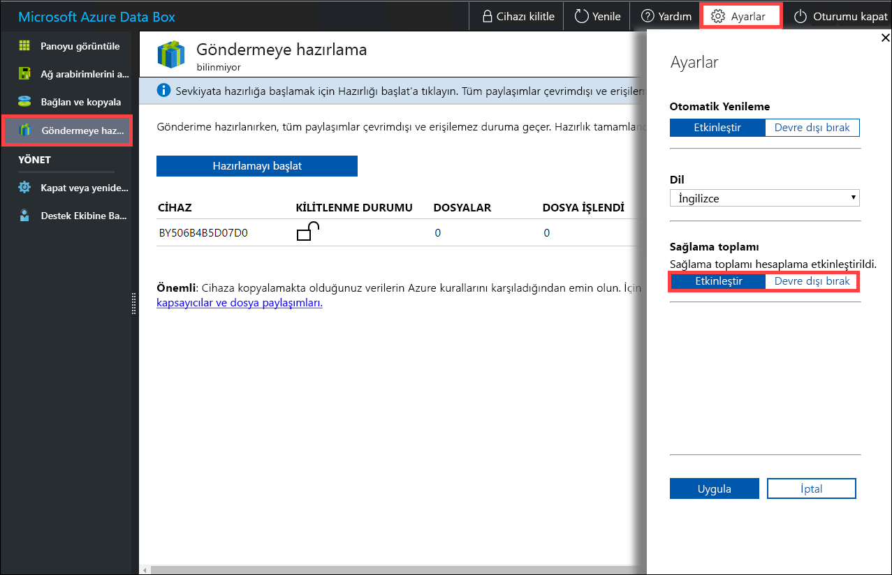

# <a name="use-the-local-web-ui-to-administer-your-data-box-and-data-box-heavy"></a>Data Box ve Data Box Heavy yönetmek için yerel Web Kullanıcı arabirimini kullanın

Bu makalede Data Box ve Data Box Heavy cihazlarda gerçekleştirilen yapılandırma ve yönetim görevlerinin bazıları açıklanmaktadır. Azure portal Kullanıcı arabirimi ve cihaz için yerel Web Kullanıcı arabirimi aracılığıyla Data Box ve Data Box Heavy cihazlarını yönetebilirsiniz. Bu makale, yerel Web Kullanıcı arabirimi kullanılarak gerçekleştirilen görevlere odaklanır.

Data Box için yerel Web Kullanıcı arabirimi ve Data Box Heavy için, cihazın ilk yapılandırması için kullanılır. Ayrıca, yerel Web Kullanıcı arabirimini kullanarak cihazı kapatabilir veya yeniden başlatabilir, tanılama testlerini çalıştırabilir, yazılımı güncelleştirebilir, kopyalama günlüklerini görüntüleyebilir, cihazdan yerel verileri silebilir ve Microsoft Desteği için bir destek paketi oluşturabilirsiniz. İki bağımsız düğüm içeren bir Data Box Heavy cihazda, cihazın her bir düğümüne karşılık gelen iki ayrı yerel Web 'e erişebilirsiniz.

## <a name="generate-support-package"></a>Destek paketi oluşturma

Cihaz sorunları yaşarsanız, sistem günlüklerinden bir Destek paketi oluşturabilirsiniz. Microsoft Destek sorunu gidermek için bu paketi kullanır.

Bir destek paketi oluşturmak için aşağıdaki adımları uygulayın:

1. Yerel Web Kullanıcı arabiriminde **desteğe başvurun** sayfasına gidin. İsteğe bağlı olarak, **bellek dökümlerini içer**' i seçin Ardından **destek paketi oluştur**' u seçin.

    Bellek dökümü, cihazınızın belleğinin, sistem hatasından sonra kaydedilen içeriğidir.

    Destek bir tane istemediği müddetçe **bellek dökümleri dahil etme** seçeneğini seçemezsiniz. Bellek dökümleri içeren bir destek paketinin toplanması uzun zaman alır ve hassas veriler dahil edilir.

    

    Bir Destek paketi toplanır. Yalnızca sistem günlüklerini eklerseniz, bu işlem birkaç dakika sürer. Bellek dökümlerini eklerseniz çok daha uzun sürer.

    

2. Destek paketini oluşturma işlemi tamamlandıktan sonra **destek paketini indir**' i seçin.

    

3. İndirme konumuna göz atıp konumu seçin. İçeriği görüntülemek için klasörü açın.

    

## <a name="erase-local-data-from-your-device"></a>Cihazınızdaki yerel verileri silme

Yerel Web Kullanıcı arabirimini kullanarak, Azure veri merkezine döndürmeden önce cihazınızdaki yerel verileri silebilirsiniz.

> [!IMPORTANT]
> Veri silme geri alınamaz. Cihazınızdaki yerel verileri silmeden önce, dosyaları yedeklediğinizden emin olun.

Cihazınızdaki yerel verileri silmek için şu adımları uygulayın:

1. Yerel Web Kullanıcı arabiriminde, **veri silme**' ye gidin.
2. Cihaz parolasını girip **verileri Sil**' i seçin.

    

3. Onay isteminde, devam etmek için **Evet** ' i seçin. Veri silme, 50 dakika kadar sürebilir.

   Cihazdan silmeden önce yerel verilerinizi yedeklediğinizden emin olun. Veri silme geri alınamaz.

    

## <a name="shut-down-or-restart-your-device"></a>Cihazınızı kapatma ya da yeniden başlatma

Yerel Web Kullanıcı arabirimini kullanarak cihazınızı kapatabilir veya yeniden başlatabilirsiniz. Yeniden başlatmadan önce, ana bilgisayar ve ardından cihaz üzerindeki paylaşımları çevrimdışına almanız önerilir. Bunun yapılması, veri bozulması olasılığını en aza indirir. Cihazı kapatırken veri kopyasının devam etmediğinden emin olun.

Cihazınızı kapatmak için aşağıdaki adımları uygulayın.

1. Yerel web kullanıcı arabiriminde **Kapat ya da yeniden başlat**'a gidin.

2. **Kapat ' ı** seçin.

    

3. Onay sorulduğunda, devam etmek için **Tamam** ' ı seçin.

    

Cihaz kapatıldıktan sonra cihazı açmak için ön paneldeki güç düğmesini kullanın.

Data Box'ınızı yeniden başlatmak için aşağıdaki adımları gerçekleştirin.

1. Yerel web kullanıcı arabiriminde **Kapat ya da yeniden başlat**'a gidin.
2. **Yeniden Başlat**' ı seçin.

    

3. Onay sorulduğunda, devam etmek için **Tamam** ' ı seçin.

   Cihaz kapatılır ve sonra yeniden başlatır.

## <a name="download-bom-or-manifest-files"></a>BOM veya manifest dosyalarını indirin

BOM veya manifest dosyaları, Data Box veya Data Box Heavy kopyalanan dosyaların listesini içerir. Bu dosyalar, cihazı sevk edilecek şekilde hazırlarken bir içeri aktarma sırası için oluşturulur.

Başlamadan önce, içeri aktarma siparişiniz için BOM veya manifest dosyalarını indirmek üzere aşağıdaki adımları izleyin:

1. Cihazınız için yerel Web Kullanıcı arabirimine gidin. Cihazınızın **göndermeye hazırlama** adımını tamamladığını doğrulayın. Cihaz hazırlığı tamamlandığında, cihazınızın durumu **Sevkiyat Için hazırlık** olarak görüntülenir.

    

2. Data Box kopyalanan dosyaların listesini indirmek için **dosya listesini indir** ' i seçin.

    <!--  -->

3. Dosya Gezgini 'nde, cihaza bağlanmak için kullanılan protokole ve kullanılan Azure depolama türüne bağlı olarak dosyaların ayrı listeleri oluşturulur.

    <!--  -->
    

   Aşağıdaki tabloda, dosya adları Azure depolama türü ve kullanılan bağlantı protokolü ile eşlenir.

    |Dosya adı  |Azure depolama türü  |Kullanılan bağlantı protokolü |
    |---------|---------|---------|
    |utSAC1_202006051000_BlockBlob-BOM.txt     |Blok blobları         |SMB/NFS         |
    |utSAC1_202006051000_PageBlob-BOM.txt     |Sayfa blobları         |SMB/NFS         |
    |utSAC1_202006051000_AzFile-BOM.txt    |Azure Dosyaları         |SMB/NFS         |
    |utsac1_PageBlock_Rest-BOM.txt     |Sayfa blobları         |REST        |
    |utsac1_BlockBlock_Rest-BOM.txt    |Blok blobları         |REST         |

Data Box Azure veri merkezine döndüğünde Azure Storage hesabına yüklenen dosyaları doğrulamak için bu listeyi kullanın. Örnek bir bildirim dosyası aşağıda gösterilmiştir.

> [!NOTE]
> Data Box Heavy, cihazdaki iki düğüme karşılık gelen dosya listesi (BOM dosyaları) kümesi vardır.

```xml
<file size="52689" crc64="0x95a62e3f2095181e">\databox\media\data-box-deploy-copy-data\prepare-to-ship2.png</file>
<file size="22117" crc64="0x9b160c2c43ab6869">\databox\media\data-box-deploy-copy-data\connect-shares-file-explorer2.png</file>
<file size="57159" crc64="0x1caa82004e0053a4">\databox\media\data-box-deploy-copy-data\verify-used-space-dashboard.png</file>
<file size="24777" crc64="0x3e0db0cd1ad438e0">\databox\media\data-box-deploy-copy-data\prepare-to-ship5.png</file>
<file size="162006" crc64="0x9ceacb612ecb59d6">\databox\media\data-box-cable-options\cabling-dhcp-data-only.png</file>
<file size="155066" crc64="0x051a08d36980f5bc">\databox\media\data-box-cable-options\cabling-2-port-setup.png</file>
<file size="150399" crc64="0x66c5894ff328c0b1">\databox\media\data-box-cable-options\cabling-with-switch-static-ip.png</file>
<file size="158082" crc64="0xbd4b4c5103a783ea">\databox\media\data-box-cable-options\cabling-mgmt-only.png</file>
<file size="148456" crc64="0xa461ad24c8e4344a">\databox\media\data-box-cable-options\cabling-with-static-ip.png</file>
<file size="40417" crc64="0x637f59dd10d032b3">\databox\media\data-box-portal-admin\delete-order1.png</file>
<file size="33704" crc64="0x388546569ea9a29f">\databox\media\data-box-portal-admin\clone-order1.png</file>
<file size="5757" crc64="0x9979df75ee9be91e">\databox\media\data-box-safety\japan.png</file>
<file size="998" crc64="0xc10c5a1863c5f88f">\databox\media\data-box-safety\overload_tip_hazard_icon.png</file>
<file size="5870" crc64="0x4aec2377bb16136d">\databox\media\data-box-safety\south-korea.png</file>
<file size="16572" crc64="0x05b13500a1385a87">\databox\media\data-box-safety\taiwan.png</file>
<file size="999" crc64="0x3f3f1c5c596a4920">\databox\media\data-box-safety\warning_icon.png</file>
<file size="1054" crc64="0x24911140d7487311">\databox\media\data-box-safety\read_safety_and_health_information_icon.png</file>
<file size="1258" crc64="0xc00a2d5480f4fcec">\databox\media\data-box-safety\heavy_weight_hazard_icon.png</file>
<file size="1672" crc64="0x4ae5cfa67c0e895a">\databox\media\data-box-safety\no_user_serviceable_parts_icon.png</file>
<file size="3577" crc64="0x99e3d9df341b62eb">\databox\media\data-box-safety\battery_disposal_icon.png</file>
<file size="993" crc64="0x5a1a78a399840a17">\databox\media\data-box-safety\tip_hazard_icon.png</file>
<file size="1028" crc64="0xffe332400278f013">\databox\media\data-box-safety\electrical_shock_hazard_icon.png</file>
<file size="58699" crc64="0x2c411d5202c78a95">\databox\media\data-box-deploy-ordered\data-box-ordered.png</file>
<file size="46816" crc64="0x31e48aa9ca76bd05">\databox\media\data-box-deploy-ordered\search-azure-data-box1.png</file>
<file size="24160" crc64="0x978fc0c6e0c4c16d">\databox\media\data-box-deploy-ordered\select-data-box-option1.png</file>
<file size="115954" crc64="0x0b42449312086227">\databox\media\data-box-disk-deploy-copy-data\data-box-disk-validation-tool-output.png</file>
<file size="6093" crc64="0xadb61d0d7c6d4deb">\databox\data-box-cable-options.md</file>
<file size="6499" crc64="0x080add29add367d9">\databox\data-box-deploy-copy-data-via-nfs.md</file>
<file size="11089" crc64="0xc3ce6b13a4fe3001">\databox\data-box-deploy-copy-data-via-rest.md</file>
<file size="9126" crc64="0x820856b5a54321ad">\databox\data-box-overview.md</file>
<file size="10963" crc64="0x5e9a14f9f4784fd8">\databox\data-box-safety.md</file>
<file size="5941" crc64="0x8631d62fbc038760">\databox\data-box-security.md</file>
<file size="12536" crc64="0x8c8ff93e73d665ec">\databox\data-box-system-requirements-rest.md</file>
<file size="3220" crc64="0x7257a263c434839a">\databox\data-box-system-requirements.md</file>
<file size="2823" crc64="0x63db1ada6fcdc672">\databox\index.yml</file>
<file size="4364" crc64="0x62b5710f58f00b8b">\databox\data-box-local-web-ui-admin.md</file>
<file size="3603" crc64="0x7e34c25d5606693f">\databox\TOC.yml</file>
```

Bu dosya, Data Box veya Data Box Heavy kopyalanan tüm dosyaların listesini içerir. Bu dosyada, *crc64* değeri karşılık gelen dosya için oluşturulan sağlama toplamıyla ilgilidir.

## <a name="view-available-capacity-of-the-device"></a>Cihazın kullanılabilir kapasitesini görüntüleme

Cihazın kullanılabilir ve kullanılan kapasitesini görüntülemek için cihaz panosunu kullanabilirsiniz.

1. Yerel web kullanıcı arabiriminde **Panoyu görüntüle**'ye gidin.
2. **Bağlan ve kopyala**'nın altında cihazdaki boş ve kullanılan alan gösterilir.

    

## <a name="skip-checksum-validation"></a>Sağlama toplamı doğrulamasını atlama

Teslim için hazırlanırken, verileriniz için sağlama toplamı varsayılan olarak oluşturulur. Bazı ender durumlarda, veri türüne (küçük dosya boyutları) bağlı olarak performans yavaş olabilir. Bu gibi durumlarda sağlama toplamını atlayabilirsiniz.

Gönderim hazırlığı sırasında sağlama toplamı hesaplaması yalnızca içeri aktarma siparişleri için yapılır ve dışa aktarma siparişleri için yapılır.

Performans ciddi bir şekilde etkilenmediği takdirde sağlama toplamını devre dışı bırakmamanızı kesinlikle öneririz.

1. Cihazınızın yerel Web Kullanıcı arabiriminin sağ üst köşesinde **Ayarlar**' a gidin.

    

2. Sağlama toplamı doğrulamasını **Devre dışı bırakma**
3. **Uygula**’yı seçin.

> [!NOTE]
> Sağlama toplamı hesaplamayı Atla seçeneği yalnızca Azure Data Box kilidi açıldığında kullanılabilir. Cihaz kilitlendiğinde bu seçeneği görmezsiniz.

## <a name="enable-smb-signing"></a>SMB imzalamayı etkinleştir

Sunucu ileti bloğu (SMB) imzalama, SMB kullanan iletişimin paket düzeyinde dijital olarak imzalanmasına yönelik bir özelliktir. Bu imzalama, geçiş sırasında SMB paketlerini değiştiren saldırıları engeller.

SMB imzalama ile ilgili daha fazla bilgi için bkz. [sunucu Ileti bloğu Imzalamaya genel bakış](https://support.microsoft.com/help/887429/overview-of-server-message-block-signing).

Azure cihazınızda SMB imzalamayı etkinleştirmek için:

1. Cihazınızın yerel Web Kullanıcı arabiriminin sağ üst köşesinde **Ayarlar**' ı seçin.

    

2. **Etkinleştir** SMB Imzalama.

    

3. **Uygula**’yı seçin.
4. Yerel web kullanıcı arabiriminde **Kapat ya da yeniden başlat**'a gidin.
5. **Yeniden Başlat**' ı seçin.

## <a name="enable-backup-operator-privileges"></a>Yedekleme Işletmeni ayrıcalıklarını etkinleştir

Web Kullanıcı arabirimi kullanıcılarınız varsayılan olarak SMB paylaşımlarında yedekleme Işletmeni ayrıcalıklarına sahiptir. Bunu istemiyorsanız, ayrıcalıkları devre dışı bırakmak veya etkinleştirmek için **geri dönüş işleci ayrıcalıklarını etkinleştir** ' i kullanın.

Bilgi için bkz. [Active Directory güvenlik gruplarında](/windows/security/identity-protection/access-control/active-directory-security-groups#backup-operators)yedekleme işleçleri.

Azure cihazınızda yedekleme Işletmeni ayrıcalıklarını etkinleştirmek için:

1. Cihazınızın yerel Web Kullanıcı arabiriminin sağ üst köşesinde **Ayarlar**' ı seçin.

   

2. **Etkinleştir** Yedekleme Işletmeni ayrıcalıkları.

   

3. **Uygula**' yı seçin.
4. Yerel web kullanıcı arabiriminde **Kapat ya da yeniden başlat**'a gidin.
5. **Yeniden Başlat**' ı seçin.

## <a name="enable-acls-for-azure-files"></a>Azure dosyaları için ACL 'Leri etkinleştirme

Kullanıcılar Data Box SMB aracılığıyla verileri karşıya yüklerken, dosyalardaki meta veriler varsayılan olarak aktarılır. Meta veriler, erişim denetim listeleri (ACL 'Ler), dosya öznitelikleri ve zaman damgaları içerir. Bunu istemiyorsanız, bu özelliği devre dışı bırakmak veya etkinleştirmek için **Azure dosyaları Için ACL 'leri** kullanın.

<!--For more information about metadata that is transferred, see [Preserving the ACLs and metadata with Azure Data Box](./data-box-local-web-ui-admin.md#enable-backup-operator-privileges) - IN DEVELOPMENT-->

> [!Note]
> Meta verileri dosyalarla aktarmak için bir yedekleme Işletmeni olmanız gerekir. Bu özelliği kullandığınızda, Web Kullanıcı arabiriminin yerel kullanıcılarının yedekleme Işleçleri olduğundan emin olun. Bkz. [yedekleme işletmeni ayrıcalıklarını etkinleştirme](#enable-backup-operator-privileges).

Azure dosyaları için ACL 'lerin aktarılmasını etkinleştirmek için:

1. Cihazınızın yerel Web Kullanıcı arabiriminin sağ üst köşesinde **Ayarlar**' ı seçin.

    

2. **Etkinleştir** Azure dosyaları için ACL 'Ler.

     
  
3. **Uygula**’yı seçin.
4. Yerel web kullanıcı arabiriminde **Kapat ya da yeniden başlat**'a gidin.
5. **Yeniden Başlat**' ı seçin.

## <a name="enable-tls-11"></a>TLS 1,1 'yi etkinleştirme

Varsayılan olarak, Azure Data Box, TSL 1,1 ' den daha güvenli olduğundan şifreleme için Aktarım Katmanı Güvenliği (TLS) 1,2 kullanır. Ancak, veya istemcileriniz TLS 1,2 desteklemeyen verilere erişmek için bir tarayıcı kullanıyorsa, TLS 1,1 ' i etkinleştirebilirsiniz.

TLS ile ilgili daha fazla bilgi için bkz. [Azure Data Box Gateway Security](../databox-gateway/data-box-gateway-security.md).

Azure cihazınızda TLS 1,1 ' i etkinleştirmek için:

1. Cihazınızın yerel Web Kullanıcı arabiriminin sağ üst köşesinde **Ayarlar**' ı seçin.

    

2. **Etkinleştir** TLS 1,1.

    

3. **Uygula**’yı seçin.
4. Yerel web kullanıcı arabiriminde **Kapat ya da yeniden başlat**'a gidin.
5. **Yeniden Başlat**' ı seçin.

## <a name="next-steps"></a>Sonraki adımlar

- [Azure Portal aracılığıyla Data Box ve Data Box Heavy yönetmeyi](data-box-portal-admin.md)öğrenin.
