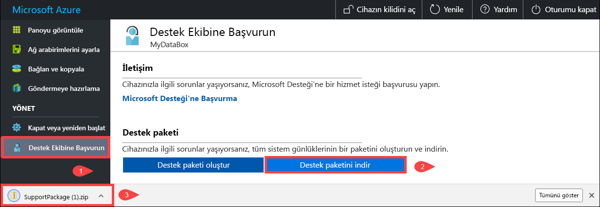
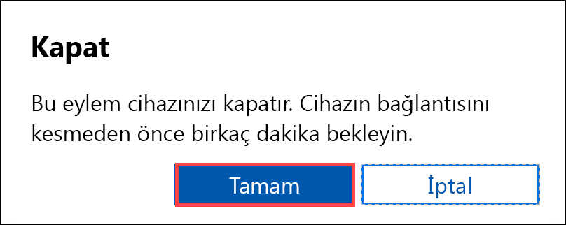

# <a name="use-the-local-web-ui-to-administer-your-data-box-and-data-box-heavy"></a>Data Box ve da veri kutusu ağır yönetmek için yerel web kullanıcı arabirimini kullanın

Bu makalede Data Box ve veri kutusu ağır cihazlarda gerçekleştirilebilir yapılandırma ve yönetim görevlerinin bazılarını açıklar. Azure portal kullanıcı Arabirimi aracılığıyla Data Box ve veri kutusu ağır cihazlar ve cihazın yerel web kullanıcı Arabirimi yönetebilirsiniz. Bu makale, yerel web kullanıcı arabirimini kullanarak gerçekleştirebileceğiniz görevlere odaklanmaktadır.

Cihaz için başlangıç yapılandırmasını yerel web kullanıcı Arabirimi Data Box ve veri kutusu ağır için kullanılır. Yerel web kullanıcı Arabirimi, kapatma veya cihazı yeniden başlatmak, tanılama sınamaları çalıştırın, yazılım güncelleştirme, kopyalama günlüklerini görüntülemek ve Microsoft Support bir günlük paketi oluşturmak için de kullanabilirsiniz. İki bağımsız düğüm ile veri kutusu ağır bir cihazda cihaz her düğüme karşılık gelen iki ayrı bir yerel web kullanıcı arabirimleri erişebilirsiniz.

Bu makale aşağıdaki öğreticileri içerir:

- Destek paketi oluşturma
- Cihazınızı kapatma ya da yeniden başlatma
- BOM indirin veya bildirim dosyaları
- Cihazın kullanılabilir kapasitesini görüntüleme
- Sağlama toplamı doğrulamasını atlama

## <a name="generate-support-package"></a>Destek paketi oluşturma

Cihaz sorunları yaşarsanız, sistem günlüklerinden bir Destek paketi oluşturabilirsiniz. Microsoft Destek sorunu gidermek için bu paketi kullanır. Destek paketi oluşturmak için aşağıdaki adımları uygulayın:

1. Yerel web kullanıcı arabiriminde **Desteğe Başvur**'a gidin ve **Destek paketi oluştur**'a tıklayın.

    

2. Bir Destek paketi toplanır. Bu işlem birkaç dakika sürer.

    

3. Destek paketi oluşturma işlemi tamamlandıktan sonra **Destek paketini indir**'e tıklayın. 

    

4. İndirme konumuna göz atıp konumu seçin. İçeriği görüntülemek için klasörü açın.

    


## <a name="shut-down-or-restart-your-device"></a>Cihazınızı kapatma ya da yeniden başlatma

Kapatabilir veya yerel web kullanıcı arabirimini kullanarak Cihazınızı yeniden başlatın. Cihazı yeniden başlatmadan önce konaktaki paylaşımları sonra da cihazı çevrimdışına almanız önerilir. Bu, veri bozulması olasılığını en aza indirir. Cihazı kapatırken devam eden bir veri kopyalama işlemi olmadığından emin olun.

Cihazı kapatmak için aşağıdaki adımları uygulayın.

1. Yerel web kullanıcı arabiriminde **Kapat ya da yeniden başlat**'a gidin.
2. **Kapat**'a tıklayın.

    

3. Onayınız istendiğinde devam etmek için **Tamam**'a tıklayın.

    

Cihaz kapatıldıktan sonra cihazı açmak için ön paneldeki güç düğmesini kullanın.

Data Box'ınızı yeniden başlatmak için aşağıdaki adımları gerçekleştirin.

1. Yerel web kullanıcı arabiriminde **Kapat ya da yeniden başlat**'a gidin.
2. **Yeniden Başlat**'a tıklayın.

    

3. Onayınız istendiğinde devam etmek için **Tamam**'a tıklayın.

   Cihaz kapatılır ve sonra yeniden başlatır.

## <a name="download-bom-or-manifest-files"></a>BOM indirin veya bildirim dosyaları

Fatura, malzeme (BOM) veya bildirim dosyaları Data Box veya veri kutusu ağır kopyalanan dosyaların listesini içerir. Cihazı göndermeye hazırlayın, bu dosyalar üretilir.

Başlamadan önce cihazınızın tamamlanmış olduğundan emin olun **göndermeye hazırlama** adım. BOM indirin veya bildirim dosyaları için aşağıdaki adımları izleyin:

1. Cihazınızın yerel web kullanıcı Arabirimi gidin. Cihazı göndermeye hazırlama tamamlandığını görürsünüz. Cihaz hazırlığı tamamlandıktan sonra cihaz durumu olarak görüntülenir **gönderilmeye hazır**.

    

2. Tıklayın **dosyaları karşıdan yükleme listesi** kopyalanan Data Box'ınızı dosyaları listesini indirme.

    

3. Dosya Gezgini'nde, dosyaları ayrı listesini görürsünüz. cihaza bağlanmak için kullanılan protokol ve kullanılan Azure depolama türüne bağlı olarak oluşturulur.

    

   Aşağıdaki tabloda, Azure depolama türü ve kullanılan bağlantı protokol dosya adlarını eşler.

    |Dosya adı  |Azure depolama türü  |Kullanılan bağlantı protokolü |
    |---------|---------|---------|
    |databoxe2etest_BlockBlob.txt     |Blok blobları         |SMB/NFS         |
    |databoxe2etest_PageBlob.txt     |Sayfa blobları         |SMB/NFS         |
    |databoxe2etest_AzFile BOM.txt    |Azure Dosyaları         |SMB/NFS         |
    |databoxe2etest_PageBlock_Rest BOM.txt     |Sayfa blobları         |REST        |
    |databoxe2etest_BlockBlock_Rest BOM.txt    |Blok blobları         |REST         |
    |mydbmdrg1_MDisk BOM.txt    |Yönetilen Disk         |SMB/NFS         |
    |mydbmdrg2_MDisk BOM.txt     |Yönetilen Disk         |SMB/NFS         |

Data Box, Azure veri merkezi IP'sine döndükten sonra Azure depolama hesabına yüklenmiş dosyalarını doğrulamak için bu listeyi kullanın. Bir örnek bildirim dosyası aşağıda gösterilmiştir.

> [!NOTE]
> Bir veri kutusu yoğun, dosyalarını (BOM) listesini iki kümesini cihazda iki düğüm karşılık gelen yok.

```xml
<file size="52689" crc64="0x95a62e3f2095181e">\databox\media\data-box-deploy-copy-data\prepare-to-ship2.png</file>
<file size="22117" crc64="0x9b160c2c43ab6869">\databox\media\data-box-deploy-copy-data\connect-shares-file-explorer2.png</file>
<file size="57159" crc64="0x1caa82004e0053a4">\databox\media\data-box-deploy-copy-data\verify-used-space-dashboard.png</file>
<file size="24777" crc64="0x3e0db0cd1ad438e0">\databox\media\data-box-deploy-copy-data\prepare-to-ship5.png</file>
<file size="162006" crc64="0x9ceacb612ecb59d6">\databox\media\data-box-cable-options\cabling-dhcp-data-only.png</file>
<file size="155066" crc64="0x051a08d36980f5bc">\databox\media\data-box-cable-options\cabling-2-port-setup.png</file>
<file size="150399" crc64="0x66c5894ff328c0b1">\databox\media\data-box-cable-options\cabling-with-switch-static-ip.png</file>
<file size="158082" crc64="0xbd4b4c5103a783ea">\databox\media\data-box-cable-options\cabling-mgmt-only.png</file>
<file size="148456" crc64="0xa461ad24c8e4344a">\databox\media\data-box-cable-options\cabling-with-static-ip.png</file>
<file size="40417" crc64="0x637f59dd10d032b3">\databox\media\data-box-portal-admin\delete-order1.png</file>
<file size="33704" crc64="0x388546569ea9a29f">\databox\media\data-box-portal-admin\clone-order1.png</file>
<file size="5757" crc64="0x9979df75ee9be91e">\databox\media\data-box-safety\japan.png</file>
<file size="998" crc64="0xc10c5a1863c5f88f">\databox\media\data-box-safety\overload_tip_hazard_icon.png</file>
<file size="5870" crc64="0x4aec2377bb16136d">\databox\media\data-box-safety\south-korea.png</file>
<file size="16572" crc64="0x05b13500a1385a87">\databox\media\data-box-safety\taiwan.png</file>
<file size="999" crc64="0x3f3f1c5c596a4920">\databox\media\data-box-safety\warning_icon.png</file>
<file size="1054" crc64="0x24911140d7487311">\databox\media\data-box-safety\read_safety_and_health_information_icon.png</file>
<file size="1258" crc64="0xc00a2d5480f4fcec">\databox\media\data-box-safety\heavy_weight_hazard_icon.png</file>
<file size="1672" crc64="0x4ae5cfa67c0e895a">\databox\media\data-box-safety\no_user_serviceable_parts_icon.png</file>
<file size="3577" crc64="0x99e3d9df341b62eb">\databox\media\data-box-safety\battery_disposal_icon.png</file>
<file size="993" crc64="0x5a1a78a399840a17">\databox\media\data-box-safety\tip_hazard_icon.png</file>
<file size="1028" crc64="0xffe332400278f013">\databox\media\data-box-safety\electrical_shock_hazard_icon.png</file>
<file size="58699" crc64="0x2c411d5202c78a95">\databox\media\data-box-deploy-ordered\data-box-ordered.png</file>
<file size="46816" crc64="0x31e48aa9ca76bd05">\databox\media\data-box-deploy-ordered\search-azure-data-box1.png</file>
<file size="24160" crc64="0x978fc0c6e0c4c16d">\databox\media\data-box-deploy-ordered\select-data-box-option1.png</file>
<file size="115954" crc64="0x0b42449312086227">\databox\media\data-box-disk-deploy-copy-data\data-box-disk-validation-tool-output.png</file>
<file size="6093" crc64="0xadb61d0d7c6d4deb">\databox\data-box-cable-options.md</file>
<file size="6499" crc64="0x080add29add367d9">\databox\data-box-deploy-copy-data-via-nfs.md</file>
<file size="11089" crc64="0xc3ce6b13a4fe3001">\databox\data-box-deploy-copy-data-via-rest.md</file>
<file size="9126" crc64="0x820856b5a54321ad">\databox\data-box-overview.md</file>
<file size="10963" crc64="0x5e9a14f9f4784fd8">\databox\data-box-safety.md</file>
<file size="5941" crc64="0x8631d62fbc038760">\databox\data-box-security.md</file>
<file size="12536" crc64="0x8c8ff93e73d665ec">\databox\data-box-system-requirements-rest.md</file>
<file size="3220" crc64="0x7257a263c434839a">\databox\data-box-system-requirements.md</file>
<file size="2823" crc64="0x63db1ada6fcdc672">\databox\index.yml</file>
<file size="4364" crc64="0x62b5710f58f00b8b">\databox\data-box-local-web-ui-admin.md</file>
<file size="3603" crc64="0x7e34c25d5606693f">\databox\TOC.yml</file>
```

Bu dosya, Data Box veya veri kutusu ağır kopyalanan tüm dosyaların listesini içerir. Bu dosyadaki *crc64* karşılık gelen dosyası için sağlama toplamı değeri ilişkili.

## <a name="view-available-capacity-of-the-device"></a>Cihazın kullanılabilir kapasitesini görüntüleme

Cihazın kullanılabilir ve kullanılan kapasitesini görüntülemek için cihaz panosunu kullanabilirsiniz.

1. Yerel web kullanıcı arabiriminde **Panoyu görüntüle**'ye gidin.
2. **Bağlan ve kopyala**'nın altında cihazdaki boş ve kullanılan alan gösterilir.

    

## <a name="skip-checksum-validation"></a>Sağlama toplamı doğrulamasını atlama

Göndermeye hazırlama, sağlama, verileriniz için varsayılan olarak üretilir. (Küçük dosya boyutunu), veri türüne bağlı olarak bazı nadir durumlarda performans yavaş olabilir. Bu gibi durumlarda sağlama toplamını atlayabilirsiniz.

Performans ciddi şekilde etkilenmedikçe sağlama toplamını kesinlikle atlamamanızı öneririz.

1. Yerel web kullanıcı Arabirimi cihazınızın sağ üst köşesinde bulunan, Git **ayarları**.

    

2. Sağlama toplamı doğrulamasını **Devre dışı bırakma**
3. **Uygula**'ya tıklayın.

## <a name="next-steps"></a>Sonraki adımlar

- Bilgi edinmek için nasıl [Data Box ve veri kutusu ağır Azure portalı yönetme](data-box-portal-admin.md).

