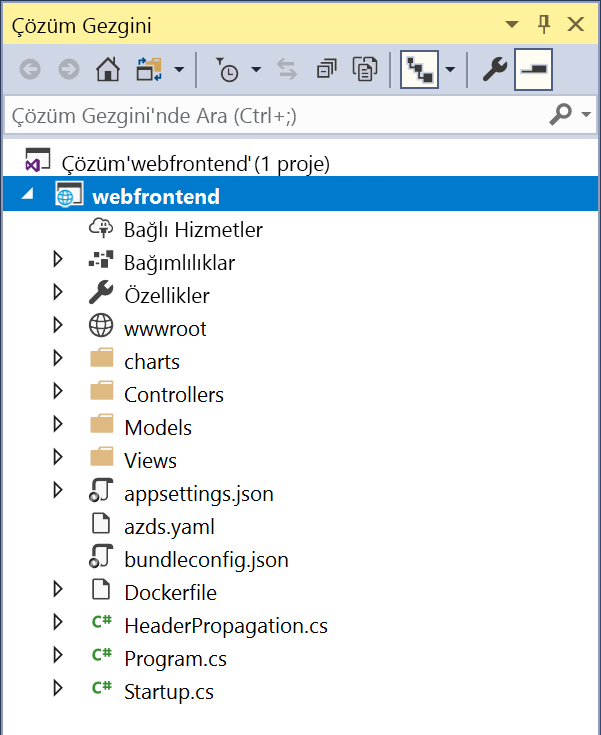

# Hızlı Başlangıç: Azure Dev Spaces ile bir Kubernetes geliştirme alanı oluşturma (.NET Core ve Visual Studio)

Bu kılavuzda şunların nasıl yapıldığını öğreneceksiniz:

- Azure'da yönetilen bir Kubernetes ile Azure Dev Spaces'ı ayarlayın.
- Visual Studio kullanarak kapsayıcılarda yinelemeli kod geliştirin.
- Bu kümede çalıştırılan kodda hata ayıklaması yapın.

> [!Note]
> Herhangi bir zamanda **kilitlenirseniz** [Sorun giderme](troubleshooting.md) bölümüne başvurun veya bu sayfada bir yorum paylaşın. Daha ayrıntılı bir [öğreticiyi](get-started-netcore-visualstudio.md) de deneyebilirsiniz.

## Ön koşullar

- EastUS, WestEurope veya CanadaEast bölgesinde Kubernetes 1.9.6'yı çalıştıran, Http Application Routing etkinleştirilmiş bir Kubernetes kümesi.

  

- Web Geliştirme iş yükünün yüklendiği Visual Studio 2017. Yüklü değilse, [buradan](https://aka.ms/vsdownload?utm_source=mscom&utm_campaign=msdocs) indirin.

## Azure Dev Spaces'i ayarlama

[Azure Dev Spaces için Visual Studio uzantısını](https://aka.ms/get-azds-visualstudio) yükleyin.

## Kümeye bağlanma

Ardından, Azure Dev Spaces için bir proje oluşturur ve yapılandırırsınız.

### ASP.NET web uygulaması oluşturma

Visual Studio 2017’de yeni bir proje oluşturun. Şu anda, projenin bir **ASP.NET Core Web Uygulaması** olması gerekir. Projeyi **webfrontend** olarak adlandırın.

**Web Uygulaması (Model-Görünüm-Denetleyici)** şablonunu seçin ve **.NET Core** ile **ASP.NET Core 2.0**’ı hedeflediğinizden emin olun.

### Azure'da geliştirme alanı oluşturma

Yeni oluşturduğunuz proje açıkken, aşağıda gösterildiği gibi başlatma ayarları açılır listesinden **Azure Dev Spaces** seçeneğini belirleyin.

Daha sonra gösterilen iletişim kutusunda, uygun hesapla oturum açtığınızdan emin olun ve ardından mevcut bir kümeyi seçin.

**Alan** açılır listesini şimdilik ayarlanmış olduğu `default` değerinde bırakın. Web uygulamasına bir genel uç noktadan erişilebilmesi için **Genel Erişime Açık** onay kutusunu işaretleyin.

Kümeyi seçmek veya oluşturmak için **Tamam**’a tıklayın.

Azure Dev Spaces ile çalışacak şekilde yapılandırılmamış bir küme seçerseniz, yapılandırmak isteyip istemediğinizi soran bir ileti görürsünüz.

**Tamam**’ı seçin. 

### Projeye eklenen dosyalara bakın
Geliştirme alanının oluşturulmasını beklerken, Azure Dev Spaces kullanmayı seçmeniz sırasında projenize eklenmiş dosyalara bakın.

- `charts` adlı bir klasörün eklenmiş ve bu klasörün içinde uygulamanız için bir [Helm grafiği](https://docs.helm.sh) oluşturulmuştur. Bu dosyalar, uygulamanızı geliştirme alanına dağıtmak için kullanılır.
- `Dockerfile`, uygulamanızı standart Docker biçiminde paketlemek için gereken bilgileri içerir.
- `azds.yaml`, uygulamaya bir genel uç noktadan erişilip erişilemeyeceği gibi yapılandırma bilgilerini içerir ve geliştirme alanı için gereklidir.

## Kubernetes’te bir kapsayıcının hatalarını ayıklama
Geliştirme alanı başarıyla oluşturulduktan sonra uygulamanızda hata ayıklayabilirsiniz. Kodda bir kesme noktası oluşturun. Örneğin, `Message` değişkeninin ayarlandığı `HomeController.cs` dosyasının 20. satırında. Hata ayıklamaya başlamak için **F5**’e tıklayın. 

Visual Studio, uygulamayı derleyip dağıtmak için geliştirme alanıyla iletişim kurar ve sonra web uygulaması çalışır durumdayken bir tarayıcı açar. Kapsayıcı yerel olarak çalışıyor gibi görünebilir, ancak gerçekte Azure’daki geliştirme ortamında çalışıyordur. Localhost adresinin nedeni, Azure Dev Spaces’in Azure’da çalışan kapsayıcıya geçici bir SSH tüneli oluşturmasıdır.

Kesme noktasını tetiklemek için sayfanın üst kısmındaki **Hakkında** bağlantısına tıklayın. Kodun yerel olarak yürütülmesi durumunda olduğu gibi, çağrı yığını, yerel değişkenler, özel durum bilgileri vb. hata ayıklama bilgilerine tam erişiminiz vardır.

## Sonraki adımlar

> [!div class="nextstepaction"]
> [Birden çok kapsayıcı ve takım geliştirme ile çalışma](get-started-netcore-visualstudio.md#call-another-container)