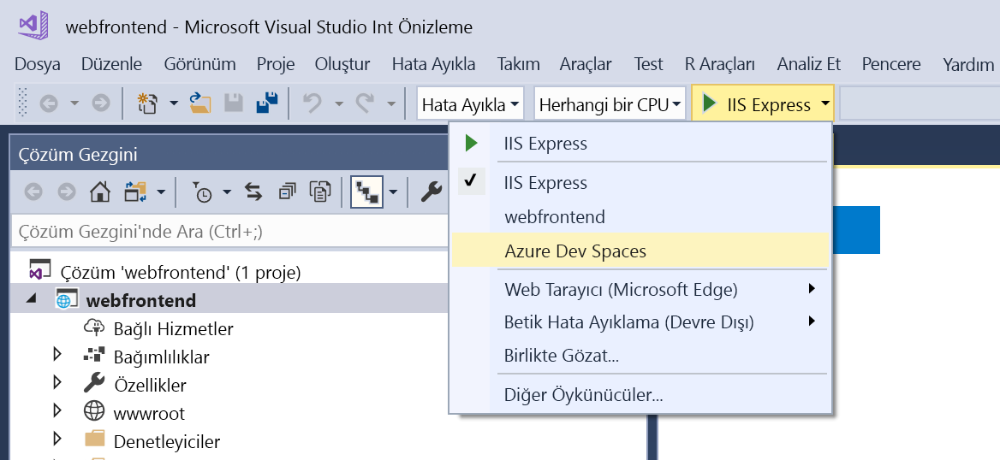

# <a name="quickstart-debug-and-iterate-on-kubernetes-visual-studio--net-core---azure-dev-spaces"></a>Hızlı başlangıç: Kubernetes 'te hata ayıklama ve yineleme: Visual Studio & .NET Core-Azure Dev Spaces

Bu kılavuzda şunların nasıl yapıldığını öğreneceksiniz:

- Azure'da yönetilen bir Kubernetes ile Azure Dev Spaces'ı ayarlayın.
- Visual Studio kullanarak kapsayıcılarda yinelemeli kod geliştirin.
- Visual Studio kullanarak kümenizde çalışan kodda hata ayıklayın.

Azure Dev Spaces ayrıca şunları kullanarak hata ayıklamanıza ve yinelemenize olanak tanır:
- [Java ve Visual Studio Code](quickstart-java.md)
- [Node. js ve Visual Studio Code](quickstart-nodejs.md)
- [.NET Core ve Visual Studio Code](quickstart-netcore.md)

## <a name="prerequisites"></a>Ön koşullar

- Azure aboneliği. Hesabınız yoksa [ücretsiz bir hesap](https://azure.microsoft.com/free) oluşturabilirsiniz.
- Azure geliştirme iş yükü yüklü olan Windows üzerinde Visual Studio 2019. Visual Studio yüklü değilse, [buradan](https://aka.ms/vsdownload?utm_source=mscom&utm_campaign=msdocs)indirin.

## <a name="create-an-azure-kubernetes-service-cluster"></a>Azure Kubernetes hizmet kümesi oluşturma

[Desteklenen bir bölgede][supported-regions]aks kümesi oluşturmanız gerekir. Bir küme oluşturmak için:

1. [Azure Portal](https://portal.azure.com) oturum açın
1. *Kubernetes hizmeti > + kaynak oluştur*' u seçin. 
1. _Abonelik_, _kaynak grubu_, _Kubernetes kümesi adı_, _bölge_, _Kubernetes sürümü_ve _DNS adı ön eki_girin.

    

1. *Gözden geçir ve oluştur*’a tıklayın.
1. *Oluştur*' a tıklayın.

## <a name="enable-azure-dev-spaces-on-your-aks-cluster"></a>AKS kümenizde Azure Dev Spaces etkinleştirme

Azure portal AKS kümenize gidin ve *geliştirme alanları*' na tıklayın. *Geliştirme alanlarını kullan* seçeneğini *Evet* olarak değiştirin ve *Kaydet*' e tıklayın.


## <a name="create-a-new-aspnet-web-app"></a>Yeni bir ASP.NET Web uygulaması oluşturma

1. Visual Studio'yu açın.
1. Yeni bir proje oluşturma.
1. *ASP.NET Core Web uygulaması* ' nı seçin ve *İleri*' ye tıklayın.
1. Projenizin *Web ön uç* adını adlandırın ve *Oluştur*' a tıklayın.
1. İstendiğinde, şablon için *Web uygulaması (Model-View-Controller)* öğesini seçin.
1. En üstteki *.NET Core* ve *2,1 ASP.NET Core* seçin.
1. *Oluştur*' a tıklayın.

## <a name="connect-your-project-to-your-dev-space"></a>Projenizi geliştirme alanınıza bağlayın

Projenizde, aşağıda gösterildiği gibi başlatma ayarları açılır listesinden **Azure dev Spaces** ' yi seçin.



Azure Dev Spaces iletişim kutusunda, *aboneliğinizi* ve *Azure Kubernetes kümenizi*seçin. *Alanı* *varsayılan* olarak ayarlayın ve *herkese açık olarak erişilebilir* onay kutusunu etkinleştirin. *Tamam*'a tıklayın.


Bu işlem, hizmetinizi genel olarak erişilebilen bir URL ile *varsayılan* geliştirme alanına dağıtır. Azure Dev Spaces ile çalışacak şekilde yapılandırılmamış bir küme seçerseniz, yapılandırmak isteyip istemediğinizi soran bir ileti görürsünüz. *Tamam*'a tıklayın.


*Varsayılan* dev alanında çalışan hizmetin genel URL 'si *Çıkış* penceresinde görüntülenir:

```cmd
Starting warmup for project 'webfrontend'.
Waiting for namespace to be provisioned.
Using dev space 'default' with target 'MyAKS'
...
Successfully built 1234567890ab
Successfully tagged webfrontend:devspaces-11122233344455566
Built container image in 39s
Waiting for container...
36s

Service 'webfrontend' port 'http' is available at `http://default.webfrontend.1234567890abcdef1234.eus.azds.io/`
Service 'webfrontend' port 80 (http) is available at http://localhost:62266
Completed warmup for project 'webfrontend' in 125 seconds.
```

Yukarıdaki örnekte, genel URL olur `http://default.webfrontend.1234567890abcdef1234.eus.azds.io/` . 

**Hata Ayıkla** ' yı seçin ve **hata ayıklamayı başlatın**. Birkaç saniye sonra hizmetiniz başlatılır ve Visual Studio, hizmetin genel URL 'sini içeren bir tarayıcı açar. Bir tarayıcı otomatik olarak açılmadığından, bir tarayıcıda hizmetinizin genel URL 'sine gidin ve geliştirme alanınızda çalışan hizmetle etkileşime geçin.

Bu işlem hizmetinize genel erişimi devre dışı bırakmış olabilir. Ortak erişimi etkinleştirmek için, [ *values. YAML*değerindeki giriş değerini][ingress-update]güncelleştirebilirsiniz.

## <a name="update-code"></a>Kodu güncelleştirme

Visual Studio hala geliştirme alanınıza bağlıysa Durdur düğmesine tıklayın. Satır 20 ' sini şu `Controllers/HomeController.cs` şekilde değiştirin:
    
```csharp
ViewData["Message"] = "Your application description page in Azure.";
```

Değişikliklerinizi kaydedin ve **Hata Ayıkla** ' yı seçin ve **hata ayıklamayı başlatın**. Birkaç saniye sonra hizmetiniz başlatılır ve Visual Studio, hizmetin genel URL 'sini içeren bir tarayıcı açar. Bir tarayıcı otomatik olarak açılmadığından, bir tarayıcıda hizmetinizin genel URL 'sine gidin ve *hakkında*' ya tıklayın. Güncelleştirilmiş iletinizin göründüğünü gözlemleyin.

Kod düzenlemeleri her yapıldığında yeni bir kapsayıcı görüntüsünü yeniden oluşturmak ve yeniden dağıtmak yerine, daha hızlı bir düzenleme/hata ayıklama döngüsü sağlamak üzere mevcut kapsayıcı içindeki kodu artımlı olarak yeniden derler Azure Dev Spaces.

## <a name="setting-and-using-breakpoints-for-debugging"></a>Hata ayıklama için kesme noktaları ayarlama ve kullanma

Visual Studio hala geliştirme alanınıza bağlıysa Durdur düğmesine tıklayın. `Controllers/HomeController.cs`İmlecinizi buraya yerleştirmek için açın ve 20. satırda herhangi bir yere tıklayın. Kesme noktası isabet *F9* ayarlamak Için, *Hata Ayıkla* ' ya tıklayın ve ardından *kesme noktasını değiştirin* Uygulamanızı geliştirme alanınızda hata ayıklama modunda başlatmak için *F5* tuşuna basın veya *Hata Ayıkla* ' ya tıkladıktan sonra *hata ayıklamayı başlatın*.

Hizmetinizi bir tarayıcıda açın ve hiçbir ileti görüntülenmediğini unutmayın. Visual Studio 'ya dönün ve 20. satırı vurgulanmıştır. Ayarladığınız kesme noktası, hizmeti 20. satırda duraklattı. Hizmeti sürdürmek için *F5* 'e basın veya *Hata Ayıkla* 'Ya tıkladıktan sonra *devam edin*. Tarayıcınıza geri dönün ve iletinin şimdi görüntülendiğini unutmayın.

Bir hata ayıklayıcı eklenmiş olarak Kubernetes 'de hizmetinizi çalıştırırken, çağrı yığını, yerel değişkenler ve özel durum bilgileri gibi bilgileri hata ayıklamaya yönelik tam erişime sahip olursunuz.

İmlecinizi 20. satıra koyarak ve F9 'a basarak kesme noktasını kaldırın `Controllers/HomeController.cs` . *F9*

## <a name="clean-up-your-azure-resources"></a>Azure kaynaklarınızı Temizleme

Azure portal kaynak grubunuza gidin ve *kaynak grubunu sil*' e tıklayın. Alternatif olarak, [az aks Delete](/cli/azure/aks#az-aks-delete) komutunu kullanabilirsiniz:

```azurecli
az group delete --name MyResourceGroup --yes --no-wait
```

## <a name="next-steps"></a>Sonraki adımlar

> [!div class="nextstepaction"]
> [Birden çok kapsayıcı ve takım geliştirme ile çalışma](multi-service-netcore-visualstudio.md)

[ingress-update]: how-dev-spaces-works-up.md#how-running-your-code-is-configured
[supported-regions]: https://azure.microsoft.com/global-infrastructure/services/?products=kubernetes-service
