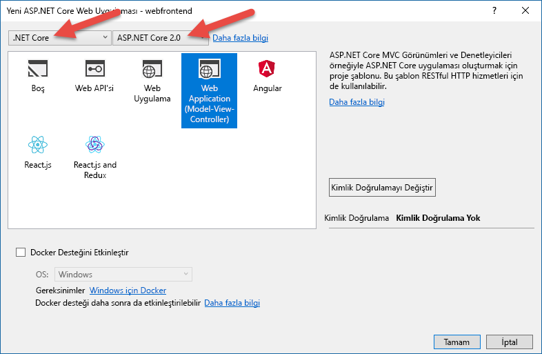

# Hızlı Başlangıç: Azure Dev Spaces ile bir Kubernetes geliştirme ortamı oluşturma (.NET Core ve Visual Studio)

Bu kılavuzda şunların nasıl yapıldığını öğreneceksiniz:

- Azure’da geliştirme için en iyi duruma getirilmiş Kubernetes tabanlı bir ortamı oluşturma.
- Visual Studio kullanarak kapsayıcılarda yinelemeli kod geliştirme.

[!INCLUDE]

[!INCLUDE]

## Visual Studio araçlarını edinme 
1. En [Visual Studio 2017](https://www.visualstudio.com/vs/) sürümünü yükleme
1. Visual Studio yükleyicisinde aşağıdaki İş Yükünün seçili olduğundan emin olun:
    * ASP.NET ve web geliştirme
1. [Azure Dev Spaces için Visual Studio uzantısını](https://aka.ms/get-azds-visualstudio) yükleme

Artık Visual Studio ile bir ASP.NET web uygulaması oluşturmaya hazırsınız.

## ASP.NET web uygulaması oluşturma

Visual Studio 2017’de yeni bir proje oluşturun. Şu anda, projenin bir **ASP.NET Core Web Uygulaması** olması gerekir. Projeyi '**webfrontend**' olarak adlandırın.

**Web Uygulaması (Model-Görünüm-Denetleyici)** şablonunu seçin ve iletişim kutusunun üstündeki iki açılır listede **.NET Core** ve **ASP.NET Core 2.0**’ı hedeflediğinizden emin olun. Projeyi oluşturmak için **Tamam**'a tıklayın.

## Azure’da bir geliştirme ortamı oluşturma

Azure Dev Spaces ile Azure tarafından tam olarak yönetilen ve geliştirme için iyileştirilmiş Kubernetes tabanlı geliştirme ortamları oluşturabilirsiniz. Yeni oluşturduğunuz proje açıkken, aşağıda gösterildiği gibi başlatma ayarları açılır listesinden **Azure Dev Spaces** seçeneğini belirleyin.

Daha sonra gösterilen iletişim kutusunda, uygun hesapla oturum açtığınızdan emin olun ve ardından mevcut bir kümeyi seçin.

**Alan** açılır listesini şimdilik varsayılan `default` değerinde bırakın. Daha sonra bu seçenek hakkında daha fazla bilgi edineceksiniz. Web uygulamasına bir genel uç noktadan erişilebilmesi için **Genel Erişime Açık** onay kutusunu işaretleyin. Bu ayar zorunlu değildir ancak bu kılavuzun sonraki kısımlarında bazı kavramları göstermeye yardımcı olacaktır. Yine de endişelenmeyin, her iki durumda da Visual Studio kullanarak web sitenizde hata ayıklayabilirsiniz.

Kümeyi seçmek veya oluşturmak için **Tamam**’a tıklayın.

Azure Dev Spaces ile çalışacak şekilde yapılandırılmamış bir küme seçerseniz, yapılandırmak isteyip istemediğinizi soran bir ileti görürsünüz.

**Tamam**’ı seçin. 

Bunu gerçekleştirmek için bir arka plan görevi başlatılır. Tamamlanması birkaç dakika sürer. Oluşturma işleminin devam edip etmediğini görmek için, aşağıdaki görüntüde gösterildiği gibi işaretçinizi durum çubuğunun sol alt köşesindeki **Arka plan görevleri** simgesinin üzerine getirin.

> [!Note]
Geliştirme ortamı başarıyla oluşturulana kadar uygulamanızda hata ayıklayamazsınız.

## Projeye eklenen dosyalara bakın
Geliştirme ortamının oluşturulmasını beklerken, bir geliştirme ortamı kullanmayı seçmeniz sırasında projenize eklenmiş dosyalara bakın.

İlk olarak, `charts` adlı bir klasörün eklendiğini ve bu klasörün içinde uygulamanız için bir [Helm grafiği](https://docs.helm.sh) oluşturulduğunu görebilirsiniz. Bu dosyalar, uygulamanızı geliştirme ortamına dağıtmak için kullanılır.

`Dockerfile` adlı bir dosyanın eklendiğini görürsünüz. Bu dosya, uygulamanızı standart Docker biçiminde paketlemek için gereken bilgileri içerir. Bir `HeaderPropagation.cs` dosyası da oluşturulur. Bu dosyayı kılavuzun sonraki bölümlerinde ele alacağız. 

Son olarak, geliştirme ortamı için gereken, uygulamaya bir genel uç noktadan erişilip erişilemeyeceği gibi yapılandırma bilgilerini içeren `azds.yaml` adlı bir dosya görürsünüz.

## Kubernetes’te bir kapsayıcının hatalarını ayıklama
Geliştirme ortamı başarıyla oluşturulduktan sonra uygulamanızda hata ayıklayabilirsiniz. Kodda bir kesme noktası oluşturun. Örneğin, `Message` değişkeninin ayarlandığı `HomeController.cs` dosyasının 20. satırı. Hata ayıklamaya başlamak için **F5**’e tıklayın. 

Visual Studio, uygulamayı derleyip dağıtmak için geliştirme ortamıyla iletişim kurar ve sonra web uygulaması çalışır durumdayken bir tarayıcı açar. Kapsayıcı yerel olarak çalışıyor gibi görünebilir, ancak gerçekte Azure’daki geliştirme ortamında çalışıyordur. Localhost adresinin nedeni, Azure Dev Spaces’in Azure’da çalışan kapsayıcıya geçici bir SSH tüneli oluşturmasıdır.

Kesme noktasını tetiklemek için sayfanın üst kısmındaki **Hakkında** bağlantısına tıklayın. Kodun yerel olarak yürütülmesi durumunda olduğu gibi, çağrı yığını, yerel değişkenler, özel durum bilgileri vb. hata ayıklama bilgilerine tam erişiminiz vardır.

## Sonraki adımlar

> [!div class="nextstepaction"]
> [Birden çok kapsayıcı ve takım geliştirme ile çalışma](get-started-netcore-visualstudio.md#call-another-container)