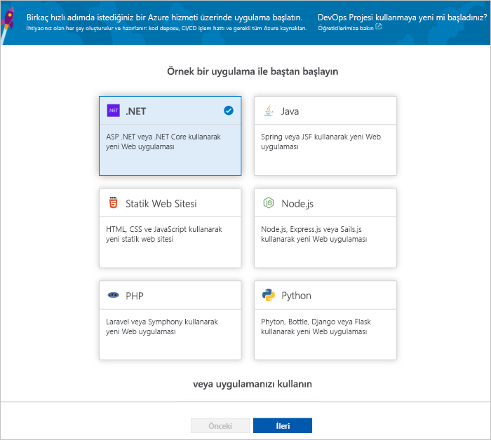
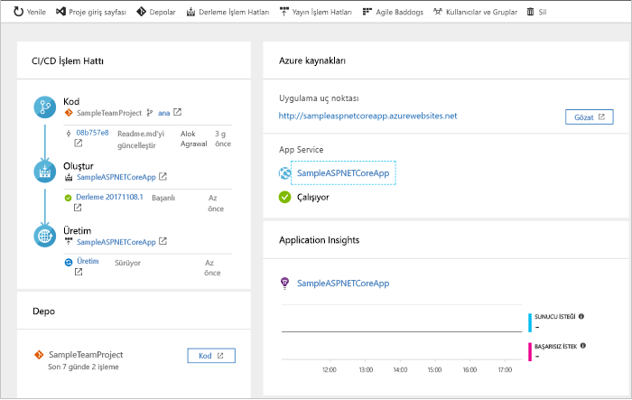

# Azure DevOps Projeleri ile .NET için BIR CI/CD ardışık

.NET çekirdek veya ASP.NET uygulamanız için DevOps Projects ile sürekli tümleştirme (CI) ve sürekli teslimat (CD) yapılandırın. DevOps Projects, Azure Ardışık Hatları'nda bir yapı ve sürüm ardışık hattının ilk yapılandırmasını basitleştirir.

Azure aboneliğiniz yoksa, [Visual Studio Dev Essentials](https://visualstudio.microsoft.com/dev-essentials/) üzerinden ücretsiz edinebilirsiniz.

## Azure portalında oturum açın

DevOps Projects, Azure DevOps'te bir CI/CD ardışık hattı oluşturur. Yeni bir Azure DevOps kuruluşu oluşturabilir veya varolan bir kuruluş kullanabilirsiniz. DevOps Projects, seçtiğiniz Azure aboneliğinde Azure kaynakları da oluşturur.

1. Microsoft Azure [portalında](https://portal.azure.com)oturum açın.

1. Sol bölmede, sol gezinti çubuğunda bir kaynak simgesi **oluştur'u** seçin ve ardından **DevOps Projeleri'ni**arayın.  

3.  **Oluştur'u**seçin.

    

## Örnek uygulama ve Azure hizmeti seçme

1. **.NET** örnek uygulamasını seçin. .NET örnekleri açık kaynaklı ASP.NET çerçevesi ya da çoklu platform .NET Core çerçevesi seçeneklerinden birini içerir.

   

2. Bu örnek bir ASP.NET Core MVC uygulamasıdır. **.NET Core** uygulama çerçevesini seçin ve **ardından İleri'yi**seçin.    
    
3. Dağıtım hedefi olarak **Windows Web App'i** seçin ve **ardından İleri'yi**seçin. İsteğe bağlı olarak, dağıtımınız için diğer Azure hizmetlerini seçebilirsiniz. Daha önce seçtiğiniz uygulama çerçevesi, azure hizmet dağıtım hedefinin türünü burada kullanılabilir olarak belirler.

## Azure DevOps'leri ve Azure aboneliğini yapılandırma 

1. Proje **adı**girin.

2. Yeni bir ücretsiz **Azure DevOps Organizasyonu** oluşturun veya açılır kaynaktan varolan bir kuruluş seçin.

3. Azure **Aboneliğinizi**seçin, Web **uygulamanız** için bir ad girin veya varsayılan ı alın, ardından **Bitti'yi**seçin. Birkaç dakika sonra, DevOps Projeleri Dağıtıma Genel Bakış Azure portalında görüntülenir. 

4. DevOps Project panosunu görüntülemek **için kaynağa git'i** seçin. Sağ üst köşede, hızlı erişim için **Proje'yi** panonuza sabitle. Azure **DevOps Kuruluşunuzdaki**bir repo'da örnek bir uygulama ayarlanır. Bir yapı yürütülür ve uygulamanız Azure'a dağıtılır.

5. Pano, kod repo'nuzda, CI/CD ardınızda ve Azure'daki uygulamanızda görünürlük sağlar. Sağdaki Azure kaynaklarının altında, çalışan uygulamanızı görüntülemek için **Gözat'ı** seçin.

    

## Kod değişikliklerini işleme ve CI/CD’yi yürütme

DevOps Projects, Azure Repos veya GitHub'da bir Git deposu oluşturdu. Depoyu görüntülemek ve uygulamanızda kod değişiklikleri yapmak için aşağıdakileri yapın:

1. DevOps Projeleri panosunun solunda **ana** şubenizin bağlantısını seçin. Bu bağlantı yeni oluşturulan Git deposuna bir görünüm açar.

2. Sonraki birkaç adımda, kod değişikliklerini doğrudan **ana** şubeye işlemek için web tarayıcısını kullanabilirsiniz. Ayrıca, depo sayfasının sağ üst kısmından **Klon'u** seçerek git deponuzu favori IDE'nizde klonlayabilirsiniz. 

3. Solda, uygulama dosyası yapısını **Application/aspnet-core-dotnet-core/Pages/Index.cshtml'e**yönlendirin.

4. **Edit'i**seçin ve ardından h2 başlığında değişiklik yapın. Örneğin, **Azure DevOps Projeleri ile hemen başlayın** yazın veya başka değişiklikler yapın.

      

5. **Commit'i**seçin, yorum bırakın ve yeniden **Commit'i** seçin.

6. Tarayıcınızda Azure DevOps Project panosuna gidin.  Bir derlemenin sürdüğünü görüyor olmanız gerekir. Yaptığınız değişiklikler otomatik olarak oluşturulur ve bir CI/CD boru hattı aracılığıyla dağıtılır.

## CI/CD boru hattını inceleyin

Önceki adımda, Azure DevOps Projeleri otomatik olarak tam bir CI/CD ardışık yapılandırıldı. İşlem hattını gerektiği şekilde keşfedin ve özelleştirin. Azure DevOps yapı ve sürüm boru hatları hakkında bilgi almak için aşağıdaki adımları izleyin.

1. DevOps Projeleri panosunun üst **kısmında, Yapı Boru Hatları'nı**seçin.  
Bu bağlantı bir tarayıcı sekmesi açar ve Azure DevOps yeni projeniz için ardışık hatlar oluşturur.

1. Elipsleri seçin (...).  Bu eylem, yeni bir yapıyı sıraya alma, yapıyı duraklatma ve yapı ardışık düzeneği düzenleme gibi çeşitli etkinlikler başlatabileceğiniz bir menü açar.

1. **Edit'i**seçin.

    

1. Bu bölmede, yapı ardışık hattınız için çeşitli görevleri inceleyebilirsiniz.  
 Yapı, Git deposundan kaynak alma, bağımlılıkları geri getirme ve dağıtımlar için kullanılan çıktıları yayımlama gibi çeşitli görevleri gerçekleştirir.

1. Derleme işlem hattının üst kısmında derleme işlem hattı adı’nı seçin.

1. Yapı ardışık noktanızın adını daha açıklayıcı bir şeyle değiştirin, **& sırasını kaydet'i**seçin ve sonra **Kaydet'i**seçin.

1. Derleme işlem hattı adınızın altında **Geçmiş**’i seçin.   
**Geçmiş** bölmesinde, yapı için son değişikliklerinizin bir denetim izini görürsünüz.  Azure Ardışık Hatları, yapı ardışık yapısında yapılan değişiklikleri izler ve sürümleri karşılaştırmanızı sağlar.

1. **Tetikleyiciler**’i seçin.  
DevOps Projects otomatik olarak bir CI tetikleyicisi oluşturdu ve depoya her taahhüt yeni bir yapı başlatır.  İsteğe bağlı olarak dalları CI işlemine dahil etmeyi veya işlemden hariç tutmayı seçebilirsiniz.

1. **Saklama**’yı seçin.  
Senaryonuza bağlı olarak, belirli sayıda yapıyı tutmak veya kaldırmak için ilkeler belirtebilirsiniz.

1. **Oluştur ve Yayınla'yı**seçin, ardından **Sürümler'i**seçin.  
DevOps Projects, Azure'daki dağıtımları yönetmek için bir sürüm ardışık hattı oluşturur.

1.  Solda, sürüm ardışık ardınızın yanındaki elipsleri (...) seçin ve ardından **Edit'i**seçin.  
Yayın işlem hattı, yayın işlemini tanımlayan bir işlem hattı içerir.  

1. **Yapıtlar**’ın altında **Bırak**’ı seçin.  Önceki adımlarda incelediğiniz derleme işlem hattı, yapıt için kullanılan çıkışı üretir. 

1. **Bırak** simgesinin yanında **Sürekli dağıtım tetikleyicisini**seçin.  
Bu sürüm ardışık alanı, her kullanılabilir yeni yapı artifakı olduğunda dağıtım çalıştıran etkin bir CD tetikleyicisi vardır. İsteğe bağlı olarak, dağıtımlarınızın el ile yürütülmesini gerektirecek şekilde tetikleyiciyi devre dışı kullanabilirsiniz.  

1. Solda, **Görevler'i**seçin.   
Görevler, dağıtım işleminizin gerçekleştirdiği etkinliklerdir. Bu örnekte, Azure Uygulama Hizmetine dağıtmak için bir görev oluşturuldu.

1. Sağda, görünüm **sürümlerini**seçin. Bu görünümde yayın geçmişi gösterilir.

1. Sürümlerinizden birinin yanındaki elipsleri (...) seçin ve ardından **Aç'ı**seçin.  
Sürüm özeti, ilişkili iş öğeleri ve testler gibi keşfedilecek birkaç menü vardır.

1. **İşlemeler**'i seçin.   
Bu görünüm, belirli dağıtımile ilişkili kod işlemelerini gösterir. 

1. **Günlükleri**seçin.  
Günlüklerde, dağıtım işlemiyle ilgili yararlı bilgiler bulunur. Bunlar hem dağıtım sırasında hem de sonrasında görüntülenebilir.

## Kaynakları temizleme

Azure Uygulama Hizmeti'ni ve oluşturduğunuz diğer ilgili kaynakları artık ihtiyacınız olmadığında silebilirsiniz. DevOps Projeleri panosundaki **Sil** işlevini kullanın.

## Sonraki adımlar

Derleme ve yayın işlem hattınızı ekibinizin ihtiyaçlarını karşılayacak şekilde değiştirmeyle ilgili daha fazla bilgi edinmek için bu öğreticiye bakın:

> [!div class="nextstepaction"]
> [CD işlemini özelleştirme](https://docs.microsoft.com/azure/devops/pipelines/release/define-multistage-release-process?view=vsts)

## Videolar

> [!VIDEO https://www.youtube.com/embed/itwqMf9aR0w]
