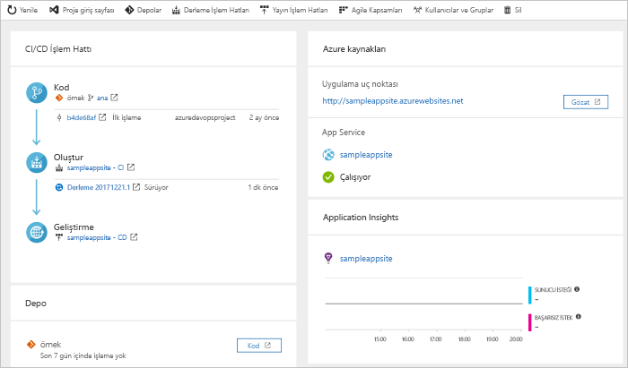

# Azure DevOps Projeleri ile Python için BIR CI/CD ardışık

Bu hızlı başlangıçta, Azure Pipelines'daki Python uygulamanız için sürekli tümleştirme (CI) ve sürekli teslimat (CD) ardışık birimi oluşturmak için basitleştirilmiş Azure DevOps Projeleri deneyimini kullanırsınız. Uygulamanızı geliştirmek, dağıtmak ve izlemek için ihtiyacınız olan her şeyi ayarlamak için Azure DevOps Projelerini kullanabilirsiniz. 

## Ön koşullar

- Etkin bir aboneliği olan bir Azure hesabı. [Ücretsiz bir hesap oluşturun.](https://azure.microsoft.com/free/?ref=microsoft.com&utm_source=microsoft.com&utm_medium=docs&utm_campaign=visualstudio) 
- Azure [DevOps](https://azure.microsoft.com/services/devops/) hesabı ve kuruluşu.

## Azure portalında oturum açın

DevOps Projects, Azure Ardışık Hatları'nda bir CI/CD ardışık alanı oluşturur. Yeni bir Azure DevOps kuruluşu oluşturabilir veya varolan bir kuruluş kullanabilirsiniz. DevOps Projects, seçtiğiniz Azure aboneliğinde Azure kaynakları da oluşturur.

1. [Azure portalında](https://portal.azure.com)oturum açın ve sol bölmede **kaynak oluştur'u**seçin. 

   

1. **DevOps Projelerini**arayın ve seçin ve ardından **Oluştur'u**seçin.

## Örnek uygulama ve Azure hizmeti seçme

1. Python örnek uygulamasını seçin. Python örnekleri birkaç uygulama çerçevesi seçeneği içerir.

1. Varsayılan örnek çerçeve Django’dur. Varsayılan ayarı bırakın ve sonra **İleri'yi**seçin.    
Kapsayıcılar için Web App varsayılan dağıtım hedefidir. Daha önce seçtiğiniz uygulama çerçevesi, burada bulunan Azure hizmet dağıtım hedefitürünü belirler. 

3. Varsayılan hizmeti bırakın ve sonra **İleri'yi**seçin.
 
## Azure DevOps'leri ve Azure aboneliğini yapılandırma 

1. Yeni bir Azure DevOps kuruluşu oluşturun veya var olan bir kuruluşu seçin. 

    a. Azure DevOps'te projeniz için bir ad girin.  

    b. Azure aboneliğinizi ve konumunuzu seçin, uygulamanız için bir ad girin ve ardından **Bitti'yi**seçin.  
     Birkaç dakika sonra proje panosu Azure portalında görüntülenir. Azure DevOps kuruluşunuzdaki bir depoda örnek bir uygulama ayarlanır, bir yapı yürütülür ve uygulamanız Azure'a dağıtılır. Bu pano, kod deponuzda, CI/CD ardınızda ve Azure'daki uygulamanızda görünürlük sağlar.  
    
2. Çalışan uygulamanızı görüntülemek için **Gözat'ı** seçin.

     
    
   DevOps Projects otomatik olarak bir CI yapı ve sürüm tetikleyicisi yapılandırır. Artık en son çalışmanızı web sitenize otomatik olarak dağıtan bir CI/CD işlemi kullanarak Python uygulamasındaki bir ekiple işbirliği yapmaya hazırsınız.

## Kod değişikliklerini işleme ve CI/CD’yi yürütme

 DevOps Projects, Azure Repos veya GitHub'da bir Git deposu oluşturur. Depoyu görüntülemek ve uygulamanızda kod değişiklikleri yapmak için aşağıdakileri yapın: 

1. DevOps Projects panosunun sol tarafında, ana dalınızın bağlantısını seçin.  
        Bu bağlantı yeni oluşturulan Git deposuna bir görünüm açar.

1. Depo kopya URL'sini görüntülemek için tarayıcının sağ üst kısmından **Kopya**’yı seçin.   
Git deponuzu en sevdiğiniz IDE’de kopyalayabilirsiniz.  Sonraki birkaç adımda, kod değişiklikleri yapıp doğrudan ana dala işlemek için web tarayıcısını kullanabilirsiniz.

1. Solda, **app/templates/app/index.html** dosyasına gidin.

1. **Düzenle**’yi seçin ve metnin bir kısmında değişiklik yapın. Örneğin, div etiketlerinden biri için metnin bir kısmını değiştirin.

1. **Commit'i**seçin ve değişikliklerinizi kaydedin.

1. Tarayıcınızda DevOps Projects panosuna gidin.   
    Şimdi devam etmekte olan bir yapı görmeniz gerekir. Az önce yaptığınız değişiklikler otomatik olarak oluşturulur ve bir CI/CD boru hattı aracılığıyla dağıtılır.

## CI/CD boru hattını inceleyin

Önceki adımda, DevOps Projects otomatik olarak tam bir CI/CD ardışık yapılandırıldı. İşlem hattını gerektiği şekilde keşfedin ve özelleştirin. Yapı ve sürüm ardışık hatları hakkında bilgi almak için aşağıdakileri yapın:

1. DevOps Projeleri panosunun üst **kısmında, Yapı Boru Hatları'nı**seçin.  
Tarayıcı sekmesi, yeni projeniz için yapı ardışık hattını görüntüler.

1. **Durum** alanını işaret edin ve sonra **elipsleri** seçin (...).  
        Menü, yeni bir yapıyı sıraya alma, yapıyı duraklatma ve yapı ardışık hattını düzenleme gibi çeşitli seçenekler görüntüler.

1. **Edit'i**seçin.

1. Bu bölmede, yapı ardışık hattınız için çeşitli görevleri inceleyebilirsiniz.  
        Yapı, Git deposundan kaynak alma, bağımlılıkları geri getirme ve dağıtımlar için çıktıyayımyayınlama gibi çeşitli görevleri gerçekleştirir.

1. Derleme işlem hattının üst kısmında derleme işlem hattı adı’nı seçin.

1. Yapı ardışık noktanızın adını daha açıklayıcı bir şeyle değiştirin, **& sırasını kaydet'i**seçin ve sonra **Kaydet'i**seçin.

1. Derleme işlem hattı adınızın altında **Geçmiş**’i seçin.  
        Derleme için yaptığınız son değişikliklere ait denetim kaydını görürsünüz.  Azure DevOps, yapı ardışık yapısında yapılan değişiklikleri izler ve sürümleri karşılaştırmanızı sağlar.

1. **Tetikleyiciler**’i seçin.  
         DevOps Projeleri otomatik olarak bir CI tetikleyicisi oluşturur ve depoya her taahhüt yeni bir yapı başlatır.  İsteğe bağlı olarak dalları CI işlemine dahil etmeyi veya işlemden hariç tutmayı seçebilirsiniz.

1. **Saklama**’yı seçin.  
        Senaryonuza bağlı olarak, belirli sayıda yapıyı tutmak veya kaldırmak için ilkeler belirtebilirsiniz.

1. **Oluştur ve Yayınla'yı**seçin ve ardından **Sürümler'i**seçin.   
 DevOps Projects, Azure'daki dağıtımları yönetmek için bir sürüm ardışık hattı oluşturur.

1. Sürüm ardışık ardışık alanınızın yanındaki elipsleri seçin ve ardından **Edit'i**seçin.  
Serbest bırakma ardışık hattı, serbest bırakma işlemini tanımlar.  
        
12. **Yapıtlar**’ın altında **Bırak**’ı seçin.   
Önceki adımlarda incelediğiniz yapı ardışık hattı, yapı için kullanılan çıktıyı üretir. 

1. **Bırak** simgesinin yanında **Sürekli dağıtım tetikleyicisini**seçin.  
        Sürüm ardışık yapısı, her yeni yapı artifakı olduğunda dağıtım çalıştıran etkin bir CD tetikleyicisi vardır. İsteğe bağlı olarak, dağıtımlarınızın el ile yürütülmesini gerektirecek şekilde tetikleyiciyi devre dışı kullanabilirsiniz. 

1. Solda, **Görevler'i**seçin.   
Görevler, dağıtım işleminizin gerçekleştirdiği etkinliklerdir. Bu örnekte, Azure Uygulama Hizmetine dağıtmak için bir görev oluşturuldu.

1. Sağda, sürümgeçmişi görüntülemek için **görünüm sürümlerini** seçin.  
        
1. Sürümlerinizden birinin yanındaki elipsleri (...) seçin ve ardından **Aç'ı**seçin.  
        Bu görünümden, sürüm özeti, ilişkili iş öğeleri ve testler gibi keşfedilecek birkaç menü vardır.

1. **İşlemeler**'i seçin. 
        Bu görünüm, belirli dağıtımile ilişkili kod taahhütlerini gösterir. 

1. **Günlükleri**seçin.   
Günlüklerde, dağıtım işlemiyle ilgili yararlı bilgiler bulunur. Bunları dağıtımlar sırasında ve sonrasında görüntüleyebilirsiniz.

## Kaynakları temizleme

Azure Uygulama Hizmeti'ni ve ilgili kaynakları artık ihtiyacınız olmadığında silebilirsiniz. DevOps Projeleri panosundaki **Sil** işlevini kullanın.

## Sonraki adımlar

CI/CD işleminizi yapılandırdığınızda, yapı ve sürüm ardışık hatları otomatik olarak oluşturuldu. Ekibinizin ihtiyaçlarını karşılamak için bu derleme ve yayın işlem hatlarını değiştirebilirsiniz. CI/CD ardışık boru hattı hakkında daha fazla bilgi için bkz:

> [!div class="nextstepaction"]
> [CD işlemini özelleştirme](https://docs.microsoft.com/azure/devops/pipelines/release/define-multistage-release-process?view=vsts)
