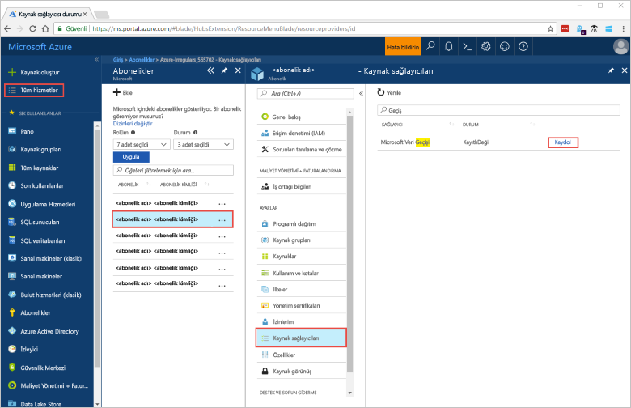

# Hızlı Başlangıç: Azure portalını kullanarak Azure Veritabanı Geçiş Hizmeti örneği oluşturma

Bu hızlı başlangıçta, Azure veritabanı geçiş hizmeti 'nin bir örneğini oluşturmak için Azure portal kullanırsınız. Örneği oluşturduktan sonra, verileri birden çok veritabanı kaynağından Azure SQL veritabanı 'na veya SQL Server Azure SQL yönetilen örneğine SQL Server gibi Azure veri platformları arasında geçirmek için kullanabilirsiniz.

Azure aboneliğiniz yoksa başlamadan önce [ücretsiz](https://azure.microsoft.com/free/) bir hesap oluşturun.

## Azure portalında oturum açın

Web tarayıcınızı açın, [Microsoft Azure portalına gidin](https://portal.azure.com/) ve kimlik bilgilerinizi girerek portalda oturum açın. Varsayılan görünüm hizmet panonuzu içerir.

> [!NOTE]
> Her bölge için bir abonelik başına en fazla 10 DMS örneği oluşturabilirsiniz. Daha fazla sayıda örneğe ihtiyacınız varsa lütfen bir destek bileti oluşturun.

## Kaynak sağlayıcısını kaydetme

İlk Veritabanı Geçiş Hizmeti örneğinizi oluşturmadan önce Microsoft.DataMigration kaynak sağlayıcısını kaydedin.

1. Azure portal, **abonelikleri** arayıp seçin.

   

2. Azure veritabanı geçiş hizmeti örneğini oluşturmak istediğiniz aboneliği seçin ve ardından **kaynak sağlayıcıları**' nı seçin.

    

3. Geçiş için arama yapın ve ardından **Microsoft. DataMigration** için **Kaydol** ' u seçin.

    

## Hizmetin bir örneğini oluşturma

1. Azure portal menüsünde veya **giriş** sayfasında, **kaynak oluştur**' u seçin. **Azure veritabanı geçiş hizmeti**'ni arayıp seçin.

    

2. **Azure Veritabanı Geçiş Hizmeti** ekranında **Oluştur**'u seçin.

    

3. **Geçiş hizmeti oluşturma** temelleri ekranında:

     - Aboneliği seçin.
     - Yeni bir kaynak grubu oluşturun veya var olan bir grubu seçin.
     - Azure veritabanı geçiş hizmeti örneği için bir ad belirtin.
     - Azure veritabanı geçiş hizmeti örneğini oluşturmak istediğiniz konumu seçin.
     - Hizmet modu olarak **Azure** ' ı seçin.
     - Fiyatlandırma katmanını seçin. Maliyetler ve fiyatlandırma katmanları hakkında daha fazla bilgi için [fiyatlandırma sayfasına](https://aka.ms/dms-pricing) bakın.
     
    

     - Sonraki: Ağ’ı seçin.

4. **Geçiş hizmeti oluştur** ağ ekranında:

    - Var olan bir sanal ağı seçin veya yeni bir ağ oluşturun. Sanal ağ, kaynak veritabanı ve hedef ortama erişimi olan Azure veritabanı geçiş hizmeti sağlar. Azure portal sanal ağ oluşturma hakkında daha fazla bilgi için [Azure Portal kullanarak sanal ağ oluşturma](../virtual-network/quick-create-portal.md)makalesine bakın.

    

    - Hizmeti oluşturmak için **gözden geçir + oluştur** ' u seçin. 
    
    - Birkaç dakika sonra Azure veritabanı geçiş hizmeti örneğiniz oluşturulup kullanıma hazırlanmaya hazırız:

    

## Kaynakları temizleme

[Azure kaynak grubunu](../azure-resource-manager/management/overview.md)silerek bu hızlı başlangıçta oluşturulan kaynakları temizleyebilirsiniz. Kaynak grubunu silmek için, oluşturduğunuz Azure Veritabanı Geçiş Hizmeti örneğine gidin. **Kaynak grubu** adını seçin ve **Kaynak grubunu sil** seçeneğini belirleyin. Bu eylem kaynak grubundaki tüm varlıkları ve kaynak grubunu siler.

## Sonraki adımlar

* [SQL Server’ı Azure SQL Veritabanı’na çevrimdışı geçirme](tutorial-sql-server-to-azure-sql.md)
* [SQL Server’ı Azure SQL Veritabanı’na çevrimiçi geçirme](tutorial-sql-server-azure-sql-online.md)
* [SQL Server Azure SQL yönetilen örneğine çevrimdışı geçirme](tutorial-sql-server-to-managed-instance.md)
* [SQL Server çevrimiçi olarak Azure SQL yönetilen örneğine geçirme](tutorial-sql-server-managed-instance-online.md)