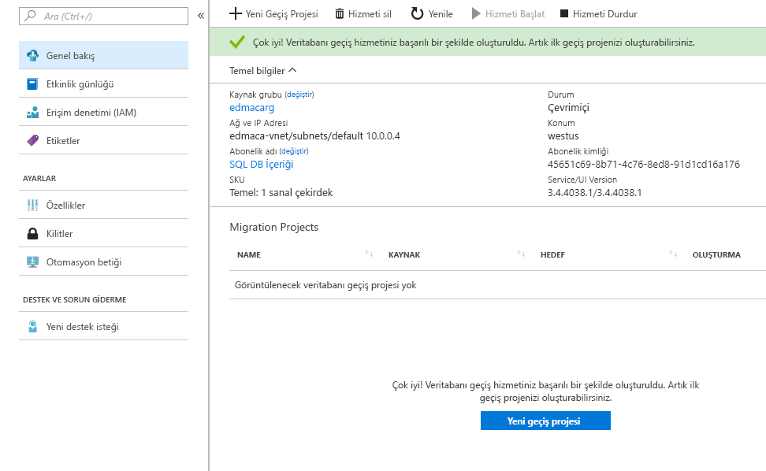

# Hızlı Başlangıç: Azure portalını kullanarak Azure Veritabanı Geçiş Hizmeti örneği oluşturma

Bu Quickstart'ta, Azure Veritabanı Geçiş Hizmeti'nin bir örneğini oluşturmak için Azure portalını kullanırsınız.  Hizmeti oluşturduktan sonra, verileri SQL Server'dan şirket içinde Azure SQL Veritabanı'na geçirmek için kullanabilirsiniz.

Azure aboneliğiniz yoksa, başlamadan önce [ücretsiz](https://azure.microsoft.com/free/) bir hesap oluşturun.

## Azure portalında oturum açın

Web tarayıcınızı açın, [Microsoft Azure portalına gidin](https://portal.azure.com/) ve kimlik bilgilerinizi girerek portalda oturum açın.

Varsayılan görünüm hizmet panonuzu içerir.

## Kaynak sağlayıcısını kaydetme

İlk Veritabanı Geçiş Hizmeti örneğinizi oluşturmadan önce Microsoft.DataMigration kaynak sağlayıcısını kaydedin.

1. Azure portalında, **Tüm hizmetler**’i seçin ve sonra **Abonelikler**’i seçin.

2. Azure Veritabanı Geçiş Hizmeti örneğini oluşturmak istediğiniz aboneliği seçin ve ardından **Kaynak sağlayıcılarını**seçin.

3. "migration" araması yapın ve **Microsoft.DataMigration** öğesinin sağ tarafındaki **Kaydet**'i seçin.

    

## Hizmetin bir örneğini oluşturma

1. Azure Veritabanı Geçiş Hizmeti'nin bir örneğini oluşturmak için kaynak**oluşturun** + seçin.

2. "Geçiş" için marketi arayın, **Azure Veritabanı Geçiş Hizmeti**’ni seçin ve **Azure Veritabanı Geçiş Hizmeti ** ekranında, **Oluştur**’u seçin.

3. **Geçiş Hizmeti Oluştur** ekranında:

    - Azure Veritabanı Geçiş Hizmeti örneğini tanımlamak için unutulmaz ve benzersiz bir **Hizmet Adı** seçin.
    - Örneği oluşturmak istediğiniz Azure **Aboneliğini** seçin.
    - Yeni bir **Kaynak Grubu** seçin ya da yeni bir tane oluşturun.
    - Kaynak veya hedef sunucunuza en yakın **Konum**’u seçin.
    - Varolan bir **Sanal ağ** seçin veya bir ağ oluşturun.

        Sanal ağ, kaynak veritabanına ve hedef ortama erişim sağlayan Azure Veritabanı Geçiş Hizmeti sağlar.

        Azure portalında sanal ağ oluşturma hakkında daha fazla bilgi için Azure [portalını kullanarak sanal ağ oluşturma makalesine](https://aka.ms/vnet)bakın.

    - **Fiyatlandırma katmanı** için Temel: 1 Sanal Çekirdek seçeneğini belirleyin.

        

4. **Oluştur'u**seçin.

    Birkaç dakika sonra Azure Veritabanı Geçişi hizmetini örnek alır ve kullanıma hazır olarak oluşturulur. Azure Veritabanı Geçiş Hizmeti aşağıdaki resimde gösterildiği gibi görüntüler:

    

## Kaynakları temizleme

[Azure kaynak grubunu](../azure-resource-manager/management/overview.md) silerek bu Hızlı Başlangıç kılavuzunda oluşturduğunuz kaynakları temizleyebilirsiniz. Kaynak grubunu silmek için, oluşturduğunuz Azure Veritabanı Geçiş Hizmeti örneğine gidin. **Kaynak grubu** adını seçin ve **Kaynak grubunu sil** seçeneğini belirleyin. Bu eylem kaynak grubundaki tüm varlıkları ve kaynak grubunu siler.

## Sonraki adımlar

> [!div class="nextstepaction"]
> [Şirket içi SQL Server’dan Azure SQL Veritabanı’na geçiş](tutorial-sql-server-to-azure-sql.md)