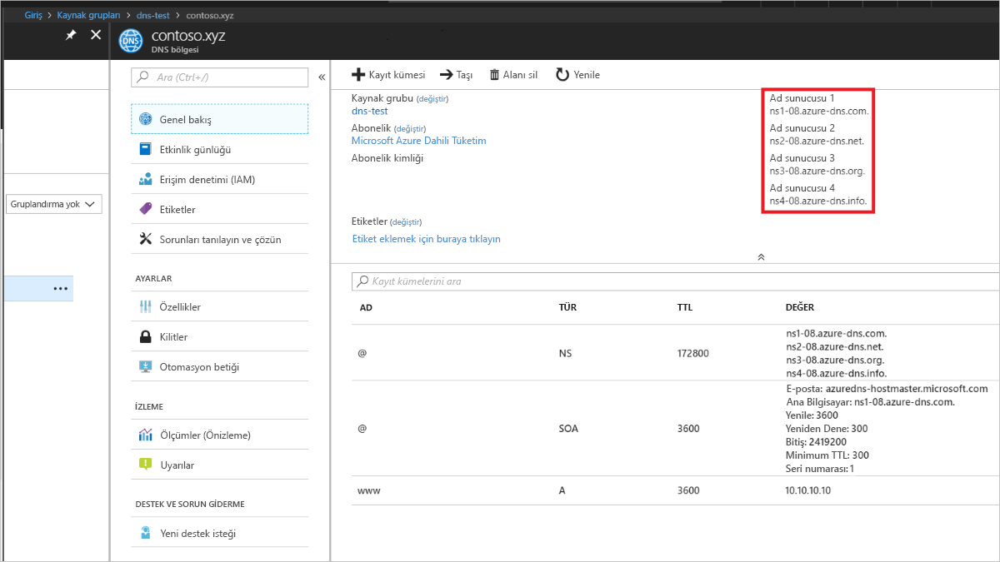

# <a name="quickstart-create-an-azure-dns-zone-and-record-using-the-azure-portal"></a>Hızlı başlangıç: Azure portalını kullanarak bir Azure DNS bölgesi oluşturun ve kaydedin

Azure DNS'yi, genel etki alanınızdaki ana bilgisayar adlarını çözümleyecek şekilde yapılandırabilirsiniz. Örneğin, bir etki alanı adı kayıt şirketinden *contoso.xyz* alan adını satın aldıysanız, Azure DNS'yi *contoso.xyz* etki alanını barındıracak şekilde yapılandırabilir ve *www.contoso.xyz'yi* web sunucunuzun veya web uygulamanızın IP adresine çözümleyebilirsiniz.

Bu hızlı başlangıçta, bir test etki alanı oluşturacak ve ardından *www* adresini IP adresi *10.10.10.10'a*çözmek için bir adres kaydı oluşturacaksınız.

>[!IMPORTANT]
>Bu hızlı başlatmadaki tüm adlar ve IP adresleri, gerçek dünya senaryolarını temsil etmeyen örneklerdir.

<!---
You can also perform these steps using [Azure PowerShell](dns-getstarted-powershell.md) or the cross-platform [Azure CLI](dns-getstarted-cli.md).
--->

Azure aboneliğiniz yoksa, başlamadan önce [ücretsiz](https://azure.microsoft.com/free/?WT.mc_id=A261C142F) bir hesap oluşturun.

Tüm portal adımları için [Azure portalında](https://portal.azure.com)oturum açın.

## <a name="create-a-dns-zone"></a>DNS bölgesi oluşturma

DNS bölgesi, bir etki alanı için DNS girişlerini içerir. Etki alanınızı Azure DNS'de barındırmaya başlamak için, bu etki alanı adı için bir DNS bölgesi oluşturursunuz. 

**DNS bölgesioluşturmak için:**

1. Sol üstte, **kaynak oluştur' u,** ardından **Ağ oluşturma'yı**ve ardından **DNS bölgesini**seçin.

1. **DNS bölge oluştur** sayfasında aşağıdaki değerleri yazın veya seçin:

   - **Adı**: Bu hızlı başlangıç örneği için *contoso.xyz* yazın. DNS bölge adı, Azure DNS sunucularında zaten yapılandırılmamış herhangi bir değer olabilir. Gerçek dünyada etki alanı adı kayıt kuruluşunuzdan satın aldığınız etki alanını kullanmanız gerekir.
   - **Kaynak grubu**: **Yeni Oluştur'u**seçin , *MyResourceGroup'u*girin ve **Tamam'ı**seçin. Kaynak grubu adı Azure aboneliği nde benzersiz olmalıdır. 

1. **Oluştur'u**seçin.

   

Bölgenin oluşturulması birkaç dakika sürebilir.

## <a name="create-a-dns-record"></a>DNS kaydı oluşturma

Etki alanınız için DNS bölgesi içinde DNS girişleri veya kayıtları oluşturursunuz. Bir ev sahibi adını IPv4 adresine çözmek için yeni bir adres kaydı veya 'A' kaydı oluşturun.

**'A' kaydı oluşturmak için:**

1. Azure portalında, **Tüm kaynaklar**altında **MyResourceGroup** kaynak grubunda **contoso.xyz** DNS bölgesini açın. Daha kolay bulmak için **ad** kutusuna *contoso.xyz* girebilirsiniz.

1. **DNS bölge** sayfasının üst kısmında **+ Kayıt kümesini**seçin.

1. Kayıt **ekle sayfasında** aşağıdaki değerleri yazın veya seçin:

   - **Adı**: Type *www*. Kayıt adı, belirtilen IP adresine çözümlemek istediğiniz ana bilgisayar adıdır.
   - **Türü**: **A**seçin. 'A' kayıtları en yaygın olanlardır, ancak posta sunucuları ('MX'), IP v6 adresleri ('AAAA') vb. için başka kayıt türleri de vardır. 
   - **TTL**: Tip *1*. DNS isteğinin *zaman içinde dns* sunucuları ve istemcileri bir yanıtı ne kadar süre önbelleğe alabildiğini belirtir.
   - **TTL birimi**: **Saat**Seçiniz. Bu, **TTL** değerinin zaman birimidir. 
   - **IP adresi**: Bu hızlı başlangıç örneği için *10.10.10.10*yazın. Bu değer, kayıt adının çözümleneğinin IP adresidir. Gerçek bir senaryoda, web sunucunuzun genel IP adresini girersiniz.

Bu hızlı başlatma yalnızca hızlı sınama amacıyla olduğundan, bir etki alanı adı kayıt şirketinde Azure DNS ad sunucularını yapılandırmaya gerek yoktur. Gerçek bir üretim etki alanı yla, Internet'teki herkesin web sunucunuza veya uygulamanıza bağlanmak için ana bilgisayar adını çözmesini istersiniz. Ad sunucusu kayıtlarını Azure DNS ad sunucularıyla değiştirmek için alan adı kayıt şirketinizi ziyaret edersiniz. Daha fazla bilgi için [Bkz. Öğretici: Etki alanınızı Azure DNS'de barındırın.](dns-delegate-domain-azure-dns.md#delegate-the-domain)

## <a name="test-the-name-resolution"></a>Ad çözümlemesini test etme

Artık bir test 'A' kaydı ile bir test DNS bölge var, *nslookup*adlı bir araç ile ad çözünürlüğü test edebilirsiniz. 

**DNS ad çözümlemesi test etmek için:**

1. Azure portalında, **Tüm kaynaklar**altında **MyResourceGroup** kaynak grubunda **contoso.xyz** DNS bölgesini açın. Daha kolay bulmak için **ad** kutusuna *contoso.xyz* girebilirsiniz.

1. **Genel Bakış** sayfasındaki ad sunucusu listesinden ad sunucusu adlarından birini kopyalayın. 

   

1. Komut istemini açın ve aşağıdaki komutu çalıştırın:

   ```
   nslookup www.contoso.xyz <name server name>
   ```

   Örnek:

   ```
   nslookup www.contoso.xyz ns1-08.azure-dns.com.
   ```

   Aşağıdaki ekran gibi bir şey görmeniz gerekir:

   

Ana bilgisayar adı **www\.contoso.xyz** **10.10.10**olarak giderir , tıpkı bunu yapılandırdığınız gibi. Bu sonuç, ad çözümlemesi doğru çalıştığını doğrular. 

## <a name="clean-up-resources"></a>Kaynakları temizleme

Bu hızlı başlatmada oluşturduğunuz kaynaklara artık ihtiyacınız olmadığında, **MyResourceGroup** kaynak grubunu silerek bunları kaldırın. **MyResourceGroup** kaynak grubunu açın ve **kaynak grubunu sil'i**seçin.

## <a name="next-steps"></a>Sonraki adımlar

> [!div class="nextstepaction"]
> [Özel etki alanında web uygulaması için DNS kayıtları oluşturma](./dns-web-sites-custom-domain.md)