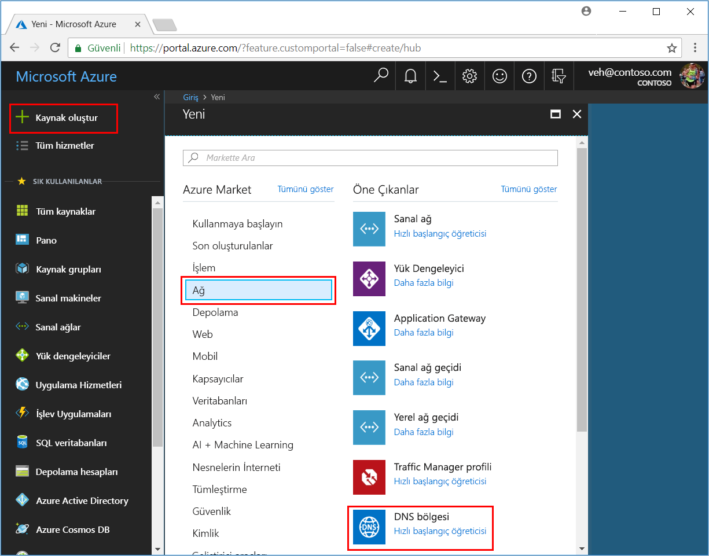

# <a name="quickstart-configure-azure-dns-for-name-resolution-using-the-azure-portal"></a>Hızlı başlangıç: Azure portalı kullanarak Azure DNS'yi ad çözümlemesi için yapılandırma

 Azure DNS'yi, genel etki alanınızdaki ana bilgisayar adlarını çözümleyecek şekilde yapılandırabilirsiniz. Örneğin bir etki alanı adı kayıt kuruluşundan contoso.com etki alanı adını satın aldıysanız Azure DNS'yi contoso.com etki alanını barındıracak ve www.contoso.com adresini web sunucunuzun veya web uygulamanızın IP adresine çözümleyecek şekilde yapılandırabilirsiniz.

Bu hızlı başlangıçta bir test amaçlı bir etki alanı oluşturacak, ardından 'www' adlı bir adres kaydı oluşturarak 10.10.10.10 IP adresine çözümlenmesini sağlayacaksınız.

Bu hızlı başlangıçta kullanılan tüm adların ve IP adreslerinin yalnızca örnek amaçlı olduğunu ve bir gerçek dünya senaryosunu yansıtmadığını lütfen unutmayın. Ancak uygun yerlerde gerçek dünya senaryoları da eklenmiştir.

<!---
You can also perform these steps using [Azure PowerShell](dns-getstarted-powershell.md) or the cross-platform [Azure CLI](dns-getstarted-cli.md).
--->

DNS bölgesi belirli bir etki alanıyla ilgili DNS girişlerini toplamak için kullanılır. Etki alanınızı Azure DNS'de barındırmaya başlamak için bir DNS bölgesi oluşturmanız gerekir. Ardından bu DNS bölgesinde etki alanınız için tüm DNS girişleri (veya kayıtları) oluşturulur. Aşağıdaki adımlar bunu nasıl yapabileceğinizi gösterir.

Azure aboneliğiniz yoksa başlamadan önce [ücretsiz bir hesap](https://azure.microsoft.com/free/?WT.mc_id=A261C142F) oluşturun.

## <a name="create-a-dns-zone"></a>DNS bölgesi oluşturma

1. Azure Portal’da oturum açın.
2. Sol üstte **+ Kaynak oluştur**'a, **Ağ**'a ve ardından **DNS bölgesi**'ne tıklayarak **DNS bölgesi oluşturma** sayfasını açın.

    

4. **DNS bölgesi oluştur** sayfasında aşağıdaki değerleri girin ve **Oluştur**’a tıklayın:


   | **Ayar** | **Değer** | **Ayrıntılar** |
   |---|---|---|
   |**Ad**|contoso.xyz|Bu örnekte kullanılan DNS bölgesinin adıdır. Bu hızlı başlangıçta Azure DNS sunucularında önceden yapılandırılmamış olması şartıyla istediğiniz değeri kullanabilirsiniz. Gerçek dünyada etki alanı adı kayıt kuruluşunuzdan satın aldığınız etki alanını kullanmanız gerekir.|
   |**Abonelik**|[Aboneliğiniz]|DNS bölgesini oluşturmak için bir abonelik seçin.|
   |**Kaynak grubu**|**Yeni oluştur:** dns-test|Bir kaynak grubu oluşturun. Kaynak grubu adı, seçili abonelik içinde benzersiz olmalıdır. |
   |**Konum**|Doğu ABD||

Bölgenin oluşturulması birkaç dakika sürebilir.

## <a name="create-a-dns-record"></a>DNS kaydı oluşturma

Şimdi yeni bir adres kaydı ('A' kaydı) oluşturun. 'A' kayıtları, bir ana bilgisayar adını bir IP v4 adresine çözümlemek için kullanılır.

1. Azure Portal **Sık Kullanılanlar** bölmesinde, **Tüm kaynaklar**’a tıklayın. Tüm kaynaklar sayfasında **contoso.xyz** DNS bölgesine tıklayın. Seçili abonelikte zaten çeşitli kaynaklar varsa, uygulama ağ geçidine kolaylıkla erişmek için **Ada göre filtrele...** kutusuna **contoso.xyz** girebilirsiniz.

1. **DNS bölgesi** sayfasının üzerindeki **+ Kayıt kümesi**’ni seçerek **Kayıt kümesi ekle** sayfasını açın.

1. **Kaynak kümesi ekle** sayfasında aşağıdaki değerleri girin ve **Tamam**’a tıklayın. Bu örnekte bir 'A' kaydı oluşturuyorsunuz.

   |**Ayar** | **Değer** | **Ayrıntılar** |
   |---|---|---|
   |**Ad**|www|Kaydın adı. Bu, IP adresini çözümlemek istediğiniz ana bilgisayarın adıdır.|
   |**Tür**|A| Oluşturulacak DNS kaydının türü. En çok 'A' kayıtları kullanılır ancak posta sunucuları için (MX), IP v6 adresleri için (AAAA) ve farklı amaçlarla kullanılan başka kayıt türleri de vardır. |
   |**TTL**|1|DNS isteğinin yaşam süresi. DNS sunucularının ve istemcilerinin bir yanıtı ne kadar süreyle önbellekte tutabileceğini belirtir.|
   |**TTL birimi**|hours|TTL değeri için zaman ölçümü.|
   |**IP adresi**|10.10.10.10| Bu değer, 'A' kaydının çözümlendiği IP adresidir. Bu değer yalnızca bu hızlı başlangıçta kullanılan bir test değeridir. Gerçek dünyada buraya web sunucunuzun genel IP adresini girmeniz gerekir.|


Bu hızlı başlangıçta gerçek bir etki alanı adı satın almadığınız için Azure DNS'yi etki alanı adı kayıt kuruluşunuzun ad sunucusuna göre yapılandırmanıza gerek yoktur. Ancak gerçek dünya senaryosunda İnternet üzerindeki herkesin web sunucunuza veya uygulamanıza bağlanmak için ana bilgisayar adınızı çözümlemesini istersiniz. Bu gerçek dünya senaryosu hakkında daha fazla bilgi için bkz. [Azure DNS'ye bir etki alanı devretme](dns-delegate-domain-azure-dns.md).


## <a name="test-the-name-resolution"></a>Ad çözümlemesini test etme

Test amaçlı 'A' kaydını içeren test bölgesini oluşturduğunuza göre nslookup adlı bir araçla ad çözümlemesini test edebilirsiniz. 

1. İlk olarak nslookup ile kullanılacak Azure DNS ad sunucularını not etmeniz gerekir. 

   Bölgenizin ad sunucuları DNS bölgesi **Genel bakış** sayfasında listelenir. Ad sunucularından birinin adını kopyalayın:

   

2. Şimdi bir komut istemi açın ve şu komutu çalıştırın:

   ```
   nslookup <host name> <name server>
   
   For example:

   nslookup www.contoso.xyz ns1-08.azure-dns.com
   ```

Aşağıdaki ekran görüntüsüne benzer bir sonuç görmeniz gerekir:


Bu sonuç ad çözümlemesinin düzgün çalıştığını doğrular. www.contoso.xyz etki alanı adı 10.10.10.10 adresine çözümleniyor, tam da sizin yaptığınız gibi!

## <a name="clean-up-resources"></a>Kaynakları temizleme

Artık gerekmediğinde **dns-test** kaynak grubunu silerek bu hızlı başlangıçta oluşturulan kaynakları silebilirsiniz. Bunu yapmak **dns-test** kaynak grubuna ve ardından **Kaynak grubunu sil**'e tıklayın.


## <a name="next-steps"></a>Sonraki adımlar

> [!div class="nextstepaction"]
> [Özel etki alanında bir web uygulaması için DNS kayıtları oluşturma](./dns-web-sites-custom-domain.md)