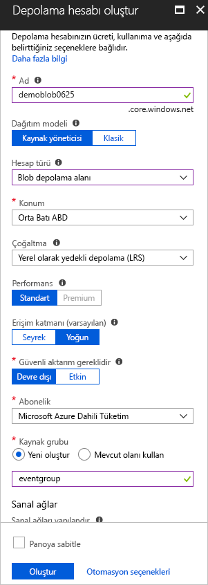
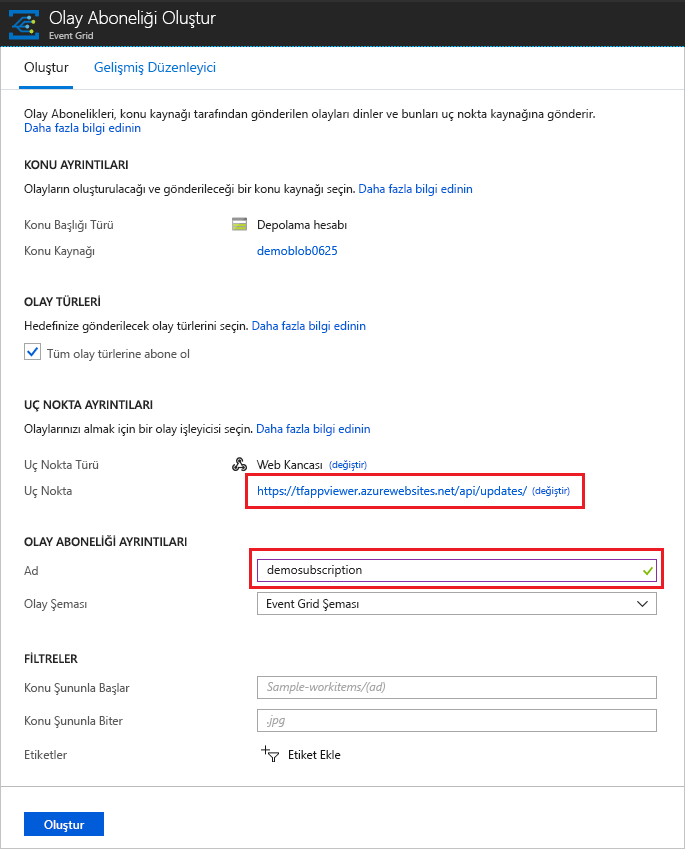

# Hızlı başlangıç: Blob Depolama olaylarını Azure portal web uç noktasına yönlendirme

Azure Event Grid, bulut için bir olay oluşturma hizmetidir. Bu makalede Azure portalını kullanarak bir Blob depolama hesabı oluşturur, bu blob depolama hesabının olaylarına abone olur ve sonucu görmek için bir olayı tetiklersiniz. Normalde olayları, olay verilerini işleyen ve eylemler gerçekleştiren bir uç noktaya gönderirsiniz. Bununla birlikte, bu makaleyi basitleştirmek için olayları iletilerin toplandığı ve görüntülendiği bir web uygulamasına gönderirsiniz.

[!INCLUDE [quickstarts-free-trial-note.md](../../includes/quickstarts-free-trial-note.md)]

İşiniz bittiğinde, olay verilerinin web uygulamasına gönderildiğini görürsünüz.

## Depolama hesabı oluşturma

1. [Azure Portal](https://portal.azure.com/)oturum açın.

1. Bir Blob depolaması oluşturmak için **Kaynak oluşturun**'u seçin. 

1. Kullanılabilir seçenekleri filtrelemek için **Depolama**'yı seçip **Depolama hesabı - blob, dosya, tablo, kuyruk** öğesini seçin.

   

   Olaylara abone olmak için, genel amaçlı v2 depolama hesabı veya bir Blob depolama hesabı oluşturun.
   
1. **Depolama hesabı oluştur** sayfasında, aşağıdaki adımları uygulayın:
    1. Azure aboneliğinizi seçin. 
    2. **Kaynak grubu**için yeni bir kaynak grubu oluşturun veya var olan bir kaynak grubunu seçin. 
    3. Depolama hesabınızın adını girin. 
    4. **İncele ve oluştur**’u seçin. 

           
    5. **Gözden geçir + oluştur** sayfasında ayarları gözden geçirin ve **Oluştur**' u seçin. 

        >[!NOTE]
        > Yalnızca **StorageV2 (genel amaçlı v2)** ve **blobstorage** türünde depolama hesapları olay tümleştirmesini destekler. **Depolama (genral amaçlı v1)** Event Grid ile *tümleştirmeyi desteklemez.*

## İleti uç noktası oluşturma

Blob depolamasındaki olaylara abone olmadan önce olay iletisi için uç noktayı oluşturalım. Normalde, olay verileri temelinde uç nokta eylemleri gerçekleştirir. Bu hızlı başlangıcı basitleştirmek için, olay iletilerini görüntüleyin bir [önceden oluşturulmuş web uygulaması](https://github.com/Azure-Samples/azure-event-grid-viewer) dağıtırsınız. Dağıtılan çözüm bir App Service planı, App Service web uygulaması ve GitHub'dan kaynak kod içerir.

1. Çözümü aboneliğinize dağıtmak için **Azure'a Dağıt**'ı seçin. 

   
2. **Özel dağıtım** sayfasında, aşağıdaki adımları uygulayın: 
    1. **Kaynak grubu**için, depolama hesabı oluştururken oluşturduğunuz kaynak grubunu seçin. Kaynak grubunu silerek öğreticiye tamamladıktan sonra temizlemeniz daha kolay olacaktır.  
    2. **Site adı**için, Web uygulaması için bir ad girin.
    3. **Barındırma planı adı**için, Web uygulamasını barındırmak üzere kullanılacak App Service planı için bir ad girin.
    4. **Yukarıda belirtilen hüküm ve koşulları kabul ediyorum**onay kutusunu seçin. 
    5. **Satın al**'ı seçin. 

       
1. Dağıtımın tamamlanması birkaç dakika sürebilir. Portalda Uyarılar ' ı (zil simgesi) seçin ve **kaynak grubuna git**' i seçin. 

    
4. **Kaynak grubu** sayfasında, kaynak listesinde, oluşturduğunuz Web uygulamasını seçin. Ayrıca, bu listede App Service planı ve depolama hesabı ' nı da görürsünüz. 

    
5. Web uygulamanızın **App Service** sayfasında, Web sitesine gitmek için URL 'yi seçin. URL şu biçimde olmalıdır: `https://<your-site-name>.azurewebsites.net`.
    
    

6. Siteyi görtığınızdan, ancak henüz hiç bir olay gönderilmemiştir.

   

[!INCLUDE [event-grid-register-provider-portal.md](../../includes/event-grid-register-provider-portal.md)]

## Blob depolamaya abone olma

Event Grid’e hangi olayları izlemek istediğinizi ve olayların nereye gönderileceğini bildirmek için bir konuya abone olursunuz.

1. Portalda, daha önce oluşturduğunuz Azure depolama hesabınıza gidin. Sol taraftaki menüden **tüm kaynaklar** ' ı seçin ve depolama hesabınızı seçin. 
2. **Depolama hesabı** sayfasında, sol taraftaki menüden **Olaylar** ' ı seçin.
1. **Diğer Seçenekler**'i ve **Web Kancası**'nı seçin. Uç nokta için bir Web kancası kullanarak Görüntüleyici uygulamanıza olay gönderiyorsunuz. 

   
3. **Olay aboneliği oluştur** sayfasında, aşağıdaki adımları uygulayın: 
    1. Olay aboneliği için bir **ad** girin.
    2. **Uç nokta türü**Için **Web kancası** seçin. 

       
4. **Uç**nokta için **bir uç nokta seç**' e tıklayın ve Web uygulamanızın URL 'sini gırın ve giriş `api/updates` sayfası URL 'sine ekleyin (örneğin: `https://spegridsite.azurewebsites.net/api/updates`) ve ardından **Seçimi Onayla**' yı seçin.

   
5. Şimdi olay **aboneliği oluştur** sayfasında, olay aboneliğini oluşturmak için **Oluştur** ' u seçin. 

   

1. Web uygulamanızı yeniden görüntüleyin ve buna bir abonelik doğrulama olayının gönderildiğine dikkat edin. Göz simgesini seçerek olay verilerini genişletin. Uç noktanın olay verilerini almak istediğini doğrulayabilmesi için Event Grid doğrulama olayını gönderir. Web uygulaması aboneliği doğrulamak için kod içerir.

   

Şimdi, Event Grid’in iletiyi uç noktanıza nasıl dağıttığını görmek için bir olay tetikleyelim.

## Uç noktanıza olay gönderme

Dosya yükleyerek Blob depolaması için bir olay tetiklemiş olursunuz. Dosyanın belirli bir içeriğe sahip olmasına gerek yoktur. Bu makalede testfile.txt adlı bir dosyaya sahip olduğunuz kabul edilmektedir ancak herhangi bir dosyayı kullanabilirsiniz.

1. Azure portal, BLOB depolama hesabınıza gidin ve **genel bakış** sayfasında **kapsayıcılar** ' ı seçin.

   

1. **+ Kapsayıcı**'yı seçin. Kapsayıcıya bir ad verin ve herhangi bir erişim düzeyi kullanın ve **Oluştur**' u seçin. 

   

1. Yeni kapsayıcınızı seçin.

   

1. Dosya yüklemek için **Yükle**'yi seçin. **Blobu karşıya yükle** sayfasında, test için karşıya yüklemek istediğiniz bir dosyaya gözatıp seçin ve ardından bu sayfada **karşıya yükle** ' yi seçin. 

   

1. Test dosyanıza göz atın ve yükleyin.

1. Olayı tetiklediniz ve Event Grid, iletiyi abone olurken yapılandırdığınız uç noktaya gönderdi. İleti JSON biçimindedir ve bir veya daha fazla olaya sahip bir dizi içerir. Aşağıdaki örnekte, JSON iletisi bir olay içeren bir dizi içerir. Web uygulamanızı görüntüleyin ve bir **BLOB Created** olayının alındığını görürsünüz. 

   

## Kaynakları temizleme

Bu olayla çalışmaya devam etmeyi planlıyorsanız bu makalede oluşturulan kaynakları temizlemeyin. Aksi takdirde, bu makalede oluşturduğunuz kaynakları silin.

Kaynak grubunu seçin ve **Kaynak grubunu sil** seçeneğini belirleyin.

## Sonraki adımlar

Özel konu ve olay abonelikleri oluşturma işlemini öğrendiğinize göre artık Event Grid’in size nasıl yardımcı olabileceği konusunda daha fazla bilgi edinebilirsiniz:

- [Event Grid Hakkında](overview.md)
- [Blob depolama olaylarını bir özel web uç noktasına yönlendirme](../storage/blobs/storage-blob-event-quickstart.md?toc=%2fazure%2fevent-grid%2ftoc.json)
- [Azure Event Grid ve Logic Apps ile sanal makine değişikliklerini izleme](monitor-virtual-machine-changes-event-grid-logic-app.md)
- [Büyük verileri bir veri ambarına akışla aktarma](event-grid-event-hubs-integration.md)
