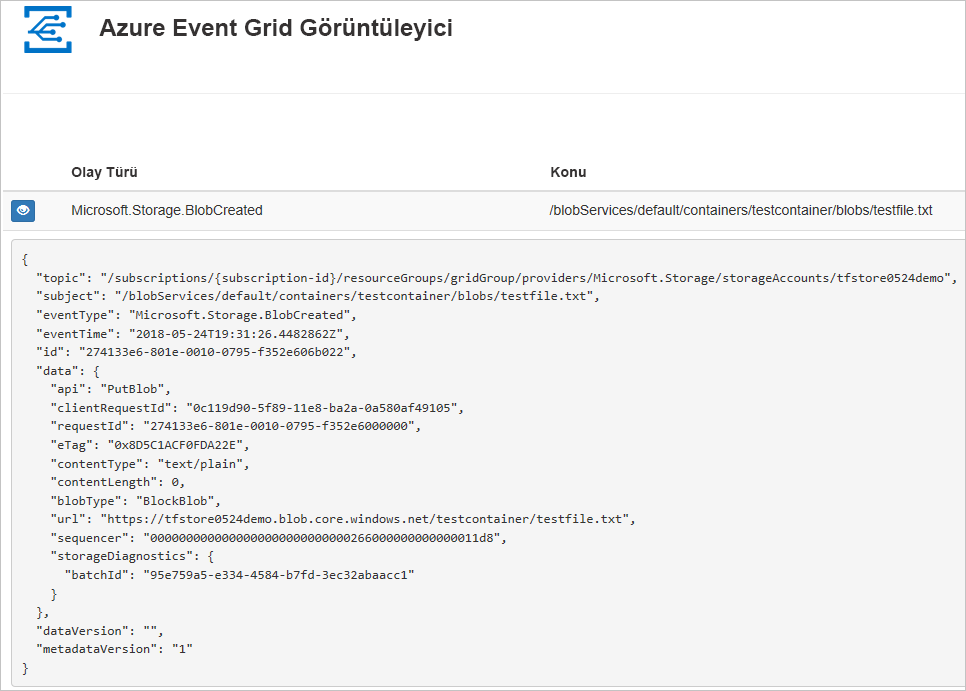

# Blob Depolama olaylarını Azure Resource Manager şablonu kullanarak Web uç noktasına yönlendirme
Azure Event Grid, bulut için bir olay oluşturma hizmetidir. Bu makalede bir BLOB depolama hesabı oluşturmak, söz konusu BLOB depolama olaylarına abone olmak ve sonucu görüntülemek için bir olay tetiklemeniz için bir **Azure Resource Manager şablonu** kullanırsınız. Normalde olayları, olay verilerini işleyen ve eylemler gerçekleştiren bir uç noktaya gönderirsiniz. Bununla birlikte, bu makaleyi basitleştirmek için olayları iletilerin toplandığı ve görüntülendiği bir web uygulamasına gönderirsiniz.

[Kaynak Yöneticisi Şablon](../azure-resource-manager/templates/overview.md) , projeniz için altyapıyı ve yapılandırmayı tanımlayan bir JAVASCRIPT nesne GÖSTERIMI (JSON) dosyasıdır. Şablon bildirim temelli sözdizimini kullanır, bu, oluşturmak için programlama komutlarının dizisini yazmak zorunda kalmadan ne dağıtmayı istediğinizi belirtmenize olanak tanır. Kaynak Yöneticisi şablonları geliştirme hakkında daha fazla bilgi edinmek istiyorsanız, bkz. [Kaynak Yöneticisi belgeleri](/azure/azure-resource-manager/).

Azure aboneliğiniz yoksa başlamadan önce [ücretsiz bir hesap](https://azure.microsoft.com/free/) oluşturun.

## Ön koşullar
### İleti uç noktası oluşturma
Blob depolamasındaki olaylara abone olmadan önce olay iletisi için uç noktayı oluşturalım. Normalde, olay verileri temelinde uç nokta eylemleri gerçekleştirir. Bu hızlı başlangıcı basitleştirmek için, olay iletilerini görüntüleyin bir [önceden oluşturulmuş web uygulaması](https://github.com/Azure-Samples/azure-event-grid-viewer) dağıtırsınız. Dağıtılan çözüm bir App Service planı, App Service web uygulaması ve GitHub'dan kaynak kod içerir.

1. Çözümü aboneliğinize dağıtmak için **Azure'a Dağıt**'ı seçin. Azure portalında parametre değerlerini girin.

    [Azure’a Dağıtma](https://portal.azure.com/#create/Microsoft.Template/uri/https%3A%2F%2Fraw.githubusercontent.com%2FAzure-Samples%2Fazure-event-grid-viewer%2Fmaster%2Fazuredeploy.json)
1. Dağıtımın tamamlanması birkaç dakika sürebilir. Dağıtım başarıyla gerçekleştirildikten sonra, web uygulamanızı görüntüleyip çalıştığından emin olun. Web tarayıcısında şu adrese gidin: `https://<your-site-name>.azurewebsites.net`

1. Siteyi görürsünüz ancak henüz yayımlanmış olay yoktur.

   

## Event Grid abonelikle depolama hesabı oluşturma
Bu hızlı başlangıçta kullanılan şablon [Azure hızlı başlangıç şablonlarından](https://github.com/Azure/azure-quickstart-templates/tree/master/101-event-grid-subscription-and-storage).

[!code-json[<Azure Resource Manager template create Blob strage Event Grid subscription>](~/quickstart-templates/101-event-grid-subscription-and-storage/azuredeploy.json)]

Şablonda iki Azure kaynağı tanımlanmıştır:

* **Microsoft. Storage/storageAccounts**: bir Azure depolama hesabı oluşturun.
* **"Microsoft. Storage/storageAccounts/Providers/Eventabonelikler**: depolama hesabı için Azure Event Grid aboneliği oluşturun. 

1. Azure 'da oturum açmak ve bir şablonu açmak için aşağıdaki bağlantıyı seçin. Şablon bir anahtar kasası ve gizli dizi oluşturur.

    [Azure’a Dağıtma](https://portal.azure.com/#create/Microsoft.Template/uri/https%3A%2F%2Fraw.githubusercontent.com%2FAzure%2Fazure-quickstart-templates%2Fmaster%2F101-event-grid-subscription-and-storage%2Fazuredeploy.json)
2. **Uç noktasını**belirtin: Web uygulamanızın URL 'sini sağlayın ve GIRIŞ sayfası url 'sine `api/updates` ekleyin.
3. Şablonu dağıtmak için **satın al** ' ı seçin. 

  Azure portal, şablonu dağıtmak için burada kullanılır. Azure PowerShell, Azure CLı ve REST API de kullanabilirsiniz. Diğer dağıtım yöntemlerini öğrenmek için bkz. [şablonları dağıtma](../azure-resource-manager/templates/deploy-powershell.md).

> [!NOTE]
> Daha fazla Azure Event Grid [şablon örneği bulabilirsiniz](https://azure.microsoft.com/resources/templates/?resourceType=Microsoft.Eventgrid).

## Dağıtımı doğrulama
Web uygulamanızı yeniden görüntüleyin ve buna bir abonelik doğrulama olayının gönderildiğine dikkat edin. Göz simgesini seçerek olay verilerini genişletin. Uç noktanın olay verilerini almak istediğini doğrulayabilmesi için Event Grid doğrulama olayını gönderir. Web uygulaması aboneliği doğrulamak için kod içerir.

Şimdi, Event Grid’in iletiyi uç noktanıza nasıl dağıttığını görmek için bir olay tetikleyelim.

Dosya yükleyerek Blob depolaması için bir olay tetiklemiş olursunuz. Dosyanın belirli bir içeriğe sahip olmasına gerek yoktur. Bu makalede testfile.txt adlı bir dosyaya sahip olduğunuz kabul edilmektedir ancak herhangi bir dosyayı kullanabilirsiniz.

Dosyayı Azure Blob depolama alanına yüklediğinizde, Event Grid abone olurken yapılandırdığınız uç noktaya bir ileti gönderir. İleti JSON biçimindedir ve bir veya daha fazla olaya sahip bir dizi içerir. Aşağıdaki örnekte, JSON iletisi bir olay içeren bir dizi içerir. Web uygulamanızı görüntülediğinizde blob oluşturma olayının gönderildiğini göreceksiniz. 

## Kaynakları temizleme
Artık gerekli olmadığında [kaynak grubunu silin](../azure-resource-manager/management/delete-resource-group.md?tabs=azure-portal#delete-resource-group
). 

## Sonraki adımlar
Azure Resource Manager şablonları hakkında daha fazla bilgi için aşağıdaki makalelere bakın:

- [Azure Resource Manager belgeleri](/azure/azure-resource-manager)
- [Azure Resource Manager şablonlarda kaynakları tanımlama](/azure/templates/)
- [Azure hızlı başlangıç şablonları](https://azure.microsoft.com/resources/templates/)
- [Azure Event Grid şablonları](https://azure.microsoft.com/resources/templates/?resourceType=Microsoft.Eventgrid).
