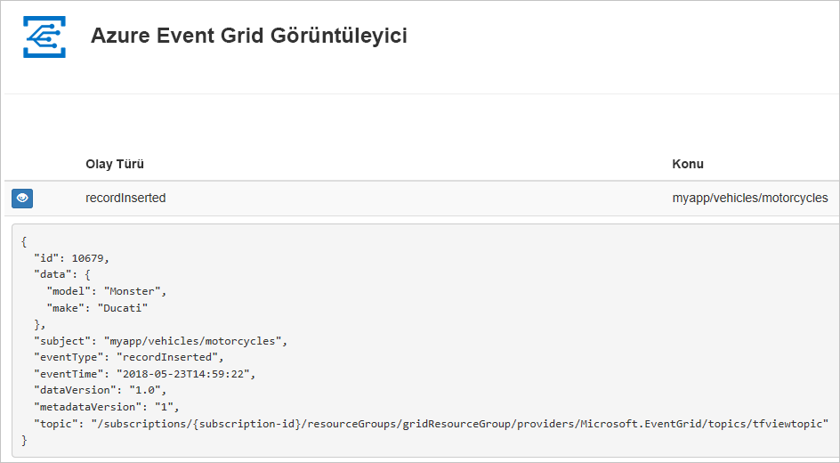
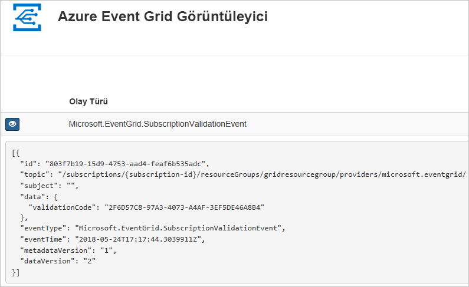

# <a name="quickstart-route-custom-events-to-web-endpoint-with-powershell-and-event-grid"></a>Hızlı başlangıç: PowerShell ve Event Grid özel olayları Web uç noktasına yönlendirme

Azure Event Grid, bulut için bir olay oluşturma hizmetidir. Bu makalede, Azure PowerShell kullanarak özel bir konu oluşturur, konuya abone olur ve sonucu görüntülemek için olayı tetiklersiniz. Normalde olayları, olay verilerini işleyen ve eylemler gerçekleştiren bir uç noktaya gönderirsiniz. Bununla birlikte, bu makaleyi basitleştirmek için olayları iletilerin toplandığı ve görüntülendiği bir web uygulamasına gönderirsiniz.

İşiniz bittiğinde, olay verilerinin web uygulamasına gönderildiğini görürsünüz.



[!INCLUDE [updated-for-az](../../includes/updated-for-az.md)]

[!INCLUDE [quickstarts-free-trial-note.md](../../includes/quickstarts-free-trial-note.md)]

Bu makale için Azure PowerShell'in en yeni sürümünü kullanmanız gerekir. Yüklemeniz veya yükseltmeniz gerekirse, bkz. [Azure PowerShell yükleyip yapılandırma](/powershell/azure/install-Az-ps).

## <a name="create-a-resource-group"></a>Kaynak grubu oluşturma

Event Grid konuları Azure kaynaklarıdır ve bir Azure kaynak grubuna yerleştirilmelidir. Kaynak grubu, Azure kaynaklarının dağıtıldığı ve yönetildiği bir mantıksal koleksiyondur.

[New-AzResourceGroup](/powershell/module/az.resources/new-azresourcegroup) komutuyla bir kaynak grubu oluşturun.

Aşağıdaki örnek *westus2* konumunda *gridResourceGroup* adlı bir kaynak grubu oluşturur.

```powershell-interactive
New-AzResourceGroup -Name gridResourceGroup -Location westus2
```

[!INCLUDE [event-grid-register-provider-powershell.md](../../includes/event-grid-register-provider-powershell.md)]

## <a name="create-a-custom-topic"></a>Özel konu oluşturma

Event grid konusu, olaylarınızı göndereceğiniz kullanıcı tanımlı bir uç nokta sağlar. Aşağıdaki örnekte özel konu, kaynak grubunuzda oluşturulur. `<your-topic-name>` değerini konunuz için benzersiz bir adla değiştirin. Konu adı bir DNS girdisinin parçası olduğundan benzersiz olmalıdır. Ayrıca, 3-50 karakter arasında olmalıdır ve yalnızca a-z, A-Z, 0-9 ve "-" değerlerini içermelidir

```powershell-interactive
$topicname="<your-topic-name>"

New-AzEventGridTopic -ResourceGroupName gridResourceGroup -Location westus2 -Name $topicname
```

## <a name="create-a-message-endpoint"></a>İleti uç noktası oluşturma

Konuya abone olmadan önce olay iletisi için uç noktayı oluşturalım. Normalde, olay verileri temelinde uç nokta eylemleri gerçekleştirir. Bu hızlı başlangıcı basitleştirmek için, olay iletilerini görüntüleyin bir [önceden oluşturulmuş web uygulaması](https://github.com/Azure-Samples/azure-event-grid-viewer) dağıtırsınız. Dağıtılan çözüm bir App Service planı, App Service web uygulaması ve GitHub'dan kaynak kod içerir.

`<your-site-name>` değerini web uygulamanız için benzersiz bir adla değiştirin. Web uygulaması adı bir DNS girdisinin parçası olduğundan benzersiz olmalıdır.

```powershell-interactive
$sitename="<your-site-name>"

New-AzResourceGroupDeployment `
  -ResourceGroupName gridResourceGroup `
  -TemplateUri "https://raw.githubusercontent.com/Azure-Samples/azure-event-grid-viewer/master/azuredeploy.json" `
  -siteName $sitename `
  -hostingPlanName viewerhost
```

Dağıtımın tamamlanması birkaç dakika sürebilir. Dağıtım başarıyla gerçekleştirildikten sonra, web uygulamanızı görüntüleyip çalıştığından emin olun. Web tarayıcısında şu adrese gidin: `https://<your-site-name>.azurewebsites.net`

Şu anda iletilerin görüntülenmediği siteyi görüyor olmalısınız.

## <a name="subscribe-to-a-topic"></a>Bir konuya abone olma

Event Grid’e hangi olayları izlemek istediğinizi ve bu olayların nereye gönderileceğini bildirmek için bir konuya abone olursunuz. Aşağıdaki örnek, oluşturduğunuz konuya abone olur ve web uygulamanızın URL’sini olay bildirimi için uç nokta olarak geçirir.

Web uygulamanızın uç noktası `/api/updates/` sonekini içermelidir.

```powershell-interactive
$endpoint="https://$sitename.azurewebsites.net/api/updates"

New-AzEventGridSubscription `
  -EventSubscriptionName demoViewerSub `
  -Endpoint $endpoint `
  -ResourceGroupName gridResourceGroup `
  -TopicName $topicname
```

Web uygulamanızı yeniden görüntüleyin ve buna bir abonelik doğrulama olayının gönderildiğine dikkat edin. Göz simgesini seçerek olay verilerini genişletin. Uç noktanın olay verilerini almak istediğini doğrulayabilmesi için Event Grid doğrulama olayını gönderir. Web uygulaması aboneliği doğrulamak için kod içerir.



## <a name="send-an-event-to-your-topic"></a>Konunuza olay gönderme

Event Grid’in iletiyi uç noktanıza nasıl dağıttığını görmek için bir olay tetikleyelim. İlk olarak konunun URL’sini ve anahtarını alalım.

```powershell-interactive
$endpoint = (Get-AzEventGridTopic -ResourceGroupName gridResourceGroup -Name $topicname).Endpoint
$keys = Get-AzEventGridTopicKey -ResourceGroupName gridResourceGroup -Name $topicname
```

Bu makaleyi basitleştirmek için özel konuya gönderilmek üzere örnek olay verileri ayarlayın. Normalde olay verilerini bir uygulama veya Azure hizmeti gönderir. Aşağıdaki örnek, olayın `htbody` verilerini oluşturmak için Hashtable kullanır ve ardından doğru biçimlendirilmiş `$body` JSON yük nesnesine dönüştürür:

```powershell-interactive
$eventID = Get-Random 99999

#Date format should be SortableDateTimePattern (ISO 8601)
$eventDate = Get-Date -Format s

#Construct body using Hashtable
$htbody = @{
    id= $eventID
    eventType="recordInserted"
    subject="myapp/vehicles/motorcycles"
    eventTime= $eventDate   
    data= @{
        make="Ducati"
        model="Monster"
    }
    dataVersion="1.0"
}

#Use ConvertTo-Json to convert event body from Hashtable to JSON Object
#Append square brackets to the converted JSON payload since they are expected in the event's JSON payload syntax
$body = "["+(ConvertTo-Json $htbody)+"]"
```

`$body` görünümünde olayın tamamını görebilirsiniz. JSON’un `data` öğesi, olayınızın yüküdür. Bu alana doğru oluşturulmuş herhangi bir JSON gelebilir. Ayrıca, gelişmiş yönlendirme ve filtreleme için konu alanını da kullanabilirsiniz.

Şimdi olayı konunuza gönderin.

```powershell-interactive
Invoke-WebRequest -Uri $endpoint -Method POST -Body $body -Headers @{"aeg-sas-key" = $keys.Key1}
```

Olayı tetiklediniz ve Event Grid, iletiyi abone olurken yapılandırdığınız uç noktaya gönderdi. Az önce gönderdiğiniz olayı görmek için web uygulamanızı görüntüleyin.

```json
[{
  "id": "1807",
  "eventType": "recordInserted",
  "subject": "myapp/vehicles/motorcycles",
  "eventTime": "2018-01-25T15:58:13",
  "data": {
    "make": "Ducati",
    "model": "Monster"
  },
  "dataVersion": "1.0",
  "metadataVersion": "1",
  "topic": "/subscriptions/{subscription-id}/resourceGroups/{resource-group}/providers/Microsoft.EventGrid/topics/{topic}"
}]
```

## <a name="clean-up-resources"></a>Kaynakları temizleme

Bu olayla veya olay görüntüleyici uygulamasıyla çalışmaya devam etmeyi planlıyorsanız bu makalede oluşturulan kaynakları temizlemeyin. Aksi takdirde, bu makalede oluşturduğunuz kaynakları silmek için aşağıdaki komutu kullanın.

```powershell
Remove-AzResourceGroup -Name gridResourceGroup
```

## <a name="next-steps"></a>Sonraki adımlar

Artık konu oluşturma ve olay aboneliklerini öğrendiğinize göre, Event Grid’in size nasıl yardımcı olabileceği konusunda daha fazla bilgi edinebilirsiniz:

- [Event Grid Hakkında](overview.md)
- [Blob depolama olaylarını bir özel web uç noktasına yönlendirme](../storage/blobs/storage-blob-event-quickstart.md?toc=%2fazure%2fevent-grid%2ftoc.json)
- [Azure Event Grid ve Logic Apps ile sanal makine değişikliklerini izleme](monitor-virtual-machine-changes-event-grid-logic-app.md)
- [Büyük verileri bir veri ambarına akışla aktarma](event-grid-event-hubs-integration.md)
