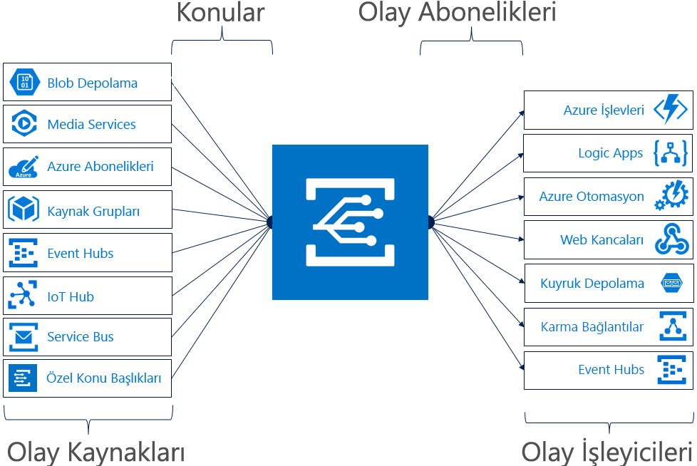

# Azure Event Grid’e giriş

Azure Event Grid, olay temelli mimarilerle kolayca uygulamalar derlemenize olanak tanır. Abone olmak istediğiniz Azure kaynağını seçin ve olayın gönderileceği olay işleyicisini veya WebHook uç noktasını belirtin. Event Grid, depolama blobları ve kaynak grupları gibi Azure hizmetlerinden gelen olaylar için yerleşik destek sunar. Event Grid ayrıca özel konu başlıkları ve özel web kancaları kullanarak uygulama ve üçüncü taraf olayları için özel destek içerir. 

Belirli olayları farklı uç noktalara yönlendirmek, birden fazla uç noktaya yayın yapmak ve olaylarınızın güvenilir bir şekilde teslim edildiğinden emin olmak üzere filtreleri kullanabilirsiniz. Event Grid ayrıca özel ve üçüncü taraf olaylar için yerleşik destek içerir.

Event Grid şu anda aşağıdaki bölgeleri destekler:

* Güneydoğu Asya
* Doğu Asya
* Avustralya Doğu
* Avustralya Güneydoğu
* Orta ABD
*   Doğu ABD
*   Doğu ABD 2
* Batı Avrupa
* Kuzey Avrupa
* Japonya Doğu
* Japonya Batı
*   Batı Orta ABD
*   Batı ABD
*   Batı ABD 2

Bu makalede Azure Event Grid’e genel bir bakış sağlanmıştır. Event Grid kullanmaya başlamak istiyorsanız bkz. [Azure Event Grid ile özel olaylar oluşturma ve yönlendirme](custom-event-quickstart.md). Aşağıdaki görüntüde Event Grid’in kaynaklara ve işleyicilere nasıl bağlandığı gösterilmiştir ancak desteklenen seçeneklerin kapsamlı bir listesi verilmemektedir.

## Olay kaynakları

Şu anda Event Grid’e olay gönderme özelliği aşağıdaki Azure hizmetleri tarafından desteklenmektedir:

* Azure Abonelikleri (yönetim işlemleri)
* Özel Konu Başlıkları
* Event Hubs
* IoT Hub
* Media Services
* Kaynak Grupları (yönetim işlemleri)
* Service Bus
* Depolama Blobu
* Depolama Genel-amaçlı v2 (GPv2)

Her bir olay kaynağının nasıl kullanılacağını gösteren makalelerin bağlantıları için bkz. [Azure Event Grid’de olay kaynakları](event-sources.md).

## Olay işleyicileri

Şu anda Event Grid’den olay işleme özelliği aşağıdaki Azure hizmetleri tarafından desteklenmektedir: 

* Azure Otomasyonu
* Azure İşlevleri
* Event Hubs
* Karma Bağlantılar
* Logic Apps
* Microsoft Flow
* Kuyruk Depolama
* WebHooks

İşleyici olarak Azure İşlevleri’ni kullanırken, genel HTTP tetikleyicileri yerine Event Grid tetikleyicisini kullanın. Event Grid, Event Grid İşlevi tetikleyicilerini otomatik olarak doğrular. Genel HTTP tetikleyicileri ile [doğrulama yanıtını](security-authentication.md#webhook-event-delivery) uygulamanız gerekir.

Her bir olay işleyicisinin nasıl kullanılacağını gösteren makalelerin bağlantıları için bkz: [Azure Event Grid’de olay işleyicileri](event-handlers.md).

## Kavramlar

Azure Event Grid’de başlangıç yapmanızı sağlayan beş kavram vardır:

* **Olaylar** - Ne olduğu.
* **Olay kaynakları/yayımcıları** - Olayın nerede gerçekleştiği.
* **Konu Başlıkları** - Yayımcıların olayları gönderdiği uç nokta.
* **Olay abonelikleri** - Olayları bazı durumlarda birden fazla işleyiciye gönderecek uç nokta ya da yerleşik mekanizma. Abonelikler ayrıca işleyiciler tarafından gelen olayları akıllıca filtrelemek için de kullanılır.
* **Olay işleyicileri** - Olaya tepki veren uygulama ya da hizmet.

Bu kavramlar hakkında daha fazla bilgi için bkz. [Azure Event Grid’de Kavramlar](concepts.md).

## Özellikler

Azure Event Grid’in önemli özelliklerinden bazıları şunlardır:

* **Basitlik** - Azure kaynağınızdan herhangi bir olay işleyici ya da uç noktaya olayları hedeflemek için üzerine gelip tıklayın.
* **Gelişmiş filtreleme** - Olay işleyicilerin yalnızca ilgili olayları aldığından emin olmak için olay türüne veya olay yayımlama yoluna göre filtreleyin.
* **Yayma** - Olayın kopyalarını gereken sayıda yere göndermek için birden fazla uç noktayı aynı olaya abone yapın.
* **Güvenilirlik** - Olayların teslim edildiğinden emin olmak için üstel geri alma ile 24 saatlik yeniden deneme süresinden yararlanın.
* **Olay başına ödeme** - Yalnızca Event Grid’i kullandığınız miktar için ödeme yapın.
* **Yüksek aktarım hızı** - Saniyede milyonlarca olay desteği ile Event Grid’de yüksek hacimli iş yükleri oluşturun.
* **Yerleşik Olaylar** - Kaynak tarafından tanımlanan yerleşik olaylarla hızlıca çalışmaya başlayın.
* **Özel Olaylar** - Event Grid’i kullanarak uygulamanızda özel olayları yönlendirin, filtreleyin ve güvenilir bir şekilde teslim edin.

Event Grid, Event Hubs ve Service Bus hizmetlerinin bir karşılaştırması için bkz. [İleti teslim eden Azure hizmetleri arasında seçim yapma](compare-messaging-services.md).

## Event Grid ile ne yapabilirim?

Azure Event Grid; sunucusuz işlem otomasyonu ve tümleştirme çalışmalarını büyük ölçüde iyileştiren birkaç özellik sağlar: 

### Sunucusuz uygulama mimarileri

Event Grid, veri kaynaklarını ve olay işleyicilerini bağlar. Event Grid’i örneğin bir blob depolama kapsayıcısına eklenen her yeni fotoğrafta görüntü analizini çalıştıracak sunucusuz bir işlev tetiklemek için kullanabilirsiniz. 

### İşlem Otomasyonu

Event Grid, otomasyonu hızlandırmanızı ve ilke uygulamayı basitleştirmenizi sağlar. Örneğin Event Grid, sanal makine oluşturulduğunda veya SQL Veritabanı hazırlandığında Azure Otomasyonu’na bilgi verebilir. Bu olaylar hizmet yapılandırmalarının uyumlu olup olmadığını otomatik olarak denetlemek, operasyon araçlarına meta verileri eklemek, sanal makineleri etiketlemek ve iş öğelerini dosyalamak için kullanılabilir.

### Uygulama tümleştirme

Event Grid, uygulamanızı diğer hizmetlere bağlar. Örneğin, uygulamanızın olay verilerini Event Grid’e göndermek için özel bir konu başlığı oluşturup Azure ile doğrudan tümleştirme, güvenilir teslim ve gelişmiş yönlendirme özelliklerinden yararlanabilirsiniz. Ayrıca Event Grid’i Logic Apps ile birlikte kullanarak kod yazmadan her yerden veri işleyebilirsiniz. 

## Event Grid’in maliyeti ne kadardır?

Azure Event Grid, olay başına ödeme fiyatlandırma modeli kullanır, bu nedenle yalnızca kullandığınız kadar ödeme yaparsınız. Her ay ilk 100.000 işlem ücretsizdir. İşlemler; olay girişi, gelişmiş eşleştirme, teslim denemesi ve yönetim çağrıları olarak tanımlanır. Ayrıntılar için bkz. [fiyatlandırma sayfası](https://azure.microsoft.com/pricing/details/event-grid/).

## Sonraki adımlar

* [Depolama Blobu olaylarını yönlendirme](../storage/blobs/storage-blob-event-quickstart.md?toc=%2fazure%2fevent-grid%2ftoc.json)  
  Event Grid kullanarak depolama blobu olaylarına yanıt verin.
* [Özel olay oluşturma ve özel olaylara abone olma](custom-event-quickstart.md)  
  Azure Event Grid hızlı başlangıcını kullanarak hemen giriş yapın ve kendi özel olaylarınızı herhangi bir uç noktaya göndermeye başlayın.
* [Olay İşleyicisi olarak Logic Apps kullanma](monitor-virtual-machine-changes-event-grid-logic-app.md)  
  Event Grid tarafından gönderilen olaylara yanıt vermek üzere Logic Apps kullanarak uygulama derleme öğreticisi.
* [Veri ambarına büyük veri akışı yapma](event-grid-event-hubs-integration.md)  
  Azure İşlevleri’ni kullanarak Event Hubs’dan SQL Veri Ambarı’na veri akışı yapan öğretici.
* [Event Grid REST API başvurusu](/rest/api/eventgrid)  
  Azure Event Grid hakkında daha fazla teknik bilgi ve Olay Aboneliklerini yönetme, yönlendirme ve filtreleme hakkında başvuru sağlar.