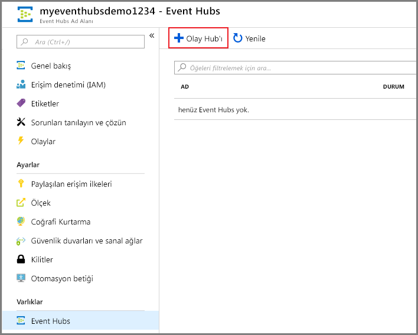

# Hızlı başlangıç: Azure portalı kullanarak olay hub'ı oluşturma
Azure Event Hubs saniyede milyonlarca olay alıp işleme kapasitesine sahip olan bir Büyük Veri akış platformu ve olay alma hizmetidir. Event Hubs dağıtılan yazılımlar ve cihazlar tarafından oluşturulan olayları, verileri ve telemetrileri işleyebilir ve depolayabilir. Bir olay hub’ına gönderilen veriler, herhangi bir gerçek zamanlı analiz sağlayıcısı ve işlem grubu oluşturma/depolama bağdaştırıcıları kullanılarak dönüştürülüp depolanabilir. Event Hubs’a ayrıntılı bir genel bakış için bkz. [Event Hubs'a genel bakış](event-hubs-about.md) ve [Event Hubs özellikleri](event-hubs-features.md).

Bu hızlı başlangıçta [Azure portalı](https://portal.azure.com) kullanarak olay hub'ı oluşturacaksınız.

## Önkoşullar

Bu hızlı başlangıcı tamamlamak için aşağıdakileri yaptığınızdan emin olun:

- Azure aboneliği. Aboneliğiniz yoksa başlamadan önce [ücretsiz bir hesap oluşturun](https://azure.microsoft.com/free/).
- [Visual Studio 2019)](https://www.visualstudio.com/vs) veya sonraki bir sürümü.
- [.NET Standard SDK'sı](https://www.microsoft.com/net/download/windows), sürüm 2.0 veya üzeri.

## Kaynak grubu oluşturma

Kaynak grubu, Azure kaynakları için mantıksal bir koleksiyondur. Tüm kaynaklar bir kaynak grubuna dağıtılır ve buradan yönetilir. Kaynak grubu oluşturmak için:

1. [Azure Portal](https://portal.azure.com)’ında oturum açın.
2. Soldaki menüden **Kaynak grupları**'na tıklayın. Daha sonra **Ekle**'ye tıklayın.

   

2. **Abonelik**için, kaynak grubunu oluşturmak istediğiniz Azure aboneliğinin adını seçin.
3. **Kaynak grubu için**benzersiz bir ad yazın. Sistem, adın seçili Azure aboneliğinde var olup olmadığını kontrol eder.
4. Kaynak grubu için bir **bölge** seçin.
5. **Gözden geçir + oluştur**' u seçin.

   
6. **Gözden geçir + oluştur** sayfasında **Oluştur**' u seçin. 

## Event Hubs ad alanı oluşturma

Event Hubs ad alanı, tam etki alanı adının başvurduğu, içinde bir veya daha fazla olay hub'ı oluşturduğunuz benzersiz bir kapsam kapsayıcısı sağlar. Portalı kullanarak kaynak grubunuzda bir ad alanı oluşturmak için aşağıdaki eylemleri gerçekleştirin:

1. Azure portalda ekranın sol üst köşesindeki **Kaynak oluştur**'a tıklayın.
2. Sol taraftaki menüden **tüm hizmetler** ' i seçin ve **analiz** kategorisinde **Event Hubs** ' ın yanındaki **yıldız (`*`)** seçeneğini belirleyin. **Event Hubs** sol gezinti menüsünde **Sık kullanılanlara** eklendiğini doğrulayın. 
    
   
3. Sol gezinti menüsünde **Sık Kullanılanlar** ' ın altında **Event Hubs** ' ı seçin ve araç çubuğunda **Ekle** ' yi seçin.

   
4. **Ad alanı oluştur** sayfasında, aşağıdaki adımları uygulayın:
    1. Ad alanı için bir **ad** girin. Adın kullanılabilirliği sistem tarafından hemen denetlenir.
    2. **Fiyatlandırma katmanını** (temel veya standart) seçin.
    3. **Enable Kafka** seçeneğinin otomatik olarak etkinleştirildiğini unutmayın. Azure Event Hubs ile bir Kafka uç noktası sağlar. Bu uç nokta, Event Hubs ad alanının [Apache Kafka](https://kafka.apache.org/intro) ileti protokolünü ve API 'leri yerel olarak anlamasına olanak sağlar. Bu özellik sayesinde ile Kafka konularını Protokolü istemcilerinize değiştirme veya kendi kümelerini çalıştırmak gibi event hubs ile iletişim kurabilir. Event Hubs, [1,0 ve üzeri sürümleri Apache Kafka](https://kafka.apache.org/10/documentation.html) destekler.
    4. Ad alanını oluşturmak istediğiniz **aboneliği** seçin.
    5. Var olan bir **kaynak grubunu** seçin veya yeni bir kaynak grubu oluşturun. 
    4. Ad alanı için bir **konum** seçin.
    5. **Oluştur**'u seçin. Sistemin kaynakları tam olarak sağlaması için birkaç dakika beklemeniz gerekebilir.

       
5. Olay Hub 'ı ad alanını görmek için **Event Hubs** sayfasını yenileyin. Uyarı içinde Olay Hub 'ı oluşturma durumunu denetleyebilirsiniz. 

    
6. Ad alanını seçin. Portalda **Event Hubs ad alanınız** için giriş sayfasını görürsünüz. 

   
    
## Olay hub’ı oluşturma

Ad alanında bir olay hub'ı oluşturmak için aşağıdaki eylemleri gerçekleştirin:

1. Event Hubs ad alanı sayfasında, soldaki menüden **Event Hubs** ' i seçin.
1. Pencerenin en üstündeki **+ Olay Hub’ı** seçeneğine tıklayın.
   
    
1. Olay hub'ınız için bir ad yazın, ardından **Oluştur**’a tıklayın.
   
    
4. Uyarı ' da Olay Hub 'ı oluşturma durumunu kontrol edebilirsiniz. Olay Hub 'ı oluşturulduktan sonra, aşağıdaki görüntüde gösterildiği gibi Olay Hub 'ları listesinde görürsünüz:

    

Tebrikler! Portalı kullanarak bir Event Hubs ad alanı ve bu ad alanının içinde bir olay hub'ı oluşturdunuz. 

## Sonraki adımlar

Bu makalede bir kaynak grubu, bir Event Hubs ad alanı ve bir olay hub'ı oluşturdunuz. Olay Hub 'ından olay alma (veya) olayları gönderme hakkında adım adım yönergeler için, bkz. **olayları gönderme ve alma** öğreticileri: 

- [.NET Core](get-started-dotnet-standard-send-v2.md)
- [Java](get-started-java-send-v2.md)
- [Python](get-started-python-send-v2.md)
- [JavaScript](get-started-java-send-v2.md)
- [Go](event-hubs-go-get-started-send.md)
- [C (yalnızca gönderme)](event-hubs-c-getstarted-send.md)
- [Apache Storm (yalnızca alma)](event-hubs-storm-getstarted-receive.md)

[Azure portal]: https://portal.azure.com/
[3]: ./media/event-hubs-quickstart-portal/sender1.png
[4]: ./media/event-hubs-quickstart-portal/receiver1.png
