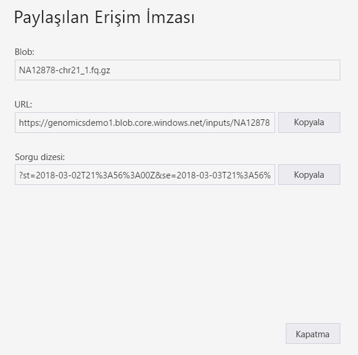
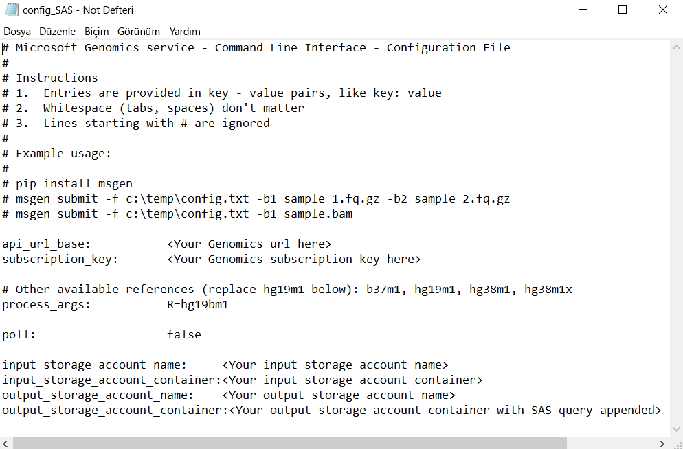

# <a name="submit-a-workflow-to-microsoft-genomics-using-a-sas-instead-of-a-storage-account-key"></a>Depolama hesabı anahtarı yerine SAS kullanarak Microsoft Genomiks’e iş akışını gönderme 

Bu hızlı başlangıçta depolama hesabı anahtarları yerine [paylaşılan erişim imzaları (SAS)](https://docs.microsoft.com/azure/storage/common/storage-dotnet-shared-access-signature-part-1) içeren bir config.txt dosyası kullanılarak Microsoft Genomiks hizmetine iş akışı gönderme işlemi gösterilmektedir. Config.txt dosyasında görünür depolama hesabı anahtarı olmasıyla ilgili güvenlik endişeleri varsa bu özellik yararlı olabilir. Bu makalede `msgen` istemcisini yükleyip çalıştırdığınız ve Azure Depolama’yı kullanma konusunda bilgi sahibi olduğunuz kabul edilmektedir. Sağlanan örnek verileri kullanarak başarıyla bir iş akışı gönderdiyseniz bu hızlı başlangıca devam etmeye hazırsınız demektir. 

## <a name="what-is-a-sas"></a>SAS nedir?
[Paylaşılan erişim imzası (SAS)](https://docs.microsoft.com/azure/storage/common/storage-dotnet-shared-access-signature-part-1), depolama hesabınızdaki kaynaklara temsilci erişimi sağlar. Bir SAS ile hesap anahtarlarınızı paylaşmadan depolama hesabınızdaki kaynaklara erişim verebilirsiniz. Bu, uygulamalarınızda paylaşılan erişim imzaları kullanmanın anahtar noktasıdır. SAS, hesap anahtarlarınızı tehlikeye atmadan depolama kaynaklarınızı paylaşmanın güvenli bir yoludur.

Microsoft Genomiks’e gönderilen SAS, yalnızca giriş ve çıkış dosyalarının depolandığı blob veya kapsayıcıya erişim veren bir [Hizmet SAS](https://docs.microsoft.com/rest/api/storageservices/Constructing-a-Service-SAS) olmalıdır. 

Hizmet düzeyinde paylaşılan erişim imzası (SAS) belirtecinin URI’si, SAS’nin erişim vereceği kaynağın URI’sini ve ardından SAS belirtecini içerir. SAS belirteci, SAS kimlik doğrulaması için gereken tüm bilgileri içeren sorgu dizesidir ve kaynağı, erişim için kullanılabilen izinleri, imzanın geçerli olduğu süre aralığını, isteklerin kaynağı olarak desteklenen IP adresini veya adres aralığını, bir isteğin yapılabilmesi için desteklenen protokolü, istekle ilişkili isteğe bağlı bir erişim ilkesi tanımlayıcısını ve imzanın kendisini belirtir. 

## <a name="sas-needed-for-submitting-a-workflow-to-the-microsoft-genomics-service"></a>Bir iş akışını Microsoft Genomiks hizmetine göndermek için gereken SAS
Microsoft Genomiks hizmetine gönderilen her iş akışında, her bir giriş dosyası için bir ve çıkış kapsayıcısı için bir tane olmak üzere iki veya daha fazla SAS belirteci gereklidir.

Giriş dosyaları için SAS şu özelliklere sahip olmalıdır:
1.  Kapsam (hesap, kapsayıcı, blob): blob
2.  Süre sonu: andan itibaren 48 saat
3.  İzinler: okuma

Çıkış kapsayıcısı için SAS şu özelliklere sahip olmalıdır:
1.  Kapsam (hesap, kapsayıcı, blob): kapsayıcı
2.  Süre sonu: andan itibaren 48 saat
3.  İzinler: okuma, yazma, silme


## <a name="create-a-sas-for-the-input-files-and-the-output-container"></a>Giriş dosyaları ve çıkış kapsayıcısı için SAS oluşturma
Bir SAS belirteci, Azure Depolama Gezini kullanılarak veya program aracılığıyla oluşturulabilir.  Kod yazıyorsanız, SAS’yi kendiniz oluşturabilir veya tercih ettiğiniz dilde Azure Depolama SDK'sını kullanabilirsiniz.


### <a name="set-up-create-a-sas-using-azure-storage-explorer"></a>Ayarlayın: Azure Depolama Gezgini'ni kullanarak SAS oluşturma

[Azure Depolama Gezgini](https://azure.microsoft.com/features/storage-explorer/), Azure Depolama'da depoladığınız kaynakları yönetmeye yönelik bir araçtır.  Azure Depolama Gezgini’ni kullanma hakkında daha fazla bilgiyi [burada](https://docs.microsoft.com/azure/vs-azure-tools-storage-manage-with-storage-explorer) bulabilirsiniz.

Giriş dosyaları için SAS kapsamı belirli giriş dosyası (blob) olarak belirlenmelidir. Bir SAS belirteci oluşturmak için [bu yönergeleri](https://docs.microsoft.com/azure/storage/blobs/storage-quickstart-blobs-storage-explorer) izleyin. SAS oluşturduktan sonra, ekranda sorgu dizesini içeren tam URL'nin yanı sıra sorgu dizesinin kendisi sağlanır ve bu değerler kopyalanabilir.

 


### <a name="set-up-create-a-sas-programattically"></a>Ayarlayın: SAS oluşturma

Azure Depolama SDK'sı kullanarak bir SAS oluşturmak için [.NET](https://docs.microsoft.com/azure/storage/blobs/storage-dotnet-shared-access-signature-part-2#generate-a-shared-access-signature-uri-for-a-blob), [Python](https://docs.microsoft.com/azure/storage/blobs/storage-python-how-to-use-blob-storage) ve [Node.js](https://docs.microsoft.com/azure/storage/blobs/storage-nodejs-how-to-use-blob-storage) dahil birkaç dilde mevcut olan belgelere bakın. 

SDK olmadan bir SAS oluşturmak için SAS sorgu dizesi, SAS kimlik doğrulaması yapmak için gereken tüm bilgiler dahil olmak üzere doğrudan oluşturulabilir. Bu [yönergeler](https://docs.microsoft.com/rest/api/storageservices/constructing-a-service-sas) SAS sorgu dizesinin bileşenleri ve nasıl oluşturulacağına ilişkin ayrıntıları verir. Bu [yönergelerde](https://docs.microsoft.com/rest/api/storageservices/service-sas-examples) açıklandığı gibi, blob/kapsayıcı kimlik doğrulama bilgileri ile bir HMAC oluşturularak gerekli SAS imzası oluşturulur.


## <a name="add-the-sas-to-the-configtxt-file"></a>SAS’yi config.txt dosyasına ekleme
Bir SAS sorgu dizesini kullanarak Microsoft Genomiks hizmeti aracılığıyla iş akışı çalıştırmak için, config.txt dosyasını düzenleyerek config.txt dosyasındaki anahtarları kaldırın. Ardından, SAS sorgu dizesini (`?` ile başlar) resimde gösterildiği gibi çıkış kapsayıcısı adına ekleyin. 



Aşağıdaki komutla iş akışınızı göndermek için Microsoft Genomiks Python istemcisini kullanın ve giriş blob adlarının her birine karşılık gelen SAS sorgu dizesini ekleyin:

```python
msgen submit -f [full path to your config file] -b1 [name of your first paired end read file, SAS query string appended] -b2 [name of your second paired end read file, SAS query string appended]
```

### <a name="if-adding-the-input-file-names-to-the-configtxt-file"></a>config.txt dosyasına giriş dosya adlarını ekliyorsanız
Alternatif olarak, resimde gösterildiği gibi SAS sorgu belirteçleri eklenerek, eşlenmiş uç okuma dosyalarının adları config.txt dosyasına doğrudan eklenebilir:


Bu örnekte, `-b1` ve `-b2` komutlarını çıkarıp aşağıdaki komutu kullanarak Microsoft Genomiks Python istemcisiyle iş akışınızı gönderin:

```python
msgen submit -f [full path to your config file] 
```

## <a name="next-steps"></a>Sonraki adımlar
Bu makalede bir iş akışını `msgen` Python istemcisi aracılığıyla Microsoft Genomiks hizmetine göndermek için hesap anahtarları yerine SAS belirteçleri kullandınız. İş akışının gönderilmesi ve Microsoft Genomiks hizmetiyle kullanabileceğiniz diğer komutlar hakkında daha fazla bilgi için bkz. [SSS](frequently-asked-questions-genomics.md). 
