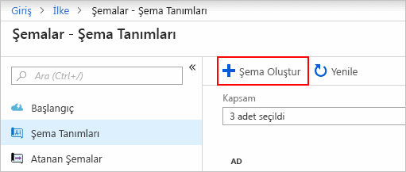
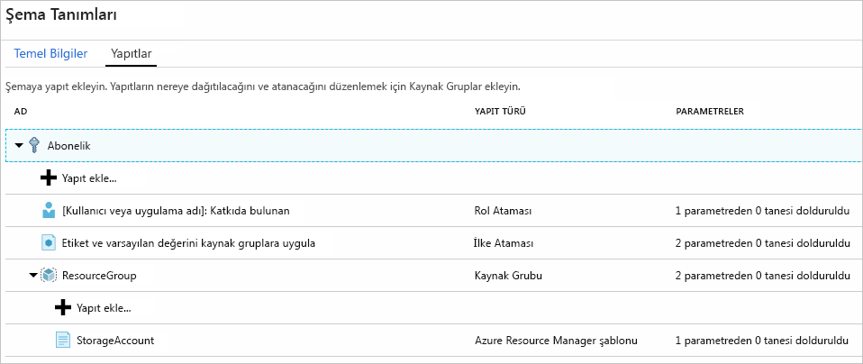
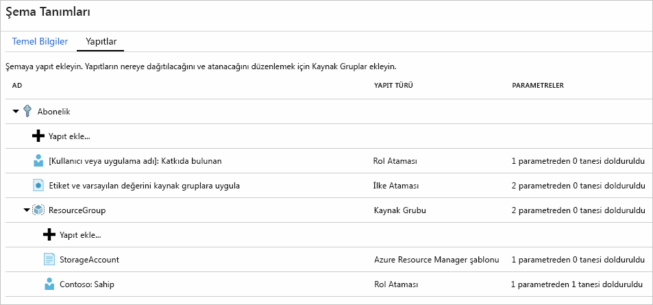

# <a name="define-and-assign-an-azure-blueprint-in-the-portal"></a>Tanımlama ve portalda bir Azure şema Ata

Şema oluşturma ve atama süreçlerini anlamak, ortak tutarlılık desenlerini tanımlamanızı ve Resource Manager şablonlarını, ilkelerini, güvenlik düzeyini ve daha fazlasını temel alan yeniden kullanılabilir ve hızla dağıtılabilir yapılandırmalar geliştirmenizi sağlar. Bu öğreticide kuruluşunuzda aşağıdakiler gibi şema oluşturma, yayımlama ve atama konusundaki yaygın görevlerin bazılarını yerine getirmek için Azure Blueprints'i kullanmayı öğreneceksiniz:

> [!div class="checklist"]
> - Yeni bir şema oluşturma ve çeşitli desteklenen yapıtlar ekleme
> - **Taslak** durumundaki bir şemada değişiklik yapma
> - Bir şemayı **Yayımlandı** durumuna getirerek atamaya hazır hale getirme
> - Bir şemayı var olan bir aboneliğe atama
> - Atanmış bir şemanın durumunu ve ilerlemesini denetleme
> - Bir aboneliğe atanmış olan şemayı kaldırma

Azure aboneliğiniz yoksa başlamadan önce [ücretsiz bir hesap](https://azure.microsoft.com/free) oluşturun.

## <a name="create-a-blueprint"></a>Şema oluşturma

Uyumluluk için standart desen tanımlamanın ilk adımı kullanılabilir durumdaki kaynaklardan bir şema oluşturmaktır. Bu örnekte abonelik için rol ve ilke atamalarını yapılandırmak amacıyla 'MyBlueprint' adlı yeni bir şema oluşturacak, yeni bir kaynak grubu ekleyecek ve yeni kaynak grubunda Resource Manager şablonu ve rol ataması oluşturacaksınız.

1. Seçin **tüm hizmetleri** sol bölmesinde. Arayın ve seçin **şemaları**.

1. Seçin **Blueprint tanımları** tıklayın ve sol sayfasında **+ Oluştur blueprint** sayfanın üstünde düğme.

   - Alternatif olarak, **Başlarken** sayfasında **Oluştur**’a tıklayarak doğrudan şemaya gidebilirsiniz.

   

1. Sağlayan bir **Blueprint adı** 'MyBlueprint gibi' (harfler ve sayılar--en fazla 48 karakter, ancak boşluk veya özel karakterler) için şema, ancak bırakın **Blueprint açıklaması** şimdilik boş. İçinde **tanım konumunu** kutusunda, sağ tıklayın, seçin [yönetim grubu](../management-groups/overview.md) veya şema kaydedin ve tıklayın istediğiniz abonelik **seçin**.

1. Bilgilerin doğru olduğunu doğrulayın ( **Blueprint adı** ve **tanım konumunu** alanlar daha sonra değiştirilemez) tıklayıp **sonraki: Yapıtları** sayfanın alt kısmındaki veya **Yapıtları** sayfanın üst kısmındaki sekme.

1. Rol ataması abonelik ekleyin: Üzerinde sol **+ yapıt ekleme...**  altında satır **abonelik** ve tarayıcı sağ tarafında 'Yapıt ekleme' penceresi açılır. 'Rol Ataması' seçin _Yapıt türü_. Altında _rol_'Katkıda bulunan' seçin ve bırakın _Ekle kullanıcı, uygulama veya grup_ alanını belirten onay kutusu ile bir **dinamik parametre**. Bu yapıtı şemaya eklemek için **Ekle**’ye tıklayın.

   

   > [!NOTE]
   > Çoğu _yapıt_, parametreleri destekler. Şema oluşturma sırasında değer atanan bir parametre, **statik parametredir**. Parametre şema ataması sırasında atanırsa **dinamik parametre** olur. Daha fazla bilgi için bkz. [Şema parametreleri](./concepts/parameters.md).

1. İlke ataması abonelik ekleyin: Üzerinde sol **+ yapıt ekleme...**  rol atama yapıtındaki altında satır. İçin 'İlke ataması' seçin _Yapıt türü_. _Tür_’ü 'Yerleşik' olarak değiştirin ve _Ara_ alanına 'etiket' ifadesini girin. Filtrelemenin yapılması için _Ara_’ya tıklayın. 'Etiket ve varsayılan değerini kaynak gruplara uygula' öğesine tıklayarak seçin. Bu yapıtı şemaya eklemek için **Ekle**’ye tıklayın.

1. 'Etiket ve varsayılan değerini kaynak gruplara uygula' ilke ataması satırına tıklayın. Şema tanımı kapsamında yapıta parametreleri sağlayacak pencere açılır ve atama sırasında parametre ayarlamak (**dinamik parametreler**) yerine bu şemaya göre tüm atamalar için parametreleri ayarlamaya (**statik parametreler**) olanak tanır. Bu örnekte şema ataması sırasında **dinamik parametreler** kullanılmaktadır. Bu nedenle varsayılan değerleri değiştirmeden **İptal**’e tıklayın.

1. Kaynak grubu aboneliği ekleyin: Üzerinde sol **+ yapıt ekleme...**  altında satır **abonelik**. 'Kaynak grubunu' seçin _Yapıt türü_. Bırakın _Yapıt görünen ad_, _kaynak grubu adı_, ve _konumu_ alanlar boş, ancak onay kutusu her parametre özelliği okunmaları işaretli olduğundan emin olun **dinamik parametreleri**. Bu yapıtı şemaya eklemek için **Ekle**’ye tıklayın.

1. Kaynak grubu altında şablon ekleyin: Üzerinde sol **+ yapıt ekleme...** altında satır **ResourceGroup** girişi. _Yapıt türü olarak_ 'Azure Resource Manager şablonu'nu seçin, _Yapıt görünen adı_’nı 'StorageAccount' olarak ayarlayın ve _Açıklama_ alanını boş bırakın. Düzenleyici kutusundaki **Şablon** sekmesinde aşağıdaki Resource Manager şablonunu yapıştırın. Şablon yapıştırılan seçin **parametreleri** sekmesini ve unutmayın şablon parametreleri **storageAccountType** ve **konumu** algılandı. Her parametre otomatik olarak algılandı ve doldurulur, ancak yapılandırılmış bir **dinamik parametre**. Denetimden Kaldır **storageAccountType** onay kutusu ve aşağı açılan yalnızca Resource Manager şablonu altında bulunan değerleri içerdiğini unutmayın **allowedValues**. Yeniden **dinamik parametre** olarak ayarlamak için kutuyu işaretleyin. Bu yapıtı şemaya eklemek için **Ekle**’ye tıklayın.

   > [!IMPORTANT]
   > Şablon içeri aktarılıyorsa, dosyanın yalnızca JSON biçiminde olduğundan ve HTML içermediğinden emin olun. GitHub’da bir URL’ye işaret ederken, GitHub’da görüntülenmek üzere HTML ile sarmalanmış dosyayı değil, **RAW** öğesine tıklayarak saf JSON dosyasını aldığınızdan emin olun. İçeri aktarılan şablon saf JSON değilse bir hata oluşur.

   ```json
   {
       "$schema": "https://schema.management.azure.com/schemas/2015-01-01/deploymentTemplate.json#",
       "contentVersion": "1.0.0.0",
       "parameters": {
           "storageAccountType": {
               "type": "string",
               "defaultValue": "Standard_LRS",
               "allowedValues": [
                   "Standard_LRS",
                   "Standard_GRS",
                   "Standard_ZRS",
                   "Premium_LRS"
               ],
               "metadata": {
                   "description": "Storage Account type"
               }
           },
           "location": {
               "type": "string",
               "defaultValue": "[resourceGroups('ResourceGroup').location]",
               "metadata": {
                   "description": "Location for all resources."
               }
           }
       },
       "variables": {
           "storageAccountName": "[concat('store', uniquestring(resourceGroup().id))]"
       },
       "resources": [{
           "type": "Microsoft.Storage/storageAccounts",
           "name": "[variables('storageAccountName')]",
           "location": "[parameters('location')]",
           "apiVersion": "2018-07-01",
           "sku": {
               "name": "[parameters('storageAccountType')]"
           },
           "kind": "StorageV2",
           "properties": {}
       }],
       "outputs": {
           "storageAccountName": {
               "type": "string",
               "value": "[variables('storageAccountName')]"
           }
       }
   }
   ```

   

1. Tamamladığınız şema aşağıdakine benzer olmalıdır. Her yapıtın _Parametreler_ sütunu altında '_y_ parametreden _x_ tanesi doldurulmuş' durumdadır. **Dinamik parametreler** şemanın her atamasında ayarlanır.

   

1. Planlanan tüm yapıtlar eklendikten sonra sayfanın alt kısmındaki **Taslağı Kaydet** seçeneğine tıklayın.

## <a name="edit-a-blueprint"></a>Şema düzenleme

[Şema oluştur](#create-a-blueprint) menüsünde bir Açıklama belirtilmemiştir ve rol ataması yeni kaynak grubuna eklenmemiştir. İki durum da aşağıdaki adımlarla düzeltilebilir:

1. Seçin **Blueprint tanımları** sol sayfasında.

1. Daha önce oluşturduğunuz bir blueprint'i listesinde sağ tıklayıp **düzenleme şema**.

1. İçinde **Blueprint açıklaması**, şema ve onu oluşturan yapıları hakkında bazı bilgiler sağlamalısınız. Bu durumda, aşağıdaki gibi girin: "Bu şema etiket ilke ve rol ataması abonelikte ayarlar, bir kaynak grubu oluşturur ve bu kaynak grubu için bir şablon ve rol ataması dağıtır."

1. Tıklayın **sonraki: Yapıtları** sayfanın alt kısmındaki veya **Yapıtları** sayfanın üst kısmındaki sekme.

1. Rol ataması kaynak grubu altında ekleyin: Üzerinde sol **+ yapıt ekleme...**  doğrudan altında satır **ResourceGroup** girişi. 'Rol Ataması' seçin _Yapıt türü_. Altında _rol_'Owner' seçmek ve kaldırmak için Denetim _Ekle kullanıcı, uygulama veya grup_ alan, arama ve bir kullanıcı, uygulama veya grup eklemek için seçin. Yapıt, bu şemanın tüm atamalarında aynı **statik parametreyi** kullanır. Bu yapıtı şemaya eklemek için **Ekle**’ye tıklayın.

   

1. Tamamladığınız şema aşağıdakine benzer olmalıdır. Yeni eklenen rol atamasında **1 parametreden 1 tanesinin doldurulmuş** olduğuna, yani bunun bir **statik parametre** olduğuna dikkat edin.

   

1. Güncelleştirildikten sonra **Taslağı Kaydet**’e tıklayın.

## <a name="publish-a-blueprint"></a>Şemayı yayımlama

Planlanan tüm yapıtları ekledikten sonra şemayı yayımlayabilirsiniz.
Yayımladığınızda şema bir aboneliğe atanmaya hazır hale gelir.

1. Seçin **Blueprint tanımları** sol sayfasında.

1. Daha önce oluşturduğunuz bir blueprint'i listesinde sağ tıklayıp **Yayımla şema**.

1. Açılan iletişim kutusunda 'v1' gibi bir **Sürüm** belirtin (harf, sayı ve tire kullanılabilir, en fazla 20 karakter uzunluğunda olabilir) ve 'İlk yayımlama' gibi **Notları değiştirin** (isteğe bağlı).

1. Sayfanın alt kısmındaki **Yayımla** seçeneğine tıklayın.

## <a name="assign-a-blueprint"></a>Şema atama

Şema yayımlandıktan sonra bir aboneliğe atanabilir. Oluşturduğunuz şemayı yönetim grubu hiyerarşinizdeki aboneliklerden birine atayın. Blueprint bir abonelik için kaydedilmiş durumda ise, yalnızca bu aboneliğe atanabilir.

1. Seçin **Blueprint tanımları** sol sayfasında.

1. Blueprint listesinde, daha önce oluşturduğunuz (veya üç noktayı seçin) bir sağ tıklayıp **Ata şema**.

1. Üzerinde **Ata şema** sayfasında, bu şema için gelen dağıtmak istediğiniz abonelikleri seçin **abonelik** açılır.

   - Kullanılabilir desteklenen Enterprise sürümüne yönelik teklifleri varsa [Azure faturalama](../../billing/index.md), **Yeni Oluştur** bağlantısı altında etkinleştirilirse **abonelik** kutusu.

     1. Seçin **Yeni Oluştur** var olanları seçmek yerine yeni bir abonelik oluşturmak için bağlantı.

        

     1. Sağlayan bir **görünen ad** yeni abonelik için.

     1. Kullanılabilir seçin **teklif** açılır listeden.

     1. Seçmek için üç nokta kullanın [yönetim grubu](../management-groups/index.md) abonelik alt olacaktır.

     1. Seçin **Oluştur** sayfanın alt kısmındaki.

     > [!IMPORTANT]
     > Yeni aboneliği hemen oluşturulur, **Oluştur** seçilir.

   > [!NOTE]
   > Seçilen her abonelik için bir atama oluşturulur ve daha sonra seçili aboneliklerin geri kalanında değişiklikleri zorlamadan tek bir abonelik atamasında değişiklik yapılmasına izin verir.

1. İçin **atama adı**, bu atama için benzersiz bir ad belirtin.

1. İçinde **konumu**, oluşturulması yönetilen kimlik ve abonelik dağıtım nesnesi için bir bölge seçin. Azure Blueprint bu yönetilen kimliği kullanarak tüm yapıtları atanmış şemaya dağıtır. Daha fazla bilgi için bkz. [Azure kaynakları için yönetilen kimlikler](../../active-directory/managed-identities-azure-resources/overview.md).

1. Bırakın **şema tanımı sürümü** açılan **yayımlanan** 'v1' giriş sürümlerinde (varsayılan değer en son **yayımlanan** sürüm).

1. **Atamayı Kilitle** seçeneği için varsayılan **Kilitleme** ayarını değiştirmeyin. Daha fazla bilgi için bkz. [şema kaynağı kilitleme](./concepts/resource-locking.md).

   

1. Altında **yönetilen kimliği**, varsayılan değerini bırakın **sistem tarafından atanan**.

1. Abonelik düzeyi rol ataması **[kullanıcı grubu veya uygulama adı]: Katkıda bulunan**, arayın ve bir kullanıcı, uygulama veya grup seçin.

1. Abonelik düzeyinde ilke ataması için **Etiket Adı**’nı 'CostCenter' ve **Etiket Değeri**’ni 'ContosoIT' olarak ayarlayın.

1. 'ResourceGroup' için **Ad** olarak 'StorageAccount' belirtin ve **Konum** olarak açılır listeden 'Doğu ABD 2'yi seçin.

   > [!NOTE]
   > Şema tanımı sırasında kaynak grubu altına eklenen her yapıt, kaynak grubu veya birlikte dağıtılacağı nesne ile birlikte hizalanmak üzere girintilenir. Parametre almayan veya atamada tanımlanacak parametresi olmayan yapıtlar yalnızca bağlam bilgisi için listelenir.

1. 'StorageAccount' adlı Azure Resource Manager şablonunda **storageAccountType** parametresi için 'Standard_GRS' seçeneğini belirleyin.

1. Sayfanın alt kısmındaki bilgi kutusunu okuyun ve ardından **Ata**’ya tıklayın.

## <a name="track-deployment-of-a-blueprint"></a>Şema dağıtımını izleme

Bir şema bir veya daha fazla aboneliğe atandığında iki şey gerçekleşir:

- Blueprint eklenir **şemaları atanan** atanan abonelik başına sayfa
- Şema tarafından tanımlanan tüm yapıtları dağıtma işlemi başlar

Şema bir aboneliğe atandıktan sonra dağıtımın ilerleme durumunu doğrulayın.

1. Seçin **şemaları atanan** sol sayfasında.

1. Blueprint listesinde, önceden atanmış bir sağ tıklayıp **atama ayrıntıları görüntüle**.

   

1. Üzerinde **Blueprint ataması** sayfasında, tüm yapıtlar başarıyla dağıtıldığını ve yapıldı, hatasız dağıtımı sırasında doğrulayın. Hatalar oluştuysa neyin yanlış gittiğini belirleme adımları için [şema sorunlarını giderme](./troubleshoot/general.md) bölümüne bakın.

## <a name="unassign-a-blueprint"></a>Şema atamasını kaldırma

Gerekli değilse şema atamasını abonelikten kaldırabilirsiniz. Şema, güncel desenlere, ilkelere ve tasarımlara sahip daha yeni bir şema ile değiştirilmiş olabilir. Bir şema kaldırıldığında o şemanın bir parçası olarak atanan yapıtlar geride kalır. Şema atamasını kaldırmak için aşağıdaki adımları izleyin:

1. Seçin **şemaları atanan** sol sayfasında.

1. Atanmamış ve ardından şema şemaları listeden seçin **Atamayı Kaldır blueprint** sayfanın üstünde düğme.

1. Onay iletisini okuyun ve ardından **Tamam**’a tıklayın.

## <a name="delete-a-blueprint"></a>Şema silme

1. Seçin **Blueprint tanımları** sol sayfasında.

1. Seçin ve silmek istediğiniz şema üzerinde sağ **silme şema**, ardından **Evet** onay iletişim kutusunda.

> [!NOTE]
> Bu yöntemde bir şema silindiğinde, seçili şemanın tüm **Yayımlanan sürümleri** de silinir. Tek bir sürümü silmek için şemayı açın, **Yayımlanan sürümler** sekmesine tıklayın, silmek istediğiniz sürümü seçip tıklayın, ardından **Bu Sürümü Sil**’e tıklayın. Ayrıca, atamaları olan bir şema, tüm şema atamaları silinene kadar silinemez.

## <a name="next-steps"></a>Sonraki adımlar

- Hakkında bilgi edinin [blueprint yaşam döngüsü](./concepts/lifecycle.md).
- Nasıl kullanılacağını anlamak [statik ve dinamik parametreleri](./concepts/parameters.md).
- Özelleştirme öğrenin [blueprint sıralama sipariş](./concepts/sequencing-order.md).
- Öğrenin yapmak kullanım [blueprint kaynak kilitleme](./concepts/resource-locking.md).
- Bilgi edinmek için nasıl [mevcut Atamaları Güncelleştir](./how-to/update-existing-assignments.md).
- İle bir blueprint ataması sırasında sorunları gidermek [genel sorun giderme](./troubleshoot/general.md).